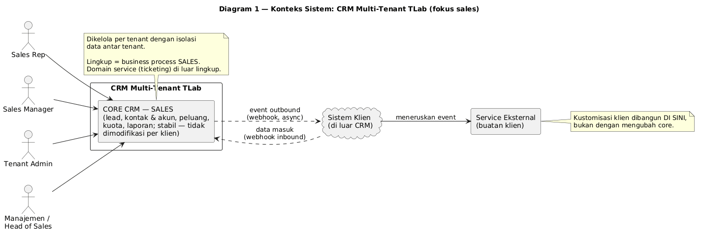
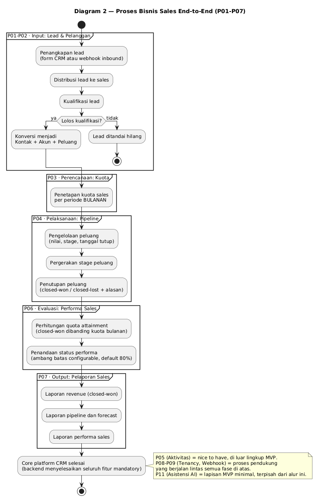
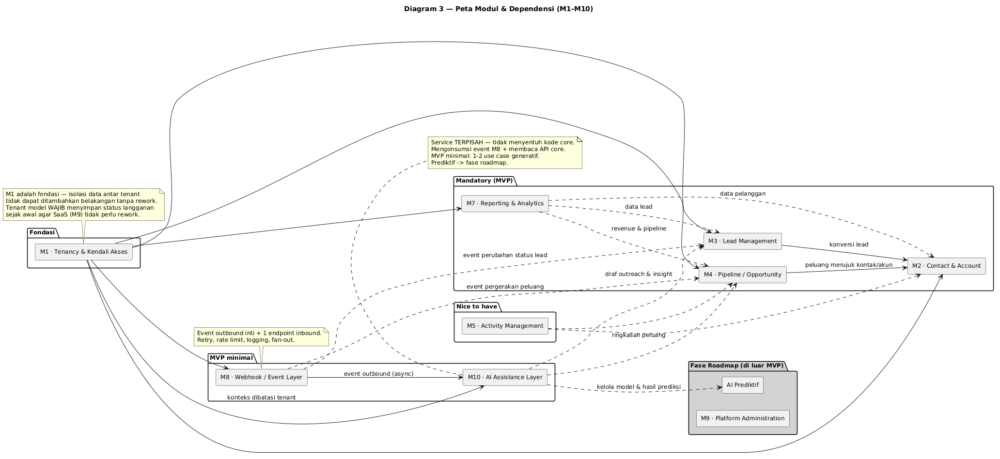
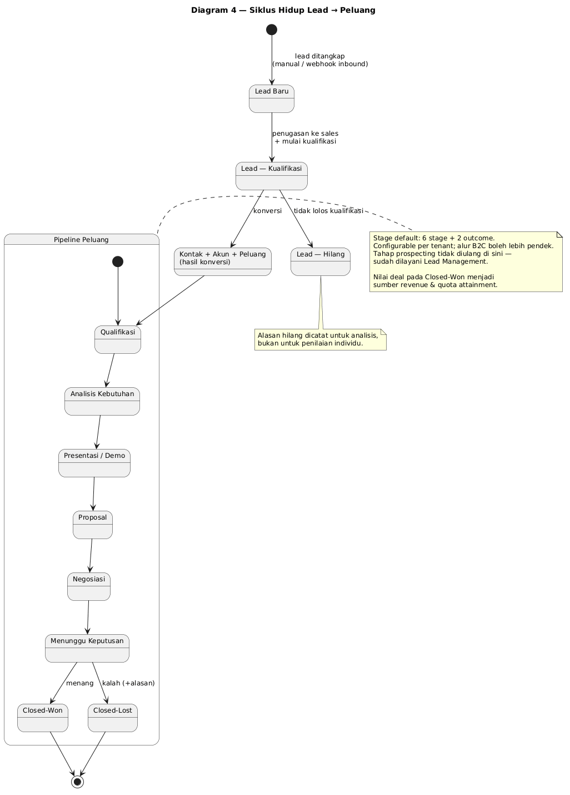
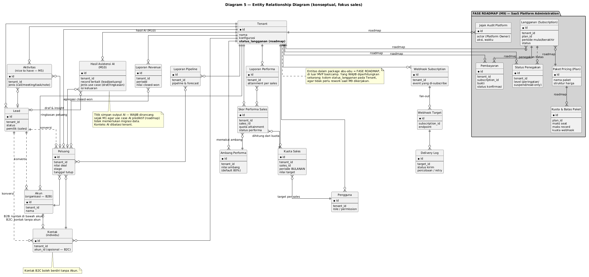
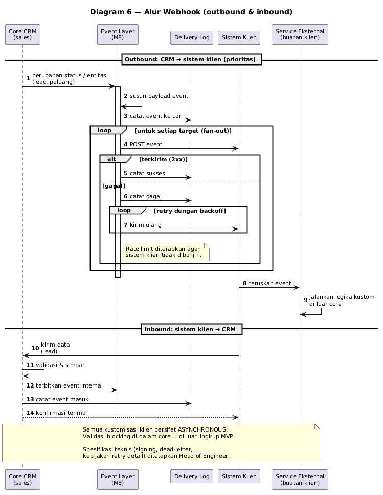
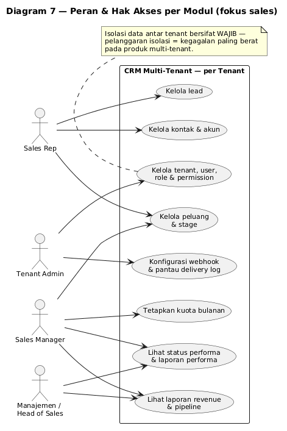
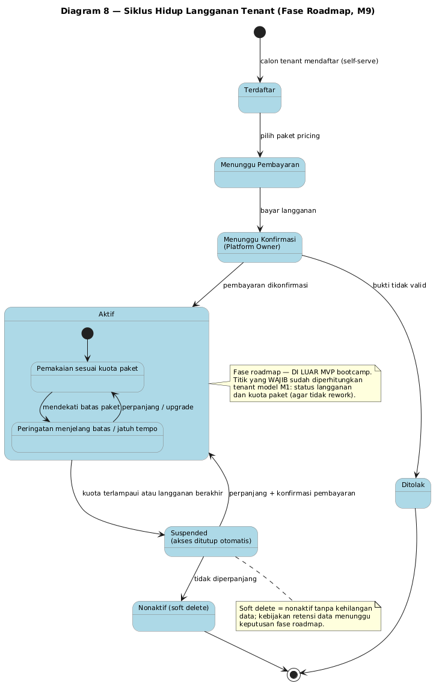
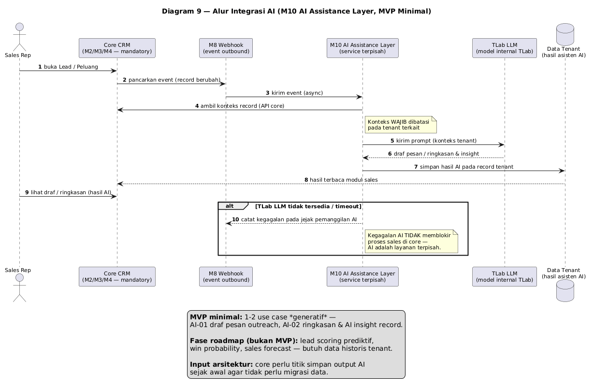

# Business Requirements Document (BRD) — CRM Multi-Tenant TLab

**Disusun Oleh:** Yudha Pratama — PM, berperan sebagai Product Owner

> **Kedudukan dokumen ini.** Dokumen ini adalah **baseline requirement** yang
> dipresentasikan pada **hari 1 bootcamp** dan menjadi dasar kerja hari 2–3.
> Substansinya sudah final untuk dipakai tim; yang tersisa adalah **agenda
> finalisasi pada hari 1** (§9) — sebagian besar berupa keputusan teknis yang
> memang harus diambil bersama.
>
> **Batas lingkup dokumen:** dokumen ini memuat **requirement produk CRM**.
> Requirement *pelaksanaan bootcamp* (susunan sesi, peserta, jadwal) berada di
> dokumen terpisah — bootcamp adalah mekanisme pelaksanaan, bukan bagian dari
> produk.

---

## 1. Konteks & Tujuan Bisnis

### 1.1 Latar Belakang

TLab membutuhkan **produk CRM milik sendiri** yang bersifat multi-tenant, dapat
dikembangkan lebih lanjut, dan pada akhirnya dapat dijual. Saat ini belum ada
sistem CRM terpusat: pengelolaan lead, peluang, dan pelanggan belum memiliki
tempat tunggal yang dapat diandalkan, sehingga riwayat interaksi pelanggan
tercecer dan pencapaian target sales sulit dibuktikan dengan data.

Masalah yang ingin diselesaikan:

| # | Masalah | Akibat bila tidak diselesaikan |
|---|---|---|
| 1 | Tidak ada sistem CRM terpusat milik TLab | Ketergantungan pada tool pihak ketiga; tidak ada aset produk yang dapat dijual |
| 2 | Data pelanggan dan interaksi tidak terkonsolidasi | Riwayat pelanggan hilang; keputusan berbasis ingatan, bukan data |
| 3 | Pencapaian target sales tidak terukur | Performa sales tidak dapat dibuktikan; pembinaan tidak berbasis data |
| 4 | Setiap klien menuntut proses berbeda | Tanpa mekanisme kustomisasi, core akan ter-fork dan tidak terkelola |

### 1.2 Tujuan Strategis

1. **Mendapatkan core platform CRM** — aset produk yang menjadi fondasi
   pengembangan dan penjualan selanjutnya.
2. **Menjadikan CRM dapat dijual ke banyak organisasi (B2B) maupun
   customer perorangan (B2C)** tanpa menduplikasi core per klien.
3. **Menyediakan jalur kustomisasi yang aman** — kebutuhan spesifik klien
   dipenuhi tanpa mengubah core, sehingga biaya pemeliharaan tetap terkendali.

### 1.3 Prinsip Produk yang Mengikat

> **Core CRM bersifat stabil dan tidak dimodifikasi per klien. Variasi proses
> bisnis klien diserap melalui webhook + service eksternal terpisah.**

Konsekuensi yang harus dipahami seluruh pihak:

1. Core memuat pakem CRM **untuk sales**: lead, peluang, kontak & akun, dan
   laporan.
2. Kebutuhan yang berbeda per klien **tidak** diselesaikan dengan mengubah core,
   melainkan dengan memanfaatkan event yang dipublikasikan core.
3. Kustomisasi berbasis webhook bersifat **asynchronous**. Kebutuhan yang
   menuntut validasi *blocking* di dalam core berada **di luar lingkup MVP**.
4. Contoh yang disepakati: klien membutuhkan mekanisme antrian → dibangun
   *service* terpisah yang berlangganan event CRM; core tidak berubah.

### 1.4 Fokus Domain: Sales, Bukan Service

Lingkup produk difokuskan pada **business process sales**. Keputusan ini
mengikuti pemisahan domain yang berlaku di pasar:

| Produk | Domain *sales* | Domain *service* |
|---|---|---|
| **Salesforce** | Sales Cloud — lead management, opportunity tracking, forecasting | Service Cloud — case management, SLA, knowledge base |
| **HubSpot** | Sales Hub | Service Hub (ticketing terdaftar di sini) |

Pada keduanya, *case/ticket management* secara eksplisit **bukan** core feature
produk sales. Karena itu ticketing berada di luar lingkup (lihat §2.2), dan
dicatat sebagai kandidat modul lanjutan pada roadmap produk.

### 1.5 Konteks Pelaksanaan

Produk ini dibangun melalui **bootcamp internal berdurasi 3 hari** dengan
komposisi:

| Hari | Kegiatan |
|---|---|
| Hari 1 | **Workshop memfinalkan requirement** bersama peserta |
| Hari 2–3 | **Pengembangan core platform CRM (backend)** |

**Implikasi yang harus disadari:** durasi total 3 hari, tetapi **jendela
pengembangan efektif hanya 2 hari** untuk 6 modul mandatory. Ini risiko tertinggi
pada inisiatif ini.

---

## 2. Ruang Lingkup

### 2.1 Modul Produk

| Modul | Nama | Status |
|---|---|---|
| M1 | Tenancy & Kendali Akses | **Mandatory** |
| M2 | Contact & Account Management | **Mandatory** |
| M3 | Lead Management | **Mandatory** |
| M4 | Sales Pipeline / Opportunity | **Mandatory** |
| M5 | Activity Management | *Nice to have* — di luar MVP |
| M6 | Ticketing | **Di luar lingkup** — domain *service* (§1.4) |
| M7 | Reporting & Analytics | **Mandatory** |
| M8 | Webhook / Event Layer | **MVP minimal** |
| M9 | Platform Administration | Fase roadmap (§2.3) |
| M10 | AI Assistance Layer | **MVP minimal** — service AI terpisah |

**Modul mandatory = 6** (M1, M2, M3, M4, M7, M8-minimal). **M9 dan M10 tidak
mengubah angka ini** — M10 adalah **lapisan tambahan MVP minimal**, bukan modul
mandatory baru. Bila waktu tidak mencukupi, prioritas tetap pada 6 modul
mandatory.

**Sasaran output yang diukur:** **desain core backend mampu menyelesaikan
seluruh fitur mandatory** yang ditargetkan. **Kesiapan frontend bukan penghambat
kelulusan** — UI boleh belum selesai selama kapabilitas backend terbukti melayani
semua fitur mandatory.

**Cara mengukur "selesai":** modul mandatory berjalan **end-to-end**, tetapi
**"end-to-end" diukur pada kapabilitas backend** — terverifikasi melalui
**API/kontrak data**, bukan kelengkapan UI. Rantai verifikasi berhenti di proses
sales: login multi-tenant → kelola lead → kelola kontak & akun → kelola peluang →
tampilkan laporan sales.

### 2.2 Di Luar Lingkup (Out of Scope)

| Item | Alasan |
|---|---|
| **M6 Ticketing** | Domain *service*, bukan core feature CRM untuk sales tracking. Sejalan dengan pemisahan Sales Cloud/Service Cloud dan Sales Hub/Service Hub. **Tetap bagian visi produk** sebagai modul lanjutan roadmap, dikembangkan di luar bootcamp |
| **M5 Activity Management** | *Nice to have* — tidak menahan kelulusan prototype |
| **Modul Billing / Invoice** | Revenue didefinisikan dari deal closed-won, bukan tagihan |
| **Assessment tim sales (HR)** | CRM mengelola pelanggan, bukan penilaian karyawan |
| **Extension point synchronous / blocking** | Kustomisasi hanya asynchronous |
| **Implementasi produksi & integrasi ke sistem TLab lain** | Di luar mandat bootcamp; perlu keputusan lanjutan |
| **Dukungan pasca-bootcamp** | Belum ada keputusan kelanjutan |
| **Leading indicator (aktivitas & pipeline) di MVP** | Memerlukan M5 yang *nice to have* |
| **M9 Platform Administration (kontrol plane SaaS)** | **Fase roadmap terpisah** — di luar MVP bootcamp; didokumentasikan penuh sebagai input arsitektur (§2.3) |
| **AI prediktif (lead scoring, win probability, forecast)** | Memerlukan **data historis** tenant yang belum tersedia saat bootcamp. Integrasi AI **generatif** masuk MVP minimal (M10) |

### 2.3 Fase Roadmap — SaaS Platform Administration (M9)

Produk ini diposisikan sebagai **SaaS** yang dijual TLab kepada banyak
organisasi. Di atas lapisan tenant (M1) terdapat **control plane** yang dikelola
**pemilik platform (TLab)** — bukan oleh tenant — untuk menjalankan bisnis
layanan.

**Penempatan:** seluruh kontrol plane ini **di luar MVP bootcamp**, ditetapkan
sebagai **fase roadmap terpisah (M9)**, tetapi **WAJIB masuk sebagai input
arsitektur** — rancangan tenant pada M1 harus menyimpan **status langganan**
sejak awal agar tidak perlu rework.

| Aspek | MVP Bootcamp | Fase Roadmap (M9) |
|---|---|---|
| Pengelola tenant | Tenant Admin — di dalam satu tenant (M1) | **Platform Owner (TLab)** — lintas semua tenant |
| Aktivasi tenant | tenant sudah tersedia untuk dipakai | registrasi → konfirmasi pembayaran → aktivasi |
| Batas penggunaan | tidak ada penegakan | penegakan kuota paket → **suspend otomatis** |
| Komersial | tidak ada | paket pricing, siklus langganan, pembayaran |

#### Ringkasan Kemampuan Control Plane

| # | Kemampuan | Proses |
|---|---|---|
| 1 | Membuat & mengelola **paket pricing** | 13.01 |
| 2 | Menetapkan **kuota & batas per paket** | 13.01 |
| 3 | **Membuat, mengubah, soft delete akun tenant** | 13.02 |
| 4 | **Pendaftaran & aktivasi tenant** | 13.03 |
| 5 | **Konfirmasi pembayaran** & riwayat masa aktif | 13.04 |
| 6 | **Siklus langganan** (perpanjangan, upgrade/downgrade) | 13.05 |
| 7 | **Penegakan batas paket → penutupan akses otomatis** | 13.06 |
| 8 | Dukungan operasional & pemantauan platform (jejak audit) | 13.07–13.08 |

#### Usulan Dimensi Paket Pricing

Dasar: praktik CRM SaaS (per-seat dominan pada ACV < USD 50K — Salesforce,
Pipedrive, Zoho memakai *per user/bulan*) + sifat produk (core stabil,
kustomisasi via webhook). **Angka harga tidak dicantumkan** karena belum ada data
harga; penetapan menunggu keputusan lanjutan.

| Dimensi | Alasan |
|---|---|
| **Seat** (jumlah user aktif) | Dimensi paling dipahami pasar; model default CRM SaaS |
| **Batas data** (Kontak + Akun + Lead + Peluang) | Alasan *upgrade* alami; mudah dihitung & ditegakkan |
| **Modul yang aktif** | Gerbang fitur per tingkatan |
| **Kuota webhook** (event/bulan + target fan-out) | Nilai jual utama sekaligus biaya operasional |
| **Dukungan & SLA** | Pemisah tier atas |
| **Storage & retensi/ekspor** | *Add-on*, bukan gerbang tier |

| Paket | Cakupan yang diusulkan | Alur masuk |
|---|---|---|
| **Trial** | 14 hari; 3 user; 1 target webhook | Registrasi mandiri (*self-serve*) |
| **Starter** | s/d 5 user; modul inti sales; laporan dasar; webhook outbound terbatas | Self-serve + konfirmasi pembayaran |
| **Growth** | s/d 20 user; seluruh modul sales + Kuota & Performa + Reporting lengkap; webhook + fan-out | Sales-led |
| **Enterprise** | user *fair use* besar; seluruh modul; webhook + SLA; dukungan khusus | Sales-led |
| **Add-on** | tambahan seat / kuota webhook / storage | — |

> **Ini rekomendasi desain, bukan keputusan produk.** Nama, harga, dan angka
> kuota belum ditetapkan — tidak diisi agar tidak menciptakan target fiktif.

### 2.4 Requirement Berprioritas Rendah (Should / Could)

Requirement berikut berada di dalam visi produk tetapi **tidak menahan approval
prototype** bila tidak selesai: **lead masuk dari luar CRM (webhook inbound)**,
**laporan pipeline**, dan **pengelolaan aktivitas**.

---

## 3. Stakeholder

| No | Stakeholder | Jenis | Kepentingan Utama | Modul Terkait |
|---|---|---|---|---|
| SH001 | **Sales Rep** | Internal | Lead & peluang terkelola, progres deal terlihat, pencapaian terukur | M3, M4, M7 |
| SH002 | **Sales Manager** | Internal | Visibilitas pipeline tim, penetapan kuota, identifikasi sales berkinerja rendah | M4, M7 |
| SH005 | **Tenant Admin** | Internal | Isolasi data antar tenant, kendali user/role, konfigurasi integrasi | M1, M8 |
| SH008 | **Sistem Klien** (di luar CRM) | System/Eksternal | Menerima event tepat waktu; dapat mengirim data ke CRM | M8 |
| SH009 | **Manajemen / Head of Sales** | Internal | Laporan revenue & pipeline yang dapat dipercaya | M7 |
| SH011 | **Platform Owner (Superadmin TLab)** | Internal | Kontrol penuh atas bisnis SaaS: paket pricing, akun tenant, konfirmasi pembayaran, siklus langganan, penegakan batas | **M9 (roadmap)** |
| SH012 | **Calon Tenant** | Eksternal | Dapat mendaftar, memilih paket, membayar, dan memperoleh akses setelah aktivasi | **M9 (roadmap)** |

**Catatan governance:** PM memegang peran ganda — **PM sekaligus Product Owner
yang berperan sebagai klien**. Konflik prioritas antara keputusan requirement dan
keputusan delivery dicatat sebagai risiko.

---

## 4. Business Requirements

Format ID: **BR-nnn**. Prioritas memakai MoSCoW. Seluruh business requirement
MVP berada pada §4.1–§4.8 dan §4.10. Blok **§4.9 adalah fase roadmap** dan
**bukan bagian MVP**.

### 4.1 Prinsip Produk & Multi-Tenancy

| ID | Business Requirement | Prioritas |
|---|---|---|
| BR-001 | Core CRM harus stabil dan **tidak dimodifikasi per klien**; kustomisasi klien diserap melalui webhook + service eksternal terpisah | Must |
| BR-002 | Platform harus **multi-tenant** — dapat digunakan banyak user dari banyak organisasi (B2B) maupun customer tanpa organisasi (B2C) | Must |
| BR-003 | Data antar tenant harus **terisolasi** — tidak boleh tercampur atau terlihat lintas tenant | Must |
| BR-004 | Tenant Admin harus dapat mengelola **user, role, dan permission** di dalam tenant-nya | Must |
| BR-005 | Kustomisasi klien hanya boleh bersifat **asynchronous**; validasi blocking di dalam core tidak disediakan di MVP | Must |

> **Catatan arsitektur (belum selesai).** *Strategi isolasi teknis* multi-tenant
> (shared DB / schema-per-tenant / DB-per-tenant) **belum ditetapkan** — menjadi
> keputusan **Head of Engineer**. Dokumen ini menetapkan **kebutuhan bisnisnya**
> (isolasi wajib), bukan mekanismenya.

### 4.2 Kontak & Akun (M2)

| ID | Business Requirement | Prioritas |
|---|---|---|
| BR-006 | Pengelolaan **Kontak** (individu) dan **Akun** (organisasi), mendukung pelanggan **B2B dan B2C** | Must |
| BR-007 | Pelanggan **B2C boleh berdiri sebagai Kontak tanpa Akun** — Akun bersifat opsional untuk B2C | Must |

### 4.3 Lead Management (M3)

| ID | Business Requirement | Prioritas |
|---|---|---|
| BR-008 | Pengelolaan lead mencakup: **penangkapan, penugasan ke sales, perubahan status, dan konversi** menjadi Kontak + Akun + Peluang | Must |
| BR-009 | Lead dapat **masuk dari luar CRM** melalui webhook inbound, tanpa input manual | Should |

### 4.4 Pipeline, Peluang & Revenue (M4)

| ID | Business Requirement | Prioritas |
|---|---|---|
| BR-010 | Pengelolaan peluang mencakup: **nilai deal, stage pipeline, tanggal tutup, dan penandaan closed-won / closed-lost beserta alasan** | Must |
| BR-010a | **Stage pipeline default = 6 stage + 2 outcome**: Qualifikasi → Analisis Kebutuhan → Presentasi/Demo → Proposal → Negosiasi → Menunggu Keputusan; outcome **Closed-Won / Closed-Lost (+alasan)**. **Configurable per tenant**; B2C boleh memakai alur lebih pendek | Must |
| BR-011 | **Revenue didefinisikan dari deal closed-won** (nilai peluang yang dimenangkan), bukan dari invoice/pembayaran aktual | Must |

> **Alasan 6 stage (bukan 7):** tahap *prospecting* pada praktik industri sudah
> dilayani **M3 Lead Management** — lead dikelola, dibagi, dikualifikasi, lalu
> dikonversi menjadi peluang. Menambahkan *prospecting* sebagai stage peluang akan
> menduplikasi M3.
>
> **Risiko yang perlu diantisipasi:** stage yang mendeskripsikan **tindakan sales**
> alih-alih **posisi pembeli** kurang bermakna sebagai indikator (contoh yang
> sering dikritik: *"Proposal Sent"*). Pada 6 stage di atas, *Proposal* dan
> *Menunggu Keputusan* perlu **dibedakan tegas** agar tidak tumpang tindih.
>
> **Yang masih terbuka:** **exit criteria per stage** — divalidasi peserta pada
> hari 1 (§9).

### 4.5 Kuota & Performa Sales (M7)

| ID | Business Requirement | Prioritas |
|---|---|---|
| BR-012 | Sales Manager dapat menetapkan **target/kuota won per sales per periode BULANAN** | Must |
| BR-013 | Sistem menghitung **quota attainment** per sales per bulan (nilai closed-won dibanding kuota bulanan) | Must |
| BR-014 | Sistem menandai **status performa** (mencapai / tidak mencapai target) dengan **ambang batas configurable per tenant** | Must |
| BR-015 | **Nilai default ambang batas = 80%**, berlaku hanya bila tenant belum mengonfigurasi ambangnya sendiri | Must |
| BR-016 | Pengukuran lapis **aktivitas & pipeline (leading indicator) tidak termasuk MVP** — MVP memakai lapis outcome | Won't (MVP) |

### 4.6 Integrasi Webhook (M8)

| ID | Business Requirement | Prioritas |
|---|---|---|
| BR-024 | CRM mempublikasikan **event ke sistem klien (outbound)** saat terjadi perubahan status/entitas | Must |
| BR-025 | CRM dapat **menerima data dari sistem klien (inbound)** | Should |
| BR-026 | Satu subscription webhook dapat diteruskan ke **beberapa target (fan-out)** | Must |
| BR-027 | Pengiriman webhook memiliki **retry, rate limit, dan logging** | Must |
| BR-028 | Tenant Admin dapat **mengonfigurasi endpoint dan secret per tenant**, serta memantau delivery log | Must |

> **Catatan teknis (belum selesai).** Spesifikasi implementasi — signing,
> dead-letter, kebijakan retry detail — menjadi keputusan **Head of Engineer**.
> Dokumen ini menetapkan kebutuhan bisnisnya saja.

### 4.7 Pelaporan (M7)

| ID | Business Requirement | Prioritas |
|---|---|---|
| BR-029 | **Laporan revenue** dari peluang closed-won per periode | Must |
| BR-030 | **Laporan pipeline dan forecast** | Should |
| BR-031 | **Laporan performa sales** (quota attainment per sales) | Must |

### 4.8 Aktivitas (M5) — Nice to Have

| ID | Business Requirement | Prioritas |
|---|---|---|
| BR-033 | Pengelolaan aktivitas (call / meeting / task / note) yang terhubung ke lead atau peluang | Could |

### 4.9 Business Requirement Fase Roadmap — SaaS Platform Administration

Ditampilkan terpisah agar **tidak tercampur dengan business requirement MVP**.
Seluruh BR di bawah ini milik **fase roadmap (M9)** — di luar MVP bootcamp.

| ID | Business Requirement | Prioritas |
|---|---|---|
| BR-034 | Platform Owner (TLab) dapat **membuat, mengubah, dan menghapus (soft delete) akun tenant** | Should (roadmap) |
| BR-035 | Platform Owner dapat **membuat dan mengelola paket pricing** beserta **kuota & batasnya** | Should (roadmap) |
| BR-036 | Calon tenant dapat **mendaftar mandiri (self-serve)**, memilih paket, dan diaktivasi setelah pembayaran dikonfirmasi | Should (roadmap) |
| BR-037 | Platform Owner dapat **mengonfirmasi pembayaran** langganan dan sistem mencatat **riwayat pembayaran & masa aktif** | Should (roadmap) |
| BR-038 | Sistem mengelola **siklus langganan tenant** — masa aktif, perpanjangan, dan pergantian paket (upgrade/downgrade) | Should (roadmap) |
| BR-039 | Sistem **menegakkan batas paket** — memantau pemakaian terhadap kuota dan memberi peringatan mendekati batas | Should (roadmap) |
| BR-040 | Sistem **menutup akses tenant secara otomatis** (*suspend*/*read-only*) bila kuota paket terlampaui atau langganan berakhir | Should (roadmap) |
| BR-041 | Platform Owner memiliki **pemantauan platform & jejak audit** tindakannya di control plane | Could (roadmap) |

### 4.10 Integrasi AI (M10) — MVP Minimal

Integrasi AI ke dalam produk diwujudkan sebagai **lapisan terpisah (M10 AI
Assistance Layer)** yang mengonsumsi event M8 dan membaca API core — konsisten
dengan prinsip produk yang mengikat (§1.3: core stabil, kustomisasi via webhook +
service eksternal terpisah). Integrasi AI **tidak menyentuh kode core** dan tidak
membongkar modul mandatory.

| ID | Business Requirement | Prioritas |
|---|---|---|
| BR-042 | Sales dapat menghasilkan **draf pesan outreach** untuk Lead/Kontak melalui AI, berdasarkan konteks record di CRM | Must |
| BR-043 | Sales dapat memperoleh **ringkasan & AI insight** atas Lead/Peluang beserta rekomendasi langkah berikutnya | Must |
| BR-044 | AI ditenagai **layanan model yang dapat dikonfigurasi** — MVP memakai **TLab LLM** (model internal TLab, akses tersedia). Detail teknis lain (nama model, endpoint, kuota, latency) ditetapkan Head of Engineer | Must |
| BR-045 | Konteks yang dikirim ke model AI **wajib dibatasi pada tenant terkait** — output AI tersimpan pada record tenant yang bersangkutan (tidak ada lintas tenant) | Must |

> **Batas MVP (penting):** hanya use case **generatif** yang masuk MVP —
> minimal **satu** use case end-to-end (**BR-042** draf pesan outreach; BR-043
> opsional bila waktu mencukupi). BR-045 adalah syarat non-fungsional yang tidak
> boleh dikompromikan.

**Fase roadmap integrasi AI (bukan MVP):** lead scoring prediktif · win
probability/deal risk · sales forecast · otomasi agentic lanjutan. Alasan
penundaan: model prediktif memerlukan **data historis** yang belum dimiliki
tenant baru — model lead scoring Microsoft, misalnya, mensyaratkan ≥ 40 lead
qualified + 40 disqualified dalam 2 tahun terakhir.

---

## 5. Peta Proses → Modul → Peran

Peta ini menjadi jembatan antara proses bisnis dan modul produk, agar peserta
memahami proses mana yang dilayani modul mana dan oleh peran siapa.

| Proses | Nama Proses | Modul | Aktor Utama | Business Requirement |
|---|---|---|---|---|
| P01 | Manajemen Lead | M3 | Sales Rep, Sales Manager, Sistem Klien | BR-008, BR-009 |
| P02 | Manajemen Kontak & Akun | M2 | Sales Rep | BR-006, BR-007 |
| P03 | Penetapan Target & Kuota Sales | M7 | Sales Manager | BR-012 |
| P04 | Pengelolaan Pipeline & Peluang | M4 | Sales Rep | BR-010, BR-010a, BR-011 |
| P05 | Pengelolaan Aktivitas | M5 *(nice to have)* | Sales Rep | BR-033 |
| P06 | Pengukuran Performa Sales | M7 | Sales Manager, Sistem | BR-013, BR-014, BR-015 |
| P07 | Pelaporan Revenue & Pipeline | M7 | Manajemen, Sales Manager | BR-029, BR-030, BR-031 |
| P08 | Tenancy & Kendali Akses | M1 | Tenant Admin | BR-002, BR-003, BR-004 |
| P09 | Integrasi Webhook | M8 | Tenant Admin, Sistem Klien | BR-024 … BR-028 |
| P10 | SaaS Platform Administration *(roadmap)* | M9 | Platform Owner TLab, Calon Tenant | BR-034 … BR-041 |
| P11 | Asistensi AI untuk Sales | **M10** | Sales Rep, Sales Manager | BR-042 … BR-045 |

---

## 6. Diagram

Sembilan diagram berikut disusun untuk membantu tim memahami requirement secara
visual. Sumber PlantUML tersedia di `requirements/brd/diagrams/*.puml`; gambar
tersedia dalam **PNG** (untuk presentasi/chat) dan **SVG** (untuk dokumen dan
perbesaran tanpa pecah).

### 6.1 Diagram 1 — Konteks Sistem

Menunjukkan batas sistem: siapa yang berinteraksi dengan CRM, dan bagaimana core
terhubung ke sistem klien tanpa mengubah core.

*Poin kunci:* kustomisasi klien dibangun di **service eksternal**, bukan di dalam
core. Isolasi data antar tenant berlaku menyeluruh.

### 6.2 Diagram 2 — Proses Bisnis End-to-End

Alur proses sales dari lead masuk sampai pelaporan.

*Poin kunci:* alur berhenti di **pelaporan sales**. P05 (Aktivitas) berada di
luar MVP; Tenancy dan Webhook adalah proses pendukung yang berjalan lintas semua
fase.

### 6.3 Diagram 3 — Peta Modul & Dependensi

Menunjukkan mengapa M1 harus dibangun pertama, dan bagaimana M7 serta M8
bergantung pada modul lain.

*Poin kunci:* **M1 adalah fondasi** — isolasi data antar tenant tidak dapat
ditambahkan belakangan tanpa rework. M7 hanya mengonsumsi data modul lain; M8
mengaitkan event ke seluruh modul sales.

### 6.4 Diagram 4 — Siklus Hidup Lead → Peluang

*Poin kunci:* konversi lead menghasilkan tiga entitas sekaligus (Kontak + Akun +
Peluang); nilai deal pada Closed-Won menjadi sumber revenue & quota attainment.

### 6.5 Diagram 5 — Entity Relationship Diagram (Konseptual)

*Poin kunci:* hampir semua entitas terikat ke `Tenant` — ini wujud teknis dari
kebutuhan isolasi (BR-003). Kontak B2C tidak wajib terhubung ke Akun. Entitas
bergaris abu-abu adalah **fase roadmap**; yang wajib diperhitungkan sekarang
adalah kolom `status_langganan` pada Tenant.

### 6.6 Diagram 6 — Alur Webhook (Outbound & Inbound)

*Poin kunci:* prioritas adalah **outbound** (CRM → sistem klien) dengan dukungan
fan-out, retry, dan rate limit. Seluruh kustomisasi bersifat **asynchronous**.

### 6.7 Diagram 7 — Peran & Hak Akses per Modul

*Poin kunci:* pemisahan peran menentukan batas kewenangan — mis. hanya Sales
Manager yang menetapkan kuota; hanya Tenant Admin yang menyentuh tenancy dan
konfigurasi webhook.

### 6.8 Diagram 8 — Siklus Hidup Langganan Tenant (Fase Roadmap, M9)

**Bukan bagian MVP** — dimasukkan agar mekanisme SaaS terdokumentasi dan menjadi
input arsitektur M1.

*Poin kunci:* tenant melewati pendaftaran → pemilihan paket → pembayaran →
konfirmasi Platform Owner → aktivasi. Bila langganan berakhir atau kuota paket
terlampaui, sistem **menutup akses otomatis** (BR-040). Diagram ini juga
memperlihatkan titik yang harus sudah diperhitungkan oleh **tenant model M1**:
status langganan dan kuota paket.

### 6.9 Diagram 9 — Alur Integrasi AI (M10, MVP Minimal)

Menggambarkan bagaimana AI masuk sebagai **lapisan terpisah** tanpa menyentuh
kode core.

*Poin kunci:* core CRM memancarkan event melalui **M8 Webhook** → **M10 AI
Assistance Layer** menyusun konteks dari API core → memanggil **TLab LLM** →
menyimpan hasil pada **record tenant** → terbaca kembali oleh Sales. Konteks yang
dikirim ke model **wajib dibatasi pada tenant terkait** (BR-045). Karena AI adalah
layanan terpisah, kegagalan AI **tidak memblokir** proses sales di core.

---

## 7. Kriteria Keberhasilan

| # | Kriteria | Indikator |
|---|---|---|
| 1 | **Core platform CRM (backend) terbangun** | Desain core backend mampu menyelesaikan **seluruh fitur mandatory**, terverifikasi melalui **API/kontrak data** |
| 2 | Modul mandatory berjalan end-to-end | Alur sales: login multi-tenant → kelola lead → kelola kontak & akun → kelola peluang → tampilkan laporan sales (revenue, pipeline, performa) |
| 3 | Requirement difinalkan bersama peserta | Seluruh pertanyaan terbuka terjawab/ditutup pada akhir hari 1; BRD disetujui sebagai baseline kerja hari 2–3 |
| 4 | Kecepatan AI dalam development terukur | **Jumlah requirement yang ter-cover dalam jangka waktu tertentu** |
| 5 | Efektivitas AI dalam development terukur | **Belum terdefinisi** — diteruskan ke Head of Engineer |
| 6 | Produk berpotensi dikembangkan & dijual | **Belum ditentukan** — perlu definisi indikator kelayakan produk |
| 7 | Produk berjalan sebagai **SaaS komersial** (fase roadmap) | **Belum ditentukan** — bergantung pada keputusan paket pricing & siklus langganan |
| 8 | **Integrasi AI terbukti berjalan** — lapisan AI (M10) menyajikan **minimal satu use case generatif end-to-end**: **draf pesan outreach** (ringkasan/insight opsional), dengan konteks **terbatas pada tenant** | Hasil AI tersimpan pada record tenant dan terbaca kembali; konteks tidak melintas tenant (BR-045) |

> **Catatan penting.** Kriteria 5 **tidak dapat dipulihkan** bila baseline
> efektivitas AI tidak ditetapkan **sebelum hari pertama bootcamp**. Kriteria 6
> belum memiliki definisi — tidak diisi dengan angka agar tidak menciptakan
> target fiktif.
>
> **Kriteria 8:** M10 adalah **lapisan MVP minimal**, bukan modul mandatory
> ketujuh. Bila waktu pengembangan tidak mencukupi, **prioritas tetap pada 6
> modul mandatory** — tetapi minimal satu use case AI harus terbukti agar
> integrasi AI tidak sekadar klaim arsitektur.

---

## 8. Asumsi & Batasan

### 8.1 Asumsi

| # | Asumsi | Risiko bila salah | Status |
|---|---|---|---|
| A-1 | Durasi bootcamp cukup untuk menghasilkan **core backend** yang mampu menyelesaikan seluruh fitur mandatory | Lingkup harus dipotong lagi atau bootcamp diperpanjang — belum direncanakan | **Perlu Validasi — kritis** |
| A-2 | **Hari 1 cukup untuk memfinalkan seluruh requirement** | Requirement masuk hari 2 belum final; jendela pengembangan menyusut | Perlu Validasi |
| A-3 | Peserta memiliki kompetensi dasar development | Sesi harus dirombak; waktu pondasi tidak tersedia | Perlu Validasi |
| A-4 | AI OS tersedia dan dapat dipakai selama bootcamp | Sasaran pengukuran efektivitas AI tidak tercapai | Perlu Validasi |
| A-5 | **Kesiapan frontend tidak menahan kelulusan** — UI minimal dapat ditinggalkan | Sasaran core platform tidak tercapai bila backend juga belum siap | Terkonfirmasi |
| A-6 | Kustomisasi klien cukup dilayani secara **asynchronous** | Klien dengan kebutuhan blocking tidak dapat dilayani | Perlu Validasi |
| A-7 | Kuota bulanan dapat didefinisikan dari nilai closed-won tanpa data historis | Status performa kurang bermakna di prototype | Perlu Validasi |
| A-8 | Nama peserta tidak diperlukan untuk perencanaan sesi saat ini | Bila pembagian peran per individu dibutuhkan, sesi tidak dapat direncanakan | Terkonfirmasi |
| A-9 | **Integrasi AI (M10) dapat dibangun dalam sisa jendela 2 hari** tanpa mengorbankan 6 modul mandatory | Bila terlalu besar, M10 harus dipotong ke satu use case atau keluar dari MVP | **Perlu Validasi — kritis** |
| A-10 | **Penyedia model LLM beserta akses tersedia** selama bootcamp | M10 tidak dapat didemonstrasikan | **Terkonfirmasi** — TLab LLM, akses sudah tersedia |

### 8.2 Batasan (Constraints)

| # | Batasan |
|---|---|
| C-1 | Durasi bootcamp tetap **3 hari**; **hanya hari 2–3 untuk pengembangan** |
| C-2 | Produk **multi-tenant sejak awal** — bukan single-tenant yang di-retrofit |
| C-3 | **Core tidak dimodifikasi per klien** |
| C-4 | Ukuran kelulusan adalah **kapabilitas core backend**, bukan kelengkapan frontend |
| C-5 | PM merangkap **Product Owner yang berperan sebagai klien** |
| C-6 | Kustomisasi hanya **asynchronous** |
| C-7 | **Tidak ada item yang boleh diisi dengan asumsi** — field tanpa data ditulis "Belum ditentukan" |
| C-8 | Revenue berhenti di **nilai deal closed-won**; modul billing di luar lingkup |
| C-9 | **Lingkup dibatasi pada business process sales** — modul domain *service* (ticketing) di luar MVP |
| C-10 | **Kontrol plane SaaS (M9) berada di luar MVP** — fase roadmap terpisah; namun **tenant model M1 wajib menyimpan status langganan** agar tidak rework |
| C-11 | **Integrasi AI berada di luar kode core** — diwujudkan sebagai layanan terpisah (M10) yang mengonsumsi event M8; AI **generatif** masuk MVP minimal, AI **prediktif** masuk fase roadmap |

---

## 9. Bahan Workshop Hari 1

Tujuan hari 1 adalah **memfinalkan requirement bersama peserta**. Bagian ini
adalah agenda tertutup untuk sesi tersebut, agar hari 2–3 dapat langsung
digunakan untuk pengembangan tanpa requirement yang menggantung.

### 9.1 Yang perlu difinalkan di hari 1

| # | Yang perlu difinalkan | Pemilik | Dampak bila tidak selesai hari 1 |
|---|---|---|---|
| 1 | **Exit criteria per stage pipeline** — nama & jumlah stage **sudah ditetapkan** (BR-010a); yang tersisa adalah kriteria keluar tiap stage | PO + peserta | Pergerakan peluang tidak konsisten antar tim |
| 2 | **Definisi teknis "core backend selesai"** — kontrak API/endpoint per modul | PO + Head of Engineer | Penilaian hari 3 menjadi ambigu |
| 3 | **Signing & kebijakan retry webhook** | Head of Engineer | Webhook tidak dapat diimplementasikan secara aman |
| 4 | **Strategi isolasi teknis multi-tenant** | Head of Engineer | Rework arsitektur di tengah bootcamp |
| 5 | **Metrik efektivitas AI + baseline** | Head of Engineer | **Tidak dapat dipulihkan** bila lewat hari 1 |
| 6 | **Stack teknologi** | Head of Engineer | Materi sesi & scaffolding tidak dapat disiapkan |

Seluruh 6 item di atas **tidak dapat difinalkan oleh PM/PO** — item 1 memerlukan
peserta, item 2 memerlukan Head of Engineer, item 3–6 murni kewenangan teknis.

### 9.2 Yang sudah ditetapkan (cukup divalidasi peserta)

| # | Item | Ketetapan |
|---|---|---|
| A | **Jumlah & nama stage pipeline** | **6 stage + 2 outcome** — Qualifikasi → Analisis Kebutuhan → Presentasi/Demo → Proposal → Negosiasi → Menunggu Keputusan; ditutup Closed-Won / Closed-Lost (+alasan). Configurable per tenant |
| B | **Kriteria selesai modul mandatory** | Rantai verifikasi berhenti di pelaporan sales, diukur melalui **API/kontrak data** (§2.1, §7) |
| C | **Use case AI minimum M10** | **Draf pesan outreach**; ringkasan & AI insight opsional bila waktu mencukupi |
| D | **Penyedia model AI untuk M10** | **TLab LLM** (model internal TLab) — **akses sudah tersedia**; sisa detail teknis bersifat operasional |
| E | **Titik simpan output AI di core** | Perlu dirancang sejak M1 (bukan implementasi penuh) agar use case AI prediktif tidak memerlukan migrasi data |

### 9.3 Keputusan yang menunggu fase roadmap (tidak menghambat bootcamp)

Nama & jumlah paket pricing · dimensi harga & nilai kuota · struktur harga & mata
uang · kebijakan penegakan batas paket · mekanisme pembayaran · cara tenant
mendaftar · kebijakan data saat *soft delete* · strategi model prediktif (per
tenant vs global) · batas isolasi tenant pada konteks AI.

---

## 10. Dokumen Turunan yang Diharapkan

| Dokumen | Isi | Pemilik | Status |
|---|---|---|---|
| **FRD** | Functional Requirements Document — penjabaran fungsi per modul | System Analyst | Belum disusun |
| **SRS** | Software Requirements Specification — spesifikasi teknis | System Analyst | Belum disusun |
| **RTM** | Requirement Traceability Matrix — peta business requirement → fungsi → test | System Analyst | Belum disusun |
| **User Story** | User story per epic, siap dimasukkan ke papan kerja tim | Business Analyst | Tersedia |
