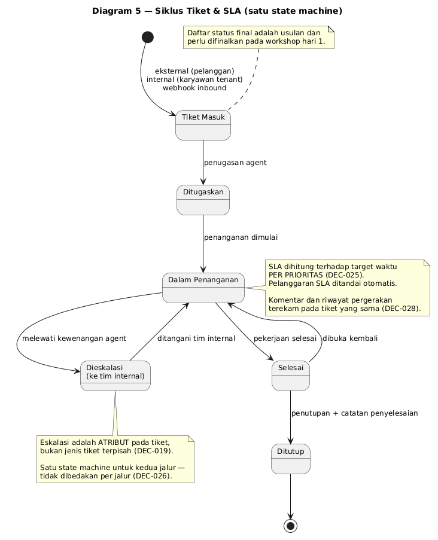

# Business Requirements Document (BRD) — CRM Multi-Tenant TLab

**Versi:** 1.0 (Draft)
**Tanggal:** 2026-10-02
**Disusun Oleh:** Yudha Pratama — PM, berperan sebagai Product Owner
**Status:** Draft — menunggu review PO dan approval Head of Product & Project

> **Kedudukan dokumen ini.** BRD ini adalah *bahan dasar* untuk **workshop
> finalisasi requirement pada hari 1 bootcamp** (DEC-037). Isinya sudah lengkap
> sebagai titik tolak, tetapi **belum final** — justru tujuan hari 1 adalah
> memfinalkannya bersama peserta. Bagian yang masih perlu finalisasi ditandai
> eksplisit di dalam dokumen, tidak disembunyikan.
>
> **Batas lingkup dokumen:** BRD ini memuat **requirement produk CRM**.
> Requirement *pelaksanaan bootcamp* (REQ-001 s/d REQ-013, REQ-038) berada di
> [[project-charter]], bukan di sini — bootcamp adalah mekanisme pelaksanaan,
> bukan bagian dari produk.

---

## 1. Konteks & Tujuan Bisnis

### 1.1 Latar Belakang

TLab membutuhkan **produk CRM milik sendiri** yang bersifat multi-tenant, dapat
dikembangkan lebih lanjut, dan pada akhirnya dapat dijual. Saat ini belum ada
sistem CRM terpusat: pengelolaan lead, peluang, pelanggan, dan tiket belum
memiliki tempat tunggal yang dapat diandalkan, sehingga riwayat interaksi
pelanggan tercecer dan pencapaian target sales sulit dibuktikan dengan data.

Masalah yang ingin diselesaikan:

| # | Masalah | Akibat bila tidak diselesaikan |
|---|---|---|
| 1 | Tidak ada sistem CRM terpusat milik TLab | Ketergantungan pada tool pihak ketiga; tidak ada aset produk yang dapat dijual |
| 2 | Data pelanggan dan interaksi tidak terkonsolidasi | Riwayat pelanggan hilang; keputusan berbasis ingatan, bukan data |
| 3 | Pencapaian target sales tidak terukur | Performa sales tidak dapat dibuktikan; pembinaan tidak berbasis data |
| 4 | Permintaan/keluhan pelanggan tidak terlacak | Keluhan hilang tanpa jejak; tidak ada kepastian waktu penyelesaian |
| 5 | Setiap klien menuntut proses berbeda | Tanpa mekanisme kustomisasi, core akan ter-fork dan tidak terkelola |

### 1.2 Tujuan Strategis

1. **Mendapatkan core platform CRM** — aset produk yang menjadi fondasi
   pengembangan dan penjualan selanjutnya.
2. **Menjadikan CRM dapat dijual ke banyak organisasi (B2B) maupun
   customer perorangan (B2C)** tanpa menduplikasi core per klien.
3. **Menyediakan jalur kustomisasi yang aman** — kebutuhan spesifik klien
   dipenuhi tanpa mengubah core, sehingga biaya pemeliharaan tetap terkendali.

### 1.3 Prinsip Produk yang Mengikat

> **Core CRM bersifat stabil dan tidak dimodifikasi per klien. Variasi proses
> bisnis klien diserap melalui webhook + service eksternal terpisah.**
> — DEC-012

Konsekuensi yang harus dipahami seluruh pihak:

1. Core memuat pakem CRM yang relatif universal: lead, peluang, kontak & akun,
   tiket, dan laporan.
2. Kebutuhan yang berbeda per klien **tidak** diselesaikan dengan mengubah core,
   melainkan dengan memanfaatkan event yang dipublikasikan core.
3. Kustomisasi berbasis webhook bersifat **asynchronous**. Kebutuhan yang
   menuntut validasi *blocking* di dalam core berada **di luar lingkup MVP**
   (DEC-014).
4. Contoh yang disepakati: klien membutuhkan mekanisme antrian → dibangun
   *service* terpisah yang berlangganan event CRM; core tidak berubah.

### 1.4 Konteks Pelaksanaan

Produk ini dibangun melalui **bootcamp internal berdurasi 3 hari** dengan
komposisi:

| Hari | Kegiatan |
|---|---|
| Hari 1 | **Workshop memfinalkan requirement** bersama peserta (DEC-037) |
| Hari 2–3 | **Pengembangan core platform CRM (backend)** (DEC-037, DEC-041) |

**Implikasi yang harus disadari:** durasi total 3 hari, tetapi **jendela
pengembangan efektif hanya 2 hari** untuk 7 modul mandatory. Ini risiko tertinggi
pada inisiatif ini (R-001, R-015 di [[risk-register]]).

---

## 2. Ruang Lingkup

### 2.1 Dalam Lingkup (In Scope)

**Modul produk MVP:**

| Modul | Nama | Status MVP |
|---|---|---|
| M1 | Tenancy & Kendali Akses | **Mandatory** |
| M2 | Contact & Account Management | **Mandatory** |
| M3 | Lead Management | **Mandatory** |
| M4 | Sales Pipeline / Opportunity | **Mandatory** |
| M5 | Activity Management | *Nice to have* — tidak masuk MVP |
| M6 | Ticketing | **Mandatory** |
| M7 | Reporting & Analytics | **Mandatory** |
| M8 | Webhook / Event Layer | **MVP minimal** (DEC-021) |

**Sasaran output yang diukur (DEC-041):** **desain core backend mampu
menyelesaikan seluruh fitur mandatory** yang ditargetkan. **Kesiapan frontend
bukan penghambat kelulusan** — UI boleh belum selesai selama kapabilitas backend
terbukti melayani semua fitur mandatory.

**Cara mengukur "selesai" (DEC-028 + DEC-042):** modul mandatory berjalan
**end-to-end**, tetapi **"end-to-end" diukur pada kapabilitas backend** — terverifikasi
melalui **API/kontrak data**, bukan kelengkapan UI. Termasuk di dalamnya:
komentar tiket dan riwayat pergerakan tiket.

### 2.2 Di Luar Lingkup (Out of Scope)

| Item | Alasan |
|---|---|
| **M5 Activity Management** | *Nice to have* — di luar MVP (DEC-015) |
| **Modul Billing / Invoice** | Revenue didefinisikan dari deal closed-won, bukan tagihan (DEC-016) |
| **Assessment tim sales (HR)** | Dikeluarkan dari lingkup produk CRM — CRM mengelola pelanggan, bukan penilaian karyawan (DEC-031) |
| **Extension point synchronous / blocking** | Kustomisasi hanya asynchronous (DEC-014) |
| **Implementasi produksi & integrasi ke sistem TLab lain** | Di luar mandat bootcamp; perlu keputusan lanjutan |
| **Dukungan pasca-bootcamp** | Belum ada keputusan kelanjutan (catatan internal Q-013) |
| **Leading indicator (aktivitas & pipeline) di MVP** | Memerlukan M5 yang *nice to have* (DEC-027) |

### 2.3 Requirement Berprioritas Rendah (Should / Could)

Requirement berikut berada di dalam visi produk tetapi **tidak menahan approval
prototype** bila tidak selesai: REQ-016 (inbound minimal), REQ-027 (laporan
pipeline), REQ-029 (laporan tiket), REQ-030 (aktivitas).

---

## 3. Stakeholder

| No | Stakeholder | Jenis | Kepentingan Utama | Modul Terkait |
|---|---|---|---|---|
| SH001 | **Sales Rep** | Internal | Lead & peluang terkelola, progres deal terlihat, pencapaian terukur | M3, M4, M7 |
| SH002 | **Sales Manager** | Internal | Visibilitas pipeline tim, penetapan kuota, identifikasi sales berkinerja rendah | M4, M7 |
| SH003 | **Agent Support** | Internal | Tiket terdistribusi, status jelas, jalur eskalasi tersedia | M6 |
| SH004 | **Support Lead / Manager** | Internal | Rekap beban & status tiket, penanganan eskalasi | M6, M7 |
| SH005 | **Tenant Admin** | Internal | Isolasi data antar tenant, kendali user/role, konfigurasi integrasi | M1, M8 |
| SH006 | **Pelanggan** (B2B/B2C) | Eksternal | Dapat membuat tiket dan memperoleh penyelesaian | M6 |
| SH007 | **Karyawan Tenant** | Internal | Dapat mengajukan permintaan/tiket ke tim lain | M6 |
| SH008 | **Sistem Klien** (di luar CRM) | System/Eksternal | Menerima event tepat waktu; dapat mengirim data ke CRM | M8 |
| SH009 | **Manajemen / Head of Sales** | Internal | Laporan revenue & pipeline yang dapat dipercaya | M7 |

Daftar lengkap beserta rencana komunikasi ada di [[stakeholder-register]].

**Catatan governance:** PM memegang peran ganda — **PM sekaligus Product Owner
yang berperan sebagai klien**. Konflik prioritas antara keputusan requirement dan
keputusan delivery dicatat sebagai risiko R-006.

---

## 4. Business Requirements

Format ID: **BR-nnn**. Setiap requirement mencantumkan **sumber requirement**
(REQ) dan **keputusan** (DEC) agar dapat ditelusuri. Prioritas memakai MoSCoW.

### 4.1 Prinsip Produk & Multi-Tenancy

| ID | Business Requirement | Sumber | Prioritas | Status |
|---|---|---|---|---|
| BR-001 | Core CRM harus stabil dan **tidak dimodifikasi per klien**; kustomisasi klien diserap melalui webhook + service eksternal terpisah | REQ-014 / DEC-012 | Must | Draft |
| BR-002 | Platform harus **multi-tenant** — dapat digunakan banyak user dari banyak organisasi (B2B) maupun customer tanpa organisasi (B2C) | REQ-017a / DEC-029 | Must | Draft |
| BR-003 | Data antar tenant harus **terisolasi** — tidak boleh tercampur atau terlihat lintas tenant | REQ-017 / DEC-015 | Must | Draft |
| BR-004 | Tenant Admin harus dapat mengelola **user, role, dan permission** di dalam tenant-nya | REQ-018 | Must | Draft |
| BR-005 | Kustomisasi klien hanya boleh bersifat **asynchronous**; validasi blocking di dalam core tidak disediakan di MVP | DEC-014 | Must | Draft |

> **Catatan arsitektur (belum selesai).** *Strategi isolasi teknis* multi-tenant
> (shared DB / schema-per-tenant / DB-per-tenant) **belum ditetapkan** — menjadi
> keputusan **Head of Engineer** (TD-01 di [[open-tech-decisions]]). BRD ini
> menetapkan **kebutuhan bisnisnya** (isolasi wajib), bukan mekanismenya.

### 4.2 Kontak & Akun (M2)

| ID | Business Requirement | Sumber | Prioritas | Status |
|---|---|---|---|---|
| BR-006 | Pengelolaan **Kontak** (individu) dan **Akun** (organisasi), mendukung pelanggan **B2B dan B2C** | REQ-019 / DEC-020 | Must | Draft |
| BR-007 | Pelanggan **B2C boleh berdiri sebagai Kontak tanpa Akun** — Akun bersifat opsional untuk B2C | DEC-024 | Must | Draft |

### 4.3 Lead Management (M3)

| ID | Business Requirement | Sumber | Prioritas | Status |
|---|---|---|---|---|
| BR-008 | Pengelolaan lead mencakup: **penangkapan, penugasan ke sales, perubahan status, dan konversi** menjadi Kontak + Akun + Peluang | REQ-020 | Must | Draft |
| BR-009 | Lead dapat **masuk dari luar CRM** melalui webhook inbound, tanpa input manual | REQ-016 / DEC-013 | Should | Draft |

### 4.4 Pipeline, Peluang & Revenue (M4)

| ID | Business Requirement | Sumber | Prioritas | Status |
|---|---|---|---|---|
| BR-010 | Pengelolaan peluang mencakup: **nilai deal, stage pipeline, tanggal tutup, dan penandaan closed-won / closed-lost beserta alasan** | REQ-021 / DEC-015 | Must | Draft |
| BR-011 | **Revenue didefinisikan dari deal closed-won** (nilai peluang yang dimenangkan), bukan dari invoice/pembayaran aktual | REQ-026 / DEC-016 | Must | Draft |

> **Belum ditetapkan:** jumlah dan nama **stage pipeline**. Belum ada datanya di
> knowledge base — perlu difinalkan pada workshop hari 1.

### 4.5 Kuota & Performa Sales (M7)

| ID | Business Requirement | Sumber | Prioritas | Status |
|---|---|---|---|---|
| BR-012 | Sales Manager dapat menetapkan **target/kuota won per sales per periode BULANAN** | REQ-022 / DEC-035 | Must | Draft |
| BR-013 | Sistem menghitung **quota attainment** per sales per bulan (nilai closed-won dibanding kuota bulanan) | REQ-023 / DEC-035 | Must | Draft |
| BR-014 | Sistem menandai **status performa** (mencapai / tidak mencapai target) dengan **ambang batas configurable per tenant** | REQ-024 / DEC-023 | Must | Draft |
| BR-015 | **Nilai default ambang batas = 80%**, berlaku hanya bila tenant belum mengonfigurasi ambangnya sendiri | DEC-039 | Must | Draft |
| BR-016 | Pengukuran lapis **aktivitas & pipeline (leading indicator) tidak termasuk MVP** — MVP memakai lapis outcome | DEC-027 | Won't (MVP) | Draft |

### 4.6 Ticketing (M6)

| ID | Business Requirement | Sumber | Prioritas | Status |
|---|---|---|---|---|
| BR-017 | Tiket dikelola sebagai **satu model tiket** (satu entitas), bukan dua sub-sistem terpisah | REQ-025 / DEC-019 | Must | Draft |
| BR-018 | Jalur tiket dibedakan berdasarkan **asal pemohon**: **eksternal = pelanggan**, **internal = karyawan tenant** | REQ-025 / DEC-022, DEC-036 | Must | Draft |
| BR-019 | **Eskalasi ke tim internal** merupakan **atribut pada tiket**, bukan jenis tiket yang berbeda | REQ-025 / DEC-019 | Must | Draft |
| BR-020 | Tiket memiliki **komentar/percakapan** yang tersimpan pada tiket yang sama | REQ-032 / DEC-028 | Must | Draft |
| BR-021 | Tiket memiliki **riwayat pergerakan** (perubahan status, assignee, eskalasi) yang dapat diaudit | REQ-033 / DEC-028 | Must | Draft |
| BR-022 | Tiket memiliki **SLA**: target waktu penyelesaian **per prioritas** beserta **penanda pelanggaran** | REQ-034 / DEC-025 | Must | Draft |
| BR-023 | Aturan status tiket memakai **satu state machine** — tidak dibedakan per jalur; SLA dibedakan hanya oleh prioritas | DEC-026 | Must | Draft |

> **Belum ditetapkan:** daftar status final tiket, daftar prioritas, dan angka
> target waktu SLA per prioritas. Diusulkan pada Diagram 5, perlu difinalkan hari 1.

### 4.7 Integrasi Webhook (M8)

| ID | Business Requirement | Sumber | Prioritas | Status |
|---|---|---|---|---|
| BR-024 | CRM mempublikasikan **event ke sistem klien (outbound)** saat terjadi perubahan status/entitas | REQ-015 / DEC-013 | Must | Draft |
| BR-025 | CRM dapat **menerima data dari sistem klien (inbound)** | REQ-016 / DEC-013 | Should | Draft |
| BR-026 | Satu subscription webhook dapat diteruskan ke **beberapa target (fan-out)** | REQ-035 / DEC-030 | Must | Draft |
| BR-027 | Pengiriman webhook memiliki **retry, rate limit, dan logging** | REQ-036 / DEC-030 | Must | Draft |
| BR-028 | Tenant Admin dapat **mengonfigurasi endpoint dan secret per tenant**, serta memantau delivery log | REQ-018, REQ-036 | Must | Draft |

> **Catatan teknis (belum selesai).** Spesifikasi implementasi — signing,
> dead-letter, kebijakan retry detail — menjadi keputusan **Head of Engineer**
> (TD-02). BRD menetapkan kebutuhan bisnisnya saja.

### 4.8 Pelaporan (M7)

| ID | Business Requirement | Sumber | Prioritas | Status |
|---|---|---|---|---|
| BR-029 | **Laporan revenue** dari peluang closed-won per periode | REQ-026 / DEC-016 | Must | Draft |
| BR-030 | **Laporan pipeline dan forecast** | REQ-027 | Should | Draft |
| BR-031 | **Laporan performa sales** (quota attainment per sales) | REQ-028 | Must | Draft |
| BR-032 | **Laporan tiket**: volume, status penanganan, dan kepatuhan SLA | REQ-029 / DEC-025 | Should | Draft |

### 4.9 Aktivitas (M5) — Nice to Have

| ID | Business Requirement | Sumber | Prioritas | Status |
|---|---|---|---|---|
| BR-033 | Pengelolaan aktivitas (call / meeting / task / note) yang terhubung ke lead, peluang, atau tiket | REQ-030 | Could | Draft |

---

## 5. Peta Proses → Modul → Peran

Peta ini menjadi jembatan antara proses bisnis dan modul produk, agar peserta
memahami proses mana yang dilayani modul mana dan oleh peran siapa.
(Sumber: [[requirement-analysis]] bagian Proses Bisnis, SPOK, dan Stakeholder.)

| Proses | Nama Proses | Modul | Aktor Utama | Business Requirement |
|---|---|---|---|---|
| P01 | Manajemen Lead | M3 | Sales Rep, Sales Manager, Sistem Klien | BR-008, BR-009 |
| P02 | Manajemen Kontak & Akun | M2 | Sales Rep | BR-006, BR-007 |
| P03 | Penetapan Target & Kuota Sales | M7 | Sales Manager | BR-012 |
| P04 | Pengelolaan Pipeline & Peluang | M4 | Sales Rep | BR-010, BR-011 |
| P05 | Pengelolaan Aktivitas | M5 *(nice to have)* | Sales Rep | BR-033 |
| P06 | Pengelolaan Tiket | M6 | Agent Support, Support Lead, Pelanggan, Karyawan Tenant | BR-017 … BR-023 |
| P07 | Pengukuran Performa Sales | M7 | Sales Manager, Sistem | BR-013, BR-014, BR-015 |
| P08 | Pelaporan Revenue & Pipeline | M7 | Manajemen, Sales Manager | BR-029, BR-030, BR-031 |
| P09 | Pelaporan Tiket | M7 | Support Lead | BR-032 |
| P10 | Tenancy & Kendali Akses | M1 | Tenant Admin | BR-002, BR-003, BR-004 |
| P11 | Integrasi Webhook | M8 | Tenant Admin, Sistem Klien | BR-024 … BR-028 |
| P12 | ~~Assessment Tim Sales (HR)~~ | — | — | **Dikeluarkan dari lingkup (DEC-031)** |

---

## 6. Diagram

Delapan diagram berikut disusun untuk membantu tim memahami requirement secara
visual saat di-share. Sumber PlantUML tersedia di
`requirements/brd/diagrams/*.puml`; gambar tersedia dalam **PNG** (untuk
presentasi/chat) dan **SVG** (untuk dokumen dan perbesaran tanpa pecah).

### 6.1 Diagram 1 — Konteks Sistem

Menunjukkan batas sistem: siapa yang berinteraksi dengan CRM, dan bagaimana core
terhubung ke sistem klien tanpa mengubah core.

*Poin kunci:* kustomisasi klien dibangun di **service eksternal**, bukan di dalam
core (DEC-012). Isolasi data antar tenant berlaku menyeluruh (DEC-029).

### 6.2 Diagram 2 — Proses Bisnis End-to-End

Alur lengkap P01–P09 dari lead masuk sampai pelaporan.

*Poin kunci:* P05 (Aktivitas) di luar MVP; P10–P11 (Tenancy, Webhook) adalah
proses pendukung yang berjalan lintas semua fase.

### 6.3 Diagram 3 — Peta Modul & Dependensi

Menunjukkan mengapa M1 harus dibangun pertama, dan bagaimana M7 serta M8
bergantung pada modul lain.

*Poin kunci:* **M1 adalah fondasi** — isolasi data antar tenant tidak dapat
ditambahkan belakangan tanpa rework. M7 hanya mengonsumsi data modul lain; M8
mengaitkan event ke seluruh modul.

### 6.4 Diagram 4 — Siklus Hidup Lead → Peluang

*Poin kunci:* konversi lead menghasilkan tiga entitas sekaligus (Kontak + Akun +
Peluang); nilai deal pada Closed-Won menjadi sumber revenue & quota attainment
(DEC-016).

### 6.5 Diagram 5 — Siklus Tiket & SLA

*Poin kunci:* **satu state machine** untuk kedua jalur (DEC-026); eskalasi adalah
atribut, bukan jenis tiket terpisah (DEC-019); SLA dihitung per prioritas (DEC-025).

### 6.6 Diagram 6 — Entity Relationship Diagram (Konseptual)

*Poin kunci:* hampir semua entitas terikat ke `Tenant` — ini wujud teknis dari
kebutuhan isolasi (BR-003). Kontak B2C tidak wajib terhubung ke Akun (DEC-024).

### 6.7 Diagram 7 — Alur Webhook (Outbound & Inbound)

*Poin kunci:* prioritas adalah **outbound** (CRM → sistem klien) dengan dukungan
fan-out, retry, dan rate limit (DEC-013, DEC-030). Seluruh kustomisasi bersifat
**asynchronous** (DEC-014).

### 6.8 Diagram 8 — Peran & Hak Akses per Modul

*Poin kunci:* pemisahan peran menentukan batas kewenangan — mis. hanya Sales
Manager yang menetapkan kuota; hanya Tenant Admin yang menyentuh tenancy dan
konfigurasi webhook.

---

## 7. Kriteria Keberhasilan

| # | Kriteria | Indikator | Sumber |
|---|---|---|---|
| 1 | **Core platform CRM (backend) terbangun** | Desain core backend mampu menyelesaikan **seluruh fitur mandatory**, terverifikasi melalui **API/kontrak data** | DEC-041, DEC-042 |
| 2 | Modul mandatory berjalan end-to-end | Alur: login multi-tenant → kelola lead/kontak/peluang → kelola tiket (termasuk komentar, riwayat pergerakan, SLA) → tampilkan laporan | DEC-028, DEC-042 |
| 3 | Requirement difinalkan bersama peserta | Seluruh pertanyaan terbuka terjawab/ditutup pada akhir hari 1; BRD disetujui sebagai baseline kerja hari 2–3 | DEC-037 |
| 4 | Kecepatan AI dalam development terukur | **Jumlah requirement yang ter-cover dalam jangka waktu tertentu** | DEC-032 |
| 5 | Efektivitas AI dalam development terukur | **Belum terdefinisi** — diteruskan ke Head of Engineer | Q-007, Q-008, TD-03/TD-04 |
| 6 | Produk berpotensi dikembangkan & dijual | **Belum ditentukan** — perlu definisi indikator kelayakan produk | Catatan internal |

> **Catatan penting.** Kriteria 5 **tidak dapat dipulihkan** bila baseline tidak
> ditetapkan sebelum hari pertama bootcamp (R-002). Kriteria 6 belum memiliki
> definisi — tidak diisi dengan angka agar tidak menciptakan target fiktif.

---

## 8. Asumsi & Batasan

### 8.1 Asumsi

| # | Asumsi | Risiko bila salah | Validasi |
|---|---|---|---|
| A-1 | Durasi bootcamp cukup untuk menghasilkan **core backend** yang mampu menyelesaikan seluruh fitur mandatory | Lingkup harus dipotong drastis atau bootcamp diperpanjang — belum direncanakan | **Perlu Validasi — kritis** |
| A-2 | **Hari 1 cukup untuk memfinalkan seluruh requirement** | Requirement masuk hari 2 belum final; jendela pengembangan menyusut | Perlu Validasi |
| A-3 | Peserta memiliki kompetensi dasar development | Sesi harus dirombak; waktu pondasi tidak tersedia | Perlu Validasi |
| A-4 | AI OS tersedia dan dapat dipakai selama bootcamp | Sasaran pengukuran efektivitas AI tidak tercapai | Perlu Validasi |
| A-5 | **Kesiapan frontend tidak menahan kelulusan** — UI minimal dapat ditinggalkan | Sasaran core platform tidak tercapai bila backend juga belum siap | DEC-041 |
| A-6 | Kustomisasi klien cukup dilayani secara **asynchronous** | Klien dengan kebutuhan blocking tidak dapat dilayani | Perlu Validasi |
| A-7 | Kuota bulanan dapat didefinisikan dari nilai closed-won tanpa data historis | Status performa kurang bermakna di prototype | Perlu Validasi |
| A-8 | Nama peserta tidak diperlukan untuk perencanaan sesi saat ini | Bila pembagian peran per individu dibutuhkan, sesi tidak dapat direncanakan | Terkonfirmasi DEC-038 |

### 8.2 Batasan (Constraints)

| # | Batasan | Sumber |
|---|---|---|
| C-1 | Durasi bootcamp tetap **3 hari**; **hanya hari 2–3 untuk pengembangan** | DEC-003, DEC-037 |
| C-2 | Produk **multi-tenant sejak awal** — bukan single-tenant yang di-retrofit | DEC-004 |
| C-3 | **Core tidak dimodifikasi per klien** | DEC-012 |
| C-4 | Ukuran kelulusan adalah **kapabilitas core backend**, bukan kelengkapan frontend | DEC-041, DEC-042 |
| C-5 | PM merangkap **Product Owner yang berperan sebagai klien** | DEC-005 |
| C-6 | Kustomisasi hanya **asynchronous** | DEC-014 |
| C-7 | **Tidak ada item yang boleh diisi dengan asumsi** — field tanpa data ditulis "Belum ditentukan" | DEC-011 |
| C-8 | Revenue berhenti di **nilai deal closed-won**; modul billing di luar lingkup | DEC-016 |

---

## 9. Yang Belum Final — Bahan Workshop Hari 1

Bagian ini sengaja dikumpulkan agar hari 1 punya agenda tertutup. Ini bukan
kekurangan dokumen, melainkan **tujuan utama workshop** (DEC-037, R-015).

| # | Yang perlu difinalkan | Pemilik | Dampak bila tidak selesai hari 1 |
|---|---|---|---|
| 1 | **Jumlah & nama stage pipeline** (BR-010) | PO + peserta | Fitur peluang tidak dapat diimplementasikan konsisten |
| 2 | **Daftar status tiket final** (BR-023) | PO + peserta | State machine tidak dapat dikodekan |
| 3 | **Daftar prioritas & target waktu SLA** (BR-022) | PO + peserta | Perhitungan SLA tidak dapat berjalan |
| 4 | **Ambang batas performa per tenant** — keputusan default 80% sudah ada (BR-015) | PO | — (sudah terjawab) |
| 5 | **Definisi teknis "core backend selesai"** — kontrak API/endpoint per modul | PO + Head of Engineer | Penilaian hari 3 menjadi ambigu |
| 6 | **Signing & kebijakan retry webhook** | Head of Engineer (TD-02) | EP-011 tidak dapat diimplementasikan |
| 7 | **Strategi isolasi teknis multi-tenant** | Head of Engineer (TD-01) | Rework arsitektur di tengah bootcamp |
| 8 | **Metrik efektivitas AI + baseline** | Head of Engineer (TD-03/04) | **Tidak dapat dipulihkan** bila lewat hari 1 |
| 9 | **Stack teknologi** | Head of Engineer (TD-05) | Materi sesi & scaffolding tidak dapat disiapkan |

---

## 10. Referensi Terkait

- **Project Profile (hub):** [[project-profile]]
- **Requirement Analysis (bahan baku BRD ini):** [[requirement-analysis]]
- **Requirement Backlog:** [[requirement-backlog]]
- **Project Charter:** [[project-charter]]
- **Decision Log:** [[decision-log]] (42 keputusan, DEC-001 s/d DEC-042)
- **Risk Register:** [[risk-register]]
- **RAID Log:** [[raid-log]]
- **Catatan Teknis Head of Engineer:** [[open-tech-decisions]] (TD-01 s/d TD-05)
- **Sumber PlantUML diagram:** `requirements/brd/diagrams/`

### Dokumen Turunan yang Diharapkan

| Dokumen | Isi | Pemilik | Status |
|---|---|---|---|
| **FRD** | Functional Requirements Document — penjabaran fungsi per modul | System Analyst | Belum disusun |
| **SRS** | Software Requirements Specification — spesifikasi teknis | System Analyst | Belum disusun |
| **RTM** | Requirement Traceability Matrix — peta BR → FR → test | System Analyst | Belum disusun |
| **User Story** | 37 user story sudah tersedia di [[requirement-analysis]] bagian 6 | BA | Tersedia |
