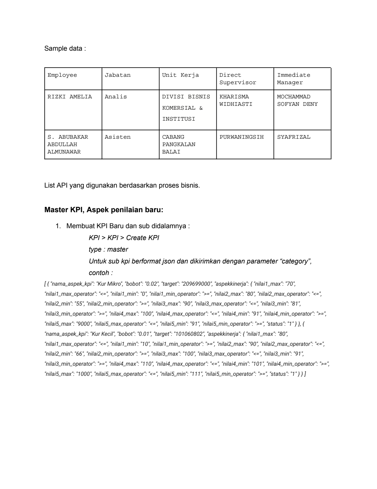
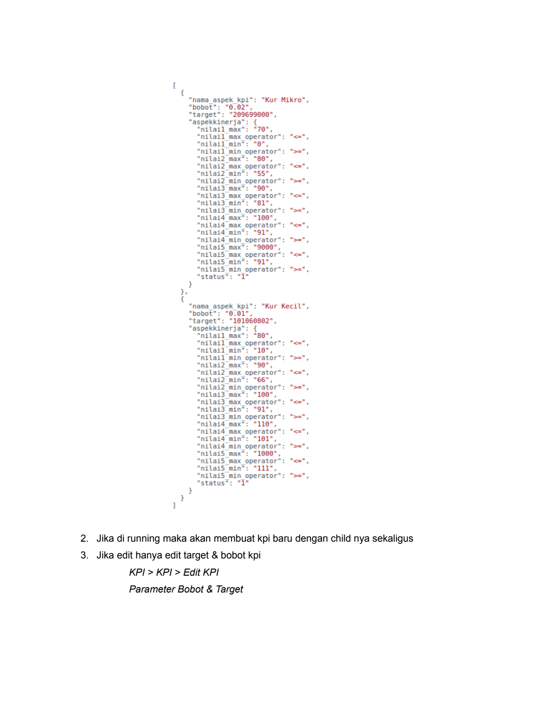
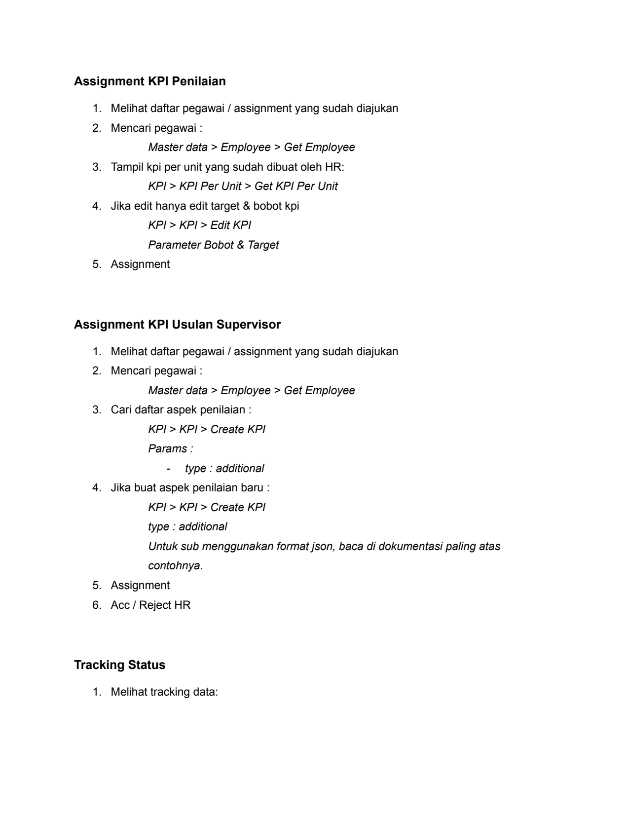

# Dokumentasi Api Kpi Monitoring

> **Sumber:** [dokumentasi-api-kpi-monitoring](https://docs.google.com/document/d/1r-sUiLi0kchYxV8ukCHp2kmnCHjDdLKAYrlctR5c7go/edit)

---

Sample data :

    Employee        Jabatan     Unit Kerja      Direct           Immediate
                                                Supervisor       Manager

    RIZKI AMELIA    Analis      DIVISI BISNIS   KHARISMA         MOCHAMMAD
                                KOMERSIAL &     WIDHIASTI        SOFYAN DENY
                                INSTITUSI

    S. ABUBAKAR     Asisten     CABANG          PURWANINGSIH     SYAFRIZAL
    ABDULLAH                    PANGKALAN
    ALMUNAWAR                   BALAI

List API yang digunakan berdasarkan proses bisnis.

Master KPI, Aspek penilaian baru:

     1. Membuat KPI Baru dan sub didalamnya :
        KPI > KPI > Create KPI
        type : master
        Untuk sub kpi berformat json dan dikirimkan dengan parameter "category",
        contoh :
[ { "nama_aspek_kpi": "Kur Mikro", "bobot": "0.02", "target": "209699000", "aspekkinerja": { "nilai1_max": "70",
"nilai1_max_operator": "<=", "nilai1_min": "0", "nilai1_min_operator": ">=", "nilai2_max": "80", "nilai2_max_operator": "<=",
"nilai2_min": "55", "nilai2_min_operator": ">=", "nilai3_max": "90", "nilai3_max_operator": "<=", "nilai3_min": "81",
"nilai3_min_operator": ">=", "nilai4_max": "100", "nilai4_max_operator": "<=", "nilai4_min": "91", "nilai4_min_operator": ">=",
"nilai5_max": "9000", "nilai5_max_operator": "<=", "nilai5_min": "91", "nilai5_min_operator": ">=", "status": "1" } }, {
"nama_aspek_kpi": "Kur Kecil", "bobot": "0.01", "target": "101060802", "aspekkinerja": { "nilai1_max": "80",
"nilai1_max_operator": "<=", "nilai1_min": "10", "nilai1_min_operator": ">=", "nilai2_max": "90", "nilai2_max_operator": "<=",
"nilai2_min": "66", "nilai2_min_operator": ">=", "nilai3_max": "100", "nilai3_max_operator": "<=", "nilai3_min": "91",
"nilai3_min_operator": ">=", "nilai4_max": "110", "nilai4_max_operator": "<=", "nilai4_min": "101", "nilai4_min_operator": ">=",
"nilai5_max": "1000", "nilai5_max_operator": "<=", "nilai5_min": "111", "nilai5_min_operator": ">=", "status": "1" } } ]

---

{
     “nama_aspek_kpi®:    "Kur Mikro",
     “bobot":  "6.02",
      “target”:   "209699000",
       “aspekkinerja":  {
        “nilail max":  "70",
     nilail
     nilail      min": "8",
     “nilail     min operator”:  ">=",
        “nilai2 max":  "88",
     nilai2
     nilai2     min":  "55",
                 min
     nilai2
                    operator”:
     nilai3            "96",
          ilai3  max operator
     nilai3            "81",
     nilai3
                max": "160",
     “nilaid
        “nilaid min":  "91",
     nilaid
          ilai5 max”:   "9800"
     nilai5
     nilai5 min®:      "91",
     nilai5      min operator
“status®:          "1"

     “nama_aspek_kpi®:   "Kur Kecil®,
         "6.61",
     “target”:   "101066862",

 nilail
  ilail                 "16",
 nilail
                max":   "98",
     “nilai2     max operator”:  "<=",
 “nilai2        min":   "66",
               nilai2
 nilai3                 "160°,
                         ilai3
     nilai3 min®:       "91",
 nilai3          min operator
 nilaid         max":   "110
 nilaid          max  operator”:
 “nilaid                "161°,
               “nilaid
 “nilai5        max":   “1006
                 max
               nilai5
                    operator”:   "<=",
 nilai5         min":   “111
 nilai5          min operator
“status”:

    2. Jika di running maka akan membuat kpi baru dengan child nya sekaligus
    3. Jika edit hanya edit target & bobot kpi
    KPI > KPI > Edit KPI
    Parameter Bobot & Target

---

Assignment KPI Penilaian

1. Melihat daftar pegawai / assignment yang sudah diajukan
2. Mencari pegawai :
Master data > Employee > Get Employee
3. Tampil kpi per unit yang sudah dibuat oleh HR:
KPI > KPI Per Unit > Get KPI Per Unit
4. Jika edit hanya edit target & bobot kpi
KPI > KPI > Edit KPI
Parameter Bobot & Target
5. Assignment

Assignment KPI Usulan Supervisor

1. Melihat daftar pegawai / assignment yang sudah diajukan
2. Mencari pegawai :
Master data > Employee > Get Employee
3. Cari daftar aspek penilaian :
KPI > KPI > Create KPI
Params :
-              type : additional
4. Jika buat aspek penilaian baru :
KPI > KPI > Create KPI
type : additional
Untuk sub menggunakan format json, baca di dokumentasi paling atas
contohnya.
5. Assignment
6. Acc / Reject HR

Tracking Status

1. Melihat tracking data:

---

