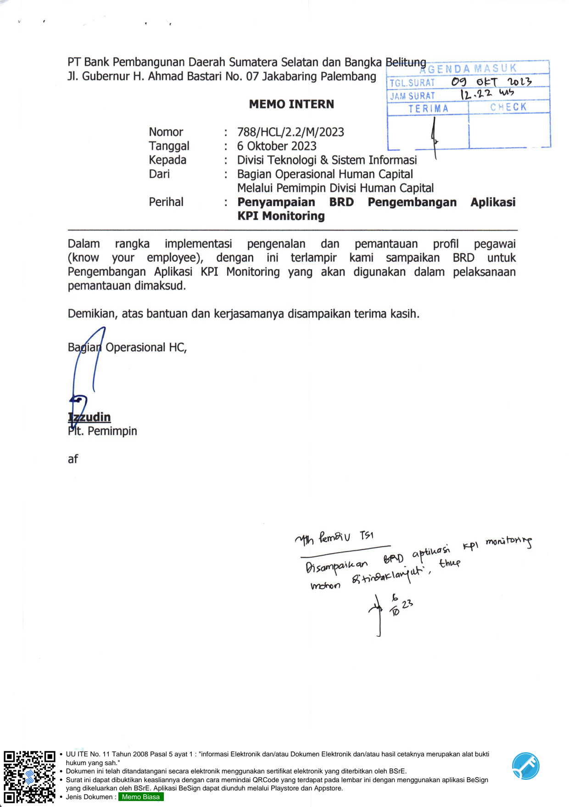
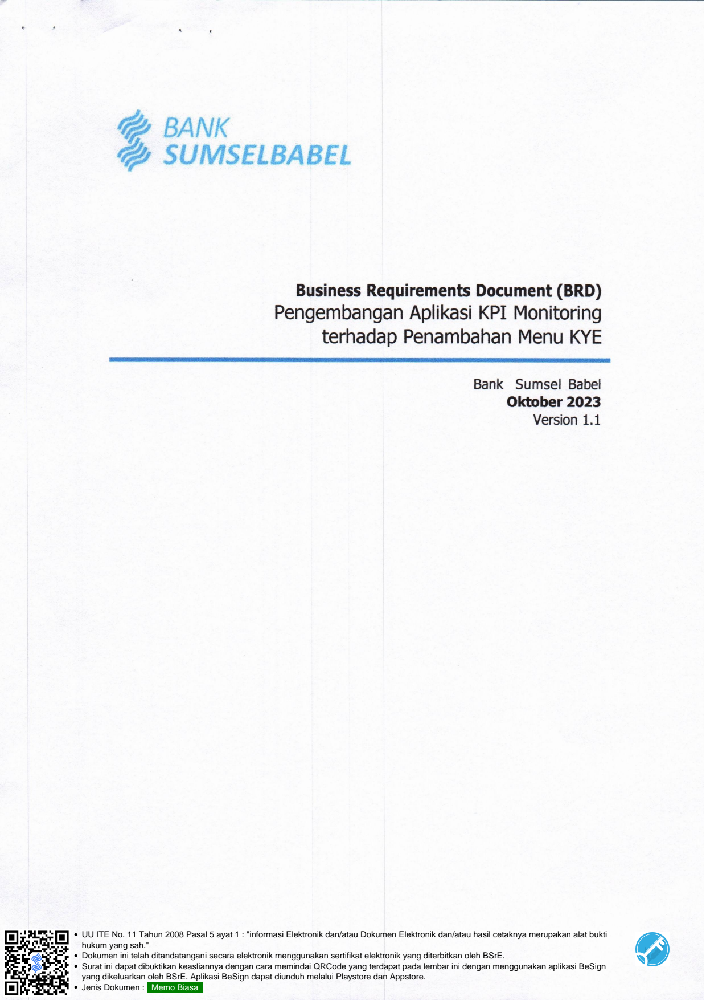
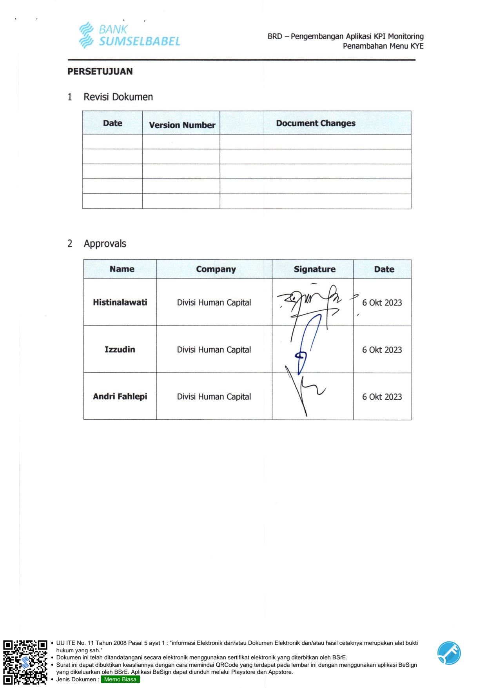
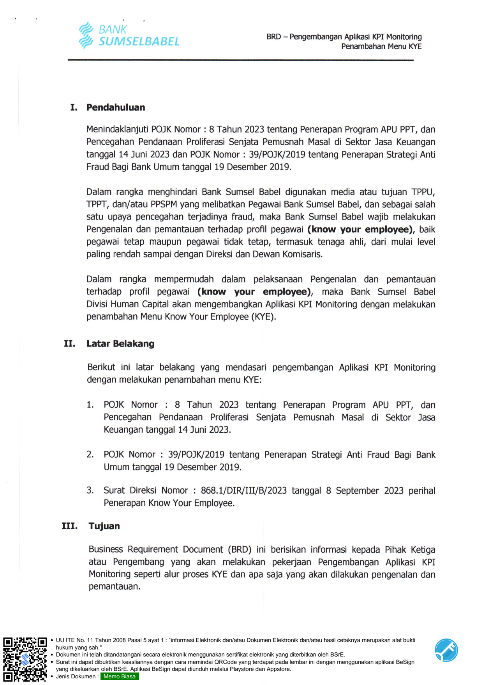
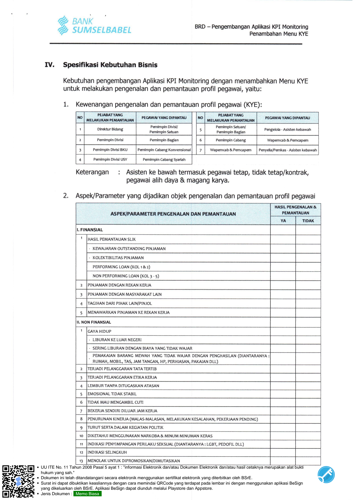
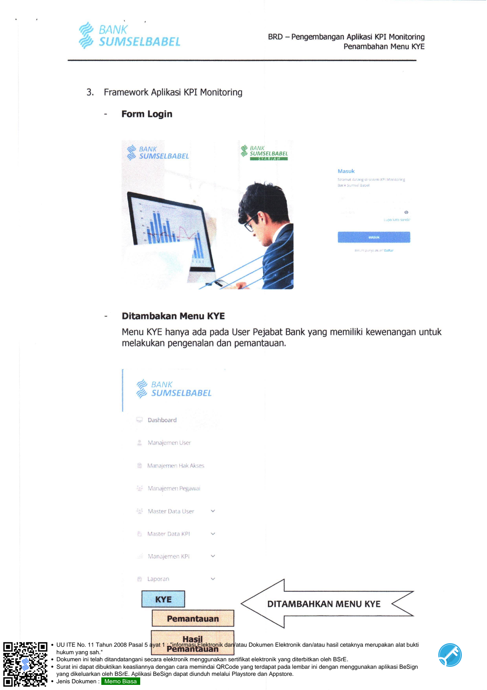
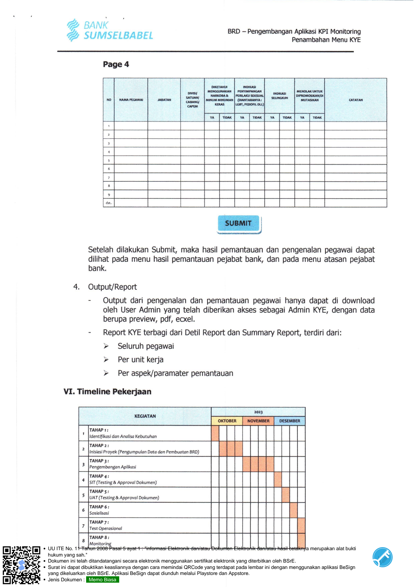
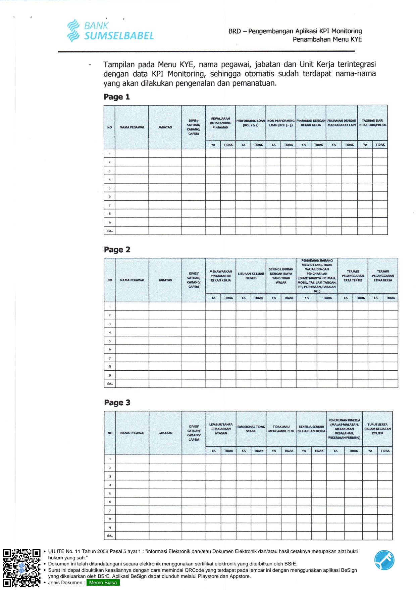

# Business Requirements Document (BRD) — KYE (Know Your Employee)

> **Sumber:** [BRD KYE.pdf (Drive)](https://drive.google.com/file/d/1Rs4xt19r-y7KgTBhTYuQNmNLHRe9jDRm/view) | [BRD KYE (Google Docs)](https://docs.google.com/document/d/1o3QC-E3bnh6EctIzMZ9AfXbi8xpSq5eEHxzRyWv0vHU/edit)

---

PT Bank Pembangunan Daerah Sumatera Selatan dan Bangka
JI. Gubernur H. Ahmad Bastari No. 07 Jakabaring Palembang -
                                                                                  22 wh   |
                                      MEMO INTERN

                   Nomor            788/HCL/2.2/M/2023                         |          |
                   Tanggal    :     6 Oktober 2023
                   Kepada             Teknologi & Sistem Informasi
                   Dari       :     Bagian Operasional Human Capital
                                    Melalui Pemimpin  Divisi Human Capital
                   Perihal    :     Penyampaian       BRD        Pengembangan     Aplikasi
                                    KPI Monitoring

    Dalam   rangka     implementasi   pengenalan  dan     pemantauan   profil      pegawai
    (know   your  employee),  dengan  ini  terlampir      kami  sampaikan     BRD    untuk
Pengembangan Aplikasi KPI Monitoring yang akan digunakan dalam pelaksanaan
pemantauan dimaksud.

    Demikian, atas bantuan dan kerjasamanya disampaikan terima kasih.

    Bagiarl Operasional  HC,

    Pemimpin

    af

                                    Mh                TS
                                    hr                  Ee                    pp
                                                        |
                                    Won               &
                                                        Lo

    +   UU ITE No. 11 Tahun 2008 Pasal 5 ayat 1 : "informasi Elektronik dan/atau Dokumen Elektronik dan/atau hasil cetaknya merupakan alat bukti
        hukum yang sah."
    “s+ Dokumen ini telah ditandatangani secara elektronik menggunakan sertifikat elektronik yang diterbitkan oleh BSrE.
    +   Surat ini dapat dibuktikan keasliannya dengan cara memindai QRCode yang terdapat pada lembar ini dengan menggunakan aplikasi BeSign
        yang dikeluarkan oleh BSrE. Aplikasi BeSign dapat diunduh melalui Playstore dan Appstore.
    «   Jenis Dokumen : Memo Biasa

---

BANK
    SUMSELBABEL

    Business Requirements Document (BRD)
    Pengembangan Aplikasi KPI Monitoring
            terhadap Penambahan Menu KYE

    Bank Sumsel Babel
         Oktober 2023
          Version 1.1

=[=] + UU ITE No. 11 Tahun 2008 Pasal 5 ayat 1 : "informasi Elektronik dan/atau Dokumen Elektronik dan/atau hasil cetaknya merupakan alat bukti
    hukum yang sah."
    «+   Dokumen ini telah ditandatangani secara elektronik menggunakan sertifikat elektronik yang diterbitkan oleh BSrE.        N
    +    Surat ini dapat dibuktikan keasliannya dengan cara memindai QRCode yang terdapat pada lembar ini dengan menggunakan aplikasi BeSign
         yang dikeluarkan oleh BSrE. Aplikasi BeSign dapat diunduh melalui Playstore dan Appstore.
    «    Jenis Dokumen : Memo Biasa

---

BRD — Pengembangan Aplikasi KPI Monitoring
                          Penambahan Menu KYE

   PERSETUJUAN

   1 Revisi Dokumen

     Date     Version Number    Document Changes

   2 Approvals

     Name     Company    Signature    Date

                        7
            Divisi  Human Capital            6 Okt 2023

                        =
   Izzudin  Divisi  Human Capital    / / T   6 Okt 2023

                        \
                        ¥

   Andri Fahlepi Divisi Human Capital        6 Okt 2023

=  =[=]  +   UU ITE No. 11 Tahun 2008 Pasal 5 ayat 1 : "informasi Elektronik dan/atau Dokumen Elektronik dan/atau hasil cetaknya merupakan alat bukti
             hukum yang sah."
    “s+ Dokumen ini telah ditandatangani secara elektronik menggunakan sertifikat elektronik yang diterbitkan oleh BSrE.
         +   Surat ini dapat dibuktikan keasliannya dengan cara memindai QRCode yang terdapat pada lembar ini dengan menggunakan aplikasi BeSign
             yang dikeluarkan oleh BSrE. Aplikasi BeSign dapat diunduh melalui Playstore dan Appstore.
         «   Jenis Dokumen : Memo Biasa

---

BRD — Pengembangan Aplikasi KPI Monitoring
                           Penambahan Menu KYE

    I.   Pendahuluan

         Menindaklanjuti POJK Nomor :      8 Tahun 2023 tentang Penerapan Program APU PPT, dan
         Pencegahan Pendanaan  Proliferasi Senjata Pemusnah    Masal di Sektor Jasa   Keuangan
         tanggal 14 Juni 2023 dan POJK Nomor  :   39/POJK/2019 tentang Penerapan Strategi Anti
         Fraud Bagi Bank Umum tanggal 19 Desember 2019.

         Dalam  rangka   menghindari  Bank Sumsel  Babel digunakan   media atau tujuan   TPPU,
         TPPT, dan/atau PPSPM yang     melibatkan Pegawai Bank Sumsel Babel, dan sebagai salah
         satu upaya pencegahan  terjadinya fraud,  maka  Bank  Sumsel   Babel wajib  melakukan
         Pengenalan dan  pemantauan terhadap profil pegawai    (know  your     employee), baik
         pegawai  tetap  maupun pegawai    tidak tetap, termasuk tenaga ahli, dari mulai level
         paling rendah sampai dengan Direksi dan Dewan Komisaris.

         Dalam   rangka  mempermudah    dalam     pelaksanaan  Pengenalan     dan   pemantauan
         terhadap profil pegawai (know     your       employee), maka   Bank    Sumsel   Babel
         Divisi    Human Capital akan mengembangkan Aplikasi KPI Monitoring   dengan melakukan
         penambahan Menu Know Your Employee (KYE).

    II.   Latar Belakang

          Berikut ini  latar  belakang yang   mendasari    pengembangan Aplikasi    KPI      Monitoring
          dengan melakukan penambahan      menu KYE:

          1.   POJK   Nomor   :  8 Tahun   2023     tentang    Penerapan    Program APU   PPT,      dan
               Pencegahan     Pendanaan Proliferasi  Senjata   Pemusnah       Masal di   Sektor    Jasa
               Keuangan tanggal 14 Juni 2023.

          2.   POJK    Nomor  :  39/POJK/2019 tentang    Penerapan   Strategi Anti  Fraud  Bagi    Bank
               Umum tanggal 19 Desember 2019.

          3.   Surat Direksi     Nomor :  868.1/DIR/III/B/2023 tanggal   8   September   2023   perihal
               Penerapan Know Your Employee.

    III.   Tujuan

           Business  Requirement   Document   (BRD)  ini   berisikan informasi  kepada   Pihak   Ketiga
           atau Pengembang     yang     akan   melakukan   pekerjaan      Pengembangan   Aplikasi   KPI
           Monitoring seperti    alur proses KYE dan apa  saja yang  akan dilakukan      pengenalan dan
           pemantauan.

  + UU ITE No. 11 Tahun 2008 Pasal 5 ayat 1 : "informasi Elektronik dan/atau Dokumen Elektronik dan/atau hasil cetaknya merupakan alat bukti
   hukum yang sah."
*r + Dokumen ini telah ditandatangani secara elektronik menggunakan sertifikat elektronik yang diterbitkan oleh BSrE.
  + Surat ini dapat dibuktikan keasliannya dengan cara memindai QRCode yang terdapat pada lembar ini dengan menggunakan aplikasi BeSign
   yang dikeluarkan oleh BSrE. Aplikasi BeSign dapat diunduh melalui Playstore dan Appstore.
  « Jenis Dokumen : Memo Biasa

---

BRD — Pengembangan Aplikasi KPI Monitoring
                           Penambahan Menu KYE

        IV.   Spesifikasi Kebutuhan Bisnis

              Kebutuhan pengembangan Aplikasi KPI Monitoring dengan menambahkan Menu KYE
              untuk melakukan pengenalan dan pemantauan profil pegawai, yaitu:

              1             Kewenangan pengenalan dan pemantauan profil pegawai (KYE):
                            NO               PEJABAT YANG          PEGAWAI YANG DIPANTAU          NO      PEJABAT YANG                   YANG
                                      MELAKUKAN    PEMANTAUAN                                               PEMANTAUAN                       DIPANTAU
                                1            Direktur Bidang                  Divisi/              5    Pemimpin Satuan/    Pengelola-   Asisten kebawah
                                                                         Pemimpin Satuan                 Pomimpin Bagian

                                2            Pemimpin Divisi             Pemimpin Bagian           6     Pemimpin Cabang    Wapemcab & Pemcapem
                                3            Pemimpin Divisi BKU  Pemimpin Cabang Konvensional | | 7  | Wapemcab&Pemcapem | Penyelia/Pemkas -Asisten kebawah

                                4            Pemimpin Divisi USY     Pemimpin Cabang Syariah

                            Keterangan           :              Asisten  ke bawah termasuk pegawai tetap, tidak tetap/kontrak,
                                                                pegawai alih daya &     magang         karya.

        Aspek/Parameter yang dijadikan objek pengenalan dan pemantauan profil pegawai

                                                                                                                                          HASIL PENGENALAN &
                                                 ASPEK/PARAMETER PENGENALAN DAN PEMANTAUAN                                               PEMANTAUAN
                                                                                                                                         YA  TIDAK

                            1.  FINANSIAL

                                   1     [HASIL PEMANTAUAN SLIK

                                         -   KEWAJARAN OUTSTANDING PINJAMAN

                                         -   KOLEKTIBILITAS PINJAMAN

                                             PERFORMING LOAN (KOL 1&2)

                                                                         3 5
                                             NON PERFORMING LOAN (KOL      -

                                         PINJAMAN DENGAN REKAN KERJA

                                         PINJAMAN DENGAN MASYARAKAT LAIN

                                4                 DARI PIHAK LAIN/PINJOL

                                5        MENAWARKAN PINJAMAN KE REKAN KERJA

                            11.    NON FINANSIAL

                                   1     GAYA HIDUP

                                         -   LIBURAN KE LUAR NEGERI

                                         -   SERING LIBURAN DENGAN BIAYA YANG TIDAK WAJAR

                                             PEMAKAIAN BARANG MEWAH YANG TIDAK WAJAR DENGAN PENGHASILAN (DIANTARANYA     :|
                                                 MOBIL, TAS, JAM TANGAN, HP, PERHIASAN, PAKAIAN DLL)

                                      TERJADI PELANGGARAN TATA TERTIB

                            fw TERJADI           PELANGGARAN ETIKA KERJA
                                         LEMBUR TANPA DITUGASKAN ATASAN

                                         EMOSIONAL TIDAK STABIL

                                      TIDAK MAU MENGAMBIL

                                         BEKERJA SENDIRI DILUAR JAM KERJA

                                         PENURUNAN KINERJA (MALAS-MALASAN, MELAKUKAN KESALAHAN, PEKERJAAN PENDING)

                                      |  TURUT SERTA  DALAM KEGIATAN POLITIK
                                         DIKETAHUI                         &
                                                 MENGGUNAKAN NARKOBA MINUM MINUMAN KERAS
                                         INDIKAS!                                                     :
                                                 PENYIMPANGAN PERILAKU SEKSUAL (DIANTARANYA LGBT, PEDOFIL DLL)

                                         INDIKASI SELINGKUH

        MENOLAK UNTUK DIPROMOSIKAN/DIMUTASIKAN
WC] « UU ITE No. 11 Tahun 2008 Pasal 5 ayat 1 : "informasi Elektronik dan/atau Dokumen Elektronik dan/atau hasil cetaknya merupakan alat bukti
        hukum yang sah."                                                                                                                     %
    +   Dokumen ini telah ditandatangani secara elektronik menggunakan sertifikat elektronik yang diterbitkan oleh BSrE.
    +   Surat ini dapat dibuktikan keasliannya dengan cara memindai QRCode yang terdapat pada lembar ini dengan menggunakan aplikasi BeSign
        yang dikeluarkan oleh BSrE. Aplikasi BeSign dapat diunduh melalui Playstore dan Appstore.
    «   Jenis Dokumen : Memo Biasa

---

BRD — Pengembangan Aplikasi KPI Monitoring
        Penambahan Menu KYE

    3.   Framework Aplikasi KPI Monitoring

         - Form Login

         -   Ditambakan Menu KYE

             Menu KYE hanya ada pada User Pejabat Bank yang memiliki kewenangan untuk
             melakukan pengenalan dan pemantauan.

             SUMSELBABEL

             DITAMBAHKAN MENU KYE

             Pemantauan

=[=] + UU ITE No. 11 Tahun 2008 Pasal 5 ayat 1 : "informasi Elektronik dan/atau Dokumen Elektronik dan/atau hasil cetaknya merupakan alat bukti
  c+ hukum yang sah." (A)
    + Dokumen ini telah ditandatangani secara elektronik menggunakan sertifikat elektronik yang diterbitkan oleh BSrE.
    + Surat ini dapat dibuktikan keasliannya dengan cara memindai QRCode yang terdapat pada lembar ini dengan menggunakan aplikasi BeSign
     yang dikeluarkan oleh BSrE. Aplikasi BeSign dapat diunduh melalui Playstore dan Appstore.
    « Jenis Dokumen : Memo Biasa

---

BRD Pengembangan Aplikasi KPI Monitoring
                         Penambahan Menu KYE

           4
        Page

               soy  |        ||  owas     |
    wo |    |  mst  |                     |    |
               An                             ama
               in
                        [row |   a [rom | [rom | wm [rom

    3

    5

    5

         Setelah  dilakukan Submit, maka hasil pemantauan dan   pengenalan pegawai   dapat
         dilihat pada menu  hasil pemantauan pejabat bank, dan  pada menu atasan   pejabat
         bank.

    4.   Output/Report
         -   Output dari pengenalan dan pemantauan pegawai        hanya dapat  di download
             oleh User Admin yang   telah diberikan akses sebagai Admin KYE,   dengan data
             berupa preview, pdf, ecxel.
         -   Report KYE terbagi dari Detil Report dan Summary Report, terdiri dari:
             »    Seluruh pegawai

             »    Per unit kerja

             »    Per aspek/paramater pemantauan

VI. Timeline Pekerjaan

                            KEGIATAN        202;    2

                        TAHAP 1:
                            dan    Analisa Kebutuhan
                        TAHAP 2:
                            Proyek (Pengumpuian Data dan Pembuatan BRD)
                        TAHAP 3:
                        Pengembangan Aplikasi
                        TAHAP 4 :
                        SIT (Testing& Approval Dokumen)
                        TAHAP 5 :
                            (Testing Approval Dokumen)
                        UAT     &
                        TAHAP   :
                                6
                        Sosialisasi
                        (TAHAP 7:
       7                {restoperasional
       8                TAHAP 8:
    +   UU ITE No. 11 Tahun 2008 Pasal 5 ayat 1 : "informasi Elektronik dan/atau Dokumen Elektronik dan/atau hasil cetaknya merupakan alat bukti
        hukum yang sah."
    +   Dokumen ini telah ditandatangani secara elektronik menggunakan sertifikat elektronik yang diterbitkan oleh BSrE.
    +   Surat ini dapat dibuktikan keasliannya dengan cara memindai QRCode yang terdapat pada lembar ini dengan menggunakan aplikasi BeSign
        yang dikeluarkan oleh BSrE. Aplikasi BeSign dapat diunduh melalui Playstore dan Appstore.
    «   Jenis Dokumen : Memo Biasa

---

BRD — Pengembangan Aplikasi KPI Monitoring
       Penambahan Menu KYE

   -   Tampilan pada Menu KYE,  nama pegawai, jabatan dan Unit Kerja                    terintegrasi
       dengan data KPI Monitoring, sehingga otomatis     sudah  terdapat                   nama-nama
       yang akan dilakukan pengenalan dan pemanatuan.
           1
       Page

                          omsy           LOAN||NON    [Pros  |             |        DENGAN   TAGIHAN
                                                                                   LAI      || PIHAK LANPINIOL
           AA             re        LOAN(KOL3-3)                REKANKERIA  MASYARAKAT               DARI
                              [ow |     a   [om |       [row |  a     [vow |    [vom |         w     [om

   5

   5

   7

   5

 2
 Page
 |  TORK
 |  |  ovisy   |  |  KELUAR|  DENGAN BIAYA |  PENGHASILAN  |  |  X
 -   mown  mone  samy  |  TAS, am  |  KERIA
 Shure)
 aren  WAAR  TanGax,
 row |  [rom |  [rom]  ou)
 w  |  |  |  w
 w  vow  [rom
 [rom

   5

   5

       5
       =

           3
 Page

   |        |    |        S|     pation  |       com|         mn     Men                    ||
       vo        mar      Asay  EE                                                      PRON)        rac
                                                                     MAAN

                              [om |     a [rox]  [row |         wm            w      | om |     w [mom

       5

   5
   -

=  =[=]  +    UU ITE No. 11 Tahun 2008 Pasal 5 ayat 1 : "informasi Elektronik dan/atau Dokumen Elektronik dan/atau hasil cetaknya merupakan alat bukti
              hukum yang sah."
         «+   Dokumen ini telah ditandatangani secara elektronik menggunakan sertifikat elektronik yang diterbitkan oleh BSrE.
         +    Surat ini dapat dibuktikan keasliannya dengan cara memindai QRCode yang terdapat pada lembar ini dengan menggunakan aplikasi BeSign
              yang dikeluarkan oleh BSrE. Aplikasi BeSign dapat diunduh melalui Playstore dan Appstore.
         «    Jenis Dokumen : Memo Biasa

---

