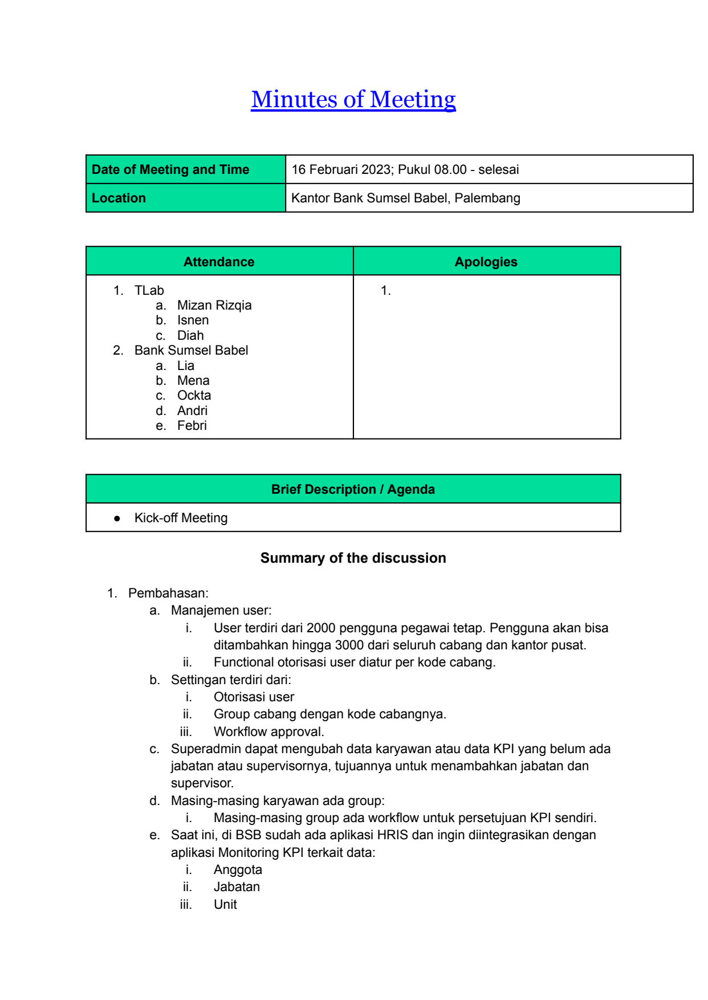
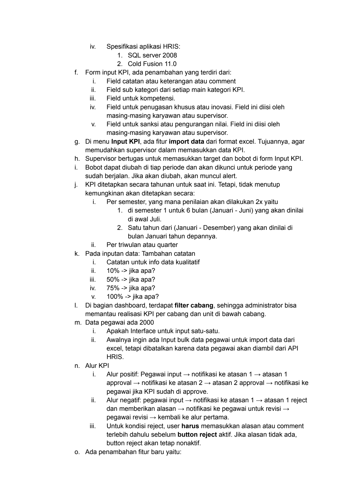
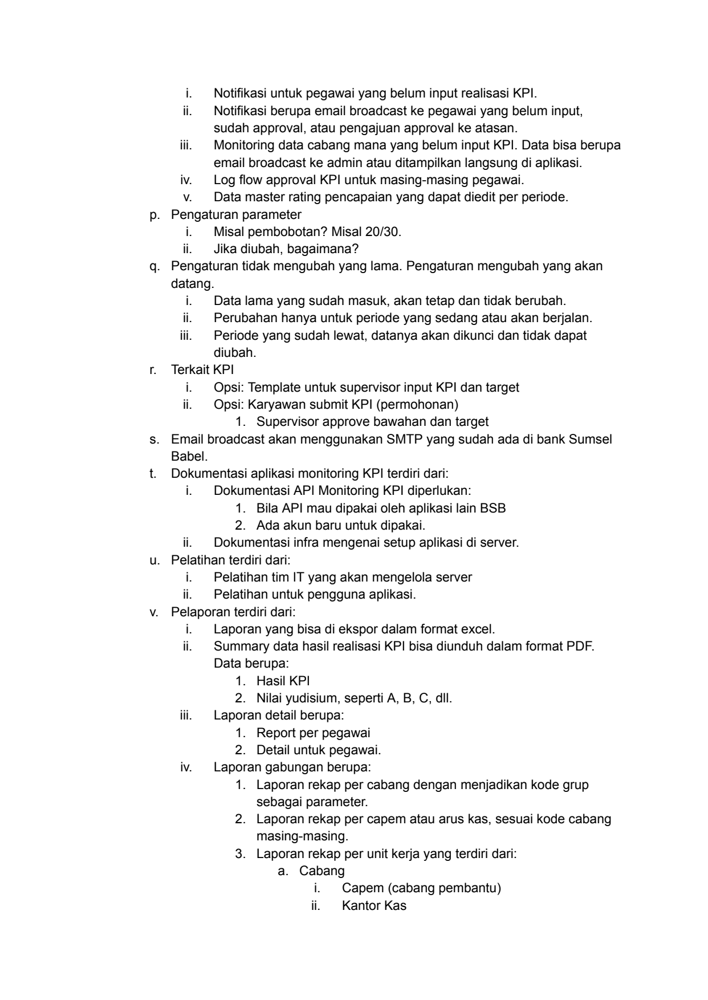
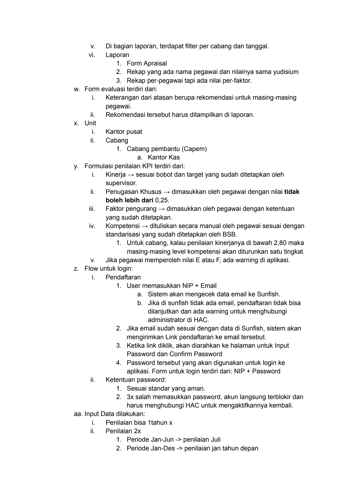
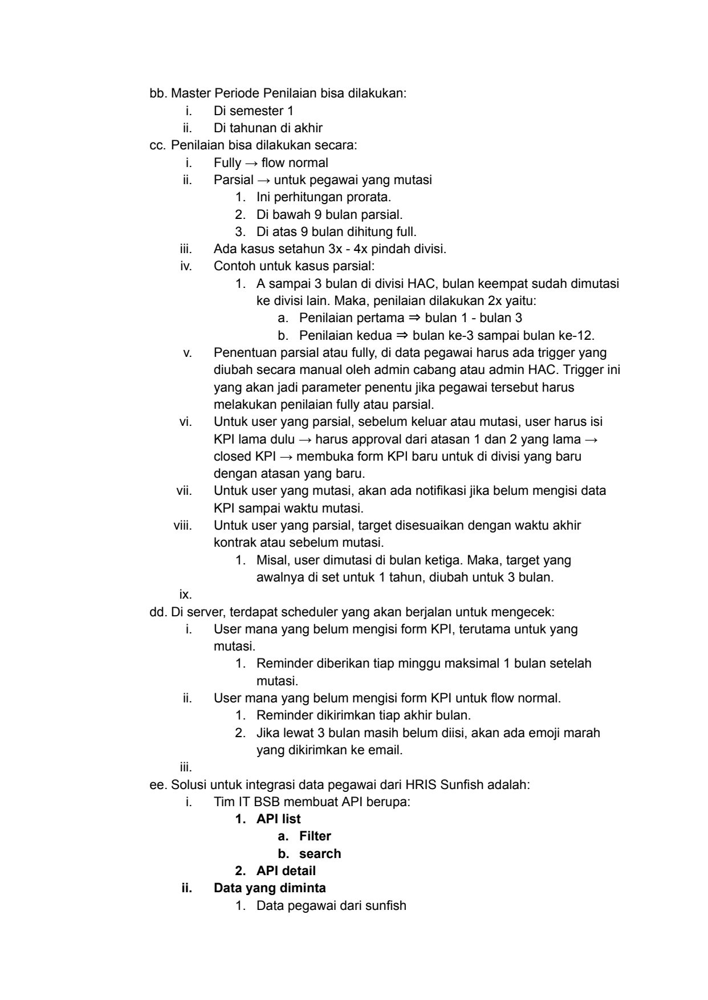
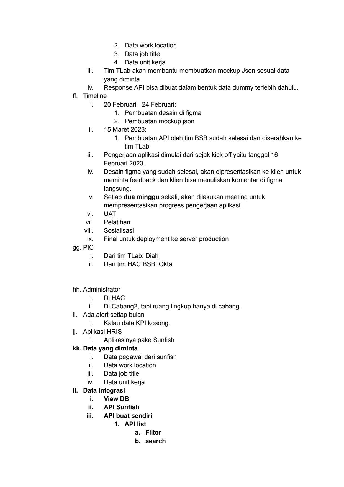
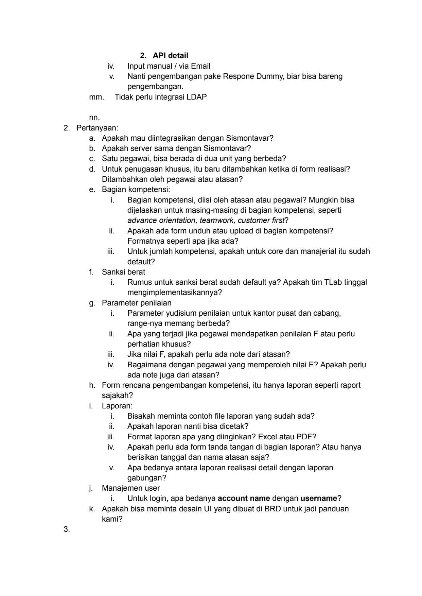

# 2023 02 16 Mom Kick Off Kpi Monitoring

> **Sumber:** [2023-02-16-mom-kick-off-kpi-monitoring](https://docs.google.com/document/d/1Wy_QAct5yXLEShyB-Duqybt_FBWRtUj7zNmKUGVwWpc/edit)

---

Minutes of Meeting

    Date of Meeting and Time   16 Februari 2023; Pukul 08.00 - selesai
    Location                   Kantor Bank Sumsel Babel, Palembang

        Attendance             Apologies
    1. TLab                    1.
    a. Mizan Rizqia
    b. Isnen
    c. Diah
2. Bank Sumsel Babel
    a. Lia
    b. Mena
    c. Ockta
    d. Andri
    e. Febri

                      Brief Description / Agenda
    ● Kick-off Meeting

                      Summary of the discussion

    1. Pembahasan:
    a. Manajemen user:
      i.          User terdiri dari 2000 pengguna pegawai tetap. Pengguna akan bisa
                  ditambahkan hingga 3000 dari seluruh cabang dan kantor pusat.
     ii.          Functional otorisasi user diatur per kode cabang.
    b. Settingan terdiri dari:
      i.          Otorisasi user
     ii.  ~~      Group cabang dengan kode cabangnya.
    iii.          Workflow approval.
    c. Superadmin dapat mengubah data karyawan atau data KPI yang belum ada
    jabatan atau supervisornya, tujuannya untuk menambahkan jabatan dan
    supervisor.
    d. Masing-masing karyawan ada group:
      i.          Masing-masing group ada workflow untuk persetujuan KPI sendiri.
    e. Saat ini, di BSB sudah ada aplikasi HRIS dan ingin diintegrasikan dengan
    aplikasi Monitoring KPI terkait data:
      i.          Anggota
     ii.          Jabatan
    iii.  ~~      Unit

---

iv.   Spesifikasi aplikasi HRIS:
           1. SQL server 2008
           2. Cold Fusion 11.0
f.   Form input KPI, ada penambahan yang terdiri dari:
       i.   Field catatan atau keterangan atau comment
      ii.   Field sub kategori dari setiap main kategori KPI.
     iii.   Field untuk kompetensi.
      iv.   Field untuk penugasan khusus atau inovasi. Field ini diisi oleh
            masing-masing karyawan atau supervisor.
       v.   Field untuk sanksi atau pengurangan nilai. Field ini diisi oleh
            masing-masing karyawan atau supervisor.
g. Di menu Input KPI, ada fitur import data dari format excel. Tujuannya, agar
     memudahkan supervisor dalam memasukkan data KPI.
h. Supervisor bertugas untuk memasukkan target dan bobot di form Input KPI.
i.   Bobot dapat diubah di tiap periode dan akan dikunci untuk periode yang
     sudah berjalan. Jika akan diubah, akan muncul alert.
j.   KPI ditetapkan secara tahunan untuk saat ini. Tetapi, tidak menutup
     kemungkinan akan ditetapkan secara:
       i.   Per semester, yang mana penilaian akan dilakukan 2x yaitu
           1. di semester 1 untuk 6 bulan (Januari - Juni) yang akan dinilai
                di awal Juli.
           2. Satu tahun dari (Januari - Desember) yang akan dinilai di
                bulan Januari tahun depannya.
      ii.   Per triwulan atau quarter
k. Pada inputan data: Tambahan catatan
       i.   Catatan untuk info data kualitatif
      ii.   10% -> jika apa?
     iii.   50% -> jika apa?
      iv.   75% -> jika apa?
       v.   100% -> jika apa?
l.   Di bagian dashboard, terdapat filter cabang, sehingga administrator bisa
     memantau realisasi KPI per cabang dan unit di bawah cabang.
m. Data pegawai ada 2000
       i.   Apakah Interface untuk input satu-satu.
      ii.   Awalnya ingin ada Input bulk data pegawai untuk import data dari
            excel, tetapi dibatalkan karena data pegawai akan diambil dari API
            HRIS.
n. Alur KPI
       i.   Alur positif: Pegawai input → notifikasi ke atasan 1 → atasan 1
            approval → notifikasi ke atasan 2 → atasan 2 approval → notifikasi ke
            pegawai jika KPI sudah di approve.
      ii.   Alur negatif: pegawai input → notifikasi ke atasan 1 → atasan 1 reject
            dan memberikan alasan → notifikasi ke pegawai untuk revisi →
            pegawai revisi → kembali ke alur pertama.
     iii.   Untuk kondisi reject, user harus memasukkan alasan atau comment
            terlebih dahulu sebelum button reject aktif. Jika alasan tidak ada,
            button reject akan tetap nonaktif.
o. Ada penambahan fitur baru yaitu:

---

i.   Notifikasi untuk pegawai yang belum input realisasi KPI.
         ii.   Notifikasi berupa email broadcast ke pegawai yang belum input,
               sudah approval, atau pengajuan approval ke atasan.
        iii.   Monitoring data cabang mana yang belum input KPI. Data bisa berupa
               email broadcast ke admin atau ditampilkan langsung di aplikasi.
         iv.   Log flow approval KPI untuk masing-masing pegawai.
          v.   Data master rating pencapaian yang dapat diedit per periode.
   p. Pengaturan parameter
          i.   Misal pembobotan? Misal 20/30.
         ii.   Jika diubah, bagaimana?
   q. Pengaturan tidak mengubah yang lama. Pengaturan mengubah yang akan
        datang.
          i.   Data lama yang sudah masuk, akan tetap dan tidak berubah.
         ii.   Perubahan hanya untuk periode yang sedang atau akan berjalan.
        iii.   Periode yang sudah lewat, datanya akan dikunci dan tidak dapat
               diubah.
   r.   Terkait KPI
          i.   Opsi: Template untuk supervisor input KPI dan target
         ii.   Opsi: Karyawan submit KPI (permohonan)
                   1. Supervisor approve bawahan dan target
   s. Email broadcast akan menggunakan SMTP yang sudah ada di bank Sumsel
Babel.
   t.   Dokumentasi aplikasi monitoring KPI terdiri dari:
          i.   Dokumentasi API Monitoring KPI diperlukan:
                   1. Bila API mau dipakai oleh aplikasi lain BSB
                   2. Ada akun baru untuk dipakai.
         ii.   Dokumentasi infra mengenai setup aplikasi di server.
   u. Pelatihan terdiri dari:
          i.   Pelatihan tim IT yang akan mengelola server
         ii.   Pelatihan untuk pengguna aplikasi.
   v. Pelaporan terdiri dari:
          i.   Laporan yang bisa di ekspor dalam format excel.
         ii.   Summary data hasil realisasi KPI bisa diunduh dalam format PDF.
               Data berupa:
                   1. Hasil KPI
                   2. Nilai yudisium, seperti A, B, C, dll.
        iii.   Laporan detail berupa:
                   1. Report per pegawai
                   2. Detail untuk pegawai.
         iv.   Laporan gabungan berupa:
                   1. Laporan rekap per cabang dengan menjadikan kode grup
                      sebagai parameter.
                   2. Laporan rekap per capem atau arus kas, sesuai kode cabang
                      masing-masing.
                   3. Laporan rekap per unit kerja yang terdiri dari:
                      a. Cabang
                             i.   Capem (cabang pembantu)
                            ii.   Kantor Kas

---

v.   Di bagian laporan, terdapat filter per cabang dan tanggal.
    vi.   Laporan
         1. Form Apraisal
         2. Rekap yang ada nama pegawai dan nilainya sama yudisium
         3. Rekap per-pegawai tapi ada nilai per-faktor.
w. Form evaluasi terdiri dari:
     i.   Keterangan dari atasan berupa rekomendasi untuk masing-masing
          pegawai.
    ii.   Rekomendasi tersebut harus ditampilkan di laporan.
x. Unit
     i.   Kantor pusat
    ii.   Cabang
         1. Cabang pembantu (Capem)
                     a. Kantor Kas
y. Formulasi penilaian KPI terdiri dari:
     i.   Kinerja → sesuai bobot dan target yang sudah ditetapkan oleh
          supervisor.
    ii.   Penugasan Khusus → dimasukkan oleh pegawai dengan nilai tidak
          boleh lebih dari 0,25.
   iii.   Faktor pengurang → dimasukkan oleh pegawai dengan ketentuan
          yang sudah ditetapkan.
    iv.   Kompetensi → dituliskan secara manual oleh pegawai sesuai dengan
          standarisasi yang sudah ditetapkan oleh BSB.
         1. Untuk cabang, kalau penilaian kinerjanya di bawah 2,80 maka
                   masing-masing level kompetensi akan diturunkan satu tingkat.
     v.   Jika pegawai memperoleh nilai E atau F, ada warning di aplikasi.
z. Flow untuk login:
     i.   Pendaftaran
         1. User memasukkan NIP + Email
                     a. Sistem akan mengecek data email ke Sunfish.
                     b. Jika di sunfish tidak ada email, pendaftaran tidak bisa
                         dilanjutkan dan ada warning untuk menghubungi
                         administrator di HAC.
         2. Jika email sudah sesuai dengan data di Sunfish, sistem akan
          mengirimkan Link pendaftaran ke email tersebut.
         3. Ketika link diklik, akan diarahkan ke halaman untuk Input
          Password dan Confirm Password
         4. Password tersebut yang akan digunakan untuk login ke
          aplikasi. Form untuk login terdiri dari: NIP + Password
    ii.   Ketentuan password:
         1. Sesuai standar yang aman.
         2. 3x salah memasukkan password, akun langsung terblokir dan
          harus menghubungi HAC untuk mengaktifkannya kembali.
aa. Input Data dilakukan:
     i.   Penilaian bisa 1tahun x
    ii.   Penilaian 2x
         1. Periode Jan-Jun -> penilaian Juli
         2. Periode Jan-Des -> penilaian jan tahun depan

---

bb. Master Periode Penilaian bisa dilakukan:
       i.   Di semester 1
      ii.   Di tahunan di akhir
    cc. Penilaian bisa dilakukan secara:
       i.   Fully → flow normal
      ii.   Parsial → untuk pegawai yang mutasi
           1. Ini perhitungan prorata.
           2. Di bawah 9 bulan parsial.
           3. Di atas 9 bulan dihitung full.
     iii.   Ada kasus setahun 3x - 4x pindah divisi.
      iv.   Contoh untuk kasus parsial:
           1. A sampai 3 bulan di divisi HAC, bulan keempat sudah dimutasi
                ke divisi lain. Maka, penilaian dilakukan 2x yaitu:
                   a. Penilaian pertama ⇒ bulan 1 - bulan 3
                   b. Penilaian kedua ⇒ bulan ke-3 sampai bulan ke-12.
       v.   Penentuan parsial atau fully, di data pegawai harus ada trigger yang
            diubah secara manual oleh admin cabang atau admin HAC. Trigger ini
            yang akan jadi parameter penentu jika pegawai tersebut harus
            melakukan penilaian fully atau parsial.
      vi.   Untuk user yang parsial, sebelum keluar atau mutasi, user harus isi
            KPI lama dulu → harus approval dari atasan 1 dan 2 yang lama →
            closed KPI → membuka form KPI baru untuk di divisi yang baru
            dengan atasan yang baru.
     vii.   Untuk user yang mutasi, akan ada notifikasi jika belum mengisi data
            KPI sampai waktu mutasi.
    viii.   Untuk user yang parsial, target disesuaikan dengan waktu akhir
            kontrak atau sebelum mutasi.
           1. Misal, user dimutasi di bulan ketiga. Maka, target yang
awalnya di set untuk 1 tahun, diubah untuk 3 bulan.
      ix.
    dd. Di server, terdapat scheduler yang akan berjalan untuk mengecek:
       i.   User mana yang belum mengisi form KPI, terutama untuk yang
            mutasi.
           1. Reminder diberikan tiap minggu maksimal 1 bulan setelah
                mutasi.
      ii.   User mana yang belum mengisi form KPI untuk flow normal.
           1. Reminder dikirimkan tiap akhir bulan.
           2. Jika lewat 3 bulan masih belum diisi, akan ada emoji marah
                yang dikirimkan ke email.
     iii.
    ee. Solusi untuk integrasi data pegawai dari HRIS Sunfish adalah:
       i.   Tim IT BSB membuat API berupa:
           1. API list
                   a. Filter
                   b. search
           2. API detail
      ii.   Data yang diminta
           1. Data pegawai dari sunfish

---

2. Data work location
             3. Data job title
             4. Data unit kerja
    iii.  ~~  Tim TLab akan membantu membuatkan mockup Json sesuai data
              yang diminta.
     iv.      Response API bisa dibuat dalam bentuk data dummy terlebih dahulu.
ff. Timeline
      i.      20 Februari - 24 Februari:
             1. Pembuatan desain di figma
             2. Pembuatan mockup json
     ii.      15 Maret 2023:
             1. Pembuatan API oleh tim BSB sudah selesai dan diserahkan ke
                 tim TLab
    iii.      Pengerjaan aplikasi dimulai dari sejak kick off yaitu tanggal 16
              Februari 2023.
     iv.      Desain figma yang sudah selesai, akan dipresentasikan ke klien untuk
              meminta feedback dan klien bisa menuliskan komentar di figma
              langsung.
      v.      Setiap dua minggu sekali, akan dilakukan meeting untuk
              mempresentasikan progress pengerjaan aplikasi.
     vi.      UAT
    vii.      Pelatihan
   viii.  ~~  Sosialisasi
     ix.      Final untuk deployment ke server production
 gg. PIC
      i.      Dari tim TLab: Diah
     ii.      Dari tim HAC BSB: Okta

hh. Administrator
        i.      Di HAC
       ii.      Di Cabang2, tapi ruang lingkup hanya di cabang.
ii.   Ada alert setiap bulan
        i.      Kalau data KPI kosong.
jj.   Aplikasi HRIS
        i.      Aplikasinya pake Sunfish
kk. Data yang diminta
        i.      Data pegawai dari sunfish
       ii.      Data work location
      iii.  ~~  Data job title
       iv.      Data unit kerja
ll.   Data integrasi
        i.      View DB
       ii.      API Sunfish
      iii.      API buat sendiri
                1. API list
                       a. Filter
                       b. search

---

2. API detail
        iv.   Input manual / via Email
         v.   Nanti pengembangan pake Respone Dummy, biar bisa bareng
              pengembangan.
  mm.      Tidak perlu integrasi LDAP

  nn.
2. Pertanyaan:
  a. Apakah mau diintegrasikan dengan Sismontavar?
  b. Apakah server sama dengan Sismontavar?
  c. Satu pegawai, bisa berada di dua unit yang berbeda?
  d. Untuk penugasan khusus, itu baru ditambahkan ketika di form realisasi?
       Ditambahkan oleh pegawai atau atasan?
  e. Bagian kompetensi:
         i.   Bagian kompetensi, diisi oleh atasan atau pegawai? Mungkin bisa
              dijelaskan untuk masing-masing di bagian kompetensi, seperti
              advance orientation, teamwork, customer first?
        ii.   Apakah ada form unduh atau upload di bagian kompetensi?
              Formatnya seperti apa jika ada?
       iii.   Untuk jumlah kompetensi, apakah untuk core dan manajerial itu sudah
              default?
  f.   Sanksi berat
         i.   Rumus untuk sanksi berat sudah default ya? Apakah tim TLab tinggal
              mengimplementasikannya?
  g. Parameter penilaian
         i.   Parameter yudisium penilaian untuk kantor pusat dan cabang,
              range-nya memang berbeda?
        ii.   Apa yang terjadi jika pegawai mendapatkan penilaian F atau perlu
              perhatian khusus?
       iii.   Jika nilai F, apakah perlu ada note dari atasan?
        iv.   Bagaimana dengan pegawai yang memperoleh nilai E? Apakah perlu
              ada note juga dari atasan?
  h. Form rencana pengembangan kompetensi, itu hanya laporan seperti raport
       sajakah?
  i.   Laporan:
         i.   Bisakah meminta contoh file laporan yang sudah ada?
        ii.   Apakah laporan nanti bisa dicetak?
       iii.   Format laporan apa yang diinginkan? Excel atau PDF?
        iv.   Apakah perlu ada form tanda tangan di bagian laporan? Atau hanya
              berisikan tanggal dan nama atasan saja?
         v.   Apa bedanya antara laporan realisasi detail dengan laporan
              gabungan?
  j.   Manajemen user
         i.   Untuk login, apa bedanya account name dengan username?
  k. Apakah bisa meminta desain UI yang dibuat di BRD untuk jadi panduan
       kami?
3.

---

