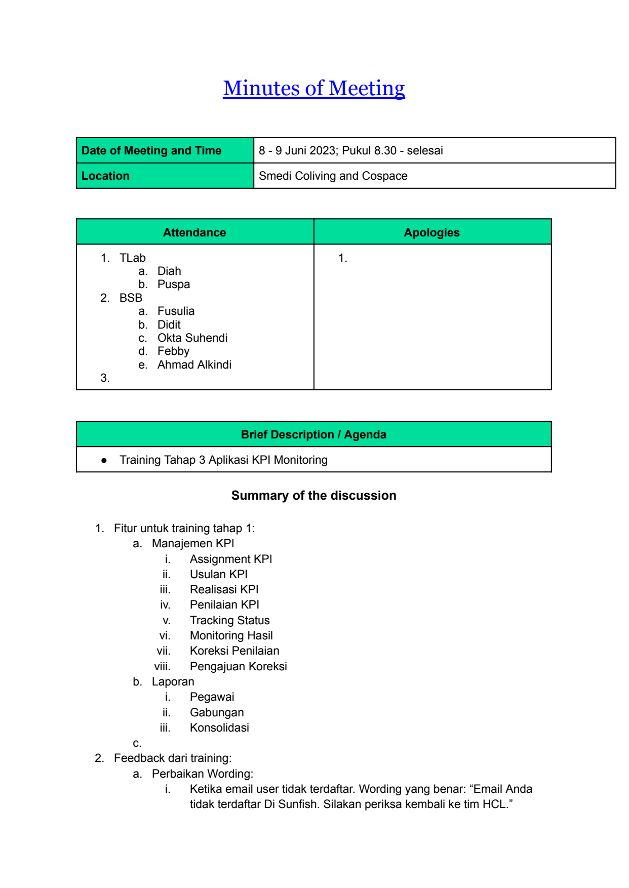
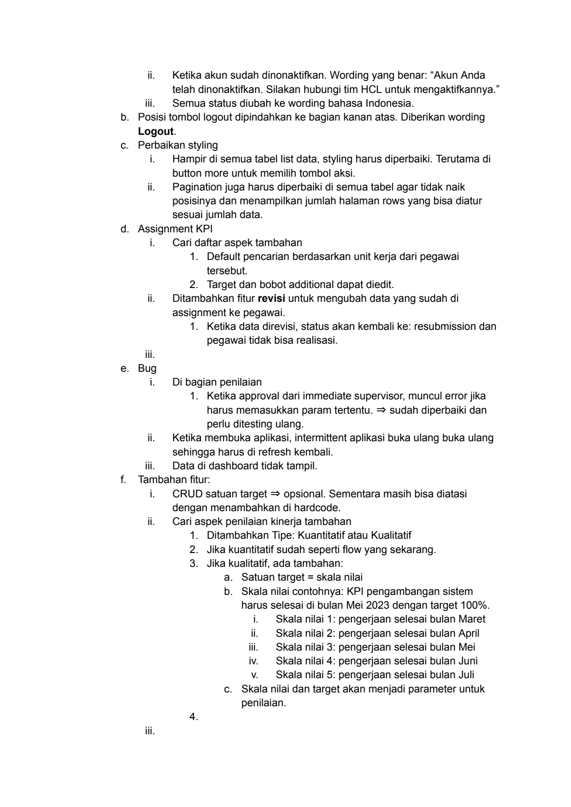
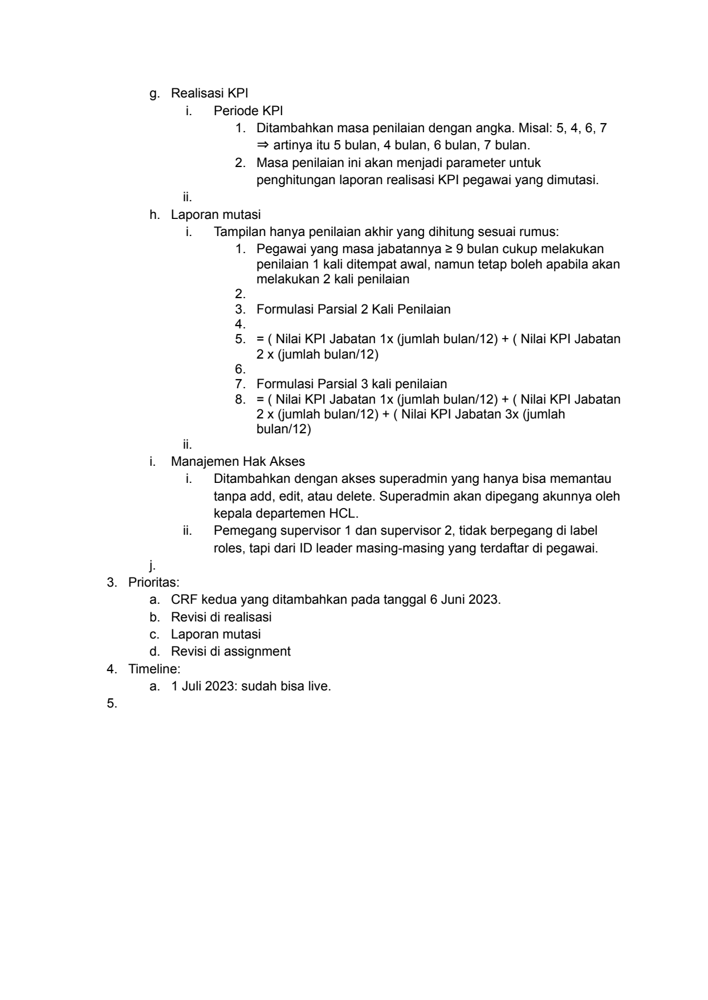

# 2023 06 08 Mom Training Tahap 3

> **Sumber:** [2023-06-08-mom-training-tahap-3](https://docs.google.com/document/d/1NtIr-CD7wwvcRhyWVoY8Fw4oIcLd7vGKms--T41y3bY/edit)

---

Minutes of Meeting

    Date of Meeting and Time   8 - 9 Juni 2023; Pukul 8.30 - selesai
    Location                   Smedi Coliving and Cospace

      Attendance               Apologies
    1. TLab                    1.
      a. Diah
      b. Puspa
    2. BSB
      a. Fusulia
      b. Didit
      c. Okta Suhendi
      d. Febby
      e. Ahmad Alkindi
    3.

                  Brief Description / Agenda
    ● Training Tahap 3 Aplikasi KPI Monitoring

                  Summary of the discussion

    1. Fitur untuk training tahap 1:
    a. Manajemen KPI
         i.   Assignment KPI
        ii.   Usulan KPI
       iii.   Realisasi KPI
        iv.   Penilaian KPI
         v.   Tracking Status
        vi.   Monitoring Hasil
       vii.   Koreksi Penilaian
      viii.   Pengajuan Koreksi
        b. Laporan
         i.   Pegawai
        ii.   Gabungan
       iii.   Konsolidasi
    c.
2. Feedback dari training:
    a. Perbaikan Wording:
         i.   Ketika email user tidak terdaftar. Wording yang benar: "Email Anda
              tidak terdaftar Di Sunfish. Silakan periksa kembali ke tim HCL."

---

ii.   Ketika akun sudah dinonaktifkan. Wording yang benar: "Akun Anda
          telah dinonaktifkan. Silakan hubungi tim HCL untuk mengaktifkannya."
   iii.   Semua status diubah ke wording bahasa Indonesia.
b. Posisi tombol logout dipindahkan ke bagian kanan atas. Diberikan wording
   Logout.
c. Perbaikan styling
     i.   Hampir di semua tabel list data, styling harus diperbaiki. Terutama di
          button more untuk memilih tombol aksi.
    ii.   Pagination juga harus diperbaiki di semua tabel agar tidak naik
          posisinya dan menampilkan jumlah halaman rows yang bisa diatur
          sesuai jumlah data.
d. Assignment KPI
     i.   Cari daftar aspek tambahan
          1. Default pencarian berdasarkan unit kerja dari pegawai
            tersebut.
          2. Target dan bobot additional dapat diedit.
    ii.   Ditambahkan fitur revisi untuk mengubah data yang sudah di
          assignment ke pegawai.
          1. Ketika data direvisi, status akan kembali ke: resubmission dan
            pegawai tidak bisa realisasi.
   iii.
 e. Bug
     i.   Di bagian penilaian
          1. Ketika approval dari immediate supervisor, muncul error jika
                    harus memasukkan param tertentu. ⇒ sudah diperbaiki dan
            perlu ditesting ulang.
    ii.   Ketika membuka aplikasi, intermittent aplikasi buka ulang buka ulang
          sehingga harus di refresh kembali.
   iii.   Data di dashboard tidak tampil.
f. Tambahan fitur:
     i.   CRUD satuan target ⇒ opsional. Sementara masih bisa diatasi
          dengan menambahkan di hardcode.
    ii.   Cari aspek penilaian kinerja tambahan
          1. Ditambahkan Tipe: Kuantitatif atau Kualitatif
          2. Jika kuantitatif sudah seperti flow yang sekarang.
          3. Jika kualitatif, ada tambahan:
                    a. Satuan target = skala nilai
                    b. Skala nilai contohnya: KPI pengambangan sistem
                    harus selesai di bulan Mei 2023 dengan target 100%.
                       i.    Skala nilai 1: pengerjaan selesai bulan Maret
                      ii.    Skala nilai 2: pengerjaan selesai bulan April
                     iii.    Skala nilai 3: pengerjaan selesai bulan Mei
                      iv.    Skala nilai 4: pengerjaan selesai bulan Juni
                       v.    Skala nilai 5: pengerjaan selesai bulan Juli
                     c. Skala nilai dan target akan menjadi parameter untuk
                    penilaian.
          4.
   iii.

---

g. Realisasi KPI
           i.   Periode KPI
               1. Ditambahkan masa penilaian dengan angka. Misal: 5, 4, 6, 7
                  ⇒ artinya itu 5 bulan, 4 bulan, 6 bulan, 7 bulan.
               2. Masa penilaian ini akan menjadi parameter untuk
                  penghitungan laporan realisasi KPI pegawai yang dimutasi.
          ii.
  h. Laporan mutasi
           i.   Tampilan hanya penilaian akhir yang dihitung sesuai rumus:
               1. Pegawai yang masa jabatannya ≥ 9 bulan cukup melakukan
                  penilaian 1 kali ditempat awal, namun tetap boleh apabila akan
                  melakukan 2 kali penilaian
               2.
               3. Formulasi Parsial 2 Kali Penilaian
               4.
               5. = ( Nilai KPI Jabatan 1x (jumlah bulan/12) + ( Nilai KPI Jabatan
                  2 x (jumlah bulan/12)
               6.
               7. Formulasi Parsial 3 kali penilaian
               8. = ( Nilai KPI Jabatan 1x (jumlah bulan/12) + ( Nilai KPI Jabatan
                  2 x (jumlah bulan/12) + ( Nilai KPI Jabatan 3x (jumlah
                  bulan/12)
          ii.
  i. Manajemen Hak Akses
           i.   Ditambahkan dengan akses superadmin yang hanya bisa memantau
                tanpa add, edit, atau delete. Superadmin akan dipegang akunnya oleh
                kepala departemen HCL.
          ii.   Pemegang supervisor 1 dan supervisor 2, tidak berpegang di label
                roles, tapi dari ID leader masing-masing yang terdaftar di pegawai.
  j.
3. Prioritas:
  a. CRF kedua yang ditambahkan pada tanggal 6 Juni 2023.
  b. Revisi di realisasi
  c. Laporan mutasi
  d. Revisi di assignment
4. Timeline:
  a. 1 Juli 2023: sudah bisa live.
5.

---

