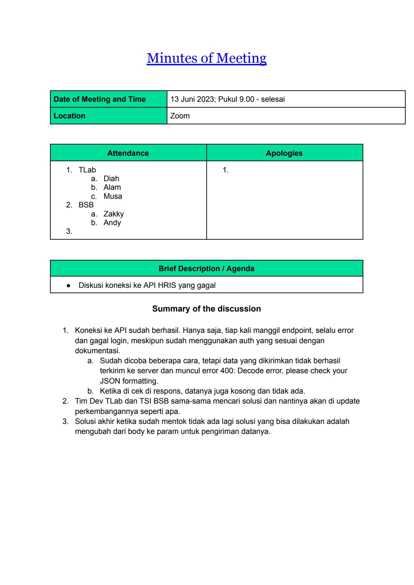

# 2023 06 13 Mom Diskusi Api Hris Gagal

> **Sumber:** [2023-06-13-mom-diskusi-api-hris-gagal](https://docs.google.com/document/d/1cTKgkaZs_vLCIrgo-VW2h6Wg0uJ1f2SpHBScVTzvbu4/edit)

---

Minutes of Meeting

Date of Meeting and Time   13 Juni 2023; Pukul 9.00 - selesai
Location                   Zoom

      Attendance           Apologies
1. TLab                    1.
  a. Diah
  b. Alam
  c. Musa
2. BSB
  a. Zakky
  b. Andy
3.

      Brief Description / Agenda
● Diskusi koneksi ke API HRIS yang gagal

      Summary of the discussion

1. Koneksi ke API sudah berhasil. Hanya saja, tiap kali manggil endpoint, selalu error
dan gagal login, meskipun sudah menggunakan auth yang sesuai dengan
dokumentasi.
a. Sudah dicoba beberapa cara, tetapi data yang dikirimkan tidak berhasil
terkirim ke server dan muncul error 400: Decode error, please check your
JSON formatting.
b. Ketika di cek di respons, datanya juga kosong dan tidak ada.
2. Tim Dev TLab dan TSI BSB sama-sama mencari solusi dan nantinya akan di update
perkembangannya seperti apa.
3. Solusi akhir ketika sudah mentok tidak ada lagi solusi yang bisa dilakukan adalah
mengubah dari body ke param untuk pengiriman datanya.

---

