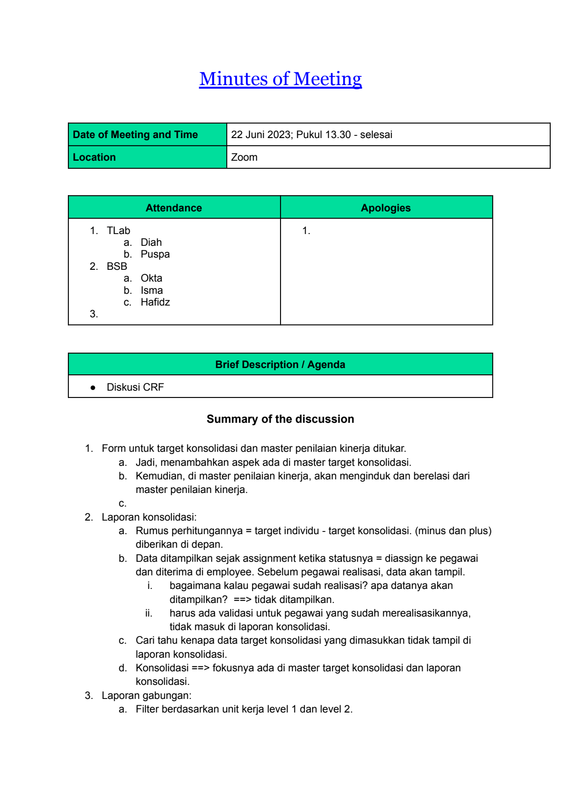
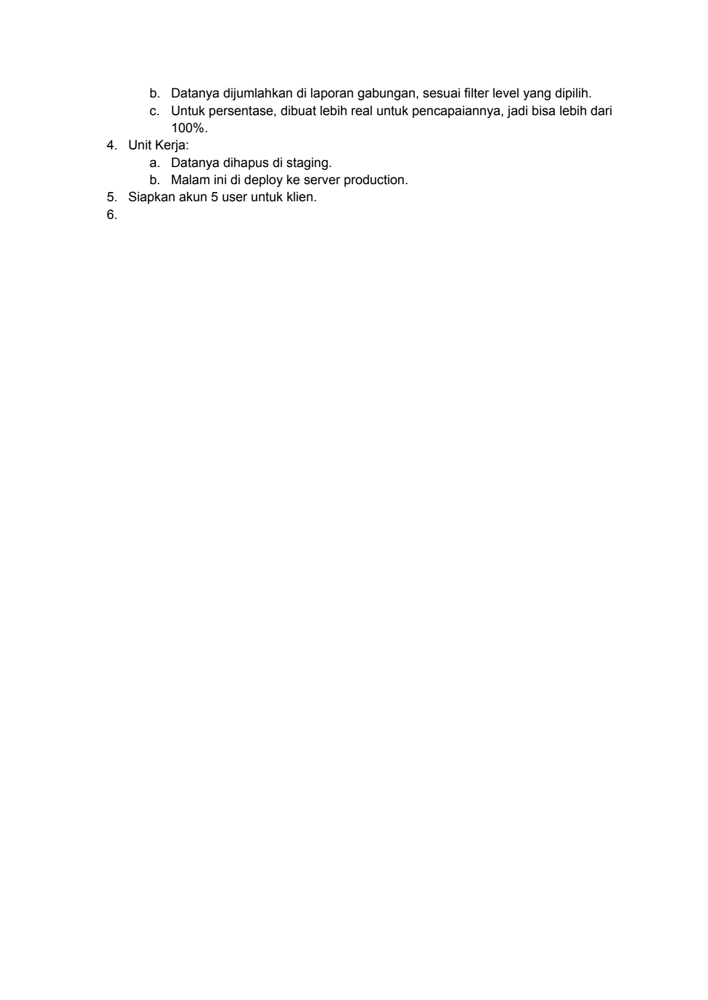

# 2023 06 22 Mom Diskusi Crf

> **Sumber:** [2023-06-22-mom-diskusi-crf](https://docs.google.com/document/d/1roL8xEdFV8JDEUvGt0X2YbK00vumUfmvmAcnBLMDQvI/edit)

---

Minutes of Meeting

    Date of Meeting and Time   22 Juni 2023; Pukul 13.30 - selesai
    Location                   Zoom

          Attendance Apologies
    1. TLab 1.
      a. Diah
      b. Puspa
    2. BSB
      a. Okta
      b. Isma
      c. Hafidz
    3.

                     Brief Description / Agenda
    ● Diskusi CRF

                     Summary of the discussion

    1. Form untuk target konsolidasi dan master penilaian kinerja ditukar.
    a. Jadi, menambahkan aspek ada di master target konsolidasi.
    b. Kemudian, di master penilaian kinerja, akan menginduk dan berelasi dari
      master penilaian kinerja.
    c.
    2. Laporan konsolidasi:
    a. Rumus perhitungannya = target individu - target konsolidasi. (minus dan plus)
      diberikan di depan.
    b. Data ditampilkan sejak assignment ketika statusnya = diassign ke pegawai
dan diterima di employee. Sebelum pegawai realisasi, data akan tampil.
       i.        bagaimana kalau pegawai sudah realisasi? apa datanya akan
                 ditampilkan? ==> tidak ditampilkan.
      ii.        harus ada validasi untuk pegawai yang sudah merealisasikannya,
                 tidak masuk di laporan konsolidasi.
    c. Cari tahu kenapa data target konsolidasi yang dimasukkan tidak tampil di
      laporan konsolidasi.
    d. Konsolidasi ==> fokusnya ada di master target konsolidasi dan laporan
      konsolidasi.
    3. Laporan gabungan:
    a. Filter berdasarkan unit kerja level 1 dan level 2.

---

b. Datanya dijumlahkan di laporan gabungan, sesuai filter level yang dipilih.
  c. Untuk persentase, dibuat lebih real untuk pencapaiannya, jadi bisa lebih dari
  100%.
4. Unit Kerja:
  a. Datanya dihapus di staging.
  b. Malam ini di deploy ke server production.
5. Siapkan akun 5 user untuk klien.
6.

---

