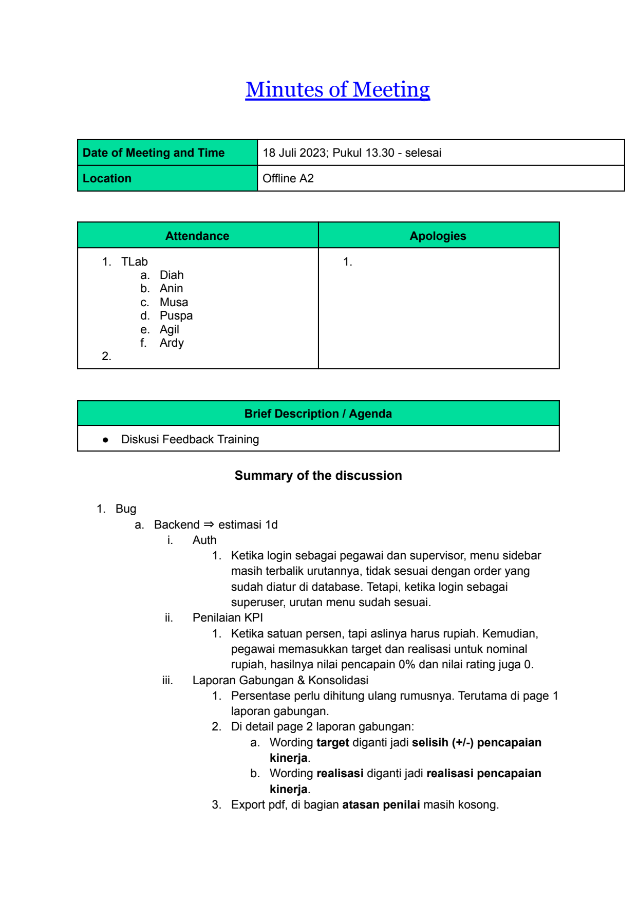
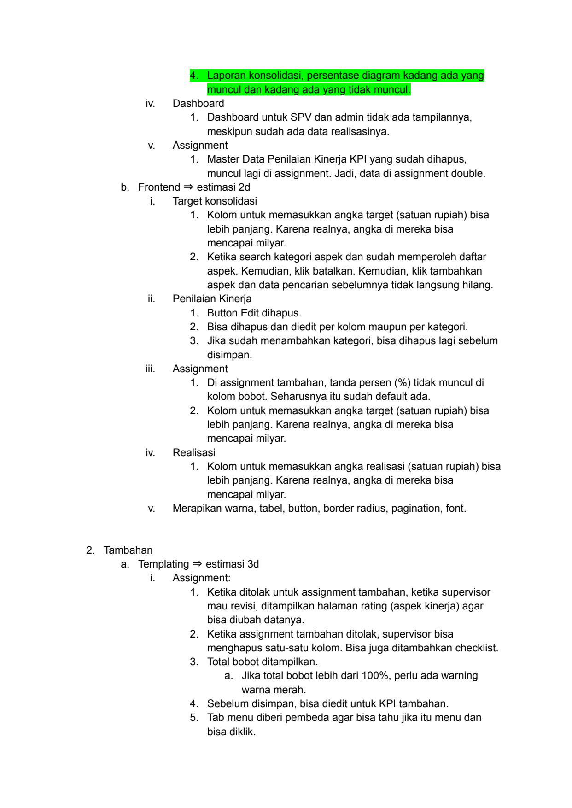
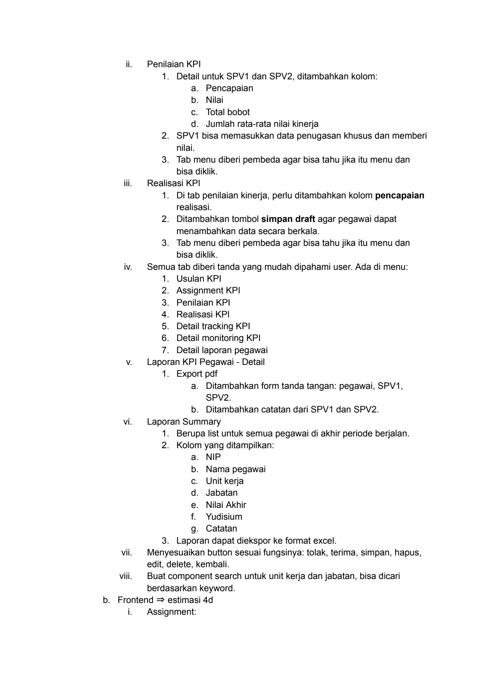
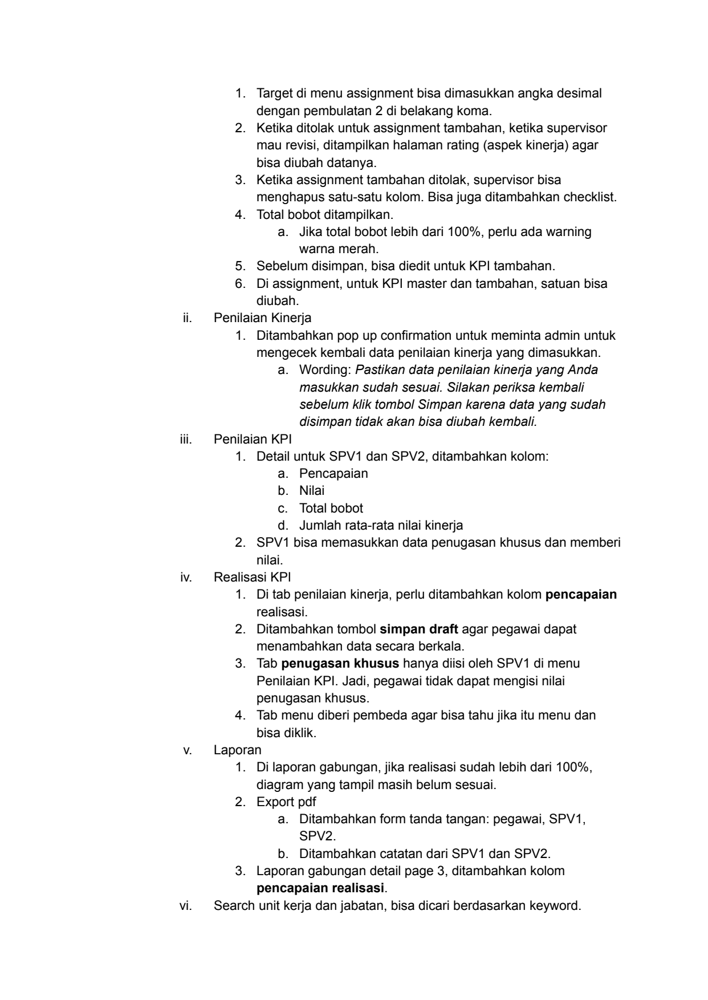
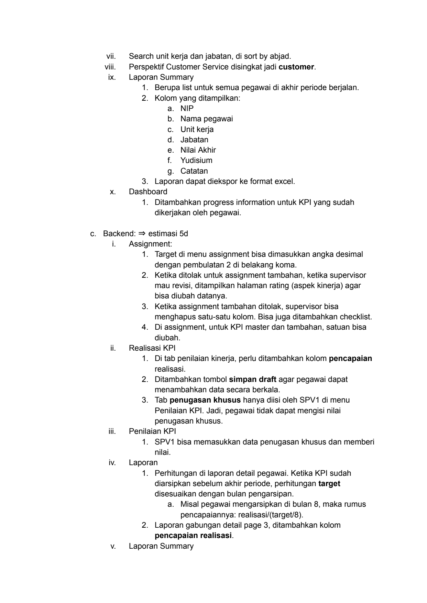
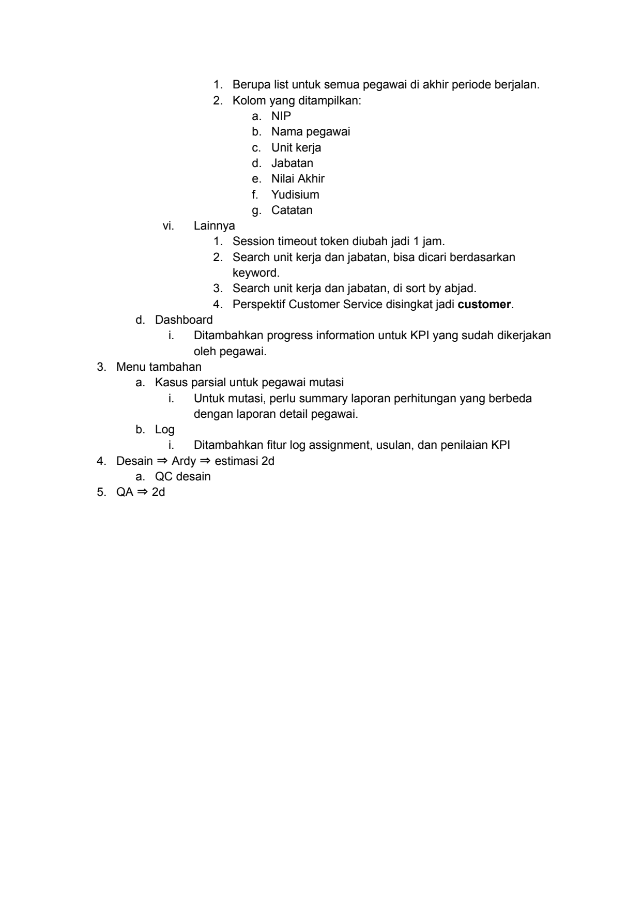

# 2023 07 18 Mom Diskusi Feedback Training

> **Sumber:** [2023-07-18-mom-diskusi-feedback-training](https://docs.google.com/document/d/1ohTg_pTUM3vmcFulZh-ocvKkY8D_zAFpukkvlrTTHqA/edit)

---

Minutes of Meeting

    Date of Meeting and Time   18 Juli 2023; Pukul 13.30 - selesai
    Location                   Offline A2

          Attendance           Apologies
    1. TLab                    1.
      a. Diah
      b. Anin
      c. Musa
      d. Puspa
      e. Agil
      f.   Ardy
    2.

                 Brief Description / Agenda
    ● Diskusi Feedback Training

                 Summary of the discussion

    1. Bug
a. Backend ⇒ estimasi 1d
        i.   Auth
            1. Ketika login sebagai pegawai dan supervisor, menu sidebar
                 masih terbalik urutannya, tidak sesuai dengan order yang
                 sudah diatur di database. Tetapi, ketika login sebagai
                 superuser, urutan menu sudah sesuai.
       ii.   Penilaian KPI
            1. Ketika satuan persen, tapi aslinya harus rupiah. Kemudian,
                 pegawai memasukkan target dan realisasi untuk nominal
                 rupiah, hasilnya nilai pencapain 0% dan nilai rating juga 0.
      iii.   Laporan Gabungan & Konsolidasi
            1. Persentase perlu dihitung ulang rumusnya. Terutama di page 1
                 laporan gabungan.
            2. Di detail page 2 laporan gabungan:
                 a. Wording target diganti jadi selisih (+/-) pencapaian
                               kinerja.
                 b. Wording realisasi diganti jadi realisasi pencapaian
                               kinerja.
            3. Export pdf, di bagian atasan penilai masih kosong.

---

4. Laporan konsolidasi, persentase diagram kadang ada yang
      muncul dan kadang ada yang tidak muncul.
 iv.   Dashboard
      1. Dashboard untuk SPV dan admin tidak ada tampilannya,
      meskipun sudah ada data realisasinya.
  v.   Assignment
      1. Master Data Penilaian Kinerja KPI yang sudah dihapus,
      muncul lagi di assignment. Jadi, data di assignment double.
    b. Frontend ⇒ estimasi 2d
  i.   Target konsolidasi
      1. Kolom untuk memasukkan angka target (satuan rupiah) bisa
      lebih panjang. Karena realnya, angka di mereka bisa
      mencapai milyar.
      2. Ketika search kategori aspek dan sudah memperoleh daftar
      aspek. Kemudian, klik batalkan. Kemudian, klik tambahkan
      aspek dan data pencarian sebelumnya tidak langsung hilang.
 ii.   Penilaian Kinerja
      1. Button Edit dihapus.
      2. Bisa dihapus dan diedit per kolom maupun per kategori.
      3. Jika sudah menambahkan kategori, bisa dihapus lagi sebelum
      disimpan.
iii.   Assignment
      1. Di assignment tambahan, tanda persen (%) tidak muncul di
      kolom bobot. Seharusnya itu sudah default ada.
      2. Kolom untuk memasukkan angka target (satuan rupiah) bisa
      lebih panjang. Karena realnya, angka di mereka bisa
      mencapai milyar.
 iv.   Realisasi
      1. Kolom untuk memasukkan angka realisasi (satuan rupiah) bisa
      lebih panjang. Karena realnya, angka di mereka bisa
      mencapai milyar.
  v.   Merapikan warna, tabel, button, border radius, pagination, font.

    2. Tambahan
    a. Templating ⇒ estimasi 3d
    i.     Assignment:
               1. Ketika ditolak untuk assignment tambahan, ketika supervisor
               mau revisi, ditampilkan halaman rating (aspek kinerja) agar
               bisa diubah datanya.
               2. Ketika assignment tambahan ditolak, supervisor bisa
               menghapus satu-satu kolom. Bisa juga ditambahkan checklist.
               3. Total bobot ditampilkan.
a. Jika total bobot lebih dari 100%, perlu ada warning
                   warna merah.
               4. Sebelum disimpan, bisa diedit untuk KPI tambahan.
               5. Tab menu diberi pembeda agar bisa tahu jika itu menu dan
               bisa diklik.

---

ii.   Penilaian KPI
         1. Detail untuk SPV1 dan SPV2, ditambahkan kolom:
         a. Pencapaian
         b. Nilai
         c. Total bobot
         d. Jumlah rata-rata nilai kinerja
         2. SPV1 bisa memasukkan data penugasan khusus dan memberi
          nilai.
         3. Tab menu diberi pembeda agar bisa tahu jika itu menu dan
          bisa diklik.
 iii.     Realisasi KPI
         1. Di tab penilaian kinerja, perlu ditambahkan kolom pencapaian
          realisasi.
         2. Ditambahkan tombol simpan draft agar pegawai dapat
          menambahkan data secara berkala.
         3. Tab menu diberi pembeda agar bisa tahu jika itu menu dan
          bisa diklik.
  iv.     Semua tab diberi tanda yang mudah dipahami user. Ada di menu:
         1. Usulan KPI
         2. Assignment KPI
         3. Penilaian KPI
         4. Realisasi KPI
         5. Detail tracking KPI
         6. Detail monitoring KPI
         7. Detail laporan pegawai
   v.     Laporan KPI Pegawai - Detail
         1. Export pdf
         a. Ditambahkan form tanda tangan: pegawai, SPV1,
                           SPV2.
         b. Ditambahkan catatan dari SPV1 dan SPV2.
  vi.     Laporan Summary
         1. Berupa list untuk semua pegawai di akhir periode berjalan.
         2. Kolom yang ditampilkan:
         a. NIP
         b. Nama pegawai
         c. Unit kerja
         d. Jabatan
         e. Nilai Akhir
         f.     Yudisium
         g. Catatan
         3. Laporan dapat diekspor ke format excel.
 vii.     Menyesuaikan button sesuai fungsinya: tolak, terima, simpan, hapus,
          edit, delete, kembali.
viii.     Buat component search untuk unit kerja dan jabatan, bisa dicari
          berdasarkan keyword.
    b. Frontend ⇒ estimasi 4d
   i.     Assignment:

---

1. Target di menu assignment bisa dimasukkan angka desimal
      dengan pembulatan 2 di belakang koma.
      2. Ketika ditolak untuk assignment tambahan, ketika supervisor
      mau revisi, ditampilkan halaman rating (aspek kinerja) agar
      bisa diubah datanya.
      3. Ketika assignment tambahan ditolak, supervisor bisa
      menghapus satu-satu kolom. Bisa juga ditambahkan checklist.
      4. Total bobot ditampilkan.
              a. Jika total bobot lebih dari 100%, perlu ada warning
                    warna merah.
      5. Sebelum disimpan, bisa diedit untuk KPI tambahan.
      6. Di assignment, untuk KPI master dan tambahan, satuan bisa
      diubah.
 ii.   Penilaian Kinerja
      1. Ditambahkan pop up confirmation untuk meminta admin untuk
      mengecek kembali data penilaian kinerja yang dimasukkan.
              a. Wording: Pastikan data penilaian kinerja yang Anda
                    masukkan sudah sesuai. Silakan periksa kembali
                    sebelum klik tombol Simpan karena data yang sudah
                    disimpan tidak akan bisa diubah kembali.
iii.   Penilaian KPI
      1. Detail untuk SPV1 dan SPV2, ditambahkan kolom:
              a. Pencapaian
              b. Nilai
              c. Total bobot
              d. Jumlah rata-rata nilai kinerja
      2. SPV1 bisa memasukkan data penugasan khusus dan memberi
      nilai.
 iv.   Realisasi KPI
      1. Di tab penilaian kinerja, perlu ditambahkan kolom pencapaian
      realisasi.
      2. Ditambahkan tombol simpan draft agar pegawai dapat
      menambahkan data secara berkala.
      3. Tab penugasan khusus hanya diisi oleh SPV1 di menu
      Penilaian KPI. Jadi, pegawai tidak dapat mengisi nilai
      penugasan khusus.
      4. Tab menu diberi pembeda agar bisa tahu jika itu menu dan
      bisa diklik.
  v.   Laporan
      1. Di laporan gabungan, jika realisasi sudah lebih dari 100%,
      diagram yang tampil masih belum sesuai.
      2. Export pdf
              a. Ditambahkan form tanda tangan: pegawai, SPV1,
                    SPV2.
              b. Ditambahkan catatan dari SPV1 dan SPV2.
      3. Laporan gabungan detail page 3, ditambahkan kolom
      pencapaian realisasi.
 vi.   Search unit kerja dan jabatan, bisa dicari berdasarkan keyword.

---

vii.   Search unit kerja dan jabatan, di sort by abjad.
viii.   Perspektif Customer Service disingkat jadi customer.
  ix.   Laporan Summary
       1. Berupa list untuk semua pegawai di akhir periode berjalan.
       2. Kolom yang ditampilkan:
                 a. NIP
                 b. Nama pegawai
                 c. Unit kerja
                 d. Jabatan
                 e. Nilai Akhir
                 f.  Yudisium
                 g. Catatan
       3. Laporan dapat diekspor ke format excel.
   x.   Dashboard
       1. Ditambahkan progress information untuk KPI yang sudah
       dikerjakan oleh pegawai.

    c. Backend: ⇒ estimasi 5d
   i.   Assignment:
       1. Target di menu assignment bisa dimasukkan angka desimal
       dengan pembulatan 2 di belakang koma.
       2. Ketika ditolak untuk assignment tambahan, ketika supervisor
       mau revisi, ditampilkan halaman rating (aspek kinerja) agar
       bisa diubah datanya.
       3. Ketika assignment tambahan ditolak, supervisor bisa
       menghapus satu-satu kolom. Bisa juga ditambahkan checklist.
       4. Di assignment, untuk KPI master dan tambahan, satuan bisa
       diubah.
  ii.   Realisasi KPI
       1. Di tab penilaian kinerja, perlu ditambahkan kolom pencapaian
       realisasi.
       2. Ditambahkan tombol simpan draft agar pegawai dapat
       menambahkan data secara berkala.
       3. Tab penugasan khusus hanya diisi oleh SPV1 di menu
       Penilaian KPI. Jadi, pegawai tidak dapat mengisi nilai
       penugasan khusus.
 iii.   Penilaian KPI
       1. SPV1 bisa memasukkan data penugasan khusus dan memberi
       nilai.
  iv.   Laporan
       1. Perhitungan di laporan detail pegawai. Ketika KPI sudah
       diarsipkan sebelum akhir periode, perhitungan target
       disesuaikan dengan bulan pengarsipan.
                 a. Misal pegawai mengarsipkan di bulan 8, maka rumus
                     pencapaiannya: realisasi/(target/8).
       2. Laporan gabungan detail page 3, ditambahkan kolom
       pencapaian realisasi.
   v.   Laporan Summary

---

1. Berupa list untuk semua pegawai di akhir periode berjalan.
                2. Kolom yang ditampilkan:
                    a. NIP
                    b. Nama pegawai
                    c. Unit kerja
                    d. Jabatan
                    e. Nilai Akhir
                    f.    Yudisium
                    g. Catatan
       vi.   Lainnya
                1. Session timeout token diubah jadi 1 jam.
                2. Search unit kerja dan jabatan, bisa dicari berdasarkan
                keyword.
                3. Search unit kerja dan jabatan, di sort by abjad.
                4. Perspektif Customer Service disingkat jadi customer.
d. Dashboard
        i.   Ditambahkan progress information untuk KPI yang sudah dikerjakan
             oleh pegawai.
3. Menu tambahan
a. Kasus parsial untuk pegawai mutasi
        i.   Untuk mutasi, perlu summary laporan perhitungan yang berbeda
             dengan laporan detail pegawai.
b. Log
        i.   Ditambahkan fitur log assignment, usulan, dan penilaian KPI
4. Desain ⇒ Ardy ⇒ estimasi 2d
a. QC desain
5. QA ⇒ 2d

---

