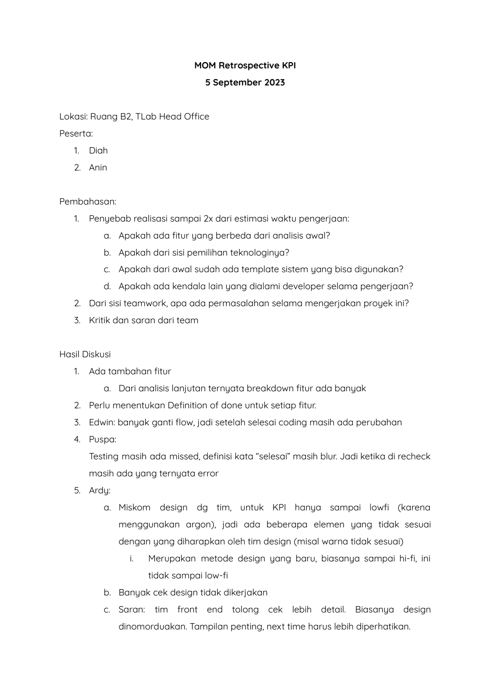
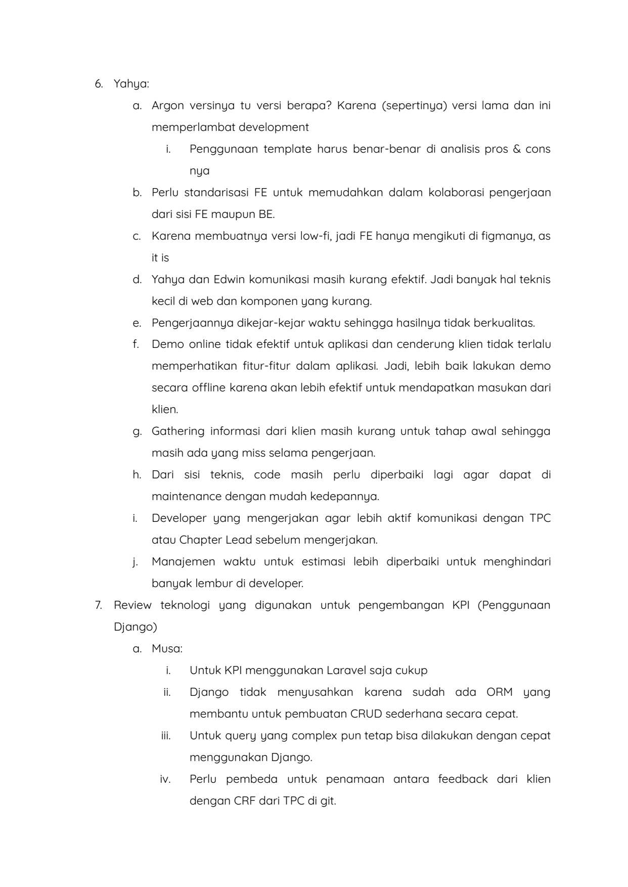
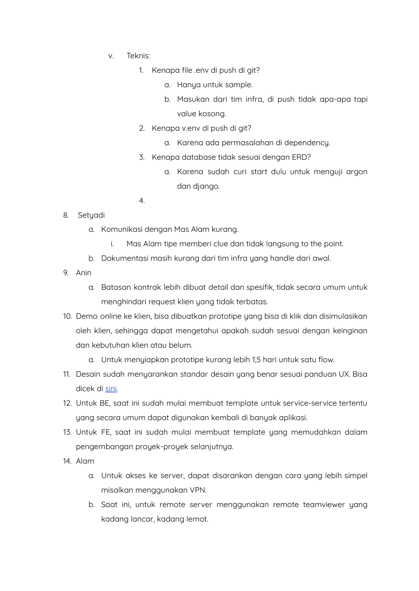
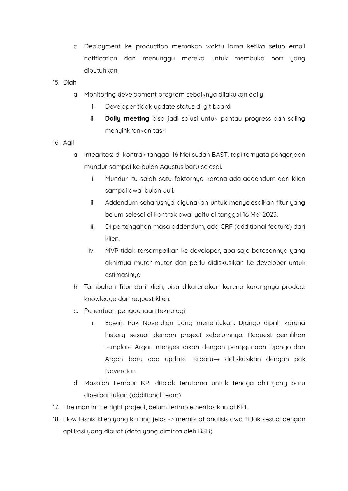

# 2023 09 05 Mom Retrospective

> **Sumber:** [2023-09-05-mom-retrospective](https://docs.google.com/document/d/1xPGLqwN-NjG_aNehTsX7-P31A_Tf2fL3K1LKMvR8jf4/edit)

---

MOM Retrospective KPI
  5 September 2023

    Lokasi: Ruang B2, TLab Head Office
    Peserta:
    1.   Diah
    2. Anin

    Pembahasan:
    1.   Penyebab realisasi sampai 2x dari estimasi waktu pengerjaan:
            a. Apakah ada fitur yang berbeda dari analisis awal?
            b. Apakah dari sisi pemilihan teknologinya?
            c. Apakah dari awal sudah ada template sistem yang bisa digunakan?
            d. Apakah ada kendala lain yang dialami developer selama pengerjaan?
    2. Dari sisi teamwork, apa ada permasalahan selama mengerjakan proyek ini?
    3.   Kritik dan saran dari team

    Hasil Diskusi
    1.   Ada tambahan fitur
            a. Dari analisis lanjutan ternyata breakdown fitur ada banyak
    2. Perlu menentukan Definition of done untuk setiap fitur.
    3.   Edwin: banyak ganti flow, jadi setelah selesai coding masih ada perubahan
    4.   Puspa:
         Testing masih ada missed, definisi kata "selesai" masih blur. Jadi ketika di recheck
         masih ada yang ternyata error
    5. Ardy:
            a. Miskom design dg tim, untuk KPI hanya sampai lowfi (karena
                 menggunakan argon), jadi ada beberapa elemen yang tidak sesuai
                 dengan yang diharapkan oleh tim design (misal warna tidak sesuai)
                 i.             Merupakan metode design yang baru, biasanya sampai hi-fi, ini
                     tidak sampai low-fi
            b. Banyak cek design tidak dikerjakan
            c.   Saran: tim front end tolong cek lebih detail. Biasanya design
                 dinomorduakan. Tampilan penting, next time harus lebih diperhatikan.

---

6. Yahya:
          a. Argon versinya tu versi berapa? Karena (sepertinya) versi lama dan ini
         memperlambat development
            i.        Penggunaan template harus benar-benar di analisis pros & cons
                 nya
              b. Perlu standarisasi FE untuk memudahkan dalam kolaborasi pengerjaan
         dari sisi FE maupun BE.
   c.    Karena membuatnya versi low-fi, jadi FE hanya mengikuti di figmanya, as
         it is
         d. Yahya dan Edwin komunikasi masih kurang efektif. Jadi banyak hal teknis
         kecil di web dan komponen yang kurang.
   e. Pengerjaannya dikejar-kejar waktu sehingga hasilnya tidak berkualitas.
   f.    Demo online tidak efektif untuk aplikasi dan cenderung klien tidak terlalu
         memperhatikan fitur-fitur dalam aplikasi. Jadi, lebih baik lakukan demo
         secara offline karena akan lebih efektif untuk mendapatkan masukan dari
         klien.
           g. Gathering informasi dari klien masih kurang untuk tahap awal sehingga
         masih ada yang miss selama pengerjaan.
                h. Dari sisi teknis, code masih perlu diperbaiki lagi agar dapat di
         maintenance dengan mudah kedepannya.
   i.    Developer yang mengerjakan agar lebih aktif komunikasi dengan TPC
         atau Chapter Lead sebelum mengerjakan.
   j.    Manajemen waktu untuk estimasi lebih diperbaiki untuk menghindari
         banyak lembur di developer.
7.               Review teknologi yang digunakan untuk pengembangan KPI (Penggunaan
   Django)
   a. Musa:
            i.   Untuk KPI menggunakan Laravel saja cukup
           ii.                   Django tidak menyusahkan karena sudah ada ORM yang
                 membantu untuk pembuatan CRUD sederhana secara cepat.
          iii.       Untuk query yang complex pun tetap bisa dilakukan dengan cepat
                 menggunakan Django.
           iv.              Perlu pembeda untuk penamaan antara feedback dari klien
                 dengan CRF dari TPC di git.

---

v.     Teknis:
                 1.  Kenapa file .env di push di git?
                     a. Hanya untuk sample.
                                 b. Masukan dari tim infra, di push tidak apa-apa tapi
                     value kosong.
                 2. Kenapa v.env di push di git?
                     a. Karena ada permasalahan di dependency.
                 3.  Kenapa database tidak sesuai dengan ERD?
                                   a. Karena sudah curi start dulu untuk menguji argon
                     dan django.
                 4.
8. Setyadi
   a. Komunikasi dengan Mas Alam kurang.
       i.      Mas Alam tipe memberi clue dan tidak langsung to the point.
   b. Dokumentasi masih kurang dari tim infra yang handle dari awal.
9. Anin
          a. Batasan kontrak lebih dibuat detail dan spesifik, tidak secara umum untuk
       menghindari request klien yang tidak terbatas.
10. Demo online ke klien, bisa dibuatkan prototipe yang bisa di klik dan disimulasikan
            oleh klien, sehingga dapat mengetahui apakah sudah sesuai dengan keinginan
   dan kebutuhan klien atau belum.
   a. Untuk menyiapkan prototipe kurang lebih 1,5 hari untuk satu flow.
        11. Desain sudah menyarankan standar desain yang benar sesuai panduan UX. Bisa
   dicek di sini.
    12. Untuk BE, saat ini sudah mulai membuat template untuk service-service tertentu
   yang secara umum dapat digunakan kembali di banyak aplikasi.
             13. Untuk FE, saat ini sudah mulai membuat template yang memudahkan dalam
   pengembangan proyek-proyek selanjutnya.
14. Alam
              a. Untuk akses ke server, dapat disarankan dengan cara yang lebih simpel
       misalkan menggunakan VPN.
                   b. Saat ini, untuk remote server menggunakan remote teamviewer yang
       kadang lancar, kadang lemot.

---

c.                    Deployment ke production memakan waktu lama ketika setup email
                            notification dan menunggu mereka untuk membuka port yang
        dibutuhkan.
15. Diah
a. Monitoring development program sebaiknya dilakukan daily
          i.   Developer tidak update status di git board
         ii.   Daily meeting bisa jadi solusi untuk pantau progress dan saling
               menyinkronkan task
16. Agil
       a. Integritas: di kontrak tanggal 16 Mei sudah BAST, tapi ternyata pengerjaan
        mundur sampai ke bulan Agustus baru selesai.
          i.   Mundur itu salah satu faktornya karena ada addendum dari klien
               sampai awal bulan Juli.
         ii.   Addendum seharusnya digunakan untuk menyelesaikan fitur yang
               belum selesai di kontrak awal yaitu di tanggal 16 Mei 2023.
        iii.   Di pertengahan masa addendum, ada CRF (additional feature) dari
               klien.
         iv.   MVP tidak tersampaikan ke developer, apa saja batasannya yang
               akhirnya muter-muter dan perlu didiskusikan ke developer untuk
               estimasinya.
             b. Tambahan fitur dari klien, bisa dikarenakan karena kurangnya product
        knowledge dari request klien.
c.      Penentuan penggunaan teknologi
          i.   Edwin: Pak Noverdian yang menentukan. Django dipilih karena
               history sesuai dengan project sebelumnya. Request pemilihan
               template Argon menyesuaikan dengan penggunaan Django dan
               Argon baru ada update terbaru→ didiskusikan dengan pak
               Noverdian.
                  d. Masalah Lembur KPI ditolak terutama untuk tenaga ahli yang baru
        diperbantukan (additional team)
17. The man in the right project, belum terimplementasikan di KPI.
18. Flow bisnis klien yang kurang jelas -> membuat analisis awal tidak sesuai dengan
aplikasi yang dibuat (data yang diminta oleh BSB)

---

