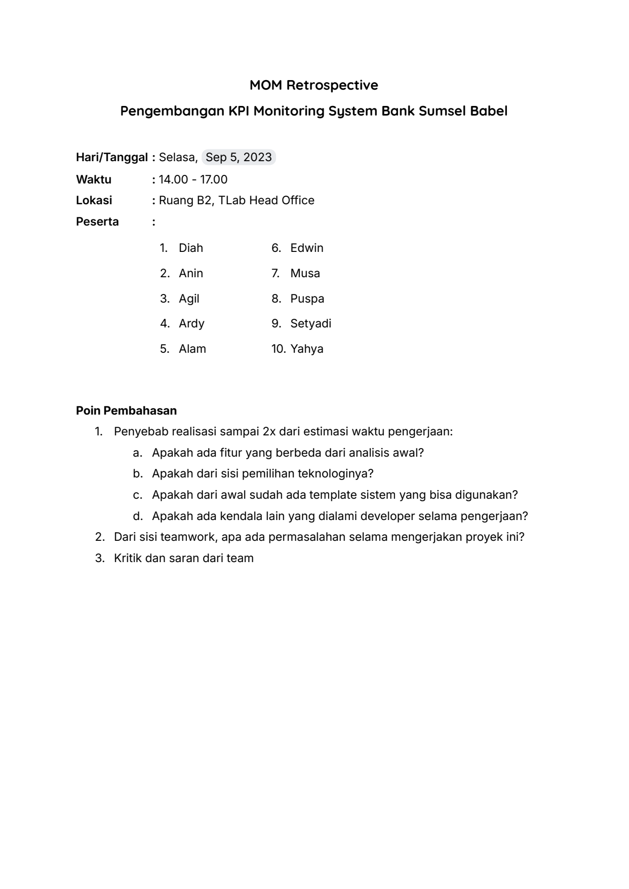
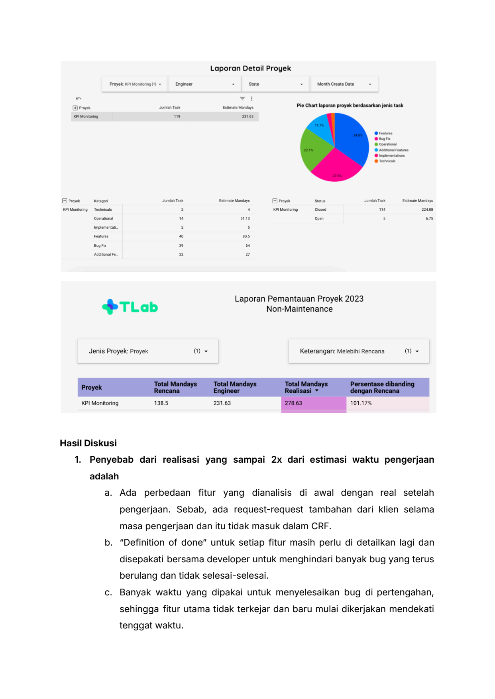
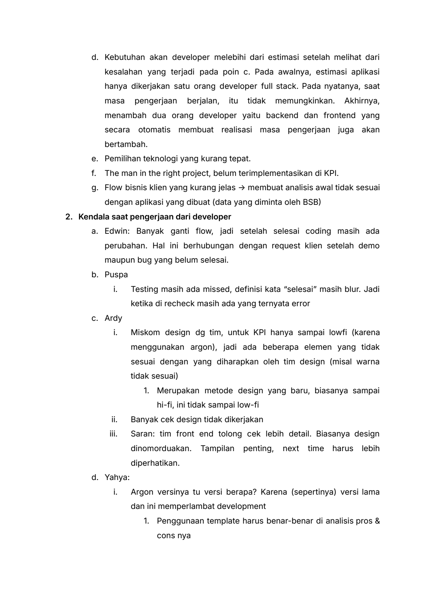
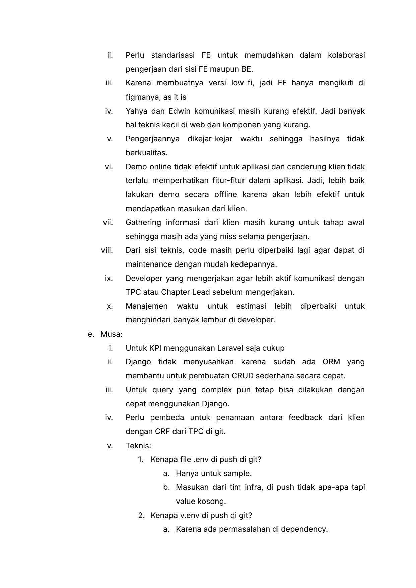
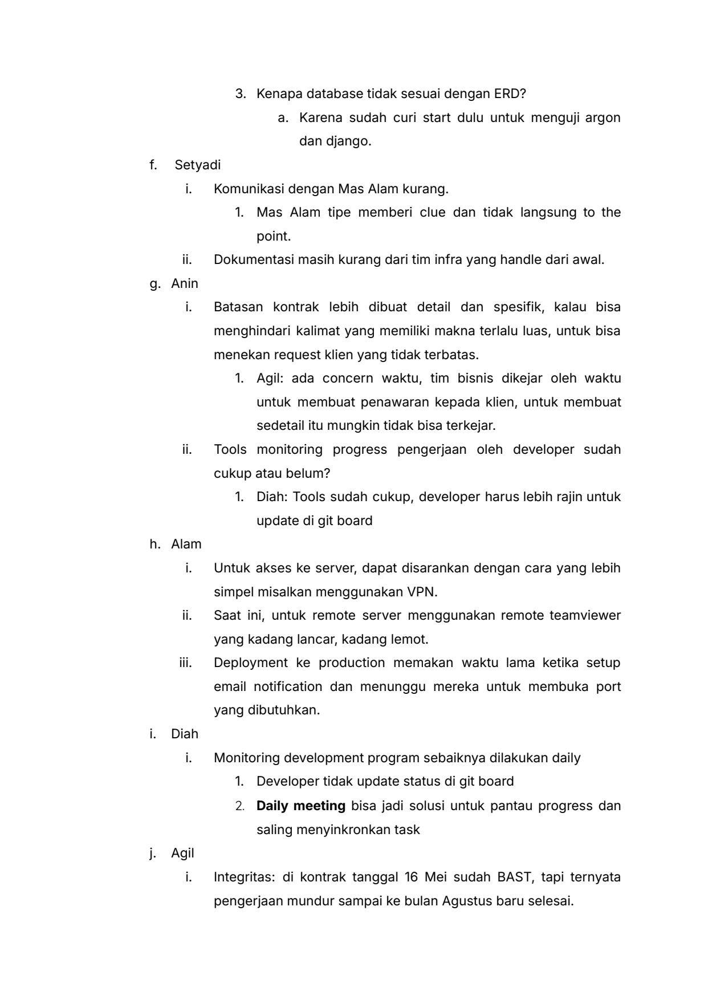
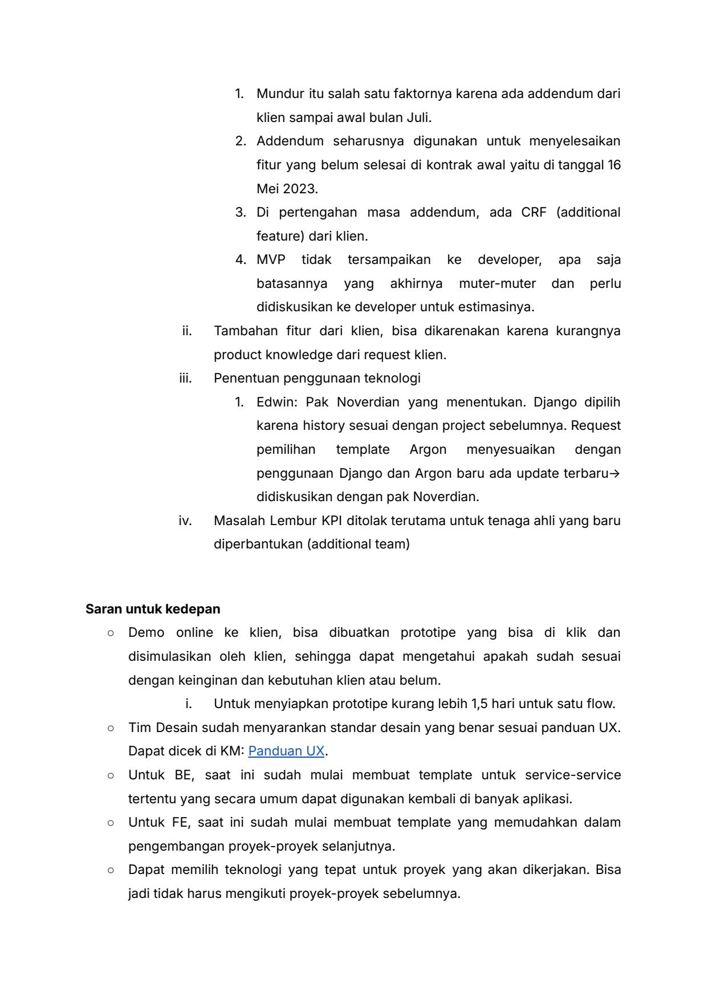
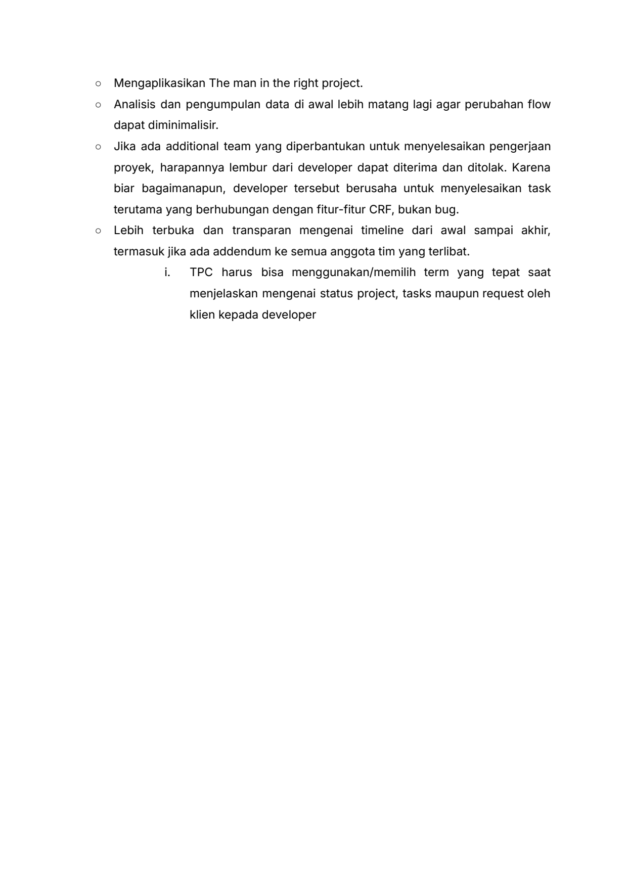

# 2023 09 05 Report Retrospective

> **Sumber:** [2023-09-05-report-retrospective](https://docs.google.com/document/d/1dkAbCgfHC9KNNwxlQsmAxYr-fRDWRbm30NqHmO180wc/edit)

---

MOM Retrospective
Pengembangan KPI Monitoring System Bank Sumsel Babel

    Hari/Tanggal : Selasa, Sep 5, 2023
    Waktu     : 14.00 - 17.00
    Lokasi    : Ruang B2, TLab Head Office
    Peserta   :
               1.     Diah     6. Edwin
               2. Anin         7. Musa
               3. Agil         8. Puspa
               4. Ardy         9. Setyadi
               5. Alam         10. Yahya

    Poin Pembahasan
    1. Penyebab realisasi sampai 2x dari estimasi waktu pengerjaan:
       a. Apakah ada fitur yang berbeda dari analisis awal?
       b. Apakah dari sisi pemilihan teknologinya?
       c. Apakah dari awal sudah ada template sistem yang bisa digunakan?
       d. Apakah ada kendala lain yang dialami developer selama pengerjaan?
    2. Dari sisi teamwork, apa ada permasalahan selama mengerjakan proyek ini?
    3. Kritik dan saran dari team

---

Laporan Detail Proyek

Proyek KP Montarng() +    Engineer    sue    ©

5         Task Pie Chart laporan proyek jenis task
    ah berdasarkan

          no me

oon
© Openers
©
©
©

[=] proyek Kategori    Jumlah Task  Estimate Mandays    [=]   Status.   JumiahTask  ‘Estimate Mandays.
                                 2                            Closed            ne                 2am

                                                  sn          oven               s                  os

                                 2                 s

                                 ©

                                 »                 “

                                 2

                       Laporan Pemantauan Proyek 2023
$TLab                  Non-Maintenance

Jenis Proyek: Proyek    ~    Keterangan: Melebihi Rencana

KPI Monitoring    138.5    231.63                             10117%

Hasil Diskusi
            1. Penyebab dari realisasi yang sampai 2x dari estimasi waktu pengerjaan
adalah
                  a. Ada perbedaan fitur yang dianalisis di awal dengan real setelah
             pengerjaan. Sebab, ada request-request tambahan dari klien selama
             masa pengerjaan dan itu tidak masuk dalam CRF.
        b. "Definition of done" untuk setiap fitur masih perlu di detailkan lagi dan
             disepakati bersama developer untuk menghindari banyak bug yang terus
             berulang dan tidak selesai-selesai.
                c. Banyak waktu yang dipakai untuk menyelesaikan bug di pertengahan,
             sehingga fitur utama tidak terkejar dan baru mulai dikerjakan mendekati
             tenggat waktu.

---

d. Kebutuhan akan developer melebihi dari estimasi setelah melihat dari
        kesalahan yang terjadi pada poin c. Pada awalnya, estimasi aplikasi
        hanya dikerjakan satu orang developer full stack. Pada nyatanya, saat
        masa pengerjaan berjalan, itu tidak memungkinkan. Akhirnya,
        menambah dua orang developer yaitu backend dan frontend yang
        secara otomatis membuat realisasi masa pengerjaan juga akan
        bertambah.
      e. Pemilihan teknologi yang kurang tepat.
      f. The man in the right project, belum terimplementasikan di KPI.
      g. Flow bisnis klien yang kurang jelas -> membuat analisis awal tidak sesuai
        dengan aplikasi yang dibuat (data yang diminta oleh BSB)
2. Kendala saat pengerjaan dari developer
      a. Edwin: Banyak ganti flow, jadi setelah selesai coding masih ada
        perubahan. Hal ini berhubungan dengan request klien setelah demo
        maupun bug yang belum selesai.
      b. Puspa
        i. Testing masih ada missed, definisi kata "selesai" masih blur. Jadi
        ketika di recheck masih ada yang ternyata error
      c. Ardy
        i. Miskom design dg tim, untuk KPI hanya sampai lowfi (karena
        menggunakan argon), jadi ada beberapa elemen yang tidak
        sesuai dengan yang diharapkan oleh tim design (misal warna
        tidak sesuai)
        1. Merupakan metode design yang baru, biasanya sampai
        hi-fi, ini tidak sampai low-fi
 ii.         Banyak cek design tidak dikerjakan
iii.          Saran: tim front end tolong cek lebih detail. Biasanya design
                     dinomorduakan. Tampilan penting, next time harus lebih
             diperhatikan.
    d. Yahya:
  i.         Argon versinya tu versi berapa? Karena (sepertinya) versi lama
             dan ini memperlambat development
             1.    Penggunaan template harus benar-benar di analisis pros &
                cons nya

---

ii.       Perlu standarisasi FE untuk memudahkan dalam kolaborasi
            pengerjaan dari sisi FE maupun BE.
 iii.       Karena membuatnya versi low-fi, jadi FE hanya mengikuti di
            figmanya, as it is
  iv.       Yahya dan Edwin komunikasi masih kurang efektif. Jadi banyak
            hal teknis kecil di web dan komponen yang kurang.
   v.       Pengerjaannya dikejar-kejar waktu sehingga hasilnya tidak
            berkualitas.
  vi.       Demo online tidak efektif untuk aplikasi dan cenderung klien tidak
            terlalu memperhatikan fitur-fitur dalam aplikasi. Jadi, lebih baik
            lakukan demo secara offline karena akan lebih efektif untuk
            mendapatkan masukan dari klien.
 vii.       Gathering informasi dari klien masih kurang untuk tahap awal
            sehingga masih ada yang miss selama pengerjaan.
viii.       Dari sisi teknis, code masih perlu diperbaiki lagi agar dapat di
            maintenance dengan mudah kedepannya.
  ix.       Developer yang mengerjakan agar lebih aktif komunikasi dengan
            TPC atau Chapter Lead sebelum mengerjakan.
   x.       Manajemen waktu untuk estimasi lebih diperbaiki untuk
            menghindari banyak lembur di developer.
    e. Musa:
   i.       Untuk KPI menggunakan Laravel saja cukup
  ii.       Django tidak menyusahkan karena sudah ada ORM yang
            membantu untuk pembuatan CRUD sederhana secara cepat.
 iii.       Untuk query yang complex pun tetap bisa dilakukan dengan
            cepat menggunakan Django.
  iv.       Perlu pembeda untuk penamaan antara feedback dari klien
            dengan CRF dari TPC di git.
   v.       Teknis:
            1. Kenapa file .env di push di git?
                   a. Hanya untuk sample.
                         b. Masukan dari tim infra, di push tidak apa-apa tapi
                       value kosong.
            2. Kenapa v.env di push di git?
                   a. Karena ada permasalahan di dependency.

---

3. Kenapa database tidak sesuai dengan ERD?
                a. Karena sudah curi start dulu untuk menguji argon
                    dan django.
f.  Setyadi
      i.   Komunikasi dengan Mas Alam kurang.
           1.          Mas Alam tipe memberi clue dan tidak langsung to the
                point.
     ii.   Dokumentasi masih kurang dari tim infra yang handle dari awal.
g. Anin
      i.   Batasan kontrak lebih dibuat detail dan spesifik, kalau bisa
           menghindari kalimat yang memiliki makna terlalu luas, untuk bisa
           menekan request klien yang tidak terbatas.
           1.        Agil: ada concern waktu, tim bisnis dikejar oleh waktu
                        untuk membuat penawaran kepada klien, untuk membuat
                sedetail itu mungkin tidak bisa terkejar.
     ii.   Tools monitoring progress pengerjaan oleh developer sudah
           cukup atau belum?
           1.    Diah: Tools sudah cukup, developer harus lebih rajin untuk
                update di git board
h. Alam
      i.   Untuk akses ke server, dapat disarankan dengan cara yang lebih
           simpel misalkan menggunakan VPN.
     ii.   Saat ini, untuk remote server menggunakan remote teamviewer
           yang kadang lancar, kadang lemot.
    iii.   Deployment ke production memakan waktu lama ketika setup
           email notification dan menunggu mereka untuk membuka port
           yang dibutuhkan.
i.  Diah
      i.   Monitoring development program sebaiknya dilakukan daily
           1.   Developer tidak update status di git board
                2. Daily meeting bisa jadi solusi untuk pantau progress dan
                saling menyinkronkan task
j.  Agil
      i.   Integritas: di kontrak tanggal 16 Mei sudah BAST, tapi ternyata
           pengerjaan mundur sampai ke bulan Agustus baru selesai.

---

1.   Mundur itu salah satu faktornya karena ada addendum dari
           klien sampai awal bulan Juli.
                   2. Addendum seharusnya digunakan untuk menyelesaikan
           fitur yang belum selesai di kontrak awal yaitu di tanggal 16
           Mei 2023.
                   3. Di pertengahan masa addendum, ada CRF (additional
           feature) dari klien.
      4. MVP tidak tersampaikan                  ke developer, apa saja
           batasannya yang akhirnya               muter-muter dan perlu
           didiskusikan ke developer untuk estimasinya.
 ii.       Tambahan fitur dari klien, bisa dikarenakan karena kurangnya
       product knowledge dari request klien.
iii.   Penentuan penggunaan teknologi
      1.   Edwin: Pak Noverdian yang menentukan. Django dipilih
           karena history sesuai dengan project sebelumnya. Request
           pemilihan template  Argon     menyesuaikan            dengan
           penggunaan Django dan Argon baru ada update terbaru→
           didiskusikan dengan pak Noverdian.
 iv.    Masalah Lembur KPI ditolak terutama untuk tenaga ahli yang baru
       diperbantukan (additional team)

Saran untuk kedepan
   ○ Demo online ke klien, bisa dibuatkan prototipe yang bisa di klik dan
      disimulasikan oleh klien, sehingga dapat mengetahui apakah sudah sesuai
      dengan keinginan dan kebutuhan klien atau belum.
        i. Untuk menyiapkan prototipe kurang lebih 1,5 hari untuk satu flow.
   ○ Tim Desain sudah menyarankan standar desain yang benar sesuai panduan UX.
      Dapat dicek di KM: Panduan UX.
   ○ Untuk BE, saat ini sudah mulai membuat template untuk service-service
      tertentu yang secara umum dapat digunakan kembali di banyak aplikasi.
   ○ Untuk FE, saat ini sudah mulai membuat template yang memudahkan dalam
      pengembangan proyek-proyek selanjutnya.
   ○ Dapat memilih teknologi yang tepat untuk proyek yang akan dikerjakan. Bisa
      jadi tidak harus mengikuti proyek-proyek sebelumnya.

---

○ Mengaplikasikan The man in the right project.
○ Analisis dan pengumpulan data di awal lebih matang lagi agar perubahan flow
dapat diminimalisir.
 ○ Jika ada additional team yang diperbantukan untuk menyelesaikan pengerjaan
  proyek, harapannya lembur dari developer dapat diterima dan ditolak. Karena
      biar bagaimanapun, developer tersebut berusaha untuk menyelesaikan task
terutama yang berhubungan dengan fitur-fitur CRF, bukan bug.
     ○ Lebih terbuka dan transparan mengenai timeline dari awal sampai akhir,
termasuk jika ada addendum ke semua anggota tim yang terlibat.
i.                    TPC harus bisa menggunakan/memilih term yang tepat saat
               menjelaskan mengenai status project, tasks maupun request oleh
   klien kepada developer

---

