# Berita Acara Uat Kpi

> **Sumber:** [berita-acara-uat-kpi](https://docs.google.com/document/d/1kQHyZVz6U3St77Mom6D26weq42WjtgywSoeMzGdpOtQ/edit)

---

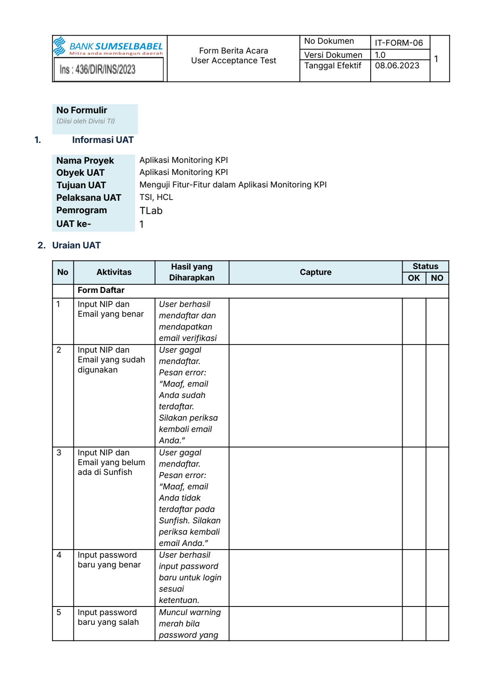

‘2   SANG           ELBABEL                       No Dokumen IT-FORM-06
2    gan              BAGEL  Form Berita Acara    Versi Dokumen 1.0
Ins  : 436/DIR/INS/2023    User Acceptance Test   Tanggal Efektif | 08.06.2023 1

    No Formulir
    (Diisi oleh Divisi TI)
1.       Informasi UAT
    Nama Proyek  Aplikasi Monitoring KPI
    Obyek UAT    Aplikasi Monitoring KPI
    Tujuan UAT     Menguji Fitur-Fitur dalam Aplikasi Monitoring KPI
    Pelaksana UAT     TSI, HCL
    Pemrogram     TLab
    UAT ke-                    1
2. Uraian UAT

    No           Aktivitas       Hasil yang Capture Status
                                 Diharapkan OK NO
          Form Daftar
    1     Input NIP dan          User berhasil
          Email yang benar       mendaftar dan
                                 mendapatkan
                                 email verifikasi
    2     Input NIP dan          User gagal
          Email yang sudah       mendaftar.
          digunakan              Pesan error:
                                 "Maaf, email
                                 Anda sudah
                                 terdaftar.
                                 Silakan periksa
                                 kembali email
                                 Anda."
    3     Input NIP dan          User gagal
          Email yang belum       mendaftar.
          ada di Sunfish         Pesan error:
                                 "Maaf, email
                                 Anda tidak
                                 terdaftar pada
                                 Sunfish. Silakan
                                 periksa kembali
                                 email Anda."
    4         | Input password   User berhasil
          baru yang benar        input password
                                 baru untuk login
                                 sesuai
                                 ketentuan.
    5     Input password         Muncul warning
          baru yang salah        merah bila
                                 password yang

---

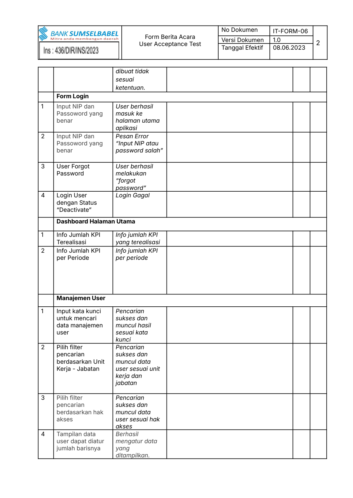

WY      BANK            SUMSELBABEL        No Dokumen     IT-FORM-06
        Mitra anda membangun daerah    Form Berita Acara  Versi Dokumen | 1.0
   Ins  : 436/DIR/INS/2023        User Acceptance Test    Tanggal Efektif | 08.06.2023 2

                              dibuat tidak
                              sesuai
                              ketentuan.
          Form Login
1         Input NIP dan       User berhasil
          Passoword yang      masuk ke
          benar               halaman utama
                              aplikasi
2         Input NIP dan       Pesan Error
          Passoword yang      "Input NIP atau
          benar               password salah"

3       | User Forgot         User berhasil
          Password            melakukan
                              "forgot
                              password"
4         Login User          Login Gagal
          dengan Status
          "Deactivate"
          Dashboard Halaman Utama
1         Info Jumlah KPI     Info jumlah KPI
          Terealisasi         yang terealisasi
2         Info Jumlah KPI     Info jumlah KPI
          per Periode         per periode

          Manajemen User
1         Input kata kunci    Pencarian
          untuk mencari       sukses dan
          data manajemen      muncul hasil
          user                sesuai kata
                              kunci
2         Pilih filter        Pencarian
          pencarian           sukses dan
          berdasarkan Unit    muncul data
          Kerja - Jabatan     user sesuai unit
                              kerja dan
                              jabatan

3         Pilih filter        Pencarian
          pencarian           sukses dan
          berdasarkan hak     muncul data
          akses               user sesuai hak
                              akses
4         Tampilan data       Berhasil
          user dapat diatur   mengatur data
          jumlah barisnya     yang
                              ditampilkan.

---

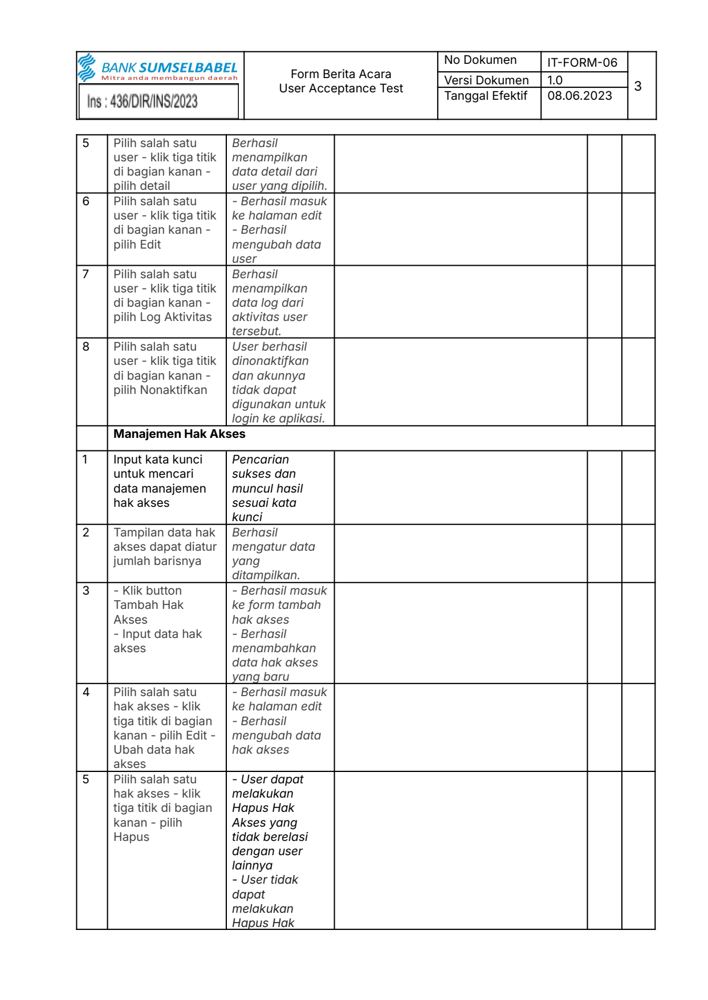

WY      BANK            SUMSELBABEL No Dokumen IT-FORM-06
        Mitra anda membangun daerah      Form Berita Acara Versi Dokumen | 1.0
   Ins  :  436/DIRANS/2023              User Acceptance Test Tanggal Efektif | 08.06.2023 3

5          Pilih salah satu         Berhasil
           user - klik tiga titik   menampilkan
           di bagian kanan -        data detail dari
           pilih detail             user yang dipilih.
6          Pilih salah satu         - Berhasil masuk
           user - klik tiga titik   ke halaman edit
           di bagian kanan -        - Berhasil
           pilih Edit               mengubah data
                                    user
7          Pilih salah satu         Berhasil
           user - klik tiga titik   menampilkan
           di bagian kanan -        data log dari
           pilih Log Aktivitas   | aktivitas user
                                    tersebut.
8          Pilih salah satu         User berhasil
           user - klik tiga titik | dinonaktifkan
           di bagian kanan - | dan akunnya
           pilih Nonaktifkan        tidak dapat
                                    digunakan untuk
                                    login ke aplikasi.
           Manajemen Hak Akses
1          Input kata kunci         Pencarian
           untuk mencari            sukses dan
           data manajemen           muncul hasil
           hak akses                sesuai kata
                                    kunci
2          Tampilan data hak | Berhasil
           akses dapat diatur       mengatur data
           jumlah barisnya          yang
                                    ditampilkan.
3          - Klik button            - Berhasil masuk
           Tambah Hak               ke form tambah
           Akses                    hak akses
           - Input data hak         - Berhasil
           akses                    menambahkan
                                    data hak akses
                                    yang baru
4          Pilih salah satu         - Berhasil masuk
           hak akses - klik         ke halaman edit
           tiga titik di bagian    | - Berhasil
           kanan - pilih Edit -     mengubah data
           Ubah data hak            hak akses
           akses
5          Pilih salah satu         - User dapat
           hak akses - klik         melakukan
           tiga titik di bagian     Hapus Hak
           kanan - pilih            Akses yang
           Hapus                    tidak berelasi
                                    dengan user
                                    lainnya
                                    - User tidak
                                    dapat
                                    melakukan
                                    Hapus Hak

---

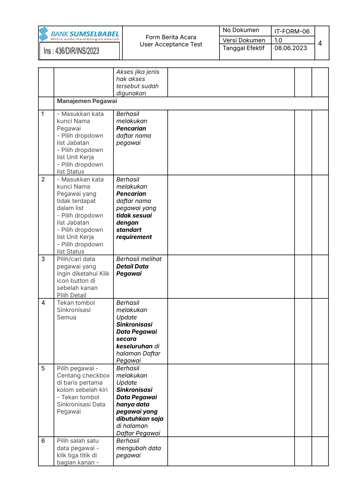

WY      BANK            SUMSELBABEL No Dokumen IT-FORM-06
        Mitra anda membangun daerah      Form Berita Acara Versi Dokumen | 1.0
   Ins  : 436/DIR/INS/2023           User Acceptance Test Tanggal Efektif | 08.06.2023 4

                                 Akses jika jenis
                                 hak akses
                                 tersebut sudah
                                 digunakan
          Manajemen Pegawai
1         - Masukkan kata        Berhasil
          kunci Nama             melakukan
          Pegawai                Pencarian
          - Pilih dropdown       daftar nama
          list Jabatan           pegawai
          - Pilih dropdown
          list Unit Kerja
          - Pilih dropdown
          list Status
2         - Masukkan kata        Berhasil
          kunci Nama             melakukan
          Pegawai yang           Pencarian
          tidak terdapat         daftar nama
          dalam list             pegawai yang
          - Pilih dropdown       tidak sesuai
          list Jabatan           dengan
          - Pilih dropdown       standart
          list Unit Kerja        requirement
          - Pilih dropdown
          list Status
3         Pilih/cari data        Berhasil melihat
          pegawai yang           Detail Data
          ingin diketahui Klik   Pegawai
          icon button di
          sebelah kanan
          Pilih Detail
4         Tekan tombol           Berhasil
          Sinkronisasi           melakukan
          Semua                  Update
                                 Sinkronisasi
                                 Data Pegawai
                                 secara
                                 keseluruhan di
                                 halaman Daftar
                                 Pegawai
5         Pilih pegawai -        Berhasil
          Centang checkbox | melakukan
          di baris pertama       Update
          kolom sebelah kiri | Sinkronisasi
          - Tekan tombol         Data Pegawai
          Sinkronisasi Data   | hanya data
          Pegawai                pegawai yang
                                 dibutuhkan saja
                                 di halaman
                                 Daftar Pegawai
6         Pilih salah satu       Berhasil
          data pegawai -         mengubah data
          klik tiga titik di     pegawai
          bagian kanan -

---

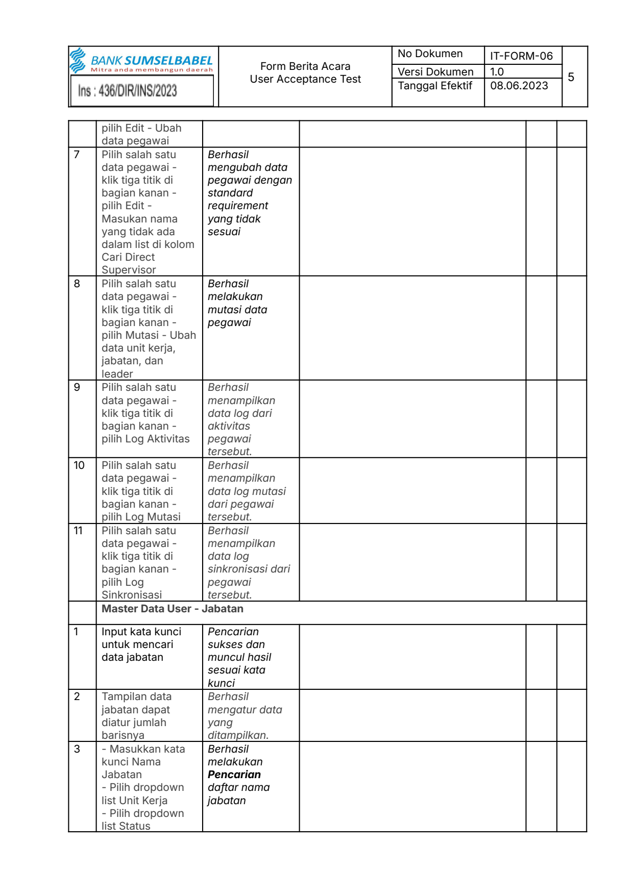

WY  BANK            SUMSELBABEL No Dokumen IT-FORM-06
    Mitra anda membangun daerah      Form Berita Acara Versi Dokumen | 1.0
   Ins : 436/DIR/INS/2023           User Acceptance Test Tanggal Efektif | 08.06.2023 5

         pilih Edit - Ubah
         data pegawai
7        Pilih salah satu       Berhasil
         data pegawai -         mengubah data
         klik tiga titik di     pegawai dengan
         bagian kanan -         standard
         pilih Edit -           requirement
         Masukan nama           yang tidak
         yang tidak ada         sesuai
         dalam list di kolom
         Cari Direct
         Supervisor
8        Pilih salah satu       Berhasil
         data pegawai -         melakukan
         klik tiga titik di     mutasi data
         bagian kanan -         pegawai
         pilih Mutasi - Ubah
         data unit kerja,
         jabatan, dan
         leader
9        Pilih salah satu       Berhasil
         data pegawai -         menampilkan
         klik tiga titik di     data log dari
         bagian kanan -         aktivitas
         pilih Log Aktivitas    pegawai
                                tersebut.
10         | Pilih salah satu   Berhasil
         data pegawai -         menampilkan
         klik tiga titik di     data log mutasi
         bagian kanan -         dari pegawai
         pilih Log Mutasi       tersebut.
11         | Pilih salah satu   Berhasil
         data pegawai -         menampilkan
         klik tiga titik di     data log
         bagian kanan -         sinkronisasi dari
         pilih Log              pegawai
         Sinkronisasi           tersebut.
         Master Data User - Jabatan
1        Input kata kunci       Pencarian
         untuk mencari          sukses dan
         data jabatan           muncul hasil
                                sesuai kata
                                kunci
2        Tampilan data          Berhasil
         jabatan dapat          mengatur data
         diatur jumlah          yang
         barisnya               ditampilkan.
3        - Masukkan kata        Berhasil
         kunci Nama             melakukan
         Jabatan                Pencarian
         - Pilih dropdown       daftar nama
         list Unit Kerja        jabatan
         - Pilih dropdown
         list Status

---

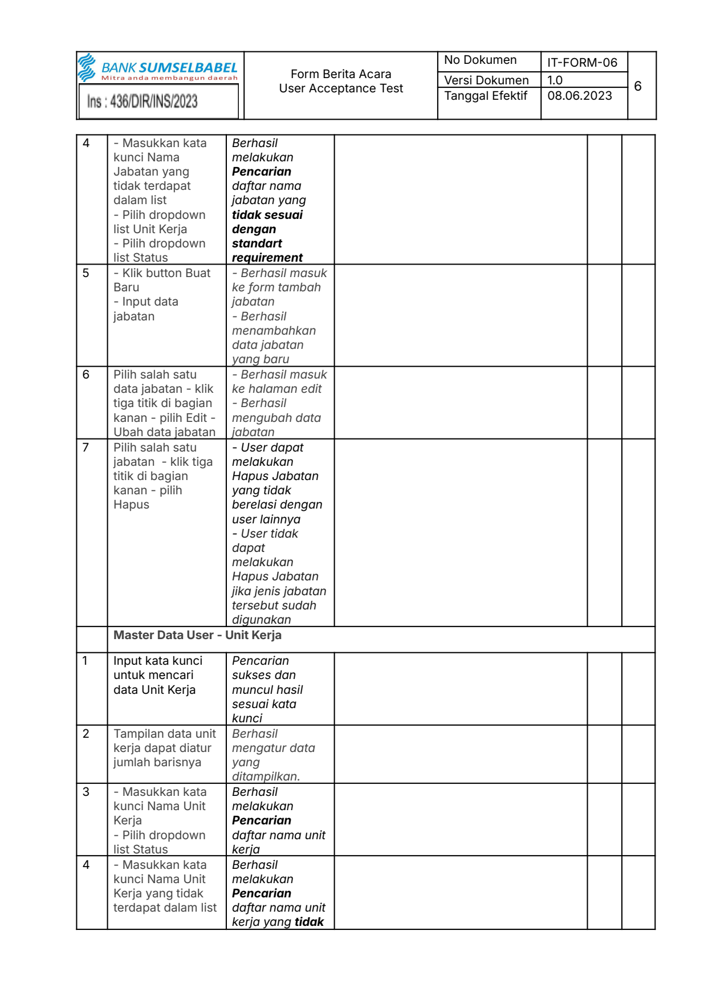

WY      BANK            SUMSELBABEL        No Dokumen                         IT-FORM-06
        Mitra anda membangun daerah      Form Berita Acara  Versi Dokumen     1.0
   Ins  : 436/DIR/INS/2023           User Acceptance Test   Tanggal Efektif   08.06.2023 6

4         - Masukkan kata        Berhasil
          kunci Nama             melakukan
          Jabatan yang           Pencarian
          tidak terdapat         daftar nama
          dalam list             jabatan yang
          - Pilih dropdown       tidak sesuai
          list Unit Kerja        dengan
          - Pilih dropdown       standart
          list Status            requirement
5         - Klik button Buat    | - Berhasil masuk
          Baru                   ke form tambah
          - Input data           jabatan
          jabatan                - Berhasil
                                 menambahkan
                                 data jabatan
                                 yang baru
6         Pilih salah satu       - Berhasil masuk
          data jabatan - klik   | ke halaman edit
          tiga titik di bagian  | - Berhasil
          kanan - pilih Edit -   mengubah data
          Ubah data jabatan | jabatan
7         Pilih salah satu       - User dapat
          jabatan - klik tiga    melakukan
          titik di bagian        Hapus Jabatan
          kanan - pilih          yang tidak
          Hapus                  berelasi dengan
                                 user lainnya
                                 - User tidak
                                 dapat
                                 melakukan
                                 Hapus Jabatan
                                 jika jenis jabatan
                                 tersebut sudah
                                 digunakan
          Master Data User - Unit Kerja
1         Input kata kunci       Pencarian
          untuk mencari          sukses dan
          data Unit Kerja        muncul hasil
                                 sesuai kata
                                 kunci
2         Tampilan data unit    | Berhasil
          kerja dapat diatur     mengatur data
          jumlah barisnya        yang
                                 ditampilkan.
3         - Masukkan kata        Berhasil
          kunci Nama Unit        melakukan
          Kerja                  Pencarian
          - Pilih dropdown       daftar nama unit
          list Status            kerja
4         - Masukkan kata        Berhasil
          kunci Nama Unit        melakukan
          Kerja yang tidak       Pencarian
          terdapat dalam list    daftar nama unit
                                 kerja yang tidak

---

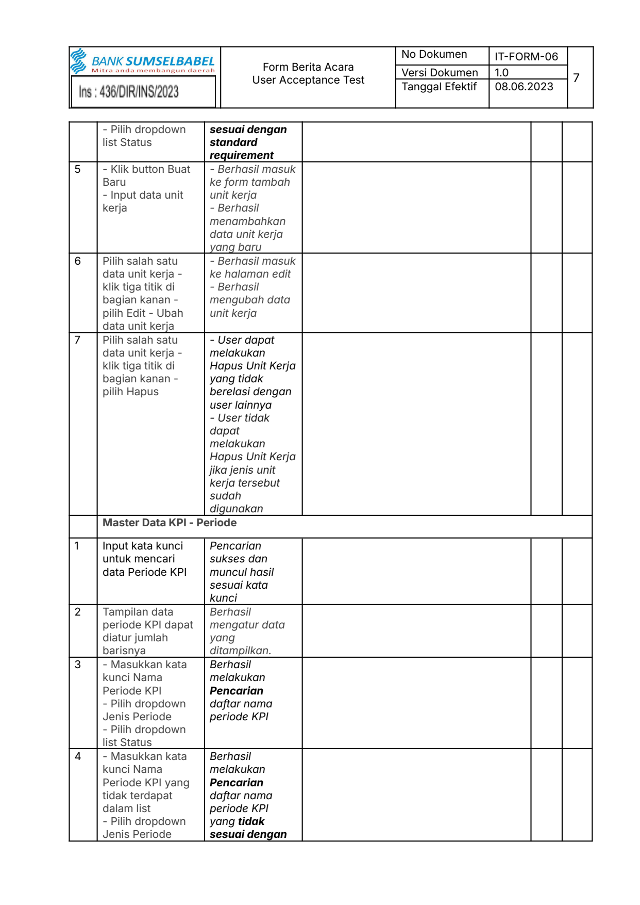

WY      BANK            SUMSELBABEL No Dokumen IT-FORM-06
        Mitra anda membangun daerah      Form Berita Acara Versi Dokumen | 1.0
   Ins  : 436/DIR/INS/2023         User Acceptance Test Tanggal Efektif | 08.06.2023 7

          - Pilih dropdown     sesuai dengan
          list Status          standard
                               requirement
5         - Klik button Buat   - Berhasil masuk
          Baru                 ke form tambah
          - Input data unit    unit kerja
          kerja                - Berhasil
                               menambahkan
                               data unit kerja
                               yang baru
6         Pilih salah satu     - Berhasil masuk
          data unit kerja -    ke halaman edit
          klik tiga titik di   - Berhasil
          bagian kanan -       mengubah data
          pilih Edit - Ubah    unit kerja
          data unit kerja
7         Pilih salah satu     - User dapat
          data unit kerja -    melakukan
          klik tiga titik di   Hapus Unit Kerja
          bagian kanan -       yang tidak
          pilih Hapus          berelasi dengan
                               user lainnya
                               - User tidak
                               dapat
                               melakukan
                               Hapus Unit Kerja
                               jika jenis unit
                               kerja tersebut
                               sudah
                               digunakan
          Master Data KPI - Periode
1         Input kata kunci     Pencarian
          untuk mencari        sukses dan
          data Periode KPI     muncul hasil
                               sesuai kata
                               kunci
2         Tampilan data        Berhasil
          periode KPI dapat | mengatur data
          diatur jumlah        yang
          barisnya             ditampilkan.
3         - Masukkan kata      Berhasil
          kunci Nama           melakukan
          Periode KPI          Pencarian
          - Pilih dropdown     daftar nama
          Jenis Periode        periode KPI
          - Pilih dropdown
          list Status
4         - Masukkan kata      Berhasil
          kunci Nama           melakukan
          Periode KPI yang     Pencarian
          tidak terdapat       daftar nama
          dalam list           periode KPI
          - Pilih dropdown     yang tidak
          Jenis Periode        sesuai dengan

---

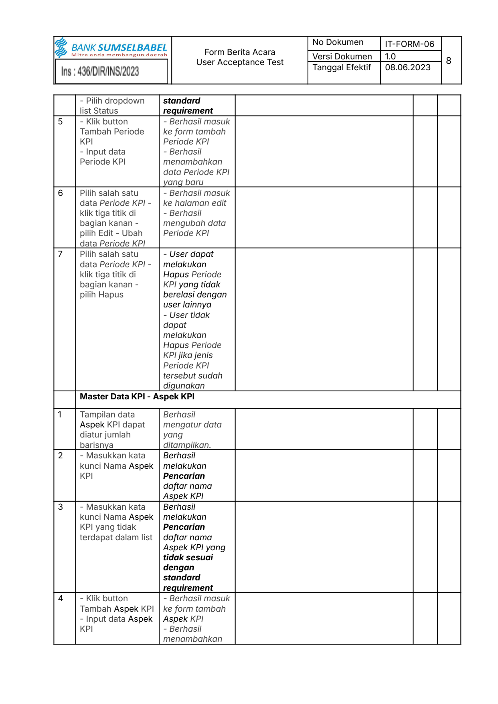

WY                                                  No Dokumen        IT-FORM-06
                               Form Berita Acara    Versi Dokumen     1.0
   Ins : 436/DIR/INS/2023    User Acceptance Test   Tanggal Efektif   08.06.2023 8

         - Pilih dropdown     standard
         list Status          requirement
5        - Klik button        - Berhasil masuk
         Tambah Periode       ke form tambah
         KPI                  Periode KPI
         - Input data         - Berhasil
         Periode KPI          menambahkan
                              data Periode KPI
                              yang baru
6        Pilih salah satu     - Berhasil masuk
         data Periode KPI - | ke halaman edit
         klik tiga titik di   - Berhasil
         bagian kanan -       mengubah data
         pilih Edit - Ubah    Periode KPI
         data Periode KPI
7        Pilih salah satu     - User dapat
         data Periode KPI -   melakukan
         klik tiga titik di   Hapus Periode
         bagian kanan -       KPI yang tidak
         pilih Hapus          berelasi dengan
                              user lainnya
                              - User tidak
                              dapat
                              melakukan
                              Hapus Periode
                              KPI jika jenis
                              Periode KPI
                              tersebut sudah
                              digunakan
         Master Data KPI - Aspek KPI
1        Tampilan data        Berhasil
         Aspek KPI dapat      mengatur data
         diatur jumlah        yang
         barisnya             ditampilkan.
2        - Masukkan kata      Berhasil
         kunci Nama Aspek     melakukan
         KPI                  Pencarian
                              daftar nama
                              Aspek KPI
3        - Masukkan kata      Berhasil
         kunci Nama Aspek     melakukan
         KPI yang tidak       Pencarian
         terdapat dalam list | daftar nama
                              Aspek KPI yang
                              tidak sesuai
                              dengan
                              standard
                              requirement
4        - Klik button        - Berhasil masuk
         Tambah Aspek KPI | ke form tambah
         - Input data Aspek   Aspek KPI
         KPI                  - Berhasil
                              menambahkan

---

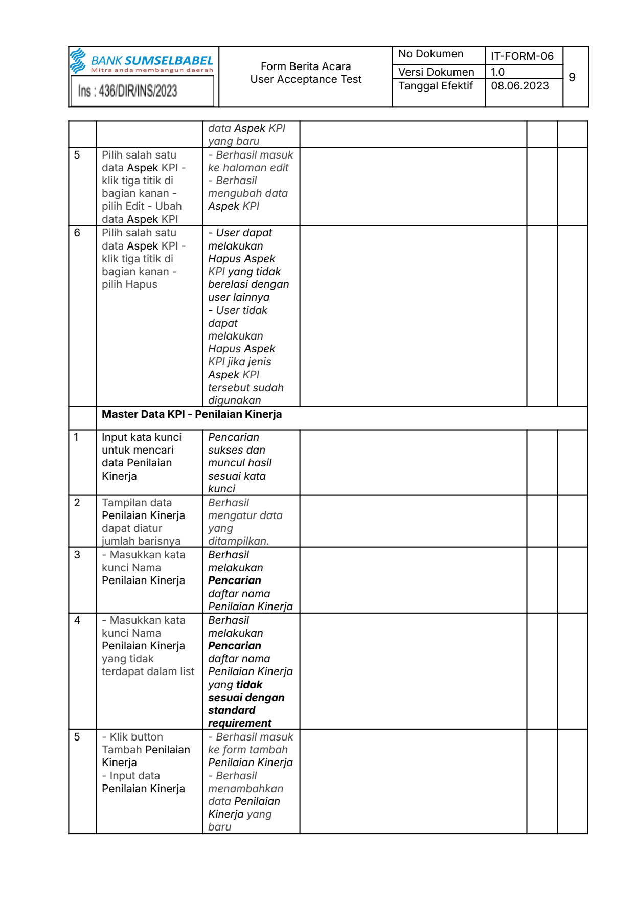

WY      BANK            SUMSELBABEL        No Dokumen                        IT-FORM-06
        Mitra anda membangun dacrah      Form Berita Acara  Versi Dokumen |  1.0
   Ins  :      436/DIR/INS/2023        User Acceptance Test Tanggal Efektif | 08.06.2023 9

                                   data Aspek KPI
                                   yang baru
5          Pilih salah satu        - Berhasil masuk
           data Aspek KPI -        ke halaman edit
           klik tiga titik di      - Berhasil
           bagian kanan -          mengubah data
           pilih Edit - Ubah       Aspek KPI
           data Aspek KPI
6          Pilih salah satu        - User dapat
           data Aspek KPI -        melakukan
           klik tiga titik di      Hapus Aspek
           bagian kanan -          KPI yang tidak
           pilih Hapus             berelasi dengan
                                   user lainnya
                                   - User tidak
                                   dapat
                                   melakukan
                                   Hapus Aspek
                                   KPI jika jenis
                                   Aspek KPI
                                   tersebut sudah
                                   digunakan
           Master Data KPI - Penilaian Kinerja
1          Input kata kunci        Pencarian
           untuk mencari           sukses dan
           data Penilaian          muncul hasil
           Kinerja                 sesuai kata
                                   kunci
2          Tampilan data           Berhasil
           Penilaian Kinerja       mengatur data
           dapat diatur            yang
           jumlah barisnya         ditampilkan.
3          - Masukkan kata         Berhasil
           kunci Nama              melakukan
           Penilaian Kinerja       Pencarian
                                   daftar nama
                                   Penilaian Kinerja
4          - Masukkan kata         Berhasil
           kunci Nama              melakukan
           Penilaian Kinerja       Pencarian
           yang tidak              daftar nama
           terdapat dalam list   | Penilaian Kinerja
                                   yang tidak
                                   sesuai dengan
                                   standard
                                   requirement
5          - Klik button           - Berhasil masuk
           Tambah Penilaian     | ke form tambah
           Kinerja                 Penilaian Kinerja
           - Input data            - Berhasil
           Penilaian Kinerja       menambahkan
                                   data Penilaian
                                   Kinerja yang
                                   baru

---

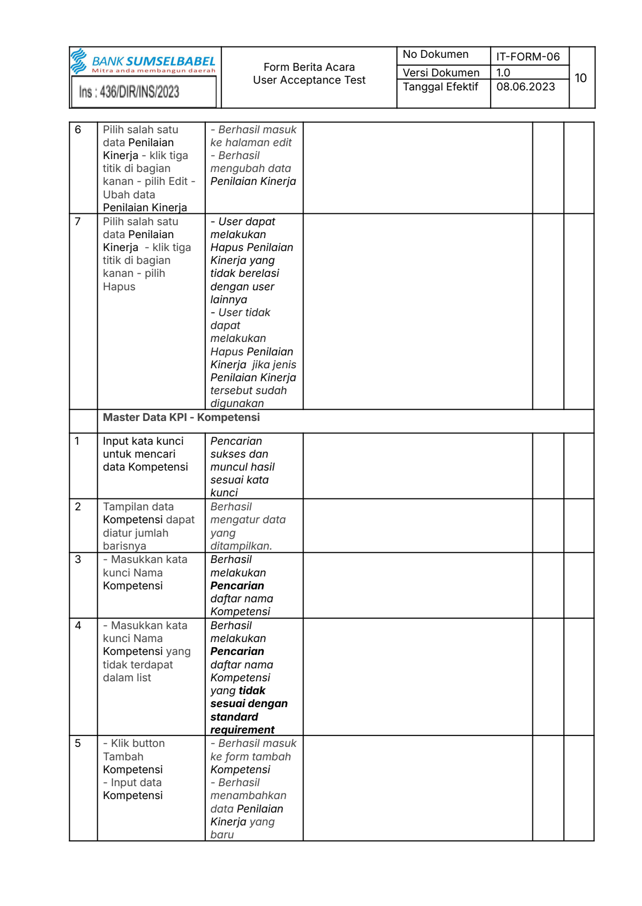

WY      BANK            SUMSELBABEL        No Dokumen      IT-FORM-06
        Mitra anda membangun daerah      Form Berita Acara  Versi Dokumen | 1.0
   Ins  : 436/DIR/INS/2023          User Acceptance Test    Tanggal Efektif | 08.06.2023 10

6         Pilih salah satu      - Berhasil masuk
          data Penilaian        ke halaman edit
          Kinerja - klik tiga   - Berhasil
          titik di bagian       mengubah data
          kanan - pilih Edit - | Penilaian Kinerja
          Ubah data
          Penilaian Kinerja
7         Pilih salah satu      - User dapat
          data Penilaian        melakukan
          Kinerja - klik tiga   Hapus Penilaian
          titik di bagian       Kinerja yang
          kanan - pilih         tidak berelasi
          Hapus                 dengan user
                                lainnya
                                - User tidak
                                dapat
                                melakukan
                                Hapus Penilaian
                                Kinerja jika jenis
                                Penilaian Kinerja
                                tersebut sudah
                                digunakan
          Master Data KPI - Kompetensi
1         Input kata kunci      Pencarian
          untuk mencari         sukses dan
          data Kompetensi       muncul hasil
                                sesuai kata
                                kunci
2         Tampilan data         Berhasil
          Kompetensi dapat      mengatur data
          diatur jumlah         yang
          barisnya              ditampilkan.
3         - Masukkan kata       Berhasil
          kunci Nama            melakukan
          Kompetensi            Pencarian
                                daftar nama
                                Kompetensi
4         - Masukkan kata       Berhasil
          kunci Nama            melakukan
          Kompetensi yang       Pencarian
          tidak terdapat        daftar nama
          dalam list            Kompetensi
                                yang tidak
                                sesuai dengan
                                standard
                                requirement
5         - Klik button         - Berhasil masuk
          Tambah                ke form tambah
          Kompetensi            Kompetensi
          - Input data          - Berhasil
          Kompetensi            menambahkan
                                data Penilaian
                                Kinerja yang
                                baru

---

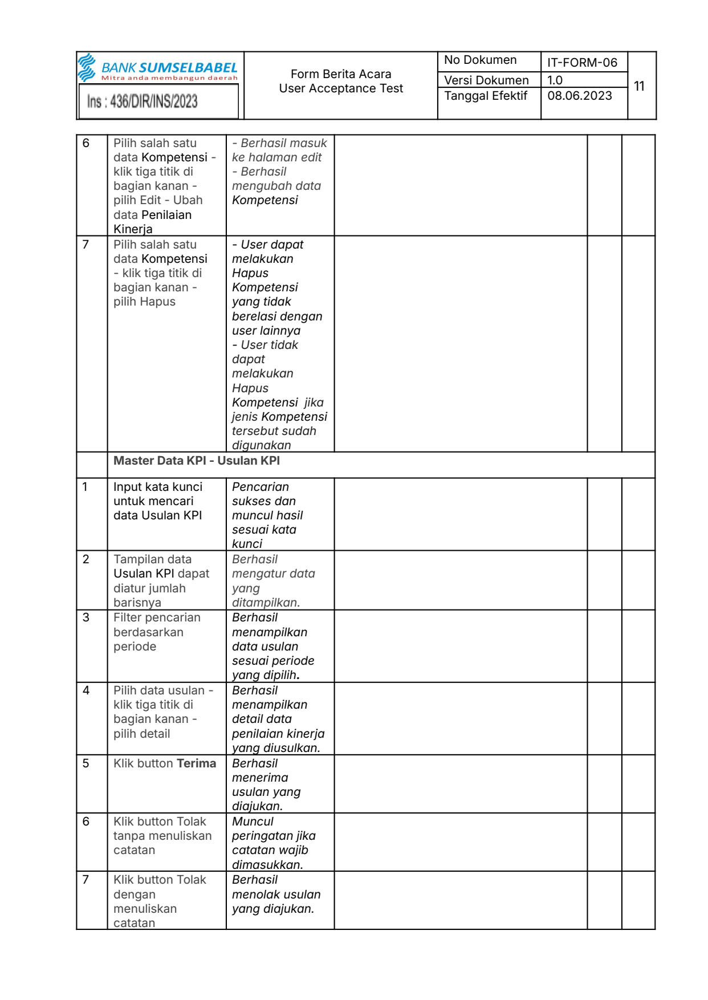

WY      BANK            SUMSELBABEL No Dokumen IT-FORM-06
        Mitra anda membangun daerah      Form Berita Acara Versi Dokumen | 1.0
   Ins  :  436/DIR/INS/2023           User Acceptance Test Tanggal Efektif | 08.06.2023 11

6          Pilih salah satu       - Berhasil masuk
           data Kompetensi - | ke halaman edit
           klik tiga titik di     - Berhasil
           bagian kanan -         mengubah data
           pilih Edit - Ubah      Kompetensi
           data Penilaian
           Kinerja
7          Pilih salah satu       - User dapat
           data Kompetensi        melakukan
           - klik tiga titik di   Hapus
           bagian kanan -         Kompetensi
           pilih Hapus            yang tidak
                                  berelasi dengan
                                  user lainnya
                                  - User tidak
                                  dapat
                                  melakukan
                                  Hapus
                                  Kompetensi jika
                                  jenis Kompetensi
                                  tersebut sudah
                                  digunakan
           Master Data KPI - Usulan KPI
1          Input kata kunci       Pencarian
           untuk mencari          sukses dan
           data Usulan KPI        muncul hasil
                                  sesuai kata
                                  kunci
2          Tampilan data          Berhasil
           Usulan KPI dapat       mengatur data
           diatur jumlah          yang
           barisnya               ditampilkan.
3          Filter pencarian       Berhasil
           berdasarkan            menampilkan
           periode                data usulan
                                  sesuai periode
                                  yang dipilih.
4          Pilih data usulan -   | Berhasil
           klik tiga titik di     menampilkan
           bagian kanan -         detail data
           pilih detail           penilaian kinerja
                                  yang diusulkan.
5          Klik button Terima Berhasil
                                  menerima
                                  usulan yang
                                  diajukan.
6          Klik button Tolak      Muncul
           tanpa menuliskan | peringatan jika
           catatan                catatan wajib
                                  dimasukkan.
7          Klik button Tolak      Berhasil
           dengan                 menolak usulan
           menuliskan             yang diajukan.
           catatan

---

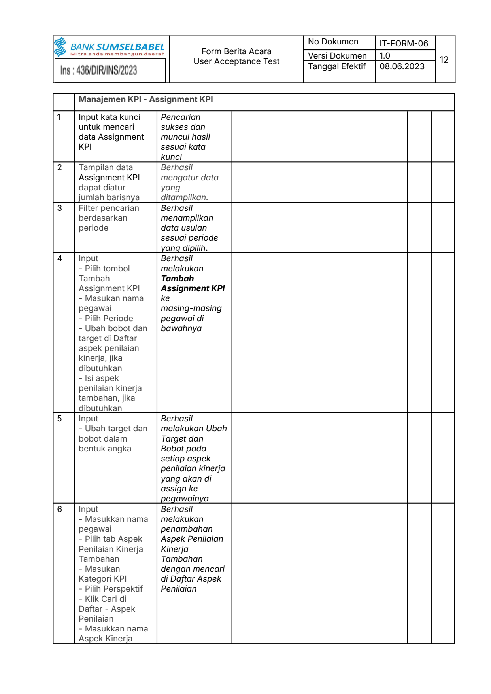

WY      BANK            SUMSELBABEL No Dokumen IT-FORM-06
        Mitra anda membangun daerah     Form Berita Acara Versi Dokumen | 1.0
   Ins  : 436/DIR/INS/2023         User Acceptance Test Tanggal Efektif | 08.06.2023 12

          Manajemen KPI - Assignment KPI
1         Input kata kunci     Pencarian
          untuk mencari        sukses dan
          data Assignment      muncul hasil
          KPI                  sesuai kata
                               kunci
2         Tampilan data        Berhasil
          Assignment KPI       mengatur data
          dapat diatur         yang
          jumlah barisnya      ditampilkan.
3         Filter pencarian     Berhasil
          berdasarkan          menampilkan
          periode              data usulan
                               sesuai periode
                               yang dipilih.
4         Input                Berhasil
          - Pilih tombol       melakukan
          Tambah               Tambah
          Assignment KPI       Assignment KPI
          - Masukan nama       ke
          pegawai              masing-masing
          - Pilih Periode      pegawai di
          - Ubah bobot dan     bawahnya
          target di Daftar
          aspek penilaian
          kinerja, jika
          dibutuhkan
          - Isi aspek
          penilaian kinerja
          tambahan, jika
          dibutuhkan
5         Input                Berhasil
          - Ubah target dan    melakukan Ubah
          bobot dalam          Target dan
          bentuk angka         Bobot pada
                               setiap aspek
                               penilaian kinerja
                               yang akan di
                               assign ke
                               pegawainya
6         Input                Berhasil
          - Masukkan nama      melakukan
          pegawai              penambahan
          - Pilih tab Aspek    Aspek Penilaian
          Penilaian Kinerja    Kinerja
          Tambahan             Tambahan
          - Masukan            dengan mencari
          Kategori KPI         di Daftar Aspek
          - Pilih Perspektif   Penilaian
          - Klik Cari di
          Daftar - Aspek
          Penilaian
          - Masukkan nama
          Aspek Kinerja

---

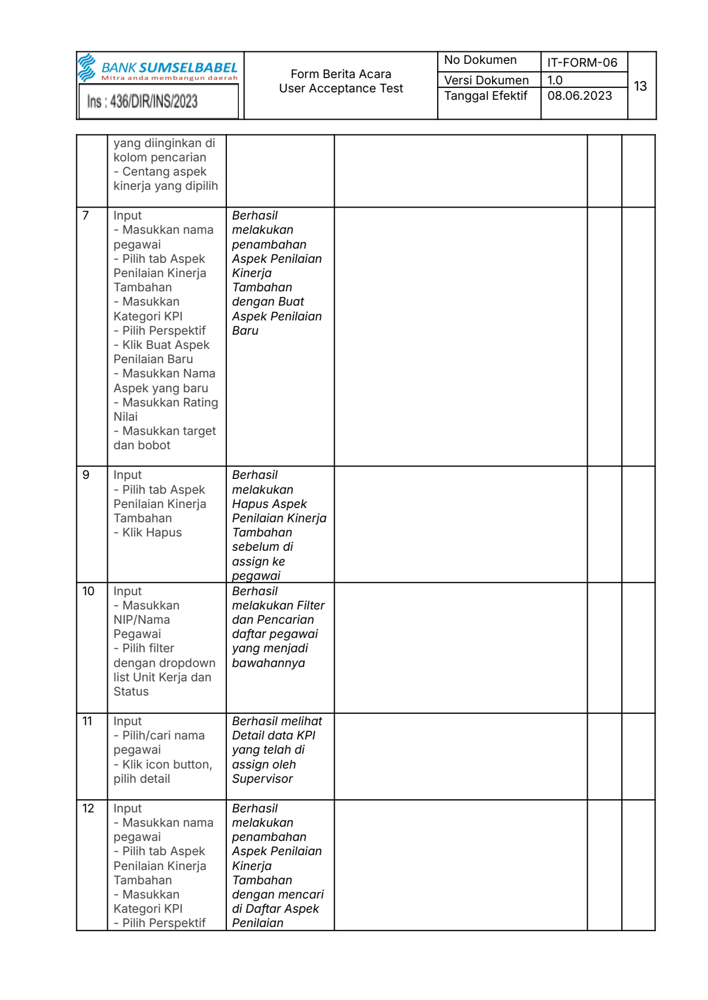

WY  BANK            SUMSELBABEL No Dokumen IT-FORM-06
    Mitra anda membangun daerah     Form Berita Acara Versi Dokumen | 1.0
Ins : 436/DIR/INS/2023         User Acceptance Test Tanggal Efektif | 08.06.2023 13

      yang diinginkan di
      kolom pencarian
      - Centang aspek
      kinerja yang dipilih

7     Input                Berhasil
      - Masukkan nama      melakukan
      pegawai              penambahan
      - Pilih tab Aspek    Aspek Penilaian
      Penilaian Kinerja    Kinerja
      Tambahan             Tambahan
      - Masukkan           dengan Buat
      Kategori KPI         Aspek Penilaian
      - Pilih Perspektif   Baru
      - Klik Buat Aspek
      Penilaian Baru
      - Masukkan Nama
      Aspek yang baru
      - Masukkan Rating
      Nilai
      - Masukkan target
      dan bobot

9     Input                Berhasil
      - Pilih tab Aspek    melakukan
      Penilaian Kinerja    Hapus Aspek
      Tambahan             Penilaian Kinerja
      - Klik Hapus         Tambahan
                           sebelum di
                           assign ke
                           pegawai
10  | Input                Berhasil
      - Masukkan           melakukan Filter
      NIP/Nama             dan Pencarian
      Pegawai              daftar pegawai
      - Pilih filter       yang menjadi
      dengan dropdown      bawahannya
      list Unit Kerja dan
      Status

11    Input                Berhasil melihat
      - Pilih/cari nama    Detail data KPI
      pegawai              yang telah di
      - Klik icon button, | assign oleh
      pilih detail         Supervisor

12  | Input                Berhasil
      - Masukkan nama      melakukan
      pegawai              penambahan
      - Pilih tab Aspek    Aspek Penilaian
      Penilaian Kinerja    Kinerja
      Tambahan             Tambahan
      - Masukkan           dengan mencari
      Kategori KPI         di Daftar Aspek
      - Pilih Perspektif   Penilaian

---

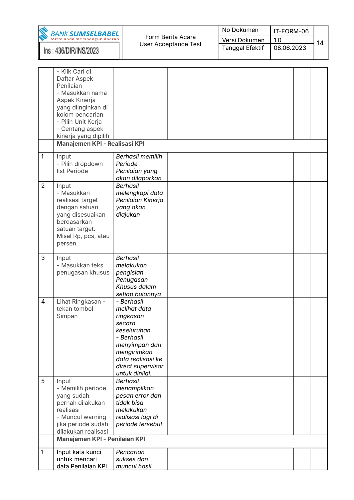

WY      BANK            SUMSELBABEL No Dokumen IT-FORM-06
        Mitra anda membangun daerah      Form Berita Acara Versi Dokumen | 1.0
   Ins  : 436/DIR/INS/2023         User Acceptance Test Tanggal Efektif | 08.06.2023 14

          - Klik Cari di
          Daftar Aspek
          Penilaian
          - Masukkan nama
          Aspek Kinerja
          yang diinginkan di
          kolom pencarian
          - Pilih Unit Kerja
          - Centang aspek
          kinerja yang dipilih
          Manajemen KPI - Realisasi KPI
1         Input                Berhasil memilih
          - Pilih dropdown     Periode
          list Periode         Penilaian yang
                               akan dilaporkan
2         Input                Berhasil
          - Masukkan           melengkapi data
          realisasi target     Penilaian Kinerja
          dengan satuan        yang akan
          yang disesuaikan   | diajukan
          berdasarkan
          satuan target.
          Misal Rp, pcs, atau
          persen.

3         Input                Berhasil
          - Masukkan teks      melakukan
          penugasan khusus     pengisian
                               Penugasan
                               Khusus dalam
                               setiap bulannya
4         Lihat Ringkasan -   | - Berhasil
          tekan tombol         melihat data
          Simpan               ringkasan
                               secara
                               keseluruhan.
                               - Berhasil
                               menyimpan dan
                               mengirimkan
                               data realisasi ke
                               direct supervisor
                               untuk dinilai.
5         Input                Berhasil
          - Memilih periode    menampilkan
          yang sudah           pesan error dan
          pernah dilakukan     tidak bisa
          realisasi            melakukan
          - Muncul warning     realisasi lagi di
          jika periode sudah   periode tersebut.
          dilakukan realisasi
          Manajemen KPI - Penilaian KPI
1         Input kata kunci     Pencarian
          untuk mencari        sukses dan
          data Penilaian KPI   muncul hasil

---

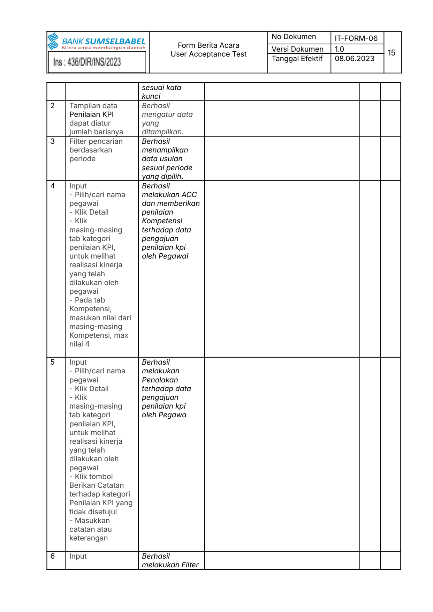

WY   BANK            SUMSELBABEL No Dokumen IT-FORM-06
     Mitra anda membangun daerah    Form Berita Acara Versi Dokumen | 1.0
Ins  : 436/DIRANS/2023         User Acceptance Test Tanggal Efektif | 08.06.2023 15

                           sesuai kata
                           kunci
2      Tampilan data       Berhasil
       Penilaian KPI       mengatur data
       dapat diatur        yang
       jumlah barisnya     ditampilkan.
3      Filter pencarian    Berhasil
       berdasarkan         menampilkan
       periode             data usulan
                           sesuai periode
                           yang dipilih.
4      Input               Berhasil
       - Pilih/cari nama   melakukan ACC
       pegawai             dan memberikan
       - Klik Detail       penilaian
       - Klik              Kompetensi
       masing-masing       terhadap data
       tab kategori        pengajuan
       penilaian KPI,      penilaian kpi
       untuk melihat       oleh Pegawai
       realisasi kinerja
       yang telah
       dilakukan oleh
       pegawai
       - Pada tab
       Kompetensi,
       masukan nilai dari
       masing-masing
       Kompetensi, max
       nilai 4

5      Input               Berhasil
       - Pilih/cari nama   melakukan
       pegawai             Penolakan
       - Klik Detail       terhadap data
       - Klik              pengajuan
       masing-masing       penilaian kpi
       tab kategori        oleh Pegawa
       penilaian KPI,
       untuk melihat
       realisasi kinerja
       yang telah
       dilakukan oleh
       pegawai
       - Klik tombol
       Berikan Catatan
       terhadap kategori
       Penilaian KPI yang
       tidak disetujui
       - Masukkan
       catatan atau
       keterangan

6      Input               Berhasil
                           melakukan Filter

---

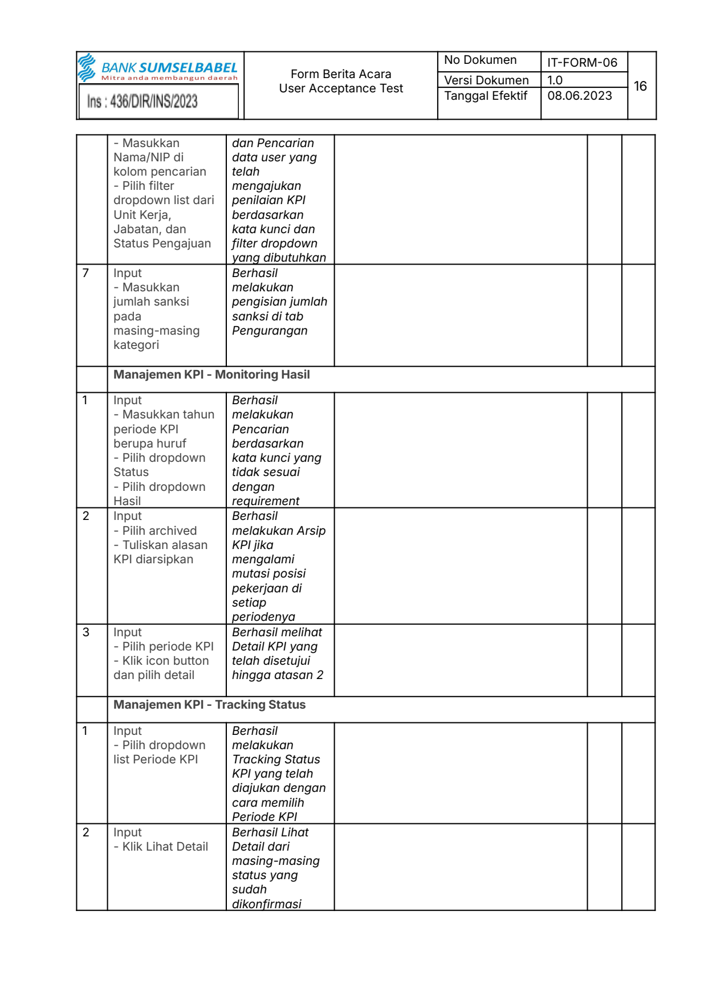

WY      BANK            SUMSELBABEL No Dokumen IT-FORM-06
        Mitra anda membangun daerah      Form Berita Acara Versi Dokumen | 1.0
   Ins  : 436/DIR/INS/2023          User Acceptance Test Tanggal Efektif | 08.06.2023 16

          - Masukkan            dan Pencarian
          Nama/NIP di           data user yang
          kolom pencarian       telah
          - Pilih filter        mengajukan
          dropdown list dari   | penilaian KPI
          Unit Kerja,           berdasarkan
          Jabatan, dan          kata kunci dan
          Status Pengajuan     | filter dropdown
                                yang dibutuhkan
7         Input                 Berhasil
          - Masukkan            melakukan
          jumlah sanksi         pengisian jumlah
          pada                  sanksi di tab
          masing-masing         Pengurangan
          kategori

          Manajemen KPI - Monitoring Hasil
1         Input                 Berhasil
          - Masukkan tahun      melakukan
          periode KPI           Pencarian
          berupa huruf          berdasarkan
          - Pilih dropdown      kata kunci yang
          Status                tidak sesuai
          - Pilih dropdown      dengan
          Hasil                 requirement
2         Input                 Berhasil
          - Pilih archived      melakukan Arsip
          - Tuliskan alasan     KPI jika
          KPI diarsipkan        mengalami
                                mutasi posisi
                                pekerjaan di
                                setiap
                                periodenya
3         Input                 Berhasil melihat
          - Pilih periode KPI  | Detail KPI yang
          - Klik icon button    telah disetujui
          dan pilih detail      hingga atasan 2

          Manajemen KPI - Tracking Status
1         Input                 Berhasil
          - Pilih dropdown      melakukan
          list Periode KPI      Tracking Status
                                KPI yang telah
                                diajukan dengan
                                cara memilih
                                Periode KPI
2         Input                 Berhasil Lihat
          - Klik Lihat Detail   Detail dari
                                masing-masing
                                status yang
                                sudah
                                dikonfirmasi

---

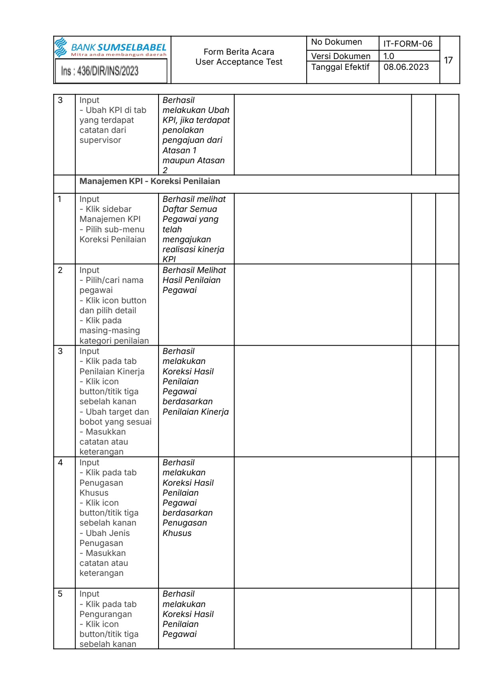

WY      BANK            SUMSELBABEL No Dokumen IT-FORM-06
        Mitra anda membangun daerah    Form Berita Acara Versi Dokumen | 1.0
   Ins  : 436/DIRANS/2023         User Acceptance Test Tanggal Efektif | 08.06.2023 17

3         Input               Berhasil
          - Ubah KPI di tab   melakukan Ubah
          yang terdapat       KPI, jika terdapat
          catatan dari        penolakan
          supervisor          pengajuan dari
                              Atasan 1
                              maupun Atasan
                              2
          Manajemen KPI - Koreksi Penilaian
1         Input               Berhasil melihat
          - Klik sidebar      Daftar Semua
          Manajemen KPI       Pegawai yang
          - Pilih sub-menu    telah
          Koreksi Penilaian   mengajukan
                              realisasi kinerja
                              KPI
2         Input               Berhasil Melihat
          - Pilih/cari nama   Hasil Penilaian
          pegawai             Pegawai
          - Klik icon button
          dan pilih detail
          - Klik pada
          masing-masing
          kategori penilaian
3         Input               Berhasil
          - Klik pada tab     melakukan
          Penilaian Kinerja   Koreksi Hasil
          - Klik icon         Penilaian
          button/titik tiga   Pegawai
          sebelah kanan       berdasarkan
          - Ubah target dan  | Penilaian Kinerja
          bobot yang sesuai
          - Masukkan
          catatan atau
          keterangan
4         Input               Berhasil
          - Klik pada tab     melakukan
          Penugasan           Koreksi Hasil
          Khusus              Penilaian
          - Klik icon         Pegawai
          button/titik tiga   berdasarkan
          sebelah kanan       Penugasan
          - Ubah Jenis        Khusus
          Penugasan
          - Masukkan
          catatan atau
          keterangan

5         Input               Berhasil
          - Klik pada tab     melakukan
          Pengurangan         Koreksi Hasil
          - Klik icon         Penilaian
          button/titik tiga   Pegawai
          sebelah kanan

---

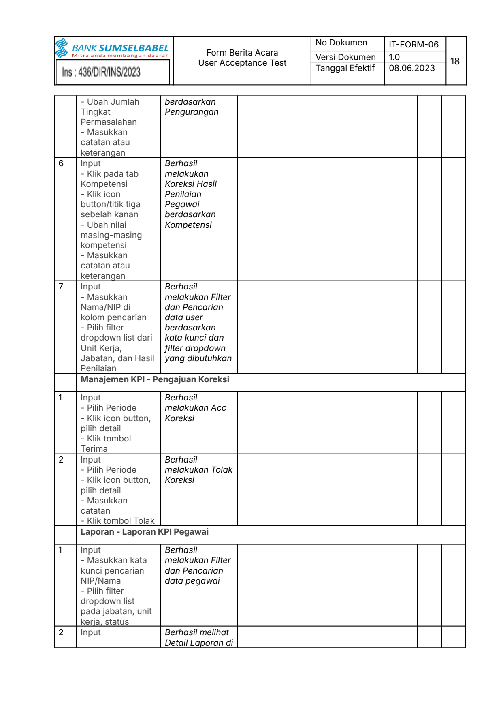

WY      BANK            SUMSELBABEL No Dokumen IT-FORM-06
        Mitra anda membangun daerah      Form Berita Acara Versi Dokumen | 1.0
   Ins  :    436/DIRANS/2023        User Acceptance Test Tanggal Efektif | 08.06.2023 18

           - Ubah Jumlah        berdasarkan
           Tingkat              Pengurangan
           Permasalahan
           - Masukkan
           catatan atau
           keterangan
6          Input                Berhasil
           - Klik pada tab      melakukan
           Kompetensi           Koreksi Hasil
           - Klik icon          Penilaian
           button/titik tiga    Pegawai
           sebelah kanan        berdasarkan
           - Ubah nilai         Kompetensi
           masing-masing
           kompetensi
           - Masukkan
           catatan atau
           keterangan
7          Input                Berhasil
           - Masukkan           melakukan Filter
           Nama/NIP di          dan Pencarian
           kolom pencarian      data user
           - Pilih filter       berdasarkan
           dropdown list dari | kata kunci dan
           Unit Kerja,          filter dropdown
           Jabatan, dan Hasil   yang dibutuhkan
           Penilaian
           Manajemen KPI - Pengajuan Koreksi
1          Input                Berhasil
           - Pilih Periode      melakukan Acc
           - Klik icon button,  | Koreksi
           pilih detail
           - Klik tombol
           Terima
2          Input                Berhasil
           - Pilih Periode      melakukan Tolak
           - Klik icon button,  | Koreksi
           pilih detail
           - Masukkan
           catatan
           - Klik tombol Tolak
           Laporan - Laporan KPI Pegawai
1          Input                Berhasil
           - Masukkan kata      melakukan Filter
           kunci pencarian      dan Pencarian
           NIP/Nama             data pegawai
           - Pilih filter
           dropdown list
           pada jabatan, unit
           kerja, status
2          Input                Berhasil melihat
                                Detail Laporan di

---

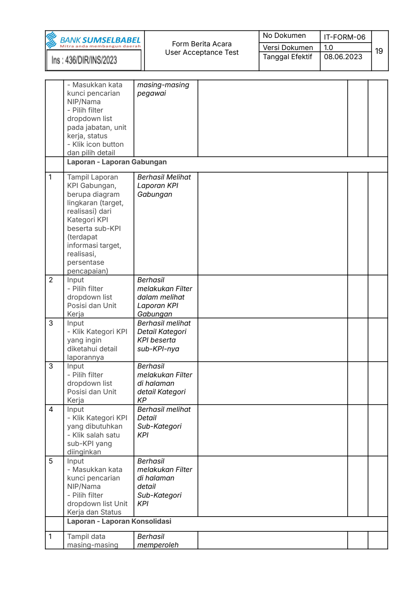

WY      BANK            SUMSELBABEL        No Dokumen      IT-FORM-06
        Mitra anda membangun daerah     Form Berita Acara  Versi Dokumen | 1.0
   Ins  :   436/DIR/INS/2023        User Acceptance Test   Tanggal Efektif | 08.06.2023 19

           - Masukkan kata      masing-masing
           kunci pencarian      pegawai
           NIP/Nama
           - Pilih filter
           dropdown list
           pada jabatan, unit
           kerja, status
           - Klik icon button
           dan pilih detail
           Laporan - Laporan Gabungan
1          Tampil Laporan       Berhasil Melihat
           KPI Gabungan,        Laporan KPI
           berupa diagram       Gabungan
           lingkaran (target,
           realisasi) dari
           Kategori KPI
           beserta sub-KPI
           (terdapat
           informasi target,
           realisasi,
           persentase
           pencapaian)
2          Input                Berhasil
           - Pilih filter       melakukan Filter
           dropdown list        dalam melihat
           Posisi dan Unit      Laporan KPI
           Kerja                Gabungan
3          Input                Berhasil melihat
           - Klik Kategori KPI | Detail Kategori
           yang ingin           KPI beserta
           diketahui detail     sub-KPI-nya
           laporannya
3          Input                Berhasil
           - Pilih filter       melakukan Filter
           dropdown list        di halaman
           Posisi dan Unit      detail Kategori
           Kerja                KP
4          Input                Berhasil melihat
           - Klik Kategori KPI  | Detail
           yang dibutuhkan      Sub-Kategori
           - Klik salah satu    KPI
           sub-KPI yang
           diinginkan
5          Input                Berhasil
           - Masukkan kata      melakukan Filter
           kunci pencarian      di halaman
           NIP/Nama             detail
           - Pilih filter       Sub-Kategori
           dropdown list Unit   | KPI
           Kerja dan Status
           Laporan - Laporan Konsolidasi
1          Tampil data          Berhasil
           masing-masing        memperoleh

---

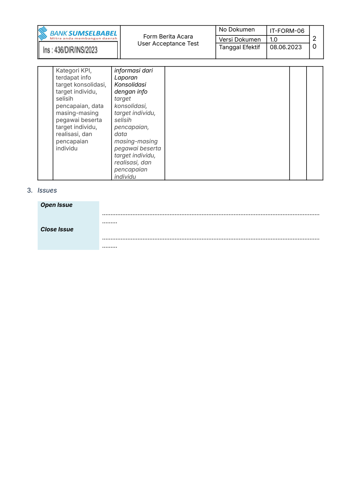

WY   BANK            SUMSELBABEL        No Dokumen                       IT-FORM-06
     Mitra anda membangun daerah    Form Berita Acara  Versi Dokumen     1.0         2
Ins  : 436/DIRANS/2023         User Acceptance Test    Tanggal Efektif   08.06.2023  0

       Kategori KPI,       informasi dari
       terdapat info       Laporan
       target konsolidasi, | Konsolidasi
       target individu,    dengan info
       selisih             target
       pencapaian, data    konsolidasi,
       masing-masing       target individu,
       pegawai beserta     selisih
       target individu,    pencapaian,
       realisasi, dan      data
       pencapaian          masing-masing
       individu            pegawai beserta
                           target individu,
                           realisasi, dan
                           pencapaian
                           individu
3. Issues

Open Issue
                          …………………………………………………………………………………………………………………
                          ………
Close Issue
                          …………………………………………………………………………………………………………………
                          ………

---

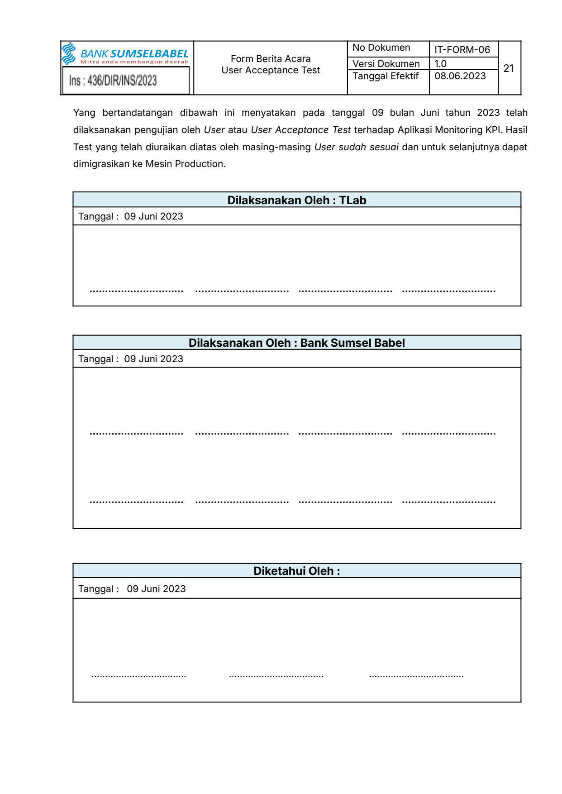

2                                   No Dokumen
 7                                                     IT-FORM-06
2,     SANE    Form Berita Acara     Versi Dokumen    |
             User Acceptance Test                      1.0        21
  Ins  : 436/DIR/INS/2023            Tanggal Efektif  | 08.06.2023

  Yang bertandatangan dibawah ini menyatakan pada tanggal 09 bulan Juni tahun 2023 telah
  dilaksanakan pengujian oleh User atau User Acceptance Test terhadap Aplikasi Monitoring KPI. Hasil
  Test yang telah diuraikan diatas oleh masing-masing User sudah sesuai dan untuk selanjutnya dapat
  dimigrasikan ke Mesin Production.

           Dilaksanakan Oleh : TLab
      Tanggal : 09 Juni 2023

       ………………………… ………………………… ………………………… …………………………

       Dilaksanakan Oleh : Bank Sumsel Babel
      Tanggal : 09 Juni 2023

       ………………………… ………………………… ………………………… …………………………

       ………………………… ………………………… ………………………… …………………………

       Diketahui Oleh :
      Tanggal : 09 Juni 2023

       …………………………….. ……………………………..   ……………………………..

---

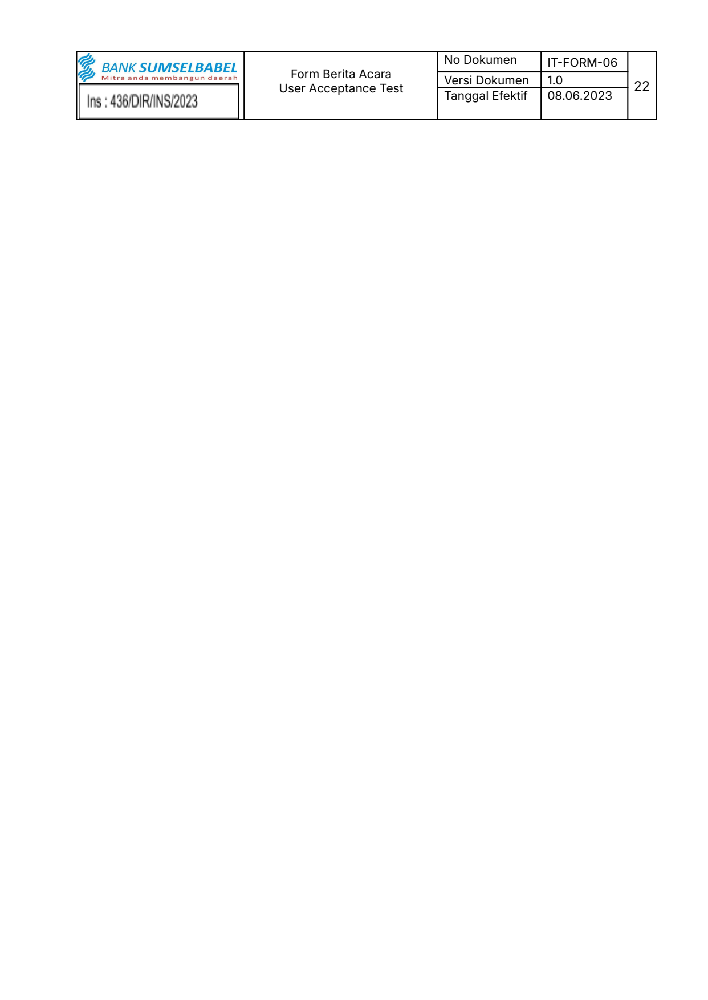

WY BANK SUMSELBABEL No D ok umen IT-FOR M-06
   Mitra anda membangun daerah Form Berita Acara Versi Dok umen | 1.0
 Ins : 436/DIRANS/2023 U s er Accep t ance Tes t Tang g al Efek tif | 08.06.2023 22

---

