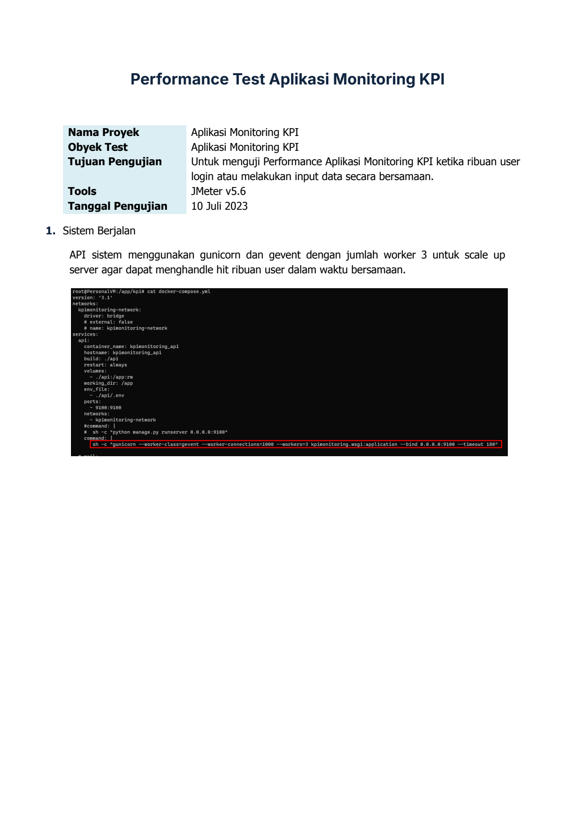
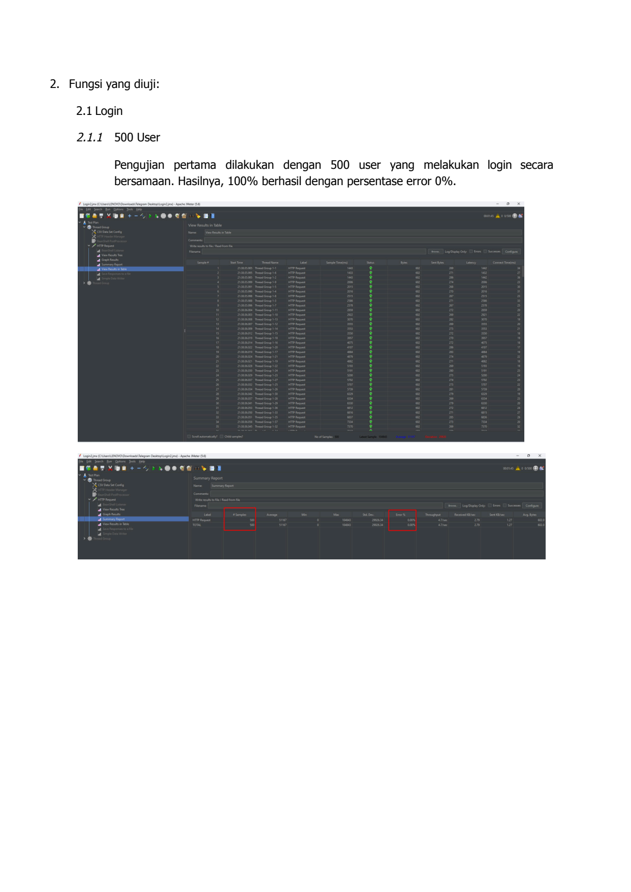
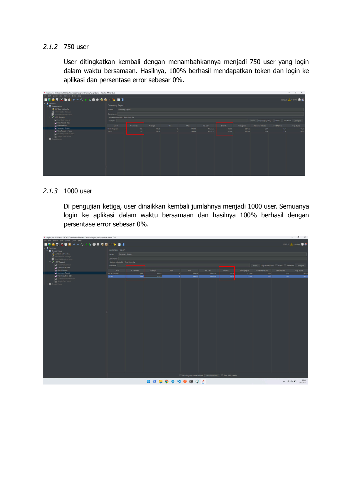
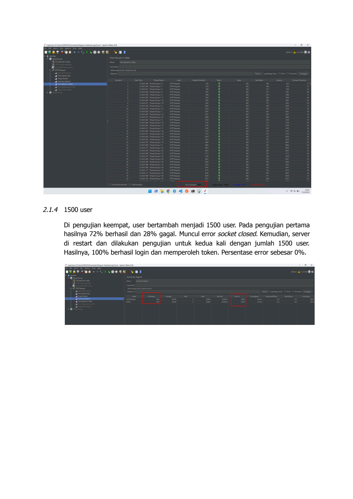
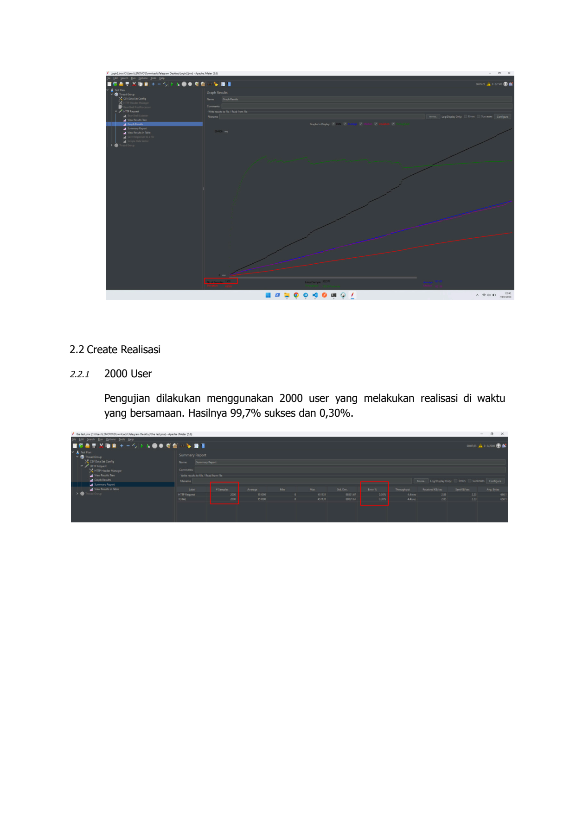
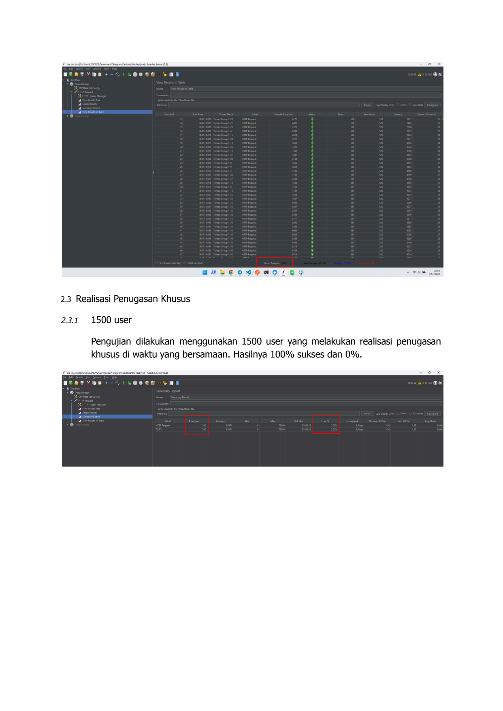
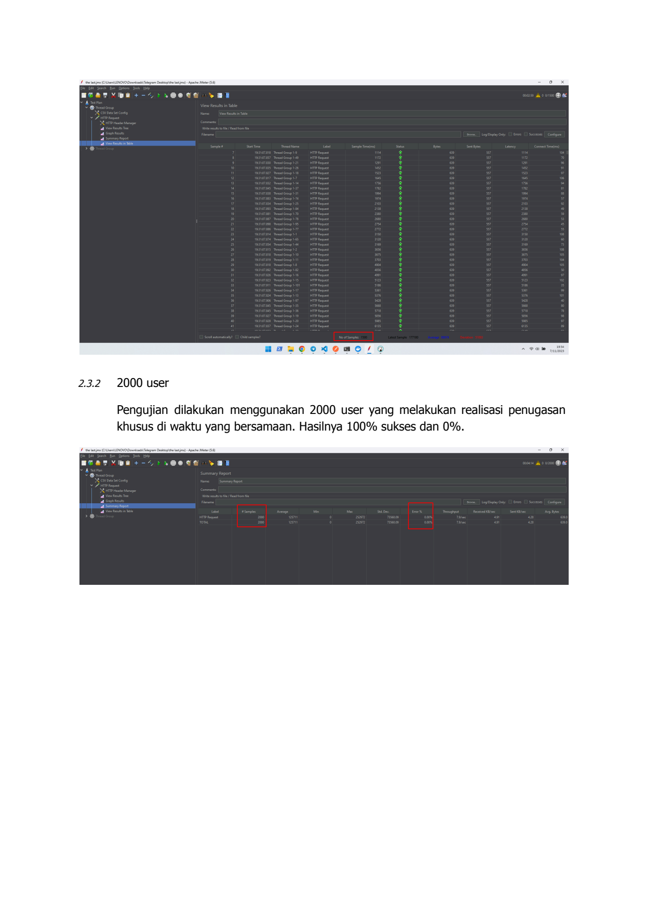
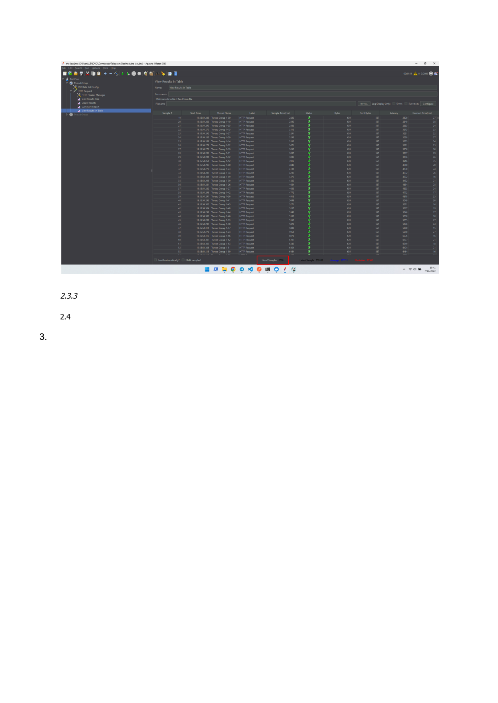

# Hasil Performance Test Kpi

> **Sumber:** [hasil-performance-test-kpi](https://docs.google.com/document/d/18FduuTEBiwmCiLOrId0f3D_wPtNF-34fXtMFlaRZU48/edit)

---

Performance Test Aplikasi Monitoring KPI

Nama Proyek         Aplikasi Monitoring KPI
Obyek Test          Aplikasi Monitoring KPI
Tujuan Pengujian    Untuk menguji Performance Aplikasi Monitoring KPI ketika ribuan user
                    login atau melakukan input data secara bersamaan.
Tools               JMeter v5.6
Tanggal Pengujian   10 Juli 2023
1. Sistem Berjalan
API sistem menggunakan gunicorn dan gevent dengan jumlah worker 3 untuk scale up
server agar dapat menghandle hit ribuan user dalam waktu bersamaan.

---

2. Fungsi yang diuji:
    2.1 Login
    2.1.1 500 User
    Pengujian pertama dilakukan dengan 500 user yang melakukan login secara
    bersamaan. Hasilnya, 100% berhasil dengan persentase error 0%.

---

2.1.2 750 user
User ditingkatkan kembali dengan menambahkannya menjadi 750 user yang login
dalam waktu bersamaan. Hasilnya, 100% berhasil mendapatkan token dan login ke
aplikasi dan persentase error sebesar 0%.

2.1.3 1000 user
Di pengujian ketiga, user dinaikkan kembali jumlahnya menjadi 1000 user. Semuanya
login ke aplikasi dalam waktu bersamaan dan hasilnya 100% berhasil dengan
persentase error sebesar 0%.

/    TTI

---

/

2.1.4 1500 user
       Di pengujian keempat, user bertambah menjadi 1500 user. Pada pengujian pertama
       hasilnya 72% berhasil dan 28% gagal. Muncul error socket closed. Kemudian, server
       di restart dan dilakukan pengujian untuk kedua kali dengan jumlah 1500 user.
       Hasilnya, 100% berhasil login dan memperoleh token. Persentase error sebesar 0%.

---

/    ven

2.2 Create Realisasi
2.2.1   2000 User
        Pengujian dilakukan menggunakan 2000 user yang melakukan realisasi di waktu
        yang bersamaan. Hasilnya 99,7% sukses dan 0,30%.

---

2.3 Realisasi Penugasan Khusus
2.3.1   1500 user
        Pengujian dilakukan menggunakan 1500 user yang melakukan realisasi penugasan
        khusus di waktu yang bersamaan. Hasilnya 100% sukses dan 0%.

---

/

2.3.2   2000 user
        Pengujian dilakukan menggunakan 2000 user yang melakukan realisasi penugasan
        khusus di waktu yang bersamaan. Hasilnya 100% sukses dan 0%.

---

/

  2.3.3

  2.4

3.

---

