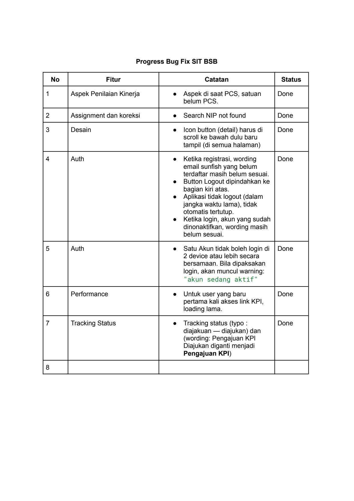
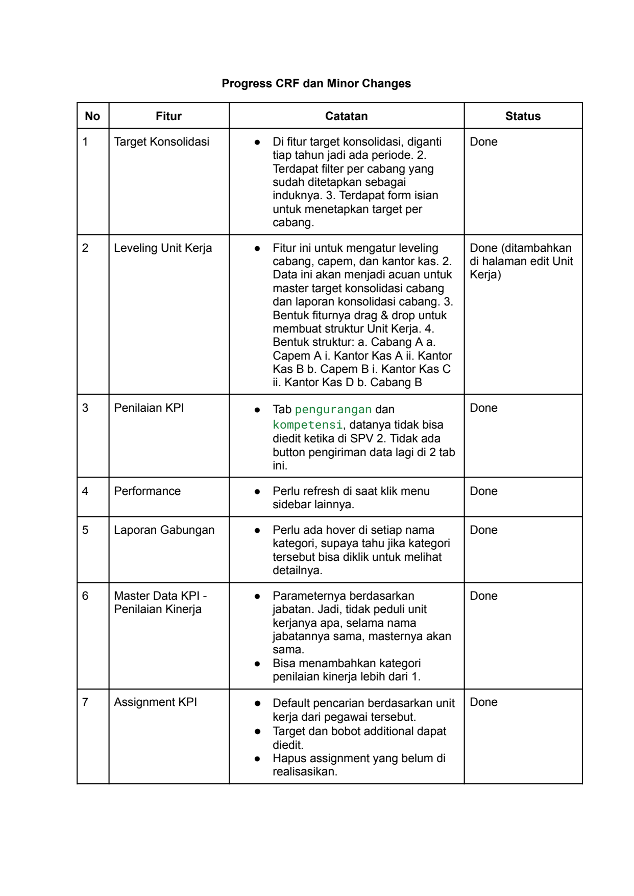

# Progress Bug Fix Sit Bsb

> **Sumber:** [progress-bug-fix-sit-bsb](https://docs.google.com/document/d/1biRIN8vX_pg53uBArGWo1p9cKWbzKociNULd6bhS82Y/edit)

---

Progress Bug Fix SIT BSB

   No        Fitur    Catatan                                         Status
1        Aspek Penilaian Kinerja   ● Aspek di saat PCS, satuan        Done
                                  belum PCS.
2        Assignment dan koreksi    ● Search NIP not found             Done
3        Desain                    ● Icon button (detail) harus di    Done
                                  scroll ke bawah dulu baru
                                  tampil (di semua halaman)
4        Auth                      ● Ketika registrasi, wording       Done
                                  email sunfish yang belum
                                  terdaftar masih belum sesuai.
                                   ● Button Logout dipindahkan ke
                                  bagian kiri atas.
                                   ● Aplikasi tidak logout (dalam
                                  jangka waktu lama), tidak
                                  otomatis tertutup.
                                   ● Ketika login, akun yang sudah
                                  dinonaktifkan, wording masih
                                  belum sesuai.
5        Auth                      ● Satu Akun tidak boleh login di   Done
                                  2 device atau lebih secara
                                  bersamaan. Bila dipaksakan
                                  login, akan muncul warning:
                                  "akun sedang aktif"

6        Performance               ● Untuk user yang baru             Done
                                  pertama kali akses link KPI,
                                  loading lama.
7        Tracking Status           ● Tracking status (typo :          Done
                                  diajakuan - diajukan) dan
                                  (wording: Pengajuan KPI
                                  Diajukan diganti menjadi
                                  Pengajuan KPI)
8

---

Progress CRF dan Minor Changes

No  Fitur    Catatan                                                   Status
1   Target Konsolidasi    ● Di fitur target konsolidasi, diganti   Done
                          tiap tahun jadi ada periode. 2.
                          Terdapat filter per cabang yang
                          sudah ditetapkan sebagai
                          induknya. 3. Terdapat form isian
                          untuk menetapkan target per
                          cabang.
2   Leveling Unit Kerja   ● Fitur ini untuk mengatur leveling      Done (ditambahkan
                          cabang, capem, dan kantor kas. 2.        di halaman edit Unit
                          Data ini akan menjadi acuan untuk        Kerja)
                          master target konsolidasi cabang
                          dan laporan konsolidasi cabang. 3.
                          Bentuk fiturnya drag & drop untuk
                          membuat struktur Unit Kerja. 4.
                          Bentuk struktur: a. Cabang A a.
                          Capem A i. Kantor Kas A ii. Kantor
                          Kas B b. Capem B i. Kantor Kas C
                          ii. Kantor Kas D b. Cabang B
3   Penilaian KPI         ● Tab pengurangan dan                    Done
                          kompetensi, datanya tidak bisa
                          diedit ketika di SPV 2. Tidak ada
                          button pengiriman data lagi di 2 tab
                          ini.
4   Performance           ● Perlu refresh di saat klik menu        Done
                          sidebar lainnya.
5   Laporan Gabungan      ● Perlu ada hover di setiap nama         Done
                          kategori, supaya tahu jika kategori
                          tersebut bisa diklik untuk melihat
                          detailnya.
6   Master Data KPI -     ● Parameternya berdasarkan               Done
    Penilaian Kinerja     jabatan. Jadi, tidak peduli unit
                          kerjanya apa, selama nama
                          jabatannya sama, masternya akan
                          sama.
                          ● Bisa menambahkan kategori
                          penilaian kinerja lebih dari 1.
7   Assignment KPI        ● Default pencarian berdasarkan unit     Done
                          kerja dari pegawai tersebut.
                          ● Target dan bobot additional dapat
                          diedit.
                          ● Hapus assignment yang belum di
                          realisasikan.

---

