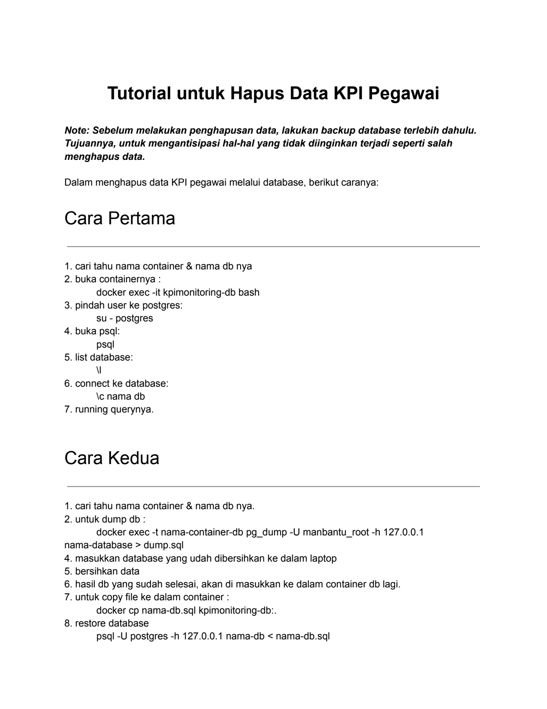
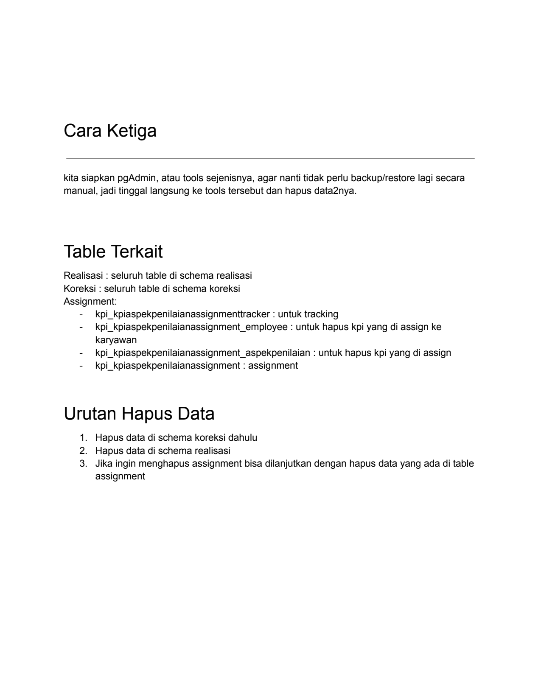
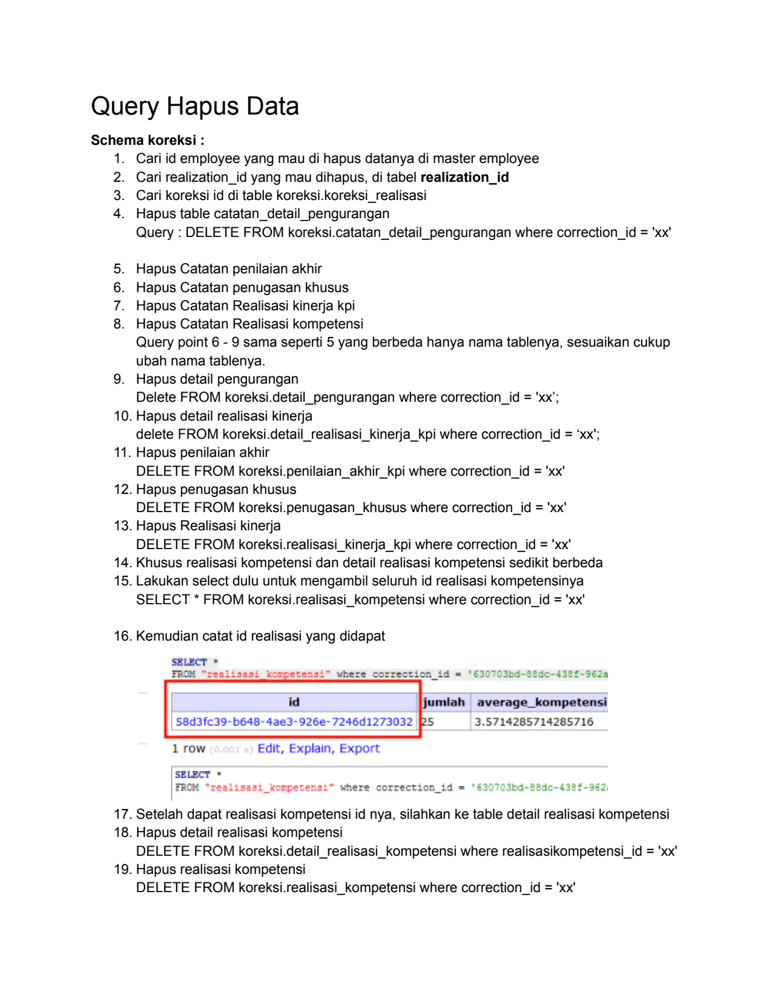
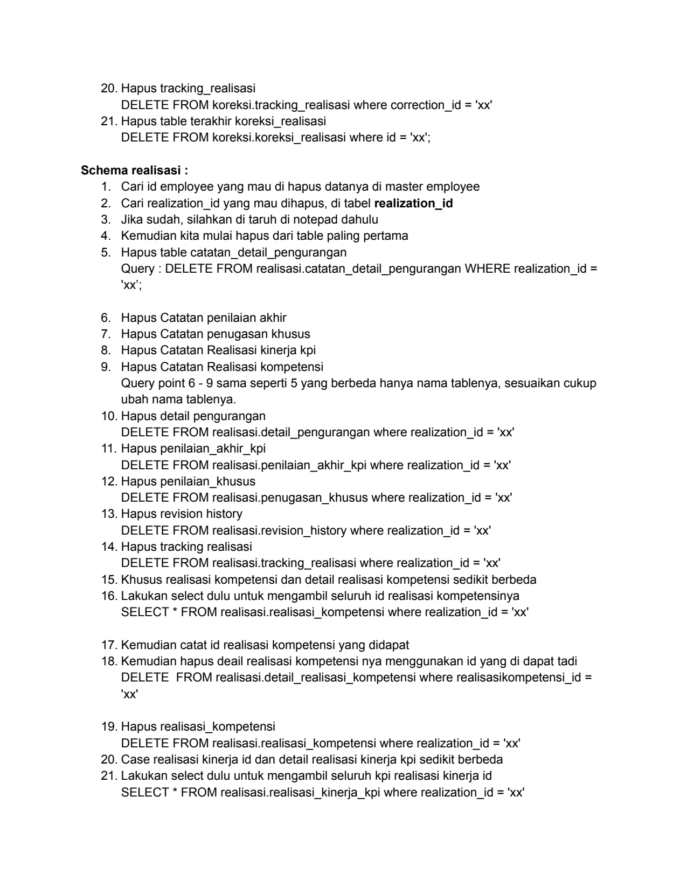
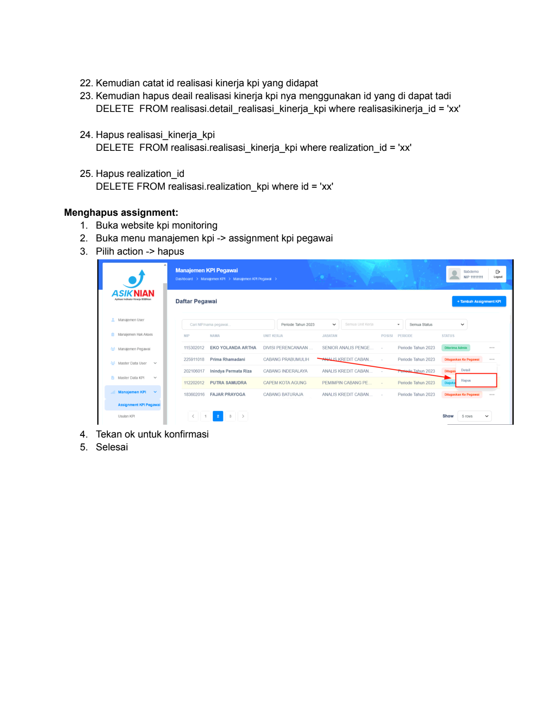

# Tutorial Hapus Data Kpi

> **Sumber:** [tutorial-hapus-data-kpi](https://docs.google.com/document/d/1QV2EH7P36Wn7sAC3pMSfpKwLJvMdyJZRQT4ZFFjQCjc/edit)

---

Tutorial untuk Hapus Data KPI Pegawai

Note: Sebelum melakukan penghapusan data, lakukan backup database terlebih dahulu.
Tujuannya, untuk mengantisipasi hal-hal yang tidak diinginkan terjadi seperti salah
menghapus data.

Dalam menghapus data KPI pegawai melalui database, berikut caranya:

Cara Pertama

    1. cari tahu nama container & nama db nya
    2. buka containernya :
    docker exec -it kpimonitoring-db bash
    3. pindah user ke postgres:
su - postgres
    4. buka psql:
    psql
    5. list database:
   \l
    6. connect ke database:
    \c nama db
    7. running querynya.

    Cara Kedua

    1. cari tahu nama container & nama db nya.
    2. untuk dump db :
    docker exec -t nama-container-db pg_dump -U manbantu_root -h 127.0.0.1
    nama-database > dump.sql
    4. masukkan database yang udah dibersihkan ke dalam laptop
    5. bersihkan data
    6. hasil db yang sudah selesai, akan di masukkan ke dalam container db lagi.
    7. untuk copy file ke dalam container :
    docker cp nama-db.sql kpimonitoring-db:.
    8. restore database
    psql -U postgres -h 127.0.0.1 nama-db < nama-db.sql

---

Cara Ketiga

kita siapkan pgAdmin, atau tools sejenisnya, agar nanti tidak perlu backup/restore lagi secara
manual, jadi tinggal langsung ke tools tersebut dan hapus data2nya.

Table Terkait
Realisasi : seluruh table di schema realisasi
Koreksi : seluruh table di schema koreksi
Assignment:
-   kpi_kpiaspekpenilaianassignmenttracker : untuk tracking
-   kpi_kpiaspekpenilaianassignment_employee : untuk hapus kpi yang di assign ke
    karyawan
-   kpi_kpiaspekpenilaianassignment_aspekpenilaian : untuk hapus kpi yang di assign
-   kpi_kpiaspekpenilaianassignment : assignment

Urutan Hapus Data
1. Hapus data di schema koreksi dahulu
2. Hapus data di schema realisasi
3. Jika ingin menghapus assignment bisa dilanjutkan dengan hapus data yang ada di table
    assignment

---

Query Hapus Data
    Schema koreksi :
    1. Cari id employee yang mau di hapus datanya di master employee
    2. Cari realization_id yang mau dihapus, di tabel realization_id
    3. Cari koreksi id di table koreksi.koreksi_realisasi
    4. Hapus table catatan_detail_pengurangan
    Query : DELETE FROM koreksi.catatan_detail_pengurangan where correction_id = 'xx'

    5. Hapus Catatan penilaian akhir
    6. Hapus Catatan penugasan khusus
    7. Hapus Catatan Realisasi kinerja kpi
    8. Hapus Catatan Realisasi kompetensi
    Query point 6 - 9 sama seperti 5 yang berbeda hanya nama tablenya, sesuaikan cukup
    ubah nama tablenya.
    9. Hapus detail pengurangan
    Delete FROM koreksi.detail_pengurangan where correction_id = 'xx';
    10. Hapus detail realisasi kinerja
    delete FROM koreksi.detail_realisasi_kinerja_kpi where correction_id = 'xx';
    11. Hapus penilaian akhir
    DELETE FROM koreksi.penilaian_akhir_kpi where correction_id = 'xx'
    12. Hapus penugasan khusus
    DELETE FROM koreksi.penugasan_khusus where correction_id = 'xx'
    13. Hapus Realisasi kinerja
    DELETE FROM koreksi.realisasi_kinerja_kpi where correction_id = 'xx'
    14. Khusus realisasi kompetensi dan detail realisasi kompetensi sedikit berbeda
    15. Lakukan select dulu untuk mengambil seluruh id realisasi kompetensinya
    SELECT * FROM koreksi.realisasi_kompetensi where correction_id = 'xx'

    16. Kemudian catat id realisasi yang didapat
    SELECT     *
    FROM                                                                        62a

                 id                                        average_kompetensi
58d3fc39-b648-4ae3-926e-7246d1273032      PS               3.5714285714285716

    1 row     Edit,     Explain,      Export

      LECT     *
      M     "realisasi_kompetensi     where correction_id =
    17. Setelah dapat realisasi kompetensi id nya, silahkan ke table detail realisasi kompetensi
    18. Hapus detail realisasi kompetensi
    DELETE FROM koreksi.detail_realisasi_kompetensi where realisasikompetensi_id = 'xx'
    19. Hapus realisasi kompetensi
    DELETE FROM koreksi.realisasi_kompetensi where correction_id = 'xx'

---

20. Hapus tracking_realisasi
DELETE FROM koreksi.tracking_realisasi where correction_id = 'xx'
21. Hapus table terakhir koreksi_realisasi
DELETE FROM koreksi.koreksi_realisasi where id = 'xx';

Schema realisasi :
1. Cari id employee yang mau di hapus datanya di master employee
2. Cari realization_id yang mau dihapus, di tabel realization_id
3. Jika sudah, silahkan di taruh di notepad dahulu
4. Kemudian kita mulai hapus dari table paling pertama
5. Hapus table catatan_detail_pengurangan
Query : DELETE FROM realisasi.catatan_detail_pengurangan WHERE realization_id =
'xx';

6. Hapus Catatan penilaian akhir
7. Hapus Catatan penugasan khusus
8. Hapus Catatan Realisasi kinerja kpi
9. Hapus Catatan Realisasi kompetensi
Query point 6 - 9 sama seperti 5 yang berbeda hanya nama tablenya, sesuaikan cukup
ubah nama tablenya.
10. Hapus detail pengurangan
DELETE FROM realisasi.detail_pengurangan where realization_id = 'xx'
11. Hapus penilaian_akhir_kpi
DELETE FROM realisasi.penilaian_akhir_kpi where realization_id = 'xx'
12. Hapus penilaian_khusus
DELETE FROM realisasi.penugasan_khusus where realization_id = 'xx'
13. Hapus revision history
DELETE FROM realisasi.revision_history where realization_id = 'xx'
14. Hapus tracking realisasi
DELETE FROM realisasi.tracking_realisasi where realization_id = 'xx'
15. Khusus realisasi kompetensi dan detail realisasi kompetensi sedikit berbeda
16. Lakukan select dulu untuk mengambil seluruh id realisasi kompetensinya
SELECT * FROM realisasi.realisasi_kompetensi where realization_id = 'xx'

17. Kemudian catat id realisasi kompetensi yang didapat
18. Kemudian hapus deail realisasi kompetensi nya menggunakan id yang di dapat tadi
DELETE FROM realisasi.detail_realisasi_kompetensi where realisasikompetensi_id =
'xx'

19. Hapus realisasi_kompetensi
DELETE FROM realisasi.realisasi_kompetensi where realization_id = 'xx'
20. Case realisasi kinerja id dan detail realisasi kinerja kpi sedikit berbeda
21. Lakukan select dulu untuk mengambil seluruh kpi realisasi kinerja id
SELECT * FROM realisasi.realisasi_kinerja_kpi where realization_id = 'xx'

---

22. Kemudian catat id realisasi kinerja kpi yang didapat
23. Kemudian hapus deail realisasi kinerja kpi nya menggunakan id yang di dapat tadi
DELETE FROM realisasi.detail_realisasi_kinerja_kpi where realisasikinerja_id = 'xx'

24. Hapus realisasi_kinerja_kpi
DELETE FROM realisasi.realisasi_kinerja_kpi where realization_id = 'xx'

25. Hapus realization_id
   DELETE FROM realisasi.realization_kpi where id = 'xx'

Menghapus assignment:
1. Buka website kpi monitoring
2. Buka menu manajemen kpi -> assignment kpi pegawai
3. Pilih action -> hapus

Manajemen KPI Pegawai

ep

225611018   Prima Rhamadani       CABANG   PRABUMULI
202106017   Inindya PermataRiza   CABANG  INDERALAYA

 12202012   PUTRASAMUDRA          CAPEMKOTAAGUNG    periods          Tahun2023

 35602016   FAJAR   PRAYOGA       CABANG BATURAIA   ANALIS KREDI     Tahun 202  a

4. Tekan ok untuk konfirmasi
5. Selesai

---

