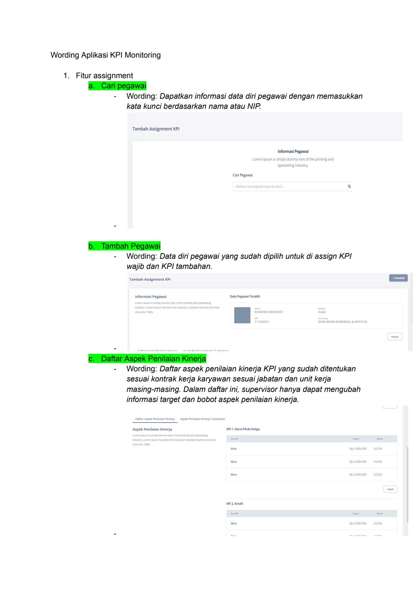
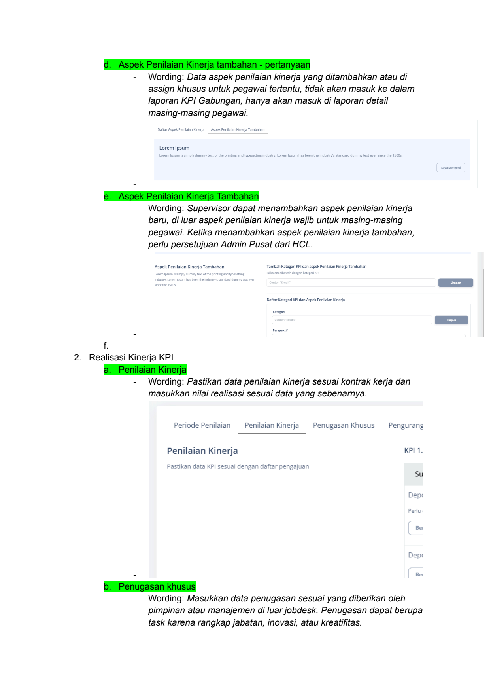
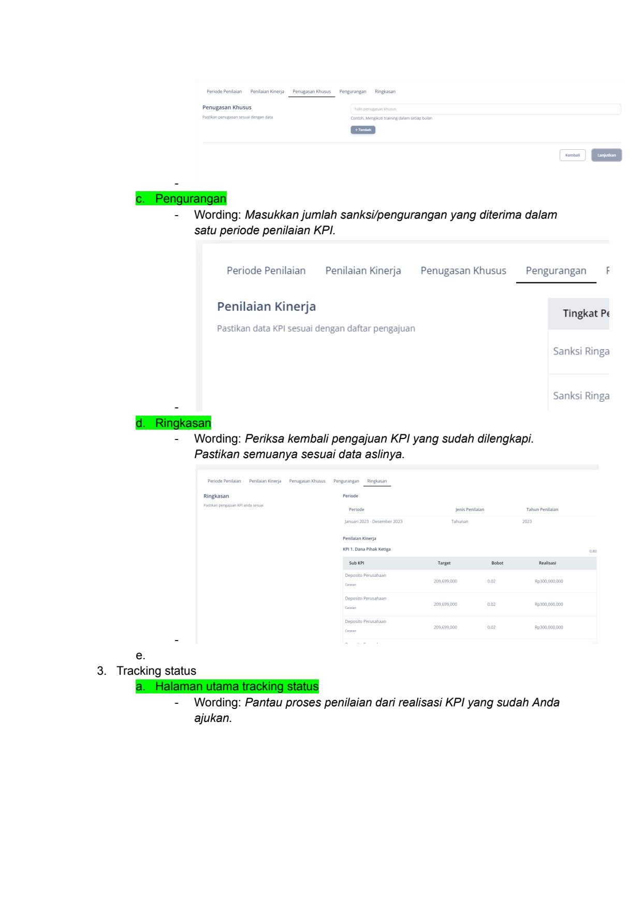
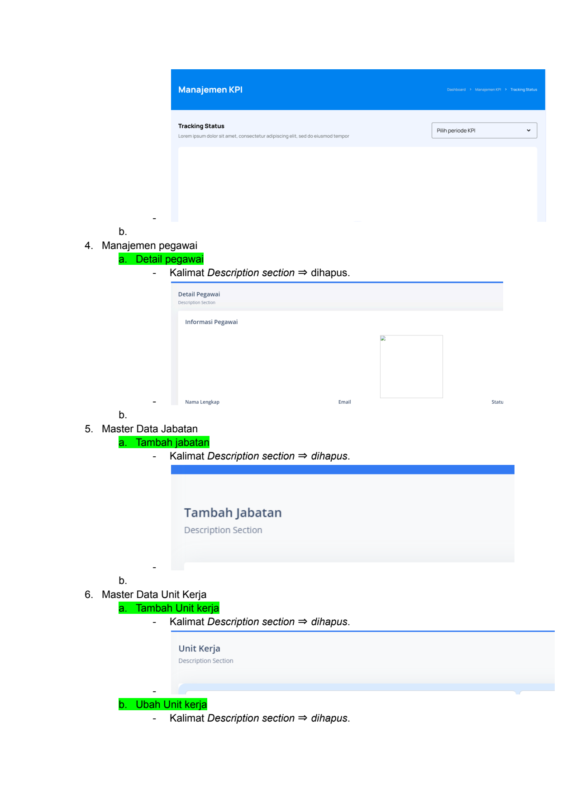
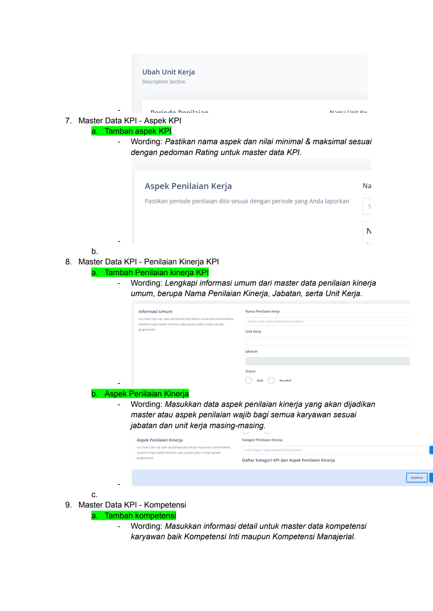

# Wording Aplikasi Kpi Monitoring

> **Sumber:** [wording-aplikasi-kpi-monitoring](https://docs.google.com/document/d/1FALt939rxCmm_6WkRDTdQY7Y5Q2aJHam4-gFDWRKCDE/edit)

---

Wording Aplikasi KPI Monitoring

    1. Fitur assignment
    a. Cari pegawai
    -   Wording: Dapatkan informasi data diri pegawai dengan memasukkan
        kata kunci berdasarkan nama atau NIP.

        Tambah Assignment KPI

            Informasi Pegaviai

            Cari Pegava

    -

    b. Tambah Pegawai
    -   Wording: Data diri pegawai yang sudah dipilih untuk di assign KPI
        wajib dan KPI tambahan.
Tambah Assignment KPI

  Informasi Pegawai        Data PegavalTerpith

    -
    c. Daftar Aspek Penilaian Kinerja
    -   Wording: Daftar aspek penilaian kinerja KPI yang sudah ditentukan
        sesuai kontrak kerja karyawan sesuai jabatan dan unit kerja
        masing-masing. Dalam daftar ini, supervisor hanya dapat mengubah
        informasi target dan bobot aspek penilaian kinerja.

        Penilaian Kinerja

        012

    -

---

d. Aspek Penilaian Kinerja tambahan - pertanyaan
    -   Wording: Data aspek penilaian kinerja yang ditambahkan atau di
        assign khusus untuk pegawai tertentu, tidak akan masuk ke dalam
        laporan KPI Gabungan, hanya akan masuk di laporan detail
        masing-masing pegawai.

        Lorem Ipsum

    -
    e. Aspek Penilaian Kinerja Tambahan
    -   Wording: Supervisor dapat menambahkan aspek penilaian kinerja
        baru, di luar aspek penilaian kinerja wajib untuk masing-masing
        pegawai. Ketika menambahkan aspek penilaian kinerja tambahan,
        perlu persetujuan Admin Pusat dari HCL.

        penilaian Kinerja Tambahan     Ktegr KP dan spe

              tar    Kater    KP dan

    -
    f.
    2. Realisasi Kinerja KPI
    a. Penilaian Kinerja
      -   Wording: Pastikan data penilaian kinerja sesuai kontrak kerja dan
          masukkan nilai realisasi sesuai data yang sebenarnya.

Periode Penilaian      Penilaian Kinerja ~~ Penugasan Khusus   ~~ Pengurang

         Penilaian Kinerja        KPI                                    1.
         Pastikan     data KPI sesuai dengan daftar pengajuan            Su

          Ber

      -                                                                 Ber
    b. Penugasan khusus
      -    Wording: Masukkan data penugasan sesuai yang diberikan oleh
           pimpinan atau manajemen di luar jobdesk. Penugasan dapat berupa
           task karena rangkap jabatan, inovasi, atau kreatifitas.

---

pengurangan

    Penugasan Khusus

    -
    c. Pengurangan
    -   Wording: Masukkan jumlah sanksi/pengurangan yang diterima dalam
satu periode penilaian KPI.

     Periode Penilaian    Penilaian Kinerja  ~~ Penugasan Khusus ~~ Pengurangan  F

     Penilaian Kinerja        Tingkat P¢
       pastikan data KPI sesuai dengan daftar pengajuan

            Sanksi     Ringa

    -        Sanksi     Ringa
    d. Ringkasan
    -    Wording: Periksa kembali pengajuan KPI yang sudah dilengkapi.
         Pastikan semuanya sesuai data aslinya.

         Ringkasan

         Target    fo

    -
    e.
    3. Tracking status
    a. Halaman utama tracking status
      -   Wording: Pantau proses penilaian dari realisasi KPI yang sudah Anda
          ajukan.

---

Manajemen KPI

Tracking Status    Pinperiode Ke!    -

-
b.
4. Manajemen pegawai
a. Detail pegawai
  - Kalimat Description section ⇒ dihapus.

    Detail Pegawai

    Informasi Pegawai

  -                                   emai    stu
b.
5. Master Data Jabatan
a. Tambah jabatan
  - Kalimat Description section ⇒ dihapus.

     Tambah Jabatan
     Description Section

  -
b.
6. Master Data Unit Kerja
a. Tambah Unit kerja
  -  Kalimat Description section ⇒ dihapus.

     Unit Kerja
     Description     Section

  -
b. Ubah Unit kerja
  -  Kalimat Description section ⇒ dihapus.

---

Ubah Unit Kerja
Description Section

-        Nama      Va
7. Master Data KPI - Aspek KPI
a. Tambah aspek KPI
-    Wording: Pastikan nama aspek dan nilai minimal & maksimal sesuai
     dengan pedoman Rating untuk master data KPI.

Aspek Penilaian Kerja    Na

pastikan periode penilaian diisi sesuai dengan periode yang An

          N
-
b.
8. Master Data KPI - Penilaian Kinerja KPI
a. Tambah Penilaian kinerja KPI
  -   Wording: Lengkapi informasi umum dari master data penilaian kinerja
      umum, berupa Nama Penilaian Kinerja, Jabatan, serta Unit Kerja.

      Informasi Umum        Nama Penta Keri

      Jbatan

  -
b. Aspek Penilaian Kinerja
  -   Wording: Masukkan data aspek penilaian kinerja yang akan dijadikan
      master atau aspek penilaian wajib bagi semua karyawan sesuai
      jabatan dan unit kerja masing-masing.

      Aspek penilaian Kinerja    tego      Kiera

           Dattar Kategori KPI dan Aspek enilaian Kinerja

  -        =
c.
9. Master Data KPI - Kompetensi
a. Tambah kompetensi
  -    Wording: Masukkan informasi detail untuk master data kompetensi
       karyawan baik Kompetensi Inti maupun Kompetensi Manajerial.

---

Tambah Kompetensi

Kompetensi Baru                                                    Nama Kompetensi

Ice cream tart oat cake shortbread jellybeans macaroon marshmallow.
Sesame snaps  halvah tiramisu cake jujubes jelly-0 cing cupcake
gingerbread.                                                       Jenis Kompetensi

-    Detail Komnetensi                                             Keterangan level 1
b.
10.

---

