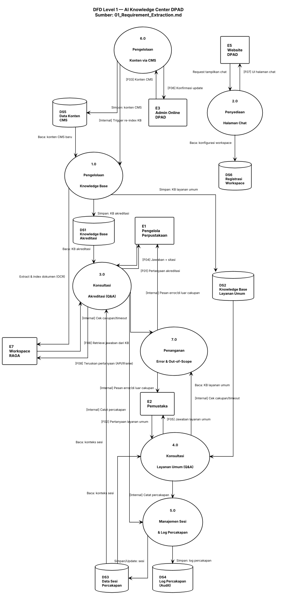

# DFD Level 1 — Diagram Dekomposisi
## AI Knowledge Center - DPAD DIY (Chatbot Konsultasi & Akreditasi Perpustakaan)

| Properti | Nilai |
|----------|-------|
| **Sistem** | AI Knowledge Center DPAD — Chatbot Konsultasi & Akreditasi Perpustakaan |
| **Sumber** | 01_Requirement_Extraction.md, 02_DFD_Level0.md |
| **Sub-Proses** | 7 proses (1.0 – 7.0) |
| **Data Store** | 7 stores (DS1 – DS7) |

---

## 1. Diagram (PlantUML)



---

## 2. Legenda / Notasi

| Simbol | Arti |
|--------|------|
| Rectangle | Entitas eksternal (E1–E7) |
| Usecase (oval) | Sub-proses sistem (1.0–7.0) |
| Database (silinder) | Data store (DS1–DS6) |
| Panah biasa | Aliran data eksternal atau akses data store (Baca/Simpan/Update) |
| Label "[Internal]" | Aliran data antar sub-proses di dalam sistem |

---

## 3. Tabel Deskripsi Sub-Proses

| ID | Nama | Deskripsi | Aktor Internal | Rujukan |
|----|------|-----------|----------------|---------|
| 1.0 | Pengelolaan Knowledge Base | Meng-extract dokumen instrumen akreditasi & materi layanan umum ke Dashboard RAGA via OCR; juga menerima trigger re-index dari konten CMS baru | Tim Internal / Sistem RAGA | P1 (Fase 1) |
| 2.0 | Penyediaan Halaman Chat | Menyediakan & menampilkan UI chatbot yang ditempel (embed) di Website DPAD, terhubung ke Workspace RAGA via API/Iframe | Sistem (Halaman Chat) | P2, P3, P4 (Fase 1) |
| 3.0 | Konsultasi Akreditasi (Q&A) | Menjawab pertanyaan seputar instrumen akreditasi berdasarkan knowledge base, dengan sitasi sumber dokumen | Workspace RAGA | P5 (Fase 1) |
| 4.0 | Konsultasi Layanan Umum (Q&A) | Menjawab pertanyaan umum layanan perpustakaan (jam buka, prosedur peminjaman, katalog) | Workspace RAGA | P6 (Fase 1) |
| 5.0 | Manajemen Sesi & Log Percakapan | Menjaga konteks percakapan dalam sesi aktif dan mencatat log percakapan untuk audit | Sistem (Session Manager) | P7, P8 (Fase 1) |
| 6.0 | Pengelolaan Konten via CMS | Menerima upload/update konten dari admin online melalui CMS di Website TLab, memicu re-index knowledge base | Admin Online / CMS RAGA | P9 (Fase 1) |
| 7.0 | Penanganan Error & Out-of-Scope | Mendeteksi pertanyaan di luar cakupan atau kegagalan/timeout Workspace RAGA, menampilkan pesan sesuai | Sistem (Error Handler) | P11, P12 (Fase 1) |

> **Catatan:** P10 (Pelatihan Penggunaan Sistem) dari Fase 1 tidak muncul sebagai sub-proses DFD karena merupakan aktivitas layanan/jasa (non-sistem, non-data-flow) — dicatat sebagai deliverable proyek, bukan proses pengolahan data. Tetap direferensikan di Use Case (Fase 5) dan FSD (Fase 7).

---

## 4. Matriks Akses Data Store

| Data Store | 1.0 | 2.0 | 3.0 | 4.0 | 5.0 | 6.0 | 7.0 |
|------------|-----|-----|-----|-----|-----|-----|-----|
| DS1 Knowledge Base Akreditasi | W | — | R | — | — | — | — |
| DS2 Knowledge Base Layanan Umum | W | — | — | R | — | — | — |
| DS3 Data Sesi Percakapan | — | — | R | R | R/W | — | — |
| DS4 Log Percakapan (Audit) | — | — | — | — | W | — | — |
| DS5 Data Konten CMS | — | — | — | — | — | W | — |
| DS6 Registrasi Workspace | — | R | — | — | — | — | — |

> DS7 (Data Peserta & Jadwal Pelatihan) tidak muncul di matriks karena terkait P10 (aktivitas non-sistem) — dikelola secara administratif, bukan diakses oleh sub-proses DFD.

---

## 5. Tabel Aliran Data per Proses

| Kode | Aliran | Proses Terkait | Deskripsi |
|------|--------|-----------------|-----------|
| F01 | Pertanyaan akreditasi | E1 → 3.0 | user_message dari pengelola perpustakaan |
| F02 | Pertanyaan layanan umum | E2 → 4.0 | user_message dari pemustaka |
| F03 | Konten CMS | E3 → 6.0 | cms_content (dokumen/teks) |
| F04 | Jawaban + sitasi | 3.0 → E1 | Jawaban teks + referensi dokumen |
| F05 | Jawaban layanan umum | 4.0 → E2 | Jawaban teks |
| F06 | Konfirmasi update | 6.0 → E3 | Notifikasi konten berhasil diperbarui |
| F07 | UI halaman chat | 2.0 → E5 | Tampilan chatbot ter-embed |
| F08 | Teruskan pertanyaan / retrieve jawaban | 3.0 ↔ E7 | Komunikasi API/Iframe dengan Workspace RAGA |

---

## 6. Tabel Aliran Antar-Proses

| Dari | Ke | Aliran Data | Pemicu |
|------|----|-----------|--------|
| 3.0 | 5.0 | [Internal] Catat percakapan akreditasi | Setiap jawaban chatbot dihasilkan (P3) |
| 4.0 | 5.0 | [Internal] Catat percakapan layanan umum | Setiap jawaban chatbot dihasilkan (P4) |
| 3.0 | 7.0 | [Internal] Cek cakupan/timeout | Pertanyaan diproses, sebelum jawaban final dikirim |
| 4.0 | 7.0 | [Internal] Cek cakupan/timeout | Pertanyaan diproses, sebelum jawaban final dikirim |
| 6.0 | 1.0 | [Internal] Trigger re-index knowledge base | Admin online submit konten baru via CMS |

---

## 7. Urutan Aliran Proses (Diagram ASCII)

### 7.1 Alur Utama — Konsultasi Akreditasi (Happy Path)

```
[E1 Pengelola]      [2.0 Halaman Chat]   [3.0 Konsultasi Akreditasi]   [E7 Workspace RAGA]   [DS1/DS3/DS4]
      │                     │                       │                        │                    │
      │──[F01] Pertanyaan──►│                       │                        │                    │
      │                     │──Teruskan pertanyaan─►│                        │                    │
      │                     │                       │──[F08] API/Iframe────►│                    │
      │                     │                       │                        │──Baca DS1 (KB)────►│
      │                     │                       │◄──Jawaban + sitasi────│                    │
      │                     │                       │──[Internal] Catat────────────────────────►│ (DS3, DS4)
      │◄──[F04] Jawaban─────│◄──────────────────────│                        │                    │
```

### 7.2 Alur CMS — Update Konten oleh Admin Online

```
[E3 Admin Online]    [6.0 Kelola Konten CMS]     [DS5]         [1.0 Kelola Knowledge Base]    [DS1/DS2]   [E7 RAGA]
      │                      │                       │                    │                      │            │
      │──[F03] Upload konten►│                       │                    │                      │            │
      │                      │──Simpan────────────────►│                    │                      │            │
      │                      │──[Internal] Trigger re-index──────────────►│                      │            │
      │                      │                       │                    │──Extract & index (OCR)──────────►│
      │                      │                       │                    │──Simpan KB ter-update────────────►│ (DS1/DS2)
      │◄──[F06] Konfirmasi───│                       │                    │                      │            │
```

### 7.3 Alur Error — Pertanyaan di Luar Cakupan / Timeout

```
[E1/E2 Pengguna]     [3.0/4.0 Konsultasi]     [7.0 Error Handler]
      │                      │                        │
      │──Pertanyaan─────────►│                        │
      │                      │──[Internal] Cek cakupan/timeout──►│
      │                      │                        │──Deteksi: di luar cakupan / RAGA timeout
      │◄────────────────────────Pesan error/di luar cakupan──────│
```

---

## 8. Batas Sistem dan Catatan

- **Batas sistem** mencakup sub-proses 1.0–7.0; entitas E1, E2, E3, E5, E7 berada di luar batas.
- Sub-proses 1.0 (Pengelolaan Knowledge Base) melibatkan dua pemicu: ekstraksi awal oleh Tim Internal (di luar cakupan DFD operasional harian) dan re-index otomatis dari CMS (6.0) — keduanya bermuara ke DS1/DS2.
- Sub-proses 3.0 dan 4.0 sengaja dipisah (bukan digabung jadi satu "Konsultasi Chatbot") karena sumber knowledge base berbeda (DS1 vs DS2) dan prioritas fitur berbeda (Tinggi vs Tinggi, tapi domain konten terpisah sesuai PRD Fitur 6 & 7).
- 7.0 (Error Handler) bersifat lintas-proses (cross-cutting) — dipanggil oleh 3.0 dan 4.0, bukan berdiri sendiri sebagai entry point.
- Item terbuka dari Fase 1 (peran Sibinakawan, user utama tunggal/ganda, regulasi data) belum tercermin sebagai elemen DFD terpisah — akan direvisi jika ada konfirmasi klien yang mengubah cakupan.

---

*Dokumen ini adalah output Fase 2 (DFD Level 1) dari pipeline System Analysis Guide. Lanjut ke Fase 3 (ERD Creation) menggunakan data store DS1–DS7 sebagai kandidat entitas.*
