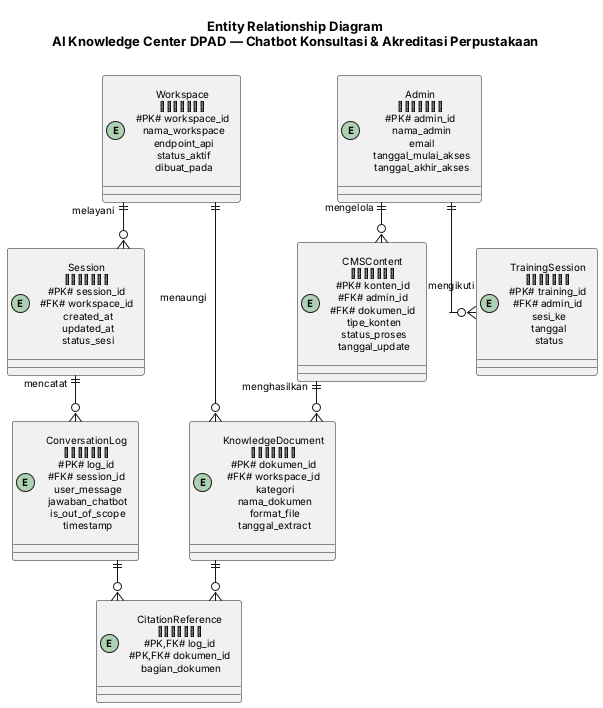

# ERD — AI Knowledge Center DPAD DIY
## Entity Relationship Diagram (Chatbot Konsultasi & Akreditasi Perpustakaan)

| Properti | Nilai |
|----------|-------|
| Sumber | 02_DFD_Level1.md (Data Store DS1–DS7), 01_Requirement_Extraction.md §4, §Saran Entitas ERD |
| Jumlah Data Store (DFD) | 7 |
| Jumlah Entitas Eksternal (DFD) | 7 |
| Entitas ERD Final | 7 |

---

## 1. Daftar Entitas (Kandidat dari DS)

### 1.1 Analisis Data Store sebagai Entitas

| Sumber (DS#) | Nama Data Store | Nama Entitas Konversi | Dasar |
|--------------|-----------------|----------------------|-------|
| DS1 | Data Knowledge Base Akreditasi | `KnowledgeDocument` (dengan atribut `kategori`) | Entitas dokumen inti — persisten, direferensikan berulang oleh jawaban chatbot |
| DS2 | Data Knowledge Base Layanan Umum | Digabung ke `KnowledgeDocument` (bukan entitas terpisah) | Struktur data identik dengan DS1 (dokumen ter-index); dibedakan lewat atribut `kategori` (akreditasi/layanan_umum), bukan tabel terpisah — menghindari duplikasi skema |
| DS3 | Data Sesi Percakapan | `Session` | Entitas transaksi — merepresentasikan satu interaksi percakapan pengguna |
| DS4 | Data Log Percakapan (Audit) | `ConversationLog` | Entitas anak dari `Session`; setiap baris = satu putaran tanya-jawab |
| DS5 | Data Konten CMS | `CMSContent` | Entitas dokumen — merekam aktivitas admin online mengelola konten, sumber bagi `KnowledgeDocument` |
| DS6 | Data Registrasi Workspace Chatbot DPAD | `Workspace` | Entitas konfigurasi — merepresentasikan instance Workspace RAGA yang menaungi seluruh knowledge base |
| DS7 | Data Peserta & Jadwal Pelatihan | `TrainingSession` | Entitas administratif — mencatat jadwal & status pelatihan admin online |

### 1.2 Analisis Entitas Eksternal sebagai Entitas

| Sumber (E#) | Nama Entitas | Termasuk sebagai Entitas ERD? | Dasar |
|--------------|-------------|------------------------------|-------|
| E1 | Pengelola Perpustakaan | TIDAK | Chatbot bersifat publik tanpa autentikasi (spec.md §Out of Scope) — tidak ada data profil pengguna yang disimpan; identitas hanya berupa `session_id` anonim di `Session` |
| E2 | Pemustaka | TIDAK | Sama seperti E1 — tidak ada login/profil tersimpan |
| E3 | Admin Online DPAD | **YA** — `Admin` | Entitas persisten yang perlu diidentifikasi untuk relasi kepemilikan `CMSContent` dan `TrainingSession` |
| E4 | Tim Internal / Tim Proyek | TIDAK | Aktor operasional proyek, bukan objek domain data yang disimpan sistem |
| E5 | Website DPAD | TIDAK | Platform hosting eksternal, bukan entitas data |
| E6 | Website TLab (CMS) | TIDAK | Platform hosting eksternal, direpresentasikan lewat `CMSContent` sebagai data yang dihasilkan di sana |
| E7 | Workspace Chatbot DPAD (RAGA) | TIDAK (sebagai entitas terpisah) | Direpresentasikan sebagai `Workspace` (dari DS6) — entitas konfigurasi, bukan entitas eksternal berulang |

### 1.3 Identifikasi Entitas Lemah

| Entitas Lemah | Bergantung pada | Alasan |
|----------------|-------------------|--------|
| `ConversationLog` | `Session` | Satu baris log tidak bermakna tanpa konteks sesi induknya; PK melibatkan referensi ke `session_id` |
| `TrainingSession` | `Admin` | Jadwal pelatihan tidak dapat eksis tanpa admin peserta yang terdaftar |

---

## 2. Definisi Atribut (per Entitas)

### 2.1 Klasifikasi Atribut

| Entitas | Atribut | Jenis | Tipe Data | Deskripsi |
|---------|---------|-------|-----------|-----------|
| Workspace | nama_workspace | Simple | VARCHAR(100) | Nama workspace RAGA (mis. "Workspace Chatbot DPAD") |
| Workspace | endpoint_api | Simple | VARCHAR(255) | URL endpoint API/Iframe |
| KnowledgeDocument | kategori | Simple | ENUM | 'akreditasi' / 'layanan_umum' — pembeda DS1/DS2 |
| KnowledgeDocument | isi_terindeks | Derived | TEXT | Hasil ekstraksi OCR, diturunkan dari file sumber |
| Session | durasi_aktif | Derived | INTERVAL | Dihitung dari `updated_at` − `created_at`, bukan disimpan eksplisit |
| ConversationLog | sumber_dokumen | Multi-valued | JSON/ARRAY | Satu jawaban bisa mengutip lebih dari satu `KnowledgeDocument` (lihat §3 relasi M:N) |
| Admin | nama_admin | Simple | VARCHAR(100) | Nama admin online DPAD |
| TrainingSession | jadwal_pelatihan | Composite | (tanggal, jam_mulai, jam_selesai) | Dipecah menjadi 3 kolom atomik di kamus data |

### 2.2 Tabel Atribut Utama per Entitas (Ringkas — Detail Lengkap di Fase 4 Data Dictionary)

| Entitas | Atribut Kunci (5–7 utama) |
|---------|------------------------------|
| Workspace | workspace_id (PK), nama_workspace, endpoint_api, status_aktif, dibuat_pada |
| KnowledgeDocument | dokumen_id (PK), workspace_id (FK), kategori, nama_dokumen, format_file, tanggal_extract |
| CMSContent | konten_id (PK), admin_id (FK), dokumen_id (FK, nullable), tipe_konten, status_proses, tanggal_update |
| Session | session_id (PK), workspace_id (FK), created_at, updated_at, status_sesi |
| ConversationLog | log_id (PK), session_id (FK), user_message, jawaban_chatbot, is_out_of_scope, timestamp |
| Admin | admin_id (PK), nama_admin, email, tanggal_mulai_akses, tanggal_akhir_akses |
| TrainingSession | training_id (PK), admin_id (FK), sesi_ke, tanggal, status |

---

## 3. Penugasan Primary Key & Identifier

| Entitas | PK | Candidate Keys | Referensi FK |
|--------|-----|----------------|--------------|
| Workspace | workspace_id | nama_workspace (UNIQUE) | — |
| KnowledgeDocument | dokumen_id | — | workspace_id (FK → Workspace) |
| CMSContent | konten_id | — | admin_id (FK → Admin), dokumen_id (FK → KnowledgeDocument, nullable saat submit pertama) |
| Session | session_id | — | workspace_id (FK → Workspace) |
| ConversationLog | log_id | — | session_id (FK → Session) |
| Admin | admin_id | email (UNIQUE) | — |
| TrainingSession | training_id | (admin_id, sesi_ke) UNIQUE | admin_id (FK → Admin) |

---

## 4. Identifikasi Relasi

### 4.1 Analisis Pola Akses Data Store (dari Matriks Akses DFD Level 1)

| Entitas A | Entitas B | Relasi | Bukti dari DFD |
|-----------|-----------|--------|---------------|
| Workspace | KnowledgeDocument | 1:N | Sub-proses 1.0 menulis banyak dokumen ke satu workspace (DS6 → DS1/DS2) |
| Workspace | Session | 1:N | Sub-proses 2.0/3.0/4.0 membaca konfigurasi workspace (DS6) untuk melayani banyak sesi percakapan (DS3) |
| Session | ConversationLog | 1:N | Sub-proses 5.0 menulis banyak entri log (DS4) untuk satu sesi aktif (DS3) |
| Admin | CMSContent | 1:N | Sub-proses 6.0: satu admin (E3) dapat mengunggah banyak entri konten (DS5) |
| CMSContent | KnowledgeDocument | 1:1 (opsional) atau 1:N | Sub-proses 6.0 → 1.0: satu entri CMSContent memicu re-index menjadi satu (atau beberapa, jika file di-split) KnowledgeDocument |
| Admin | TrainingSession | 1:N | P10 (Fase 1): satu admin mengikuti hingga maksimal 3 sesi pelatihan (DS7) — cardinality dibatasi oleh constraint bisnis, bukan skema |
| KnowledgeDocument | ConversationLog | **M:N** | Satu jawaban chatbot (ConversationLog) dapat mengutip lebih dari satu dokumen sumber (sitasi ganda); satu dokumen dapat dirujuk oleh banyak entri log — lihat §4.2 dan §5 (junction) |

### 4.2 Jenis Relasi

- **1:1**: Tidak ditemukan relasi 1:1 wajib pada model ini (CMSContent–KnowledgeDocument dianggap 1:N untuk mengakomodasi kemungkinan satu upload menghasilkan beberapa dokumen terindeks).
- **1:N**: Workspace→KnowledgeDocument, Workspace→Session, Session→ConversationLog, Admin→CMSContent, Admin→TrainingSession, CMSContent→KnowledgeDocument.
- **M:N**: KnowledgeDocument ↔ ConversationLog (relasi sitasi) — diselesaikan dengan tabel junction `CitationReference` (lihat §5).

### 4.3 Label Relasi

- `Workspace` **menaungi** `KnowledgeDocument` (1:N) — satu workspace menaungi banyak dokumen knowledge base.
- `Workspace` **melayani** `Session` (1:N) — satu workspace melayani banyak sesi percakapan.
- `Session` **mencatat** `ConversationLog` (1:N) — satu sesi mencatat banyak entri percakapan.
- `Admin` **mengelola** `CMSContent` (1:N) — satu admin mengelola banyak entri konten CMS.
- `CMSContent` **menghasilkan** `KnowledgeDocument` (1:N) — satu entri CMS memicu ekstraksi/index dokumen.
- `Admin` **mengikuti** `TrainingSession` (1:N, maks 3) — satu admin mengikuti hingga 3 sesi pelatihan.
- `KnowledgeDocument` **dikutip oleh** `ConversationLog` (M:N via `CitationReference`) — satu dokumen dikutip banyak jawaban; satu jawaban mengutip banyak dokumen.

---

## 5. Verifikasi Normalisasi

### 5.1 Checklist Bentuk Normal

- [x] **1NF** — Semua atribut atomik. `jadwal_pelatihan` (komposit) dipecah menjadi `tanggal`, `jam_mulai`, `jam_selesai` di `TrainingSession`. `sumber_dokumen` (multi-valued di `ConversationLog`) diselesaikan lewat tabel junction `CitationReference`, bukan disimpan sebagai array dalam satu kolom.
- [x] **2NF** — Tidak ada entitas dengan PK majemuk yang memiliki dependensi parsial; seluruh PK adalah surrogate key tunggal (kecuali `CitationReference` yang PK majemuknya (`log_id`, `dokumen_id`) — kedua atribut lain di tabel ini, jika ada, bergantung penuh pada kombinasi keduanya).
- [x] **3NF** — Tidak ada dependensi transitif. Contoh: `kategori` pada `KnowledgeDocument` tidak bergantung pada atribut non-key lain, hanya pada `dokumen_id`.

### 5.2 Penyelesaian Relasi M:N

| M:N Asli | Tabel Junction | Junction PK | FK 1 | FK 2 |
|----------|----------------|-------------|------|------|
| KnowledgeDocument ↔ ConversationLog | `CitationReference` | (log_id, dokumen_id) | log_id → ConversationLog | dokumen_id → KnowledgeDocument |

---

## 6. Diagram ERD (PlantUML)

---

## 7. Katalog Relasi

| Entitas A | Relasi | Entitas B | Tipe | Deskripsi |
|-----------|--------|-----------|------|------------|
| Workspace | menaungi | KnowledgeDocument | 1:N | Satu workspace RAGA menaungi seluruh dokumen knowledge base (akreditasi & layanan umum) |
| Workspace | melayani | Session | 1:N | Satu workspace melayani banyak sesi percakapan pengguna |
| Session | mencatat | ConversationLog | 1:N | Satu sesi mencatat banyak putaran tanya-jawab sebagai log audit |
| Admin | mengelola | CMSContent | 1:N | Satu admin online dapat mengunggah/mengubah banyak entri konten via CMS |
| CMSContent | menghasilkan | KnowledgeDocument | 1:N | Satu entri CMS memicu ekstraksi/index menjadi satu atau lebih dokumen knowledge base |
| Admin | mengikuti | TrainingSession | 1:N (maks 3) | Satu admin mengikuti hingga maksimal 3 sesi pelatihan @4 jam — cardinality dibatasi constraint bisnis (spec.md) |
| KnowledgeDocument | dikutip oleh | ConversationLog | M:N | Via `CitationReference` — satu dokumen dikutip di banyak jawaban, satu jawaban dapat mengutip banyak dokumen |

---

## 8. Schema Foreign Key

| Atribut FK | Merujuk ke Entitas | Atribut PK | ON DELETE | ON UPDATE |
|------------|-------------------|------------|-----------|-----------|
| workspace_id (dalam KnowledgeDocument) | Workspace | workspace_id | RESTRICT | CASCADE |
| workspace_id (dalam Session) | Workspace | workspace_id | RESTRICT | CASCADE |
| session_id (dalam ConversationLog) | Session | session_id | CASCADE | CASCADE |
| admin_id (dalam CMSContent) | Admin | admin_id | RESTRICT | CASCADE |
| dokumen_id (dalam CMSContent) | KnowledgeDocument | dokumen_id | SET NULL | CASCADE |
| admin_id (dalam TrainingSession) | Admin | admin_id | RESTRICT | CASCADE |
| log_id (dalam CitationReference) | ConversationLog | log_id | CASCADE | CASCADE |
| dokumen_id (dalam CitationReference) | KnowledgeDocument | dokumen_id | CASCADE | CASCADE |

> **Catatan ON DELETE:** `RESTRICT` dipakai pada relasi ke `Workspace` dan `Admin` agar penghapusan tidak sengaja tidak menghapus riwayat dokumen/konten/log secara beruntun. `CASCADE` dipakai pada `ConversationLog`→`Session` dan `CitationReference` karena log/sitasi tidak bermakna tanpa induknya (entitas lemah, lihat §1.3).

---

## 9. Catatan & Asumsi

1. **Tidak ada entitas `User`/`Pengguna` tersimpan** — konsisten dengan spec.md §Out of Scope ("Autentikasi/login pengguna... chatbot bersifat publik"). Identitas pengguna chatbot (E1/E2) hanya terwakili secara anonim via `session_id` di `Session`.
2. **`KnowledgeDocument` menggabungkan DS1 & DS2** — dibedakan lewat atribut `kategori` ('akreditasi'/'layanan_umum') alih-alih dua tabel terpisah, karena struktur datanya identik (hasil OCR terindeks) dan menghindari duplikasi skema. Perlu dikonfirmasi ulang di Fase 4 (Data Dictionary) apakah pemisahan fisik tetap diperlukan untuk kebutuhan RAGA TLab (di luar kendali skema proyek ini, karena data store secara fisik dikelola RAGA — lihat 01_Requirement_Extraction.md §4 catatan).
3. **`Admin` dan `TrainingSession` bersifat administratif**, bukan bagian dari alur data real-time chatbot — tetap dimodelkan karena FT-P9/FT-P10 (PRD Fase 1B) adalah fitur wajib dengan constraint terukur (1 admin, maks 3 sesi, maks 6 bulan akses).
4. **Constraint bisnis "maksimal 3 sesi pelatihan" dan "maksimal 6 bulan akses CMS"** tidak dapat dinyatakan sepenuhnya dalam skema relasional standar (butuh application-level validation atau CHECK constraint) — dicatat sebagai business rule untuk Fase 4 (Data Dictionary) dan Fase 7 (FSD), bukan struktur ERD.
5. **`CMSContent` → `KnowledgeDocument` sebagai 1:N (bukan 1:1)** mengasumsikan satu file upload berpotensi menghasilkan beberapa entri dokumen terindeks (mis. dokumen multi-bagian). Perlu divalidasi ke tim teknis RAGA TLab.
6. **Open item dari Fase 1** yang berdampak ke ERD: peran Sibinakawan (E8) — bila diaktifkan pada fase berikutnya, kemungkinan menambah entitas `ExternalSourceReference` atau memperluas `KnowledgeDocument` dengan atribut `sumber_asal`. Belum dimodelkan karena berstatus out of scope.
7. **`is_out_of_scope`** pada `ConversationLog` adalah flag boolean yang menandai jawaban jenis "di luar cakupan" (P11, Fase 1) — membantu analisis kualitas jawaban di kemudian hari meski fitur analitik/dashboard sendiri di luar cakupan proyek saat ini.

---

*Dokumen ini adalah output Fase 3 (ERD Creation) dari pipeline System Analysis Guide, disusun dari 02_DFD_Level1.md dan 01_Requirement_Extraction.md. Lanjut ke Fase 4 (Data Dictionary) untuk mendefinisikan tipe data, constraint, dan SQL DDL lengkap per entitas.*
