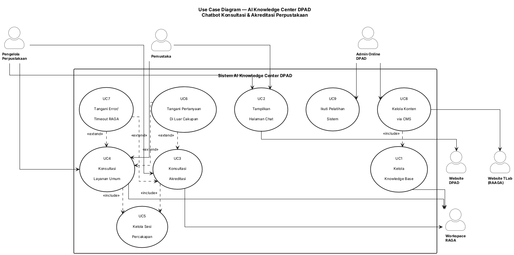

# DIAGRAM USE CASE — AI Knowledge Center DPAD DIY
## Chatbot Konsultasi & Akreditasi Perpustakaan

| Properti | Nilai |
|----------|-------|
| Sumber | 02_DFD_Level0.md, 02_DFD_Level1.md, 01B_PRD.md |
| Jumlah Aktor | 6 (5 primer/pendukung + 1 latar) |
| Jumlah Use Case | 8 |

---

## 1. Identifikasi Aktor (dari Entitas Eksternal DFD)

### 1.1 Petakan Entitas Eksternal ke Aktor

| Entitas DFD (E#) | Nama Aktor | Tipe Aktor | Peran dalam Sistem |
|-----------------|------------|------------|-------------------|
| E1 | Pengelola Perpustakaan | Primer | Bertanya seputar instrumen akreditasi & layanan umum |
| E2 | Pemustaka | Primer | Bertanya seputar layanan perpustakaan umum |
| E3 | Admin Online DPAD | Primer | Mengelola konten chatbot via CMS; peserta pelatihan |
| E5 | Website DPAD | Pendukung | Platform hosting tempat halaman chat ditampilkan |
| E6 | Website TLab (Knowledge AI RAAGA) | Pendukung | Platform hosting CMS |
| E7 | Workspace Chatbot DPAD (RAGA) | Pendukung | Engine RAG yang diakses via API/Iframe untuk menghasilkan jawaban |
| E4 | Tim Internal / Tim Proyek | Latar (Offstage) | Setup awal knowledge base, memberi pelatihan — tidak berinteraksi langsung dengan sistem runtime |

### 1.2 Klasifikasi Aktor

| Kategori | Aktor | Deskripsi |
|----------|-------|-----------|
| **Aktor Primer** | Pengelola Perpustakaan, Pemustaka, Admin Online DPAD | Memulai use case untuk mencapai tujuan (bertanya, kelola konten, ikut pelatihan) |
| **Aktor Pendukung** | Website DPAD, Website TLab, Workspace Chatbot DPAD (RAGA) | Menyediakan layanan/platform eksternal yang dikonsumsi sistem |
| **Aktor Latar** | Tim Internal / Tim Proyek | Berkepentingan (setup awal, pelatihan) tetapi tidak berinteraksi dengan sistem secara runtime/berulang |

### 1.3 Hierarki Aktor (Generalisasi)

```
Pengguna Chatbot (generalisasi)
  ├── Pengelola Perpustakaan (bertanya akreditasi + layanan umum)
  └── Pemustaka (bertanya layanan umum)
```

> Kedua aktor primer ini berbagi perilaku umum "Ajukan Pertanyaan ke Chatbot" dan "Terima Jawaban Chatbot" — dimodelkan sebagai use case bersama yang diakses keduanya, bukan generalisasi aktor formal di diagram (untuk menjaga diagram tetap ringkas, lihat §5).

---

## 2. Identifikasi Use Case (dari Proses DFD)

### 2.1 Petakan Proses ke Use Case

| Proses DFD (P#) | Nama Use Case | Deskripsi | Aktor Primer |
|------------------|---------------|------------|--------------|
| 1.0 | Kelola Knowledge Base | Extract & index dokumen ke Dashboard RAGA | Admin Online DPAD *(via CMS)*, Tim Internal *(setup awal)* |
| 2.0 | Tampilkan Halaman Chat | Render UI chatbot yang ditempel di Website DPAD | Pengelola Perpustakaan, Pemustaka |
| 3.0 | Konsultasi Akreditasi | Jawab pertanyaan seputar instrumen akreditasi + sitasi | Pengelola Perpustakaan |
| 4.0 | Konsultasi Layanan Umum | Jawab pertanyaan layanan perpustakaan umum | Pemustaka, Pengelola Perpustakaan |
| 5.0 | *(tidak dimodelkan sebagai UC terpisah)* | Manajemen sesi & log — perilaku pendukung, selalu terjadi bersama UC3/UC4 | — *(lihat §3.1 include)* |
| 6.0 | Kelola Konten via CMS | Admin unggah/update konten chatbot | Admin Online DPAD |
| 7.0 | *(tidak dimodelkan sebagai UC terpisah)* | Penanganan error/out-of-scope — perilaku kondisional dari UC3/UC4 | — *(lihat §3.2 extend)* |
| P10 *(non-DFD)* | Ikuti Pelatihan Sistem | Admin online mengikuti pelatihan penggunaan CMS & chatbot | Admin Online DPAD |

> Sub-proses 5.0 (Manajemen Sesi & Log) dan 7.0 (Penanganan Error) tidak dijadikan use case mandiri karena keduanya bukan tujuan yang diinisiasi aktor secara sadar — keduanya adalah perilaku sistem yang **selalu menyertai** (5.0 → `<<include>>`) atau **kadang muncul sebagai varian** (7.0 → `<<extend>>`) dari UC3/UC4. Ini konsisten dengan aturan "Jangan memodelkan akses data store sebagai use case terpisah" (§Aturan 2).

### 2.2 Rincian Use Case dari Proses

**1.0 Kelola Knowledge Base**
| Use Case | Deskripsi | Pemicu |
|----------|------------|--------|
| UC1 | Kelola Knowledge Base | Dokumen baru/update tersedia untuk di-extract ke RAGA |

**2.0 Tampilkan Halaman Chat**
| Use Case | Deskripsi | Pemicu |
|----------|------------|--------|
| UC2 | Tampilkan Halaman Chat | Pengguna membuka website DPAD dan mengakses menu chat |

**3.0 & 4.0 Konsultasi Chatbot**
| Use Case | Deskripsi | Pemicu |
|----------|------------|--------|
| UC3 | Konsultasi Akreditasi | Pengelola perpustakaan mengetik pertanyaan seputar akreditasi |
| UC4 | Konsultasi Layanan Umum | Pemustaka/pengelola mengetik pertanyaan layanan umum |
| UC5 | Kelola Sesi Percakapan *(include)* | Otomatis terjadi setiap kali UC3/UC4 dijalankan |
| UC6 | Tangani Pertanyaan Di Luar Cakupan *(extend)* | Kondisional — hanya jika pertanyaan terdeteksi di luar topik |
| UC7 | Tangani Error/Timeout RAGA *(extend)* | Kondisional — hanya jika Workspace RAGA down/timeout |

**6.0 Kelola Konten via CMS**
| Use Case | Deskripsi | Pemicu |
|----------|------------|--------|
| UC8 | Kelola Konten via CMS | Admin online login ke CMS dan mengunggah/mengubah konten |

**P10 Pelatihan (non-DFD, layanan)**
| Use Case | Deskripsi | Pemicu |
|----------|------------|--------|
| UC9 | Ikuti Pelatihan Sistem | Jadwal pelatihan (maks 3x @4 jam) disepakati dan dilaksanakan |

### 2.3 Konvensi Penamaan Use Case

Seluruh use case mengikuti pola frasa kata kerja + objek, maksimum 4 kata (Tampilkan Halaman Chat, Kelola Konten via CMS, dst.) — konsisten dengan konvensi pipeline.

---

## 3. Relasi Use Case

### 3.1 Relasi Include (`<<include>>`)

| Use Case Dasar | Use Case yang Ditambahkan | Alasan |
|---------------|---------------------------|--------|
| UC3 Konsultasi Akreditasi | UC5 Kelola Sesi Percakapan | Setiap konsultasi selalu memerlukan konteks sesi & pencatatan log (P7/P8, Fase 1) — wajib, bukan opsional |
| UC4 Konsultasi Layanan Umum | UC5 Kelola Sesi Percakapan | Sama seperti di atas — setiap jawaban chatbot selalu dicatat dalam sesi & log audit |

### 3.2 Relasi Extend (`<<extend>>`)

| Use Case Dasar | Use Case Ekstensi | Kondisi |
|---------------|-------------------|---------|
| UC3 Konsultasi Akreditasi | UC6 Tangani Pertanyaan Di Luar Cakupan | Jika pertanyaan terdeteksi di luar topik akreditasi/layanan perpustakaan |
| UC4 Konsultasi Layanan Umum | UC6 Tangani Pertanyaan Di Luar Cakupan | Sama — berlaku untuk kedua jalur konsultasi |
| UC3 Konsultasi Akreditasi | UC7 Tangani Error/Timeout RAGA | Jika Workspace RAGA tidak merespons dalam batas waktu (down/timeout) |
| UC4 Konsultasi Layanan Umum | UC7 Tangani Error/Timeout RAGA | Sama — berlaku untuk kedua jalur konsultasi |

### 3.3 Relasi Generalisasi

| Use Case Induk | Use Case Anak | Perbedaan |
|-----------------|----------------|------------|
| *(Tidak ada generalisasi use case formal)* | — | Model ini menggunakan generalisasi aktor (§1.3), bukan generalisasi use case — UC3 dan UC4 cukup berbeda dalam sumber knowledge base (DS1 vs DS2) untuk tetap dipisah sebagai use case independen, bukan varian dari satu use case induk |

---

## 4. Deskripsi Use Case

### UC1 — Kelola Knowledge Base

**Aktor:** Admin Online DPAD (via CMS, rutin) / Tim Internal (setup awal, sekali di awal proyek)
**Pemicu:** Dokumen instrumen akreditasi atau materi layanan umum baru/revisi tersedia
**Pre-kondisi:** Workspace Chatbot DPAD (RAGA) sudah dikonfigurasi (UC di luar cakupan operasional harian — bagian setup proyek)
**Post-kondisi:** Dokumen ter-index di knowledge base dan dapat dirujuk chatbot

**Alur Normal:**
1. Admin/Tim internal menyiapkan dokumen (PDF/Word/Excel)
2. Dokumen diunggah ke Dashboard RAGA (langsung oleh tim internal saat setup awal, atau via CMS oleh admin online setelah go-live)
3. RAGA mengekstrak isi dokumen menggunakan OCR
4. Dokumen terindeks ke knowledge base sesuai kategori (akreditasi/layanan umum)

**Alur Alternatif:**
- Update dokumen existing: dokumen versi lama ditandai usang, versi baru menggantikan sebagai sumber aktif

**Alur Pengecualian:**
- Dokumen berformat tidak didukung/corrupt → proses ekstraksi gagal, notifikasi error dikirim ke pengunggah

**Kebutuhan Data:**
- Input: I2 (Dokumen Instrumen Akreditasi), I3 (Materi Layanan Perpustakaan), I4 (Konten CMS)
- Output: Knowledge base terindeks
- Data Store: DS1, DS2 (`tbl_knowledge_document`)

**Aturan Bisnis:**
- Format file harus salah satu dari PDF, DOCX, DOC, XLSX, XLS (04_DataDictionary.md §6.1)
- Dokumen dengan status ekstraksi gagal tidak boleh dirujuk sebagai sumber jawaban chatbot

---

### UC2 — Tampilkan Halaman Chat

**Aktor:** Pengelola Perpustakaan, Pemustaka
**Pemicu:** Pengguna membuka website DPAD dan mengakses menu/halaman chat
**Pre-kondisi:** Halaman chat sudah ditempel (embed) di website DPAD dan Workspace RAGA aktif
**Post-kondisi:** UI chatbot tampil dan siap menerima pertanyaan; `session_id` baru dibuat

**Alur Normal:**
1. Pengguna membuka website DPAD
2. Pengguna mengakses menu/link menuju halaman chat
3. Halaman chat memuat UI chatbot, terhubung ke Workspace RAGA via API/Iframe
4. Sistem menampilkan pesan pembuka/instruksi penggunaan (O5)

**Alur Alternatif:**
- Tidak ada

**Alur Pengecualian:**
- Halaman chat gagal dimuat (error jaringan/API) → sistem menampilkan pesan fallback, bukan halaman kosong

**Kebutuhan Data:**
- Input: I5 (Konfigurasi Embed Halaman Chat)
- Output: O5 (Pesan Pembuka/Instruksi Penggunaan)
- Data Store: DS6 (`tbl_workspace`)

**Aturan Bisnis:**
- Halaman chat harus dapat ditempel tanpa mengubah arsitektur website DPAD secara signifikan (spec.md Constraints)

---

### UC3 — Konsultasi Akreditasi

**Aktor:** Pengelola Perpustakaan
**Pemicu:** Pengguna mengetik pertanyaan seputar instrumen akreditasi di halaman chat
**Pre-kondisi:** UC2 (Tampilkan Halaman Chat) sudah berjalan; knowledge base akreditasi (DS1) tersedia
**Post-kondisi:** Jawaban + sitasi sumber ditampilkan; percakapan tercatat dalam sesi & log

**Alur Normal:**
1. Pengelola perpustakaan mengetik pertanyaan (user_message)
2. Halaman chat meneruskan pertanyaan ke Workspace RAGA via API/Iframe (F08)
3. RAGA melakukan retrieval dari knowledge base akreditasi (DS1)
4. RAGA menghasilkan jawaban berbasis konteks yang ditemukan, disertai referensi dokumen sumber
5. Jawaban + sitasi ditampilkan ke pengguna (O1)
6. *«include»* UC5 Kelola Sesi Percakapan mencatat pasangan tanya-jawab ke log

**Alur Alternatif:**
- Pertanyaan lanjutan dalam sesi yang sama menggunakan konteks percakapan sebelumnya (US-04, spec.md)

**Alur Pengecualian:**
- *«extend»* UC6 — pertanyaan di luar cakupan akreditasi/layanan perpustakaan
- *«extend»* UC7 — Workspace RAGA timeout/tidak merespons

**Kebutuhan Data:**
- Input: I1 (Pertanyaan Pengguna), session_id
- Output: O1 (Jawaban + Sitasi Sumber)
- Data Store: DS1 (baca), DS3 (baca/tulis), DS4 (tulis), junction `tbl_citation_reference` (tulis)

**Aturan Bisnis:**
- Jawaban wajib bersumber dari dokumen resmi terindeks — dilarang mengarang jawaban (anti-halusinasi, spec.md Unwanted Behavior)
- Setiap jawaban yang merujuk instrumen akreditasi wajib menyertakan sitasi sumber (nama dokumen/bagian)

---

### UC4 — Konsultasi Layanan Umum

**Aktor:** Pemustaka, Pengelola Perpustakaan
**Pemicu:** Pengguna mengetik pertanyaan seputar layanan perpustakaan umum (jam buka, prosedur peminjaman, katalog)
**Pre-kondisi:** UC2 sudah berjalan; knowledge base layanan umum (DS2) tersedia
**Post-kondisi:** Jawaban ditampilkan; percakapan tercatat dalam sesi & log

**Alur Normal:**
1. Pengguna mengetik pertanyaan layanan umum
2. Halaman chat meneruskan pertanyaan ke Workspace RAGA via API/Iframe
3. RAGA melakukan retrieval dari knowledge base layanan umum (DS2)
4. RAGA menghasilkan jawaban teks
5. Jawaban ditampilkan ke pengguna (O2)
6. *«include»* UC5 mencatat percakapan ke log

**Alur Alternatif:**
- Tidak ada (jalur lebih sederhana dari UC3, tanpa kewajiban sitasi eksplisit)

**Alur Pengecualian:**
- *«extend»* UC6 — pertanyaan ambigu antara topik akreditasi vs layanan umum, chatbot mengklarifikasi maksud pengguna
- *«extend»* UC7 — Workspace RAGA timeout/tidak merespons

**Kebutuhan Data:**
- Input: I1 (Pertanyaan Pengguna), session_id
- Output: O2 (Jawaban Layanan Umum)
- Data Store: DS2 (baca), DS3 (baca/tulis), DS4 (tulis)

**Aturan Bisnis:**
- Pertanyaan ambigu (akreditasi vs layanan umum) wajib diklarifikasi sebelum dijawab (DFD Level 1 §Edge Case)

---

### UC5 — Kelola Sesi Percakapan *(included behavior)*

**Aktor:** *(Tidak diinisiasi aktor secara langsung — dipicu otomatis oleh UC3/UC4)*
**Pemicu:** Setiap kali UC3 atau UC4 dijalankan
**Pre-kondisi:** Sesi (`session_id`) sudah dibuat saat halaman chat dibuka (UC2)
**Post-kondisi:** Konteks sesi ter-update; entri baru tercatat di log percakapan

**Alur Normal:**
1. Sistem membaca konteks sesi aktif (jika ada pertanyaan lanjutan)
2. Sistem menyimpan pasangan pertanyaan-jawaban baru ke `tbl_conversation_log`
3. Sistem memperbarui `updated_at` pada `tbl_session`

**Alur Alternatif:**
- Sesi berakhir (refresh/tutup halaman) → konteks percakapan sebelumnya boleh hilang; sesi baru dimulai bersih (state-driven EARS, spec.md)

**Alur Pengecualian:**
- Tidak ada (perilaku pendukung, tidak menghasilkan jalur error tersendiri)

**Kebutuhan Data:**
- Input: session_id, user_message, jawaban_chatbot
- Output: Log tersimpan
- Data Store: DS3, DS4 (`tbl_session`, `tbl_conversation_log`)

**Aturan Bisnis:**
- Setiap percakapan wajib dicatat untuk audit & peningkatan kualitas jawaban (Ubiquitous EARS, spec.md)

---

### UC6 — Tangani Pertanyaan Di Luar Cakupan *(extending behavior)*

**Aktor:** *(Dipicu kondisional dari UC3/UC4)*
**Pemicu:** Pertanyaan pengguna terdeteksi di luar topik layanan perpustakaan/akreditasi
**Pre-kondisi:** UC3 atau UC4 sedang berjalan
**Post-kondisi:** Pesan "di luar cakupan" ditampilkan; `is_out_of_scope = TRUE` tercatat di log

**Alur Normal:**
1. Sistem mendeteksi pertanyaan tidak relevan dengan knowledge base yang tersedia
2. Sistem menyampaikan bahwa topik di luar cakupan chatbot, tanpa mengarang jawaban
3. Entri log dicatat dengan flag `is_out_of_scope = TRUE`, tanpa sitasi dokumen

**Alur Alternatif:** Tidak ada
**Alur Pengecualian:** Tidak ada

**Kebutuhan Data:**
- Output: O3 (Pesan "Di Luar Cakupan")
- Data Store: DS4 (`tbl_conversation_log`, `is_out_of_scope = TRUE`)

**Aturan Bisnis:**
- Baris `tbl_citation_reference` tidak boleh dibuat untuk log dengan `is_out_of_scope = TRUE` (04_DataDictionary.md §2.6)

---

### UC7 — Tangani Error/Timeout RAGA *(extending behavior)*

**Aktor:** *(Dipicu kondisional dari UC3/UC4)*
**Pemicu:** Workspace Chatbot DPAD (RAGA) tidak merespons dalam batas waktu, atau sedang downtime
**Pre-kondisi:** UC3 atau UC4 sedang berjalan
**Post-kondisi:** Pesan error/timeout ditampilkan; pengguna disarankan mencoba lagi

**Alur Normal:**
1. Sistem menunggu respons dari Workspace RAGA melewati batas waktu yang ditentukan
2. Sistem menampilkan pesan error yang informatif, bukan tampilan kosong/hang
3. Sistem menyarankan pengguna mencoba kembali

**Alur Alternatif:** Tidak ada
**Alur Pengecualian:** Tidak ada — ini sendiri adalah jalur pengecualian dari UC3/UC4

**Kebutuhan Data:**
- Output: O4 (Pesan Error/Timeout)
- Data Store: DS4 (opsional — dicatat dengan flag `is_error = TRUE`)

**Aturan Bisnis:**
- Landing page harus menampilkan status jelas saat Workspace RAGA tidak dapat diakses (graceful degradation, spec.md Non-Functional Requirements)

---

### UC8 — Kelola Konten via CMS

**Aktor:** Admin Online DPAD
**Pemicu:** Admin online memiliki dokumen/konten baru atau revisi yang perlu diperbarui
**Pre-kondisi:** Admin online memiliki akses CMS aktif (belum melewati masa 6 bulan)
**Post-kondisi:** Konten tersimpan, memicu re-index ke knowledge base; admin menerima konfirmasi

**Alur Normal:**
1. Admin online login ke CMS di website TLab
2. Admin mengunggah/mengubah konten (dokumen atau teks)
3. Sistem menyimpan entri konten dan memicu proses re-index (→ UC1)
4. Sistem menampilkan konfirmasi bahwa konten berhasil diperbarui (O6)

**Alur Alternatif:**
- Update konten existing menggantikan versi lama sebagai sumber aktif

**Alur Pengecualian:**
- Dokumen tidak didukung/corrupt → notifikasi error ke admin, `status_proses = 'GAGAL'`
- Masa akses CMS (6 bulan) telah berakhir → sistem menolak login dengan pesan status akses tidak berlaku *(mekanisme pasti perlu klarifikasi — Open Item)*

**Kebutuhan Data:**
- Input: I4 (Konten CMS)
- Output: O6 (Konfirmasi Update Konten)
- Data Store: DS5 (`tbl_cms_content`), memicu tulis ke DS1/DS2

**Aturan Bisnis:**
- Akses CMS (`INSERT` ke `tbl_cms_content`) hanya berlaku selama `Admin.tanggal_akhir_akses` belum terlampaui (04_DataDictionary.md §2.3)
- Hanya 1 admin aktif yang didukung pada fase ini (constraint bisnis, divalidasi di level aplikasi)

---

### UC9 — Ikuti Pelatihan Sistem

**Aktor:** Admin Online DPAD (peserta), Tim Internal (pemberi pelatihan — aktor latar, tidak dimodelkan di diagram)
**Pemicu:** Jadwal pelatihan disepakati (biasanya menjelang atau setelah go-live)
**Pre-kondisi:** Admin online telah ditentukan identitasnya (Open Item, 01_Requirement_Extraction.md #5)
**Post-kondisi:** Admin online dinyatakan mampu mengoperasikan CMS & sistem chatbot secara mandiri

**Alur Normal:**
1. Jadwal 3x pertemuan @4 jam disepakati antara tim proyek dan DPAD
2. Sesi pelatihan ke-1 hingga ke-3 dilaksanakan (online/onsite — perlu konfirmasi)
3. Admin online dievaluasi kemampuannya mengoperasikan CMS & sistem pasca-pelatihan

**Alur Alternatif:**
- Sesi dijadwalkan ulang jika ada kendala jadwal (tidak mengubah total maksimal 3x sesi)

**Alur Pengecualian:**
- Permintaan pelatihan tambahan (>3 sesi atau >1 peserta) → dicatat sebagai di luar cakupan scope of work (spec.md §Out of Scope)

**Kebutuhan Data:**
- Input: Materi pelatihan, jadwal
- Output: O7 (Admin online kompeten)
- Data Store: DS7 (`tbl_training_session`)

**Aturan Bisnis:**
- Maksimal 3 sesi per admin, `sesi_ke BETWEEN 1 AND 3` (04_DataDictionary.md §6.1)
- Pelatihan diberikan untuk 1 orang admin online (Discovery Notes §3)

### 4.2 Tabel Deskripsi Use Case

| UC# | Use Case | Aktor | Pemicu | Skenario Sukses Utama |
|-----|----------|-------|--------|----------------------|
| UC1 | Kelola Knowledge Base | Admin Online DPAD, Tim Internal | Dokumen baru/revisi tersedia | Dokumen ter-extract & terindeks ke knowledge base |
| UC2 | Tampilkan Halaman Chat | Pengelola Perpustakaan, Pemustaka | Pengguna membuka website DPAD | UI chatbot tampil, sesi baru dibuat |
| UC3 | Konsultasi Akreditasi | Pengelola Perpustakaan | Pertanyaan akreditasi diketik | Jawaban + sitasi sumber ditampilkan |
| UC4 | Konsultasi Layanan Umum | Pemustaka, Pengelola Perpustakaan | Pertanyaan layanan umum diketik | Jawaban teks ditampilkan |
| UC5 | Kelola Sesi Percakapan | *(include, tanpa aktor langsung)* | UC3/UC4 dijalankan | Log percakapan tersimpan |
| UC6 | Tangani Pertanyaan Di Luar Cakupan | *(extend, tanpa aktor langsung)* | Pertanyaan di luar topik | Pesan keterbatasan cakupan ditampilkan |
| UC7 | Tangani Error/Timeout RAGA | *(extend, tanpa aktor langsung)* | RAGA down/timeout | Pesan error informatif ditampilkan |
| UC8 | Kelola Konten via CMS | Admin Online DPAD | Admin punya konten baru/update | Konten tersimpan & knowledge base ter-refresh |
| UC9 | Ikuti Pelatihan Sistem | Admin Online DPAD | Jadwal pelatihan disepakati | Admin online kompeten mengoperasikan sistem |

---

## 5. Diagram Use Case (PlantUML)



---

## 6. Definisi Batas Sistem

```
┌─────────────────────────────────────────────────────────┐
│   BATAS SISTEM: Sistem AI Knowledge Center DPAD          │
├─────────────────────────────────────────────────────────┤
│                                                         │
│  DI DALAM (Use case dikelola sistem):                  │
│  • UC1 Kelola Knowledge Base                            │
│  • UC2 Tampilkan Halaman Chat                            │
│  • UC3 Konsultasi Akreditasi                             │
│  • UC4 Konsultasi Layanan Umum                           │
│  • UC5 Kelola Sesi Percakapan                            │
│  • UC6 Tangani Pertanyaan Di Luar Cakupan                │
│  • UC7 Tangani Error/Timeout RAGA                        │
│  • UC8 Kelola Konten via CMS                             │
│  • UC9 Ikuti Pelatihan Sistem                            │
│                                                         │
├─────────────────────────────────────────────────────────┤
│                                                         │
│  DI LUAR (Aktor berinteraksi dengan sistem):           │
│  • Pengelola Perpustakaan (aktor primer)                 │
│  • Pemustaka (aktor primer)                              │
│  • Admin Online DPAD (aktor primer)                      │
│  • Website DPAD (aktor pendukung — hosting)              │
│  • Website TLab / Knowledge AI RAAGA (aktor pendukung)   │
│  • Workspace Chatbot DPAD / RAGA (aktor pendukung —      │
│    engine RAG existing, tidak dibangun ulang)            │
│  • Tim Internal / Tim Proyek (aktor latar — setup awal,  │
│    pemberi pelatihan, tidak berinteraksi runtime)         │
│  • Sibinakawan (di luar cakupan — belum aktif)           │
│                                                         │
└─────────────────────────────────────────────────────────┘
```

---

## 7. Matriks Aktor-Use Case

| Aktor | UC1 | UC2 | UC3 | UC4 | UC5 | UC6 | UC7 | UC8 | UC9 |
|-------|:---:|:---:|:---:|:---:|:---:|:---:|:---:|:---:|:---:|
| Pengelola Perpustakaan | ○ | ● | ● | ● | ○ | ○ | ○ | ○ | ○ |
| Pemustaka | ○ | ● | ○ | ● | ○ | ○ | ○ | ○ | ○ |
| Admin Online DPAD | ● | ○ | ○ | ○ | ○ | ○ | ○ | ● | ● |
| Website DPAD | ○ | ● | ○ | ○ | ○ | ○ | ○ | ○ | ○ |
| Website TLab (RAAGA) | ○ | ○ | ○ | ○ | ○ | ○ | ○ | ● | ○ |
| Workspace RAGA | ● | ○ | ● | ● | ○ | ○ | ● | ○ | ○ |
| Tim Internal / Tim Proyek | ● | ○ | ○ | ○ | ○ | ○ | ○ | ○ | ● |

● = Tanggung jawab utama, ○ = Keterlibatan sekunder/tidak langsung

---

## 8. Matriks Ketergantungan Use Case

| Use Case | Includes | Extends | Induk |
|---------|----------|---------|-------|
| UC3 Konsultasi Akreditasi | UC5 | — | — |
| UC4 Konsultasi Layanan Umum | UC5 | — | — |
| UC6 Tangani Pertanyaan Di Luar Cakupan | — | UC3, UC4 | — |
| UC7 Tangani Error/Timeout RAGA | — | UC3, UC4 | — |
| UC8 Kelola Konten via CMS | UC1 | — | — |

---

## 9. Catatan dan Asumsi

1. **UC5 dan UC6/UC7 tidak memiliki aktor langsung** di diagram — keduanya perilaku sistem yang dipicu secara otomatis (include) atau kondisional (extend) dari UC3/UC4, sesuai aturan "jangan memodelkan akses data store sebagai use case terpisah" namun tetap layak didokumentasikan karena punya alur & aturan bisnis tersendiri yang signifikan (anti-halusinasi, graceful degradation).
2. **UC9 (Ikuti Pelatihan Sistem)** dimodelkan sebagai use case meski tidak berasal dari DFD (P10 di Fase 1 sengaja dikeluarkan dari DFD karena bukan aliran data) — tetap relevan di level use case karena merupakan interaksi aktor (Admin Online DPAD) dengan "sistem" dalam pengertian luas (proyek/layanan), bukan hanya aplikasi runtime.
3. **Tim Internal / Tim Proyek** diklasifikasikan sebagai aktor latar (offstage) dan sengaja **tidak** dimasukkan ke diagram PlantUML (§5) agar diagram tetap ringkas sesuai batas 6–8 use case/aktor per halaman A4 — perannya di UC1 (setup awal) dan UC9 (pemberi pelatihan) tetap didokumentasikan di deskripsi use case (§4).
4. **UC1 melibatkan dua pemicu berbeda**: setup awal oleh Tim Internal (sekali di awal proyek) dan operasional rutin oleh Admin Online DPAD (via UC8, berkelanjutan selama masa CMS aktif). Keduanya digabung dalam satu use case karena hasil akhirnya sama (dokumen ter-index), dibedakan lewat aktor pemicu di alur normal.
5. **Sibinakawan (E8)** tidak muncul sebagai aktor karena statusnya out of scope pada fase ini — akan ditambahkan sebagai aktor pendukung baru jika integrasi disepakati di fase berikutnya.
6. **Open Item yang berdampak ke use case**: mekanisme penolakan akses saat masa CMS 6 bulan berakhir (UC8, alur pengecualian) dan mode pelatihan online/onsite (UC9) masih menunggu konfirmasi klien — ditandai eksplisit di deskripsi use case masing-masing.

---

*Dokumen ini adalah output Fase 5 (Use Case Creation) dari pipeline System Analysis Guide, disusun dari 02_DFD_Level0.md, 02_DFD_Level1.md, dan 01B_PRD.md. Lanjut ke Fase 6 (Activity Diagram) untuk mendetailkan alur langkah-per-langkah tiap use case, khususnya UC3, UC4, dan UC8.*
