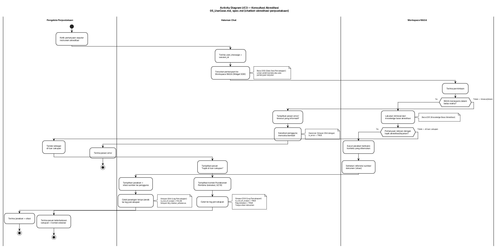
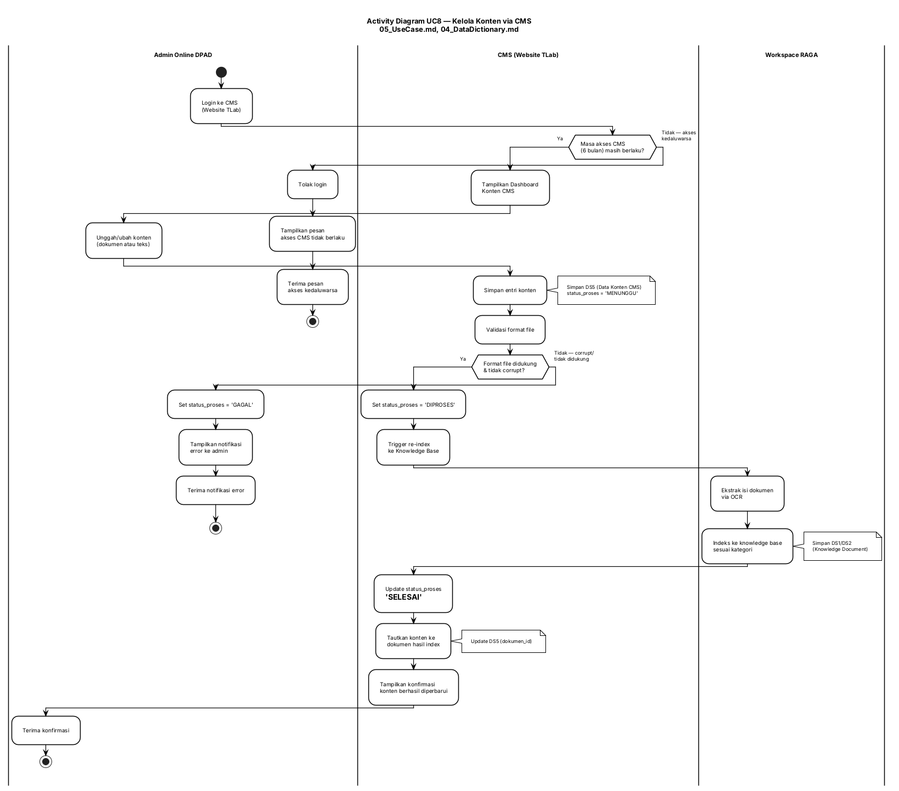
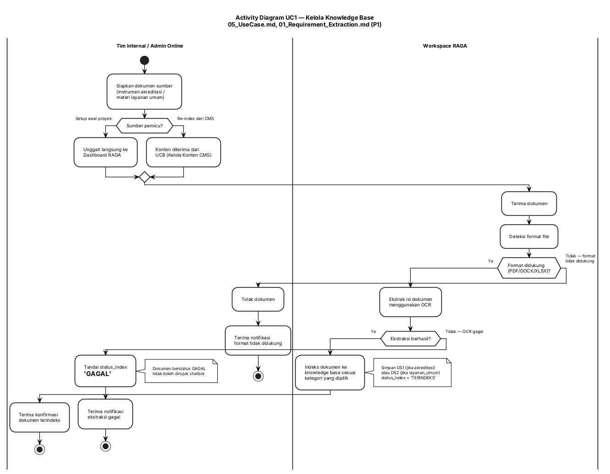

# DIAGRAM AKTIVITAS — AI Knowledge Center DPAD DIY
## Chatbot Konsultasi & Akreditasi Perpustakaan

| Properti | Nilai |
|----------|-------|
| Sumber | 05_UseCase.md, 02_DFD_Level1.md, 04_DataDictionary.md |
| Jumlah Diagram | 3 (AD-UC3, AD-UC8, AD-UC1) |
| Rata-rata Swimlane per Diagram | 3–4 |

---

## 1. Ringkasan

| ID Diagram | Use Case Sumber | Nama Proses | Alasan Dipilih |
|------------|------------------|-------------|-----------------|
| AD-UC3 | UC3 (+ include UC5, extend UC6/UC7) | Konsultasi Akreditasi | Alur paling kompleks — melibatkan retrieval, sitasi, dan 2 jalur pengecualian (out-of-scope, timeout) |
| AD-UC8 | UC8 (+ include UC1) | Kelola Konten via CMS | Melibatkan validasi akses time-bound (6 bulan) dan trigger re-index — aturan bisnis kritis |
| AD-UC1 | UC1 | Kelola Knowledge Base | Proses ekstraksi OCR dengan dua pemicu berbeda (setup awal vs re-index dari CMS) |

> UC2 (Tampilkan Halaman Chat) dan UC9 (Ikuti Pelatihan Sistem) tidak didiagramkan terpisah — UC2 bersifat linear tanpa titik keputusan berarti, dan UC9 adalah aktivitas administratif non-sistem yang cukup didokumentasikan sebagai deskripsi use case (05_UseCase.md §4).

---

## 2. AD-UC3 — Konsultasi Akreditasi

### 2.1 Diagram PlantUML



### 2.2 Metadata & Deskripsi

**AD-UC3 (Konsultasi Akreditasi)**

| Properti | Nilai |
|----------|-------|
| Swimlanes | Pengelola Perpustakaan, Halaman Chat, Workspace RAGA |
| Titik Keputusan | 2 (RAGA merespons dalam batas waktu?, Pertanyaan relevan dengan topik?) |
| Aktivitas Paralel | Tidak ada (alur sekuensial dengan percabangan) |
| Data Store | DS1 (baca), DS3 (baca/tulis), DS4 (tulis), `tbl_citation_reference` (tulis) |
| Referensi Sumber | spec.md Event-Driven & Unwanted Behavior EARS, 05_UseCase.md UC3/UC5/UC6/UC7/UC10 |

### 2.3 Rincian Aktivitas

| Urutan | Aktivitas | Aktor | Tipe | Data Store |
|--------|-----------|-------|------|------------|
| 1 | Ketik pertanyaan seputar instrumen akreditasi | Pengelola Perpustakaan | Tindakan | — |
| 2 | Terima user_message + session_id | Halaman Chat | Tindakan | — |
| 3 | Teruskan pertanyaan ke Workspace RAGA | Halaman Chat | Tindakan | DS3 (baca) |
| 4 | RAGA merespons dalam batas waktu? | Workspace RAGA | Keputusan | — |
| 5 | Lakukan retrieval dari knowledge base akreditasi | Workspace RAGA | Tindakan | DS1 (baca) |
| 6 | Pertanyaan relevan dengan topik? | Workspace RAGA | Keputusan | — |
| 7 | Susun jawaban + sertakan sitasi | Workspace RAGA | Tindakan | — |
| 8 | Tampilkan jawaban + sitasi | Halaman Chat | Tindakan | — |
| 9 | Catat ke log percakapan (sukses) | Halaman Chat | Tindakan | DS4 (tulis), citation (tulis) |
| 10 | Tampilkan pesan "di luar cakupan" | Halaman Chat | Tindakan | — |
| 11 | Tampilkan kontak Pustakawan Pembina (eskalasi, UC10) | Halaman Chat | Tindakan | — |
| 12 | Catat ke log percakapan (out-of-scope + eskalasi) | Halaman Chat | Tindakan | DS4 (tulis) |
| 13 | Tampilkan pesan error/timeout | Halaman Chat | Tindakan | — |

### 2.4 Ringkasan Alur Aktivitas

```
MULAI → Ketik Pertanyaan → Teruskan ke RAGA
  → [D1: RAGA merespons tepat waktu?]
      → [Tidak] → Tampilkan Error/Timeout → AKHIR
      → [Ya] → Retrieval Knowledge Base
          → [D2: Pertanyaan relevan?]
              → [Ya] → Susun Jawaban + Sitasi → Tampilkan → Catat Log → AKHIR
              → [Tidak] → Tampilkan "Di Luar Cakupan" → Tampilkan Kontak Pustakawan Pembina (eskalasi UC10) → Catat Log → AKHIR
```

---

## 3. AD-UC8 — Kelola Konten via CMS

### 3.1 Diagram PlantUML



### 3.2 Metadata & Deskripsi

**AD-UC8 (Kelola Konten via CMS)**

| Properti | Nilai |
|----------|-------|
| Swimlanes | Admin Online DPAD, CMS (Website TLab), Workspace RAGA |
| Titik Keputusan | 2 (Masa akses CMS masih berlaku?, Format file didukung & tidak corrupt?) |
| Aktivitas Paralel | Tidak ada |
| Data Store | DS5 (tulis/update), DS1/DS2 (tulis, via UC1 include) |
| Referensi Sumber | 04_DataDictionary.md §2.3/§2.4 (chk_admin_masa_akses), spec.md CMS path |

### 3.3 Rincian Aktivitas

| Urutan | Aktivitas | Aktor | Tipe | Data Store |
|--------|-----------|-------|------|------------|
| 1 | Login ke CMS | Admin Online DPAD | Tindakan | — |
| 2 | Masa akses CMS masih berlaku? | CMS | Keputusan | — |
| 3 | Unggah/ubah konten | Admin Online DPAD | Tindakan | — |
| 4 | Simpan entri konten (status: MENUNGGU) | CMS | Tindakan | DS5 (tulis) |
| 5 | Validasi format file | CMS | Tindakan | — |
| 6 | Format file didukung & tidak corrupt? | CMS | Keputusan | — |
| 7 | Trigger re-index ke Knowledge Base | CMS | Tindakan | — |
| 8 | Ekstrak isi dokumen via OCR & indeks | Workspace RAGA | Tindakan | DS1/DS2 (tulis) |
| 9 | Update status_proses = SELESAI | CMS | Tindakan | DS5 (update) |
| 10 | Tampilkan konfirmasi | CMS | Tindakan | — |
| 11 | Set status_proses = GAGAL, notifikasi error | CMS | Tindakan | DS5 (update) |
| 12 | Tolak login, tampilkan pesan kedaluwarsa | CMS | Tindakan | — |

### 3.4 Ringkasan Alur Aktivitas

```
MULAI → Login CMS
  → [D1: Akses masih berlaku?]
      → [Tidak] → Tolak Login → Pesan Kedaluwarsa → AKHIR
      → [Ya] → Unggah Konten → Simpan (MENUNGGU) → Validasi Format
          → [D2: Format valid?]
              → [Ya] → Trigger Re-index → Ekstrak OCR → Update (SELESAI) → Konfirmasi → AKHIR
              → [Tidak] → Set GAGAL → Notifikasi Error → AKHIR
```

---

## 4. AD-UC1 — Kelola Knowledge Base

### 4.1 Diagram PlantUML



### 4.2 Metadata & Deskripsi

**AD-UC1 (Kelola Knowledge Base)**

| Properti | Nilai |
|----------|-------|
| Swimlanes | Tim Internal / Admin Online, Workspace RAGA |
| Titik Keputusan | 3 (Sumber pemicu?, Format didukung?, Ekstraksi berhasil?) |
| Aktivitas Paralel | Tidak ada |
| Data Store | DS1 (tulis, kategori=akreditasi), DS2 (tulis, kategori=layanan_umum) |
| Referensi Sumber | 01_Requirement_Extraction.md P1, DFD Level 1 sub-proses 1.0 |

### 4.3 Rincian Aktivitas

| Urutan | Aktivitas | Aktor | Tipe | Data Store |
|--------|-----------|-------|------|------------|
| 1 | Siapkan dokumen sumber | Tim Internal / Admin Online | Tindakan | — |
| 2 | Sumber pemicu? (setup awal vs re-index CMS) | Tim Internal / Admin Online | Keputusan | — |
| 3 | Terima dokumen, deteksi format | Workspace RAGA | Tindakan | — |
| 4 | Format didukung? | Workspace RAGA | Keputusan | — |
| 5 | Ekstrak isi dokumen via OCR | Workspace RAGA | Tindakan | — |
| 6 | Ekstraksi berhasil? | Workspace RAGA | Keputusan | — |
| 7 | Tentukan kategori & indeks dokumen | Workspace RAGA | Tindakan | DS1 atau DS2 (tulis) |
| 8 | Tandai status_index = GAGAL | Workspace RAGA | Tindakan | DS1/DS2 (update) |
| 9 | Tolak dokumen (format tidak didukung) | Workspace RAGA | Tindakan | — |

### 4.4 Ringkasan Alur Aktivitas

```
MULAI → Siapkan Dokumen
  → [D1: Sumber pemicu?] → (setup awal / re-index CMS, keduanya lanjut ke bawah)
  → Terima Dokumen → Deteksi Format
      → [D2: Format didukung?]
          → [Tidak] → Tolak Dokumen → AKHIR
          → [Ya] → Ekstrak OCR
              → [D3: Ekstraksi berhasil?]
                  → [Ya] → Tentukan Kategori → Indeks ke KB → Konfirmasi → AKHIR
                  → [Tidak] → Tandai GAGAL → Notifikasi Gagal → AKHIR
```

---

## 5. Matriks Cross-Reference

### 5.1 Matriks Aktivitas-Swimlane (Gabungan 3 Diagram)

| Diagram | Aktor Primer | Sistem/Halaman Chat/CMS | Workspace RAGA |
|---------|:---:|:---:|:---:|
| AD-UC3 | ● | ● | ● |
| AD-UC8 | ● | ● | ○ |
| AD-UC1 | ● | — | ● |

● = swimlane utama dalam diagram, ○ = swimlane muncul sebagai partisipan sekunder, — = tidak muncul

### 5.2 Matriks Aktivitas-DataStore

| Diagram | DS1 | DS2 | DS3 | DS4 | DS5 |
|---------|:---:|:---:|:---:|:---:|:---:|
| AD-UC3 | R | — | R/W | W | — |
| AD-UC8 | W | W | — | — | R/W |
| AD-UC1 | W | W | — | — | — |

W = Tulis, R = Baca, R/W = Baca dan Tulis, — = Tidak diakses

### 5.3 Matriks Keputusan-Swimlane

| Keputusan | Diagram | Swimlane Pemilik | Hasil A | Hasil B |
|----------|---------|-------------------|---------|---------|
| RAGA merespons tepat waktu? | AD-UC3 | Workspace RAGA | Lanjut retrieval | Tampilkan error/timeout |
| Pertanyaan relevan dengan topik? | AD-UC3 | Workspace RAGA | Jawab + sitasi | Tampilkan di luar cakupan |
| Masa akses CMS masih berlaku? | AD-UC8 | CMS | Tampilkan dashboard | Tolak login |
| Format file didukung & tidak corrupt? | AD-UC8 | CMS | Trigger re-index | Set GAGAL |
| Sumber pemicu? | AD-UC1 | Tim Internal/Admin | Unggah langsung / dari CMS | (keduanya lanjut ke alur sama) |
| Format didukung? | AD-UC1 | Workspace RAGA | Ekstrak OCR | Tolak dokumen |
| Ekstraksi berhasil? | AD-UC1 | Workspace RAGA | Indeks ke KB | Tandai GAGAL |

---

## 6. Ringkasan

### 6.1 Total Titik Keputusan per Diagram

| Diagram | Jumlah Keputusan | Jumlah Aktivitas Paralel (Fork) |
|---------|---------------------|-----------------------------------|
| AD-UC3 | 2 | 0 |
| AD-UC8 | 2 | 0 |
| AD-UC1 | 3 | 0 |

> Tidak ada fork/join pada ketiga diagram — seluruh alur dalam sistem ini bersifat sekuensial dengan percabangan kondisional (if/else), konsisten dengan sifat sistem sebagai lapisan integrasi tipis yang meneruskan permintaan ke RAGA TLab satu per satu, bukan sistem dengan pemrosesan paralel majemuk.

### 6.2 Data Store yang Terlibat di Seluruh Diagram

```
Catatan: DS1 = Data Knowledge Base Akreditasi
         DS2 = Data Knowledge Base Layanan Umum
         DS3 = Data Sesi Percakapan
         DS4 = Data Log Percakapan (Audit)
         DS5 = Data Konten CMS
```

### 6.3 Catatan & Asumsi

1. **AD-UC8 mengasumsikan validasi masa akses CMS terjadi di titik login**, bukan di setiap aksi unggah — ini pilihan desain yang perlu dikonfirmasi ke tim teknis (alternatif: validasi ulang di setiap submit untuk sesi yang sudah lama terbuka).
2. **AD-UC1 menggabungkan dua pemicu** (setup awal oleh Tim Internal, operasional oleh Admin Online via CMS) dalam satu diagram karena logika pemrosesan di sisi RAGA identik — hanya sumber pemicu di swimlane awal yang berbeda.
3. **Tidak ada aktivitas paralel (fork/join)** ditemukan di ketiga proses inti — mencerminkan sifat sistem yang sederhana secara arsitektur (thin integration layer), bukan kekurangan analisis.
4. **Titik keputusan "Ekstraksi berhasil?" (AD-UC1)** dan "Format file didukung & tidak corrupt? (AD-UC8)" pada dasarnya menguji hal yang tumpang tindih — dipertahankan terpisah karena AD-UC8 menguji dari perspektif CMS (validasi awal sebelum trigger) sedangkan AD-UC1 menguji dari perspektif RAGA (hasil aktual proses OCR).
5. **Jalur eskalasi UC10** dimodelkan sebagai perluasan cabang "di luar cakupan" pada AD-UC3 — saat pertanyaan tidak relevan/tidak terjawab, sistem menampilkan pesan keterbatasan cakupan sekaligus kontak Pustakawan Pembina (eskalasi), lalu mencatat kejadian ke log dengan flag eskalasi = TRUE (mendukung metrik "jumlah eskalasi" KAK).
6. **UC11 (Monitoring Pemanfaatan Layanan)** tidak memiliki diagram aktivitas terpisah — merupakan use case analitik yang membaca log percakapan (DS3/DS4) dan ditangani sebagai dashboard, bukan alur proses runtime.

---

*Dokumen ini adalah output Fase 6 (Activity Diagram) dari pipeline System Analysis Guide, disusun dari 05_UseCase.md, 02_DFD_Level1.md, dan 04_DataDictionary.md. Lanjut ke Fase 7 (FSD — Functional Specification Document) yang mengonsolidasikan ERD, Activity Diagram, dan Use Case menjadi spesifikasi fungsional lengkap.*
