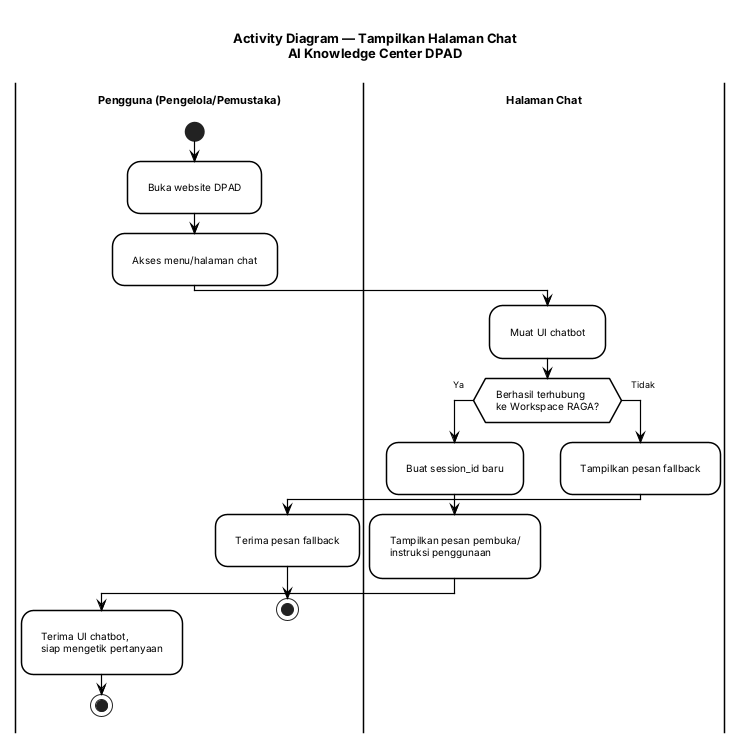
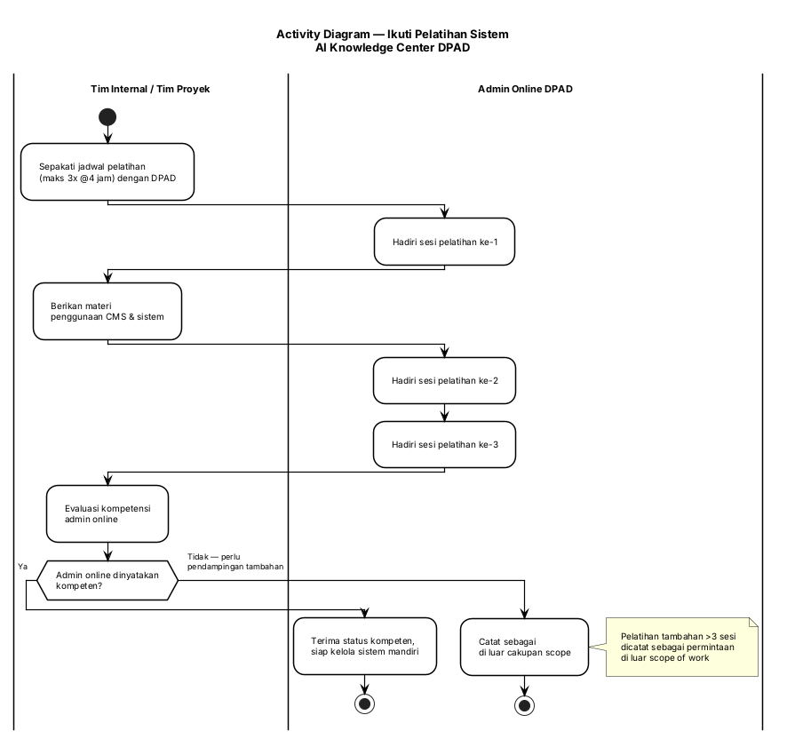

# Dokumen Spesifikasi Fungsional — AI Knowledge Center DPAD DIY
## Chatbot Konsultasi & Akreditasi Perpustakaan

---

## 1. Pendahuluan

### 1.1 Tujuan Dokumen

Dokumen Spesifikasi Fungsional (FSD) ini menyediakan informasi detail tentang bagaimana solusi AI Knowledge Center DPAD DIY akan berfungsi dan perilaku yang diminta. Dokumen ini dibuat berdasarkan persyaratan tingkat tinggi yang diidentifikasi dalam Discovery & Kick-off Notes, PRD & Feature Spec, dan Feature Spec (EARS) — serta menyediakan ketertelusuran pada spesifikasi fungsional kembali ke persyaratan bisnis tersebut. Termasuk dalam dokumen ini: use case detail, input dan output sistem, alur proses, diagram, dan spesifikasi tingkat bidang.

### 1.2 Lingkup Proyek

Proyek ini membangun lapisan integrasi (thin integration layer) yang menghubungkan RAGA TLab (engine RAG existing) dengan tiga titik akses: (1) halaman chat yang ditempel di website DPAD untuk konsultasi publik seputar layanan perpustakaan dan instrumen akreditasi, (2) CMS di website TLab (Knowledge AI RAAGA) bagi admin online DPAD untuk mengelola konten knowledge base, dan (3) pelatihan penggunaan sistem bagi admin online tersebut. Sistem tidak membangun engine RAG baru — seluruh kapabilitas retrieval dan generation bersumber dari RAGA TLab yang sudah ada.

### 1.3 Lingkup Dokumen

Dokumen ini mencakup seluruh 9 use case yang teridentifikasi pada Fase 5 (05_UseCase.md): UC1–UC9. Tidak ada FSD terpisah untuk sub-sistem lain — proyek ini cukup ringkas untuk dicakup dalam satu FSD tunggal.

### 1.4 Dokumen Terkait

| Komponen | Nama (dengan tautan ke dokumen) | Deskripsi |
|-----------|----------------------------------|-------------|
| Persyaratan | [01_Requirement_Extraction.md](01_Requirement_Extraction.md) | Ekstraksi persyaratan Fase 1 |
| PRD | [01B_PRD.md](01B_PRD.md) | Product Requirements Document (persona, fitur, user story) |
| DFD | [02_DFD_Level0.md](02_DFD_Level0.md), [02_DFD_Level1.md](02_DFD_Level1.md) | Diagram Aliran Data |
| ERD | [03_ERD.md](03_ERD.md) | Diagram Hubungan Entitas |
| Kamus Data | [04_DataDictionary.md](04_DataDictionary.md) | Kamus Data & SQL DDL |
| Use Case | [05_UseCase.md](05_UseCase.md) | Diagram Use Case |
| Aktivitas | [06_Activity_Diagram.md](06_Activity_Diagram.md) | Diagram Aktivitas (AD-UC3, AD-UC8, AD-UC1) |
| Discovery | [../../01-Discover/Discovery & Kick-off Notes - AI Knowledge Center DPAD.md](../../01-Discover/Discovery%20&%20Kick-off%20Notes%20-%20AI%20Knowledge%20Center%20DPAD.md) | Konteks bisnis, pain point, stakeholder |
| Feature Spec (EARS) | [../../02-Define/specs/features/chatbot-akreditasi-perpustakaan/spec.md](../../02-Define/specs/features/chatbot-akreditasi-perpustakaan/spec.md) | Spesifikasi fitur & acceptance criteria EARS |

### 1.5 Istilah/Akronim dan Definisi

| Istilah/Akronim | Definisi | Deskripsi |
|-----------------|----------|-------------|
| RAGA TLab | Retrieval-Augmented Generation Application | Aplikasi existing milik TLab yang menjadi engine chatbot & knowledge management |
| RAG | Retrieval-Augmented Generation | Teknik AI yang menggabungkan pencarian dokumen (retrieval) dengan generasi jawaban (generation) |
| Workspace Chatbot DPAD | — | Instance/ruang kerja khusus DPAD di dalam RAGA, terhubung ke knowledge base akreditasi & layanan umum |
| Halaman Chat | — | UI chatbot yang ditempel (embed) pada website DPAD existing |
| CMS | Content Management System | Antarmuka pengelolaan konten chatbot di website TLab (Knowledge AI RAAGA) |
| Admin Online | — | 1 orang staf DPAD yang diberi akses dan pelatihan mengelola konten chatbot |
| OCR | Optical Character Recognition | Teknologi ekstraksi teks dari dokumen PDF/Word/Excel |
| session_id | — | Identifier sesi percakapan untuk menjaga konteks tanya-jawab |
| Anti-halusinasi | — | Prinsip chatbot tidak mengarang jawaban di luar knowledge base yang tersedia |
| Sibinakawan | — | Sistem existing DPAD yang berpotensi menjadi sumber data/KMS tambahan (out of scope fase ini) |

### 1.6 Risiko dan Asumsi

| Kategori | Item | Dampak |
|----------|------|--------|
| Risiko | Timeline 1 bulan sejak kick-off (27 Agustus 2026) bersifat agresif untuk cakupan fitur final | Berpotensi menunda go-live atau memaksa pengurangan scope |
| Risiko | Kapasitas RAGA TLab menangani beban akses bersamaan belum divalidasi | Berpotensi timeout massal saat musim akreditasi (volume tinggi) |
| Risiko | Skema data logis di FSD ini (KnowledgeDocument, CMSContent, Workspace) mungkin tidak identik dengan skema aktual RAGA TLab | Perlu klarifikasi ke tim teknis RAGA sebelum implementasi |
| Asumsi | Dokumen instrumen akreditasi tersedia dalam format yang bisa di-extract ke RAGA (PDF/DOCX/XLSX) | Jika tidak, perlu konversi manual tambahan |
| Asumsi | Chatbot bersifat publik tanpa autentikasi pengguna akhir (E1/E2) | Konsisten dengan spec.md §Out of Scope |
| Asumsi | Hanya 1 admin online aktif pada fase ini | Sesuai Discovery Notes §3 — pelatihan untuk 1 orang |
| Komponen Pihak Ketiga | RAGA TLab (engine RAG) — komponen commercial/existing, bukan dibangun proyek ini | Ketergantungan penuh pada ketersediaan & kapabilitas RAGA TLab |

---

## 2. Tinjauan Sistem/Solusi

AI Knowledge Center DPAD DIY adalah layanan chatbot AI berbasis RAG yang membantu pengelola perpustakaan dan pemustaka mendapatkan jawaban cepat dan akurat seputar layanan perpustakaan serta instrumen akreditasi perpustakaan, tanpa harus menunggu konsultasi manual/tatap muka. Manfaat utama: mengurangi beban konsultasi tatap muka, mempercepat akses informasi akreditasi, dan memberi DPAD kemandirian mengelola konten chatbot melalui CMS setelah pelatihan.

### 2.1 Diagram Konteks

Lihat [02_DFD_Level0.md](02_DFD_Level0.md) untuk diagram PlantUML lengkap. Ringkasan: sistem berinteraksi dengan 6 entitas eksternal utama — Pengelola Perpustakaan (E1), Pemustaka (E2), Admin Online DPAD (E3), Website DPAD (E5), Website TLab/CMS (E6), dan Workspace Chatbot DPAD/RAGA (E7) — melalui 8 aliran data utama (F01–F08).

```
[E1 Pengelola Perpustakaan] ─┐
[E2 Pemustaka]               ├──► [Sistem: AI Knowledge Center DPAD] ◄──► [E7 Workspace RAGA]
[E3 Admin Online DPAD]      ─┘              │
                                              ▼
                                    [E5 Website DPAD] (halaman chat ter-embed)
                                    [E6 Website TLab] (CMS ter-embed)
```

### 2.2 Aktor Sistem

#### 2.2.1 Peran dan Tanggung Jawab Pengguna / Persyaratan Otoritas

| Peran/Pengguna | Contoh | Frekuensi Penggunaan | Keamanan/Akses, Fitur yang Digunakan | Catatan Tambahan |
|-----------|---------|------------------|--------------------------------|------------------|
| Pengelola Perpustakaan | Staf perpustakaan mempersiapkan akreditasi | Tinggi saat musim akreditasi | Publik, tanpa login — Konsultasi Akreditasi (UC3), Konsultasi Layanan Umum (UC4) | Aktor primer utama |
| Pemustaka | Pengguna layanan perpustakaan umum | Harian/insidental | Publik, tanpa login — Konsultasi Layanan Umum (UC4) | Aktor primer sekunder |
| Admin Online DPAD | 1 orang staf DPAD (identitas belum dikonfirmasi) | Berkala sesuai kebutuhan update konten | Login CMS — Kelola Konten (UC8), Kelola Knowledge Base (UC1) | Akses time-bound maksimal 6 bulan |
| Tim Internal / Tim Proyek | Tim proyek AI Knowledge Center | Sekali di awal (setup) + saat pelatihan | Akses langsung Dashboard RAGA — Kelola Knowledge Base (UC1), pemberi Pelatihan (UC9) | Aktor latar, tidak berinteraksi runtime |

#### 2.2.2 Deskripsi Aktor

| Aktor | Deskripsi | Interaksi dengan Sistem |
|-------|-------------|------------------------|
| Pengelola Perpustakaan | Staf perpustakaan yang mempersiapkan dokumen akreditasi dan melayani pemustaka | Mengetik pertanyaan di halaman chat; menerima jawaban + sitasi sumber |
| Pemustaka | Pengguna layanan perpustakaan (masyarakat umum) | Mengetik pertanyaan layanan umum di halaman chat; menerima jawaban teks |
| Admin Online DPAD | Staf DPAD yang ditunjuk mengelola konten chatbot | Login CMS; unggah/update dokumen; menerima konfirmasi update; mengikuti pelatihan |
| Website DPAD | Platform website resmi DPAD existing | Menghosting halaman chat yang ditempel (embed) |
| Website TLab (Knowledge AI RAAGA) | Platform CMS milik TLab | Menghosting antarmuka CMS untuk admin online |
| Workspace Chatbot DPAD (RAGA) | Instance engine RAG TLab khusus DPAD | Menerima pertanyaan via API/Iframe, melakukan retrieval & generation, mengembalikan jawaban |
| Tim Internal / Tim Proyek | Tim pelaksana proyek AI Knowledge Center | Setup awal knowledge base; memberi pelatihan kepada admin online |

### 2.3 Ketergantungan dan Dampak Perubahan

#### 2.3.1 Ketergantungan Sistem

- **RAGA TLab** — seluruh kapabilitas retrieval, generation, dan penyimpanan knowledge base bergantung penuh pada platform RAGA TLab existing. Sistem ini tidak berfungsi tanpa RAGA aktif.
- **Website DPAD existing** — halaman chat harus dapat ditempel tanpa mengubah arsitektur website secara signifikan (constraint spec.md).
- **Website TLab (Knowledge AI RAAGA)** — CMS disediakan di platform ini, bukan dibangun sebagai aplikasi terpisah.

#### 2.3.2 Dampak Perubahan

- **Website DPAD** — perlu penambahan menu/link/embed code untuk menampilkan halaman chat; dampak minimal terhadap struktur existing.
- **Tidak ada sistem lain DPAD yang terdampak langsung** pada fase ini — Sibinakawan secara eksplisit di luar cakupan (out of scope), sehingga tidak ada perubahan pada sistem tersebut.

---

## 3. Spesifikasi Fungsional

---

### 3.1 Kelola Knowledge Base

#### 3.1.1 Tujuan/Deskripsi

**Tujuan:** Memastikan dokumen instrumen akreditasi dan materi layanan umum tersedia sebagai knowledge base terindeks yang dapat dirujuk chatbot secara akurat.

**Deskripsi:** Use case ini mencakup ekstraksi dokumen via OCR ke Dashboard RAGA, baik saat setup awal proyek (oleh Tim Internal) maupun operasional rutin melalui CMS (oleh Admin Online, lihat UC8).

#### 3.1.2 Use Case

| | |
|-|-|
| **UC-1** | **Kelola Knowledge Base** |
| **Aktor Utama** | Tim Internal / Tim Proyek (setup awal), Admin Online DPAD (operasional, via UC8) |
| **Pemangku Kepentingan dan Minat** | DPAD (butuh knowledge base akurat), Pengelola Perpustakaan & Pemustaka (bergantung pada kualitas jawaban) |
| **Pemicu** | Dokumen instrumen akreditasi atau materi layanan umum baru/revisi tersedia |
| **Pre-kondisi** | Workspace Chatbot DPAD sudah dikonfigurasi (UC di luar cakupan operasional harian) |
| **Post-kondisi** | Dokumen ter-index di knowledge base dan dapat dirujuk chatbot |
| **Skenario Sukses Utama** | 1. Aktor menyiapkan dokumen (PDF/Word/Excel) 2. Dokumen diunggah ke Dashboard RAGA 3. RAGA mendeteksi format file 4. RAGA mengekstrak isi dokumen via OCR 5. RAGA menentukan kategori (akreditasi/layanan_umum) 6. RAGA mengindeks dokumen ke knowledge base N. TUJUAN TERCAPAI — dokumen terindeks & siap dirujuk |
| **Ekstensi** | Jika format tidak didukung, maka dokumen ditolak dan notifikasi dikirim. Jika ekstraksi OCR gagal, maka status_index ditandai GAGAL dan dokumen tidak dirujuk chatbot |
| **Prioritas** | Tinggi |
| **Persyaratan Khusus** | Sistem harus mendukung format PDF, DOCX, DOC, XLSX, XLS |
| **Pertanyaan Terbuka** | Cakupan detail instrumen akreditasi (versi/tahun, jenis perpustakaan) belum dikonfirmasi klien (01_Requirement_Extraction.md #3) |

#### 3.1.3 Diagram Aktivitas

Lihat [06_Activity_Diagram.md §4](06_Activity_Diagram.md#4-ad-uc1--kelola-knowledge-base) — AD-UC1, PlantUML lengkap dengan 3 titik keputusan (Sumber pemicu?, Format didukung?, Ekstraksi berhasil?).

#### 3.1.4 Persyaratan Fungsional

| ID Spesifikasi | Deskripsi Spesifikasi | Aturan Bisnis/Ketergantungan Data |
|---------|---------------------------|--------------------------------|
| FR-1.1 | Sistem harus menerima dokumen dalam format PDF, DOCX, DOC, XLSX, XLS | tbl_knowledge_document.format_file (CHECK constraint, 04_DataDictionary.md §6.1) |
| FR-1.2 | Sistem harus mengekstrak isi dokumen menggunakan OCR dan mengindeksnya sesuai kategori | tbl_knowledge_document.kategori IN ('akreditasi', 'layanan_umum') |
| FR-1.3 | Sistem harus menandai status_index = 'GAGAL' jika ekstraksi tidak berhasil, dan dokumen tersebut tidak boleh dirujuk sebagai sumber jawaban | tbl_knowledge_document.status_index |
| FR-1.4 | Sistem harus mengirim notifikasi error jika dokumen berformat tidak didukung/corrupt | — |

#### 3.1.5 Spesifikasi Tingkat Bidang

**Elemen Formulir (Form Upload Dokumen — bagian dari UC8 CMS, direferensikan di sini):**

| Call-out | Label Bidang | Kontrol UI | Wajib? | Dapat Diedit | Tipe Data | Set Nilai | Nilai Default | Contoh Data | Sumber Data |
|----------|-------------|------------|-------|----------|-----------|-----------|---------------|---------------|-------------|
| 1 | Pilih File Dokumen | File upload | Ya | Ya | File (PDF/DOCX/DOC/XLSX/XLS) | — | — | Instrumen Akreditasi 2026.pdf | Upload pengguna |
| 2 | Kategori Konten | Dropdown | Ya | Ya | Enum | [Akreditasi, Layanan Umum] | — | Akreditasi | Pilihan admin |

**Aturan dan Ketergantungan Bisnis Formulir:**

| Label Bidang | Validasi/Aturan Bisnis | Pesan Kesalahan | Ketergantungan Data | Info/Catatan Tambahan |
|-------------|---------------------------|---------------|-------------------|----------------------|
| Pilih File Dokumen | Format harus PDF/DOCX/DOC/XLSX/XLS | "Format file tidak didukung" | tbl_knowledge_document.format_file | Ukuran maksimum file belum ditentukan — perlu klarifikasi |
| Kategori Konten | Wajib salah satu dari dua nilai domain | "Kategori tidak valid" | tbl_knowledge_document.kategori | — |

**Tombol, Tautan, dan Ikon:**

| Label Tombol, Tautan, Ikon | Event OnClick | Event Lain | Terlihat | Aktif vs Dinonaktifkan | Navigasi Ke | Validasi | Ketergantungan |
|---------------------------|---------------|-------------|---------|---------------------|-------------|------------|--------------|
| Unggah & Proses | Kirim dokumen untuk diekstrak | OnHover: tooltip format didukung | Ya | Dinonaktifkan hingga file dipilih | Halaman status proses | Validasi format file | Bergantung pada koneksi ke Dashboard RAGA |

---

### 3.2 Tampilkan Halaman Chat

#### 3.2.1 Tujuan/Deskripsi

**Tujuan:** Menyediakan titik akses tunggal bagi Pengelola Perpustakaan dan Pemustaka untuk berinteraksi dengan chatbot, langsung dari website DPAD.

**Deskripsi:** Use case ini mencakup pemuatan UI chatbot yang ditempel (embed) di website DPAD dan inisialisasi sesi percakapan baru.

#### 3.2.2 Use Case

| | |
|-|-|
| **UC-2** | **Tampilkan Halaman Chat** |
| **Aktor Utama** | Pengelola Perpustakaan, Pemustaka |
| **Pemangku Kepentingan dan Minat** | DPAD (butuh titik akses publik yang mudah dijangkau) |
| **Pemicu** | Pengguna membuka website DPAD dan mengakses menu/halaman chat |
| **Pre-kondisi** | Halaman chat sudah ditempel (embed) di website DPAD dan Workspace RAGA aktif |
| **Post-kondisi** | UI chatbot tampil dan siap menerima pertanyaan; session_id baru dibuat |
| **Skenario Sukses Utama** | 1. Pengguna membuka website DPAD 2. Pengguna mengakses menu/link menuju halaman chat 3. Halaman chat memuat UI chatbot, terhubung ke Workspace RAGA 4. Sistem membuat session_id baru 5. Sistem menampilkan pesan pembuka/instruksi penggunaan N. TUJUAN TERCAPAI — pengguna siap mengetik pertanyaan |
| **Ekstensi** | Jika halaman chat gagal dimuat (error jaringan/API), maka sistem menampilkan pesan fallback, bukan halaman kosong |
| **Prioritas** | Tinggi |
| **Persyaratan Khusus** | Halaman chat harus dapat ditempel tanpa mengubah arsitektur website DPAD secara signifikan |
| **Pertanyaan Terbuka** | Tidak ada |

#### 3.2.3 Diagram Aktivitas



#### 3.2.4 Persyaratan Fungsional

| ID Spesifikasi | Deskripsi Spesifikasi | Aturan Bisnis/Ketergantungan Data |
|---------|---------------------------|--------------------------------|
| FR-2.1 | Sistem harus membuat session_id unik setiap kali halaman chat dibuka | tbl_session.session_id |
| FR-2.2 | Sistem harus menampilkan pesan pembuka/instruksi saat halaman chat pertama dibuka | — |
| FR-2.3 | Sistem harus menampilkan pesan fallback (bukan halaman kosong) jika koneksi ke Workspace RAGA gagal | — |

#### 3.2.5 Spesifikasi Tingkat Bidang

**Elemen Formulir:**

| Call-out | Label Bidang | Kontrol UI | Wajib? | Dapat Diedit | Tipe Data | Set Nilai | Nilai Default | Contoh Data | Sumber Data |
|----------|-------------|------------|-------|----------|-----------|-----------|---------------|---------------|-------------|
| 1 | Kotak Input Pertanyaan | Textbox (chat input) | Ya (saat submit) | Ya | Text | — | — | "Apa syarat akreditasi?" | Entry pengguna |

**Aturan dan Ketergantungan Bisnis Formulir:**

| Label Bidang | Validasi/Aturan Bisnis | Pesan Kesalahan | Ketergantungan Data | Info/Catatan Tambahan |
|-------------|---------------------------|---------------|-------------------|----------------------|
| Kotak Input Pertanyaan | Tidak boleh kosong saat submit | "Silakan ketik pertanyaan Anda" | tbl_conversation_log.user_message | — |

**Tombol, Tautan, dan Ikon:**

| Label Tombol, Tautan, Ikon | Event OnClick | Event Lain | Terlihat | Aktif vs Dinonaktifkan | Navigasi Ke | Validasi | Ketergantungan |
|---------------------------|---------------|-------------|---------|---------------------|-------------|------------|--------------|
| Kirim (ikon panah/send) | Kirim pertanyaan ke Workspace RAGA | OnHover: tooltip | Ya | Dinonaktifkan jika input kosong | Tetap di halaman chat, tampilkan jawaban | Validasi input tidak kosong | Bergantung pada UC3/UC4 |

---

### 3.3 Konsultasi Akreditasi

#### 3.3.1 Tujuan/Deskripsi

**Tujuan:** Memungkinkan Pengelola Perpustakaan mendapat jawaban cepat dan akurat seputar instrumen akreditasi, disertai referensi sumber dokumen resmi.

**Deskripsi:** Use case inti sistem — menerjemahkan pertanyaan bebas teks menjadi jawaban berbasis knowledge base akreditasi, dengan mekanisme anti-halusinasi dan penanganan error.

#### 3.3.2 Use Case

| | |
|-|-|
| **UC-3** | **Konsultasi Akreditasi** |
| **Aktor Utama** | Pengelola Perpustakaan |
| **Pemangku Kepentingan dan Minat** | DPAD (akurasi jawaban krusial untuk reputasi layanan), Workspace RAGA (penyedia jawaban) |
| **Pemicu** | Pengguna mengetik pertanyaan seputar instrumen akreditasi di halaman chat |
| **Pre-kondisi** | UC2 (Tampilkan Halaman Chat) sudah berjalan; knowledge base akreditasi tersedia |
| **Post-kondisi** | Jawaban + sitasi sumber ditampilkan; percakapan tercatat dalam sesi & log |
| **Skenario Sukses Utama** | 1. Pengelola perpustakaan mengetik pertanyaan 2. Halaman chat meneruskan pertanyaan ke Workspace RAGA via API/Iframe 3. RAGA melakukan retrieval dari knowledge base akreditasi 4. RAGA menghasilkan jawaban disertai referensi dokumen sumber 5. Jawaban + sitasi ditampilkan ke pengguna 6. Sistem mencatat pasangan tanya-jawab ke log percakapan (include UC5) N. TUJUAN TERCAPAI — pengguna mendapat jawaban akurat tanpa konsultasi manual |
| **Ekstensi** | Jika pertanyaan di luar cakupan akreditasi/layanan perpustakaan, maka UC6 (Tangani Pertanyaan Di Luar Cakupan) dijalankan. Jika Workspace RAGA timeout/tidak merespons, maka UC7 (Tangani Error/Timeout RAGA) dijalankan |
| **Prioritas** | Tinggi |
| **Persyaratan Khusus** | Jawaban wajib bersumber dari dokumen resmi terindeks — dilarang mengarang jawaban (anti-halusinasi) |
| **Pertanyaan Terbuka** | Waktu respons target < 5 detik p95 perlu divalidasi terhadap kapasitas RAGA TLab (spec.md §Non-Functional Requirements) |

#### 3.3.3 Diagram Aktivitas

Lihat [06_Activity_Diagram.md §2](06_Activity_Diagram.md#2-ad-uc3--konsultasi-akreditasi) — AD-UC3, PlantUML lengkap dengan 2 titik keputusan (RAGA merespons tepat waktu?, Pertanyaan relevan dengan topik?) dan 3 swimlane.

#### 3.3.4 Persyaratan Fungsional

| ID Spesifikasi | Deskripsi Spesifikasi | Aturan Bisnis/Ketergantungan Data |
|---------|---------------------------|--------------------------------|
| FR-3.1 | Sistem harus meneruskan user_message dan session_id ke Workspace RAGA via API/Iframe menggunakan HTTPS | tbl_session, komunikasi wajib HTTPS (NFR Security) |
| FR-3.2 | Sistem harus menampilkan jawaban disertai referensi sumber dokumen (nama dokumen/bagian) | tbl_citation_reference (junction M:N) |
| FR-3.3 | Sistem harus mempertahankan konteks percakapan selama sesi masih aktif | tbl_session.status_sesi = 'AKTIF' |
| FR-3.4 | Sistem harus mencatat setiap percakapan ke log untuk audit dan peningkatan kualitas | tbl_conversation_log |
| FR-3.5 | Sistem harus menampilkan waktu respons chatbot < 5 detik p95 untuk pertanyaan standar | *(target performa, perlu validasi kapasitas RAGA)* |

#### 3.3.5 Spesifikasi Tingkat Bidang

**Elemen Formulir:**

| Call-out | Label Bidang | Kontrol UI | Wajib? | Dapat Diedit | Tipe Data | Set Nilai | Nilai Default | Contoh Data | Sumber Data |
|----------|-------------|------------|-------|----------|-----------|-----------|---------------|---------------|-------------|
| 1 | Kotak Input Pertanyaan | Textbox (chat input) | Ya | Ya | Text | — | — | "Apa syarat akreditasi perpustakaan sekolah?" | Entry pengguna |
| 2 | Area Tampilan Jawaban | Read-only text block | — | Tidak | Text (rich) | — | — | "Berdasarkan Instrumen Akreditasi..." | tbl_conversation_log.jawaban_chatbot |
| 3 | Badge Sitasi Sumber | Link/badge | — | Tidak | Text | — | — | "Sumber: Instrumen Akreditasi 2026, Bab III" | tbl_citation_reference |

**Aturan dan Ketergantungan Bisnis Formulir:**

| Label Bidang | Validasi/Aturan Bisnis | Pesan Kesalahan | Ketergantungan Data | Info/Catatan Tambahan |
|-------------|---------------------------|---------------|-------------------|----------------------|
| Kotak Input Pertanyaan | Tidak boleh kosong | "Silakan ketik pertanyaan Anda" | tbl_conversation_log.user_message | — |
| Badge Sitasi Sumber | Hanya tampil jika kategori_jawaban = 'AKREDITASI' dan is_out_of_scope = FALSE | — | tbl_citation_reference | Tidak tampil untuk jawaban layanan umum (UC4) atau di luar cakupan |

**Tombol, Tautan, dan Ikon:**

| Label Tombol, Tautan, Ikon | Event OnClick | Event Lain | Terlihat | Aktif vs Dinonaktifkan | Navigasi Ke | Validasi | Ketergantungan |
|---------------------------|---------------|-------------|---------|---------------------|-------------|------------|--------------|
| Kirim | Kirim pertanyaan ke UC3 | OnHover: tooltip | Ya | Dinonaktifkan jika input kosong/sedang memuat jawaban | Tetap di halaman chat | Validasi input tidak kosong | Bergantung pada Workspace RAGA aktif |
| Badge Sitasi Sumber (klik) | Tampilkan detail dokumen sumber (opsional) | — | Ya, jika ada sitasi | Aktif | Modal/tooltip detail sumber | — | Bergantung pada FR-3.2 |

---

### 3.4 Konsultasi Layanan Umum

#### 3.4.1 Tujuan/Deskripsi

**Tujuan:** Memungkinkan Pemustaka (dan Pengelola Perpustakaan) mendapat informasi cepat seputar layanan perpustakaan umum tanpa datang langsung.

**Deskripsi:** Struktural identik dengan UC3, namun bersumber dari knowledge base layanan umum (bukan akreditasi) dan tidak mewajibkan sitasi eksplisit.

#### 3.4.2 Use Case

| | |
|-|-|
| **UC-4** | **Konsultasi Layanan Umum** |
| **Aktor Utama** | Pemustaka, Pengelola Perpustakaan |
| **Pemangku Kepentingan dan Minat** | DPAD (mengurangi beban layanan tatap muka) |
| **Pemicu** | Pengguna mengetik pertanyaan seputar layanan perpustakaan umum (jam buka, prosedur peminjaman, katalog) |
| **Pre-kondisi** | UC2 sudah berjalan; knowledge base layanan umum tersedia |
| **Post-kondisi** | Jawaban ditampilkan; percakapan tercatat dalam sesi & log |
| **Skenario Sukses Utama** | 1. Pengguna mengetik pertanyaan layanan umum 2. Halaman chat meneruskan pertanyaan ke Workspace RAGA 3. RAGA melakukan retrieval dari knowledge base layanan umum 4. RAGA menghasilkan jawaban teks 5. Jawaban ditampilkan ke pengguna 6. Sistem mencatat percakapan ke log (include UC5) N. TUJUAN TERCAPAI |
| **Ekstensi** | Jika pertanyaan ambigu antara topik akreditasi vs layanan umum, maka UC6 dijalankan untuk klarifikasi. Jika Workspace RAGA timeout, maka UC7 dijalankan |
| **Prioritas** | Tinggi |
| **Persyaratan Khusus** | Tidak ada kewajiban sitasi eksplisit (berbeda dari UC3) |
| **Pertanyaan Terbuka** | Tidak ada |

#### 3.4.3 Diagram Aktivitas

Struktural identik dengan [AD-UC3](06_Activity_Diagram.md#2-ad-uc3--konsultasi-akreditasi) (06_Activity_Diagram.md §2) — perbedaan hanya pada data store yang dibaca (DS2, bukan DS1) dan tidak adanya langkah "sertakan sitasi sumber". Tidak dibuat diagram terpisah untuk menghindari duplikasi (lihat 06_Activity_Diagram.md §6.3 catatan #1).

#### 3.4.4 Persyaratan Fungsional

| ID Spesifikasi | Deskripsi Spesifikasi | Aturan Bisnis/Ketergantungan Data |
|---------|---------------------------|--------------------------------|
| FR-4.1 | Sistem harus meneruskan pertanyaan layanan umum ke Workspace RAGA dan mengembalikan jawaban teks | tbl_knowledge_document (kategori='layanan_umum') |
| FR-4.2 | Sistem harus mengklarifikasi maksud pengguna jika pertanyaan ambigu antara topik akreditasi vs layanan umum | — |
| FR-4.3 | Sistem harus mencatat percakapan ke log dengan kategori_jawaban = 'LAYANAN_UMUM' | tbl_conversation_log.kategori_jawaban |

#### 3.4.5 Spesifikasi Tingkat Bidang

**Elemen Formulir:** Sama seperti UC3 (§3.3.5) — kotak input pertanyaan dan area tampilan jawaban dibagikan (shared UI component) antara UC3 dan UC4, dibedakan hanya oleh `kategori_jawaban` yang dihasilkan sistem, bukan oleh elemen form terpisah.

**Aturan dan Ketergantungan Bisnis Formulir:**

| Label Bidang | Validasi/Aturan Bisnis | Pesan Kesalahan | Ketergantungan Data | Info/Catatan Tambahan |
|-------------|---------------------------|---------------|-------------------|----------------------|
| Area Tampilan Jawaban | Badge sitasi sumber TIDAK ditampilkan untuk kategori_jawaban = 'LAYANAN_UMUM' | — | tbl_conversation_log.kategori_jawaban | Beda perilaku dari UC3 |

**Tombol, Tautan, dan Ikon:** Sama seperti UC3 (§3.3.5).

---

### 3.5 Kelola Sesi Percakapan

#### 3.5.1 Tujuan/Deskripsi

**Tujuan:** Menjaga konteks percakapan dalam satu sesi aktif dan mencatat setiap interaksi untuk keperluan audit.

**Deskripsi:** Use case pendukung (included behavior) yang selalu dijalankan bersamaan dengan UC3 atau UC4 — tidak diinisiasi aktor secara langsung.

#### 3.5.2 Use Case

| | |
|-|-|
| **UC-5** | **Kelola Sesi Percakapan** |
| **Aktor Utama** | *(Tidak ada aktor langsung — dipicu otomatis oleh UC3/UC4)* |
| **Pemangku Kepentingan dan Minat** | DPAD (kebutuhan audit), Tim Internal (peningkatan kualitas jawaban) |
| **Pemicu** | Setiap kali UC3 atau UC4 dijalankan |
| **Pre-kondisi** | Sesi (session_id) sudah dibuat saat halaman chat dibuka (UC2) |
| **Post-kondisi** | Konteks sesi ter-update; entri baru tercatat di log percakapan |
| **Skenario Sukses Utama** | 1. Sistem membaca konteks sesi aktif (jika ada pertanyaan lanjutan) 2. Sistem menyimpan pasangan pertanyaan-jawaban baru ke log percakapan 3. Sistem memperbarui timestamp terakhir pada sesi N. TUJUAN TERCAPAI — konteks & log tersimpan konsisten |
| **Ekstensi** | Jika sesi berakhir (refresh/tutup halaman), maka konteks percakapan sebelumnya boleh hilang dan sesi baru dimulai bersih |
| **Prioritas** | Sedang |
| **Persyaratan Khusus** | Tidak ada kolom identitas pengguna (nama, IP) — menjaga prinsip anonim/tanpa-login |
| **Pertanyaan Terbuka** | Kebijakan retensi data log (berapa lama disimpan) belum ditentukan — relevan dengan Open Item regulasi UU PDP |

#### 3.5.3 Diagram Aktivitas

*(Tidak ada diagram aktivitas terpisah — perilaku ini adalah bagian internal dari AD-UC3/AD-UC4, dimodelkan sebagai langkah "Catat pasangan tanya-jawab ke log percakapan" di kedua diagram tersebut, lihat 06_Activity_Diagram.md §2.1)*

#### 3.5.4 Persyaratan Fungsional

| ID Spesifikasi | Deskripsi Spesifikasi | Aturan Bisnis/Ketergantungan Data |
|---------|---------------------------|--------------------------------|
| FR-5.1 | Sistem harus menyimpan setiap pasangan tanya-jawab ke tbl_conversation_log dengan referensi session_id | tbl_conversation_log.session_id (FK) |
| FR-5.2 | Sistem harus memperbarui tbl_session.updated_at setiap kali ada interaksi baru dalam sesi | tbl_session.updated_at |
| FR-5.3 | Sistem harus mengubah status_sesi menjadi 'BERAKHIR' saat pengguna refresh/menutup halaman | tbl_session.status_sesi |

#### 3.5.5 Spesifikasi Tingkat Bidang

*(Use case ini tidak memiliki elemen UI form tersendiri — beroperasi sepenuhnya di latar belakang sebagai bagian dari UC3/UC4)*

---

### 3.6 Tangani Pertanyaan Di Luar Cakupan

#### 3.6.1 Tujuan/Deskripsi

**Tujuan:** Mencegah chatbot memberikan jawaban yang mengarang/tidak berdasar (halusinasi) saat pertanyaan berada di luar topik layanan perpustakaan/akreditasi.

**Deskripsi:** Use case ekstensi kondisional dari UC3/UC4 — prinsip anti-halusinasi yang menjadi salah satu kriteria sukses proyek (spec.md).

#### 3.6.2 Use Case

| | |
|-|-|
| **UC-6** | **Tangani Pertanyaan Di Luar Cakupan** |
| **Aktor Utama** | *(Tidak ada aktor langsung — dipicu kondisional dari UC3/UC4)* |
| **Pemangku Kepentingan dan Minat** | DPAD (kredibilitas jawaban chatbot), Pengguna (menghindari informasi menyesatkan) |
| **Pemicu** | Pertanyaan pengguna terdeteksi di luar topik layanan perpustakaan/akreditasi |
| **Pre-kondisi** | UC3 atau UC4 sedang berjalan |
| **Post-kondisi** | Pesan "di luar cakupan" ditampilkan; is_out_of_scope = TRUE tercatat di log |
| **Skenario Sukses Utama** | 1. Sistem mendeteksi pertanyaan tidak relevan dengan knowledge base yang tersedia 2. Sistem menyampaikan bahwa topik di luar cakupan chatbot, tanpa mengarang jawaban 3. Sistem mencatat entri log dengan flag is_out_of_scope = TRUE, tanpa sitasi dokumen N. TUJUAN TERCAPAI — pengguna tidak menerima jawaban menyesatkan |
| **Ekstensi** | Tidak ada |
| **Prioritas** | Sedang |
| **Persyaratan Khusus** | Baris tbl_citation_reference tidak boleh dibuat untuk log dengan is_out_of_scope = TRUE |
| **Pertanyaan Terbuda** | Ambang batas deteksi "di luar cakupan" (threshold relevansi) bergantung pada konfigurasi RAGA — perlu klarifikasi teknis tim RAGA |

#### 3.6.3 Diagram Aktivitas

*(Tercakup dalam AD-UC3, lihat 06_Activity_Diagram.md §2.1 — cabang "Tidak — di luar cakupan" pada keputusan kedua)*

#### 3.6.4 Persyaratan Fungsional

| ID Spesifikasi | Deskripsi Spesifikasi | Aturan Bisnis/Ketergantungan Data |
|---------|---------------------------|--------------------------------|
| FR-6.1 | Sistem harus menampilkan pesan bahwa topik di luar cakupan, tanpa mengarang jawaban | tbl_conversation_log.is_out_of_scope = TRUE |
| FR-6.2 | Sistem tidak boleh membuat baris tbl_citation_reference untuk jawaban di luar cakupan | tbl_citation_reference (constraint logis, 04_DataDictionary.md §2.6) |
| FR-6.3 | Sistem harus mengklarifikasi maksud pengguna untuk pertanyaan ambigu (akreditasi vs layanan umum) sebelum menandainya sebagai di luar cakupan | — |

#### 3.6.5 Spesifikasi Tingkat Bidang

**Elemen Formulir:**

| Call-out | Label Bidang | Kontrol UI | Wajib? | Dapat Diedit | Tipe Data | Set Nilai | Nilai Default | Contoh Data | Sumber Data |
|----------|-------------|------------|-------|----------|-----------|-----------|---------------|---------------|-------------|
| 1 | Pesan Di Luar Cakupan | Read-only text block (styled berbeda dari jawaban normal) | — | Tidak | Text | — | Pesan standar | "Maaf, pertanyaan ini di luar cakupan layanan chatbot kami." | Sistem (template pesan) |

**Aturan dan Ketergantungan Bisnis Formulir:**

| Label Bidang | Validasi/Aturan Bisnis | Pesan Kesalahan | Ketergantungan Data | Info/Catatan Tambahan |
|-------------|---------------------------|---------------|-------------------|----------------------|
| Pesan Di Luar Cakupan | Tidak menampilkan badge sitasi sumber | — | — | Visual berbeda dari jawaban normal agar pengguna paham keterbatasan |

**Tombol, Tautan, dan Ikon:** Tidak ada tombol khusus — pengguna dapat langsung mengetik pertanyaan baru di kotak input yang sama (UC2/UC3/UC4).

---

### 3.7 Tangani Error/Timeout RAGA

#### 3.7.1 Tujuan/Deskripsi

**Tujuan:** Memberikan pengalaman graceful degradation saat Workspace RAGA tidak dapat diakses, alih-alih tampilan kosong/hang yang membingungkan pengguna.

**Deskripsi:** Use case ekstensi kondisional dari UC3/UC4 yang menangani skenario kegagalan teknis di sisi RAGA.

#### 3.7.2 Use Case

| | |
|-|-|
| **UC-7** | **Tangani Error/Timeout RAGA** |
| **Aktor Utama** | *(Tidak ada aktor langsung — dipicu kondisional dari UC3/UC4)* |
| **Pemangku Kepentingan dan Minat** | DPAD (reliabilitas layanan), Pengguna (pengalaman tidak membingungkan saat error) |
| **Pemicu** | Workspace Chatbot DPAD (RAGA) tidak merespons dalam batas waktu, atau sedang downtime |
| **Pre-kondisi** | UC3 atau UC4 sedang berjalan |
| **Post-kondisi** | Pesan error/timeout ditampilkan; pengguna disarankan mencoba lagi |
| **Skenario Sukses Utama** | 1. Sistem menunggu respons dari Workspace RAGA melewati batas waktu 2. Sistem menampilkan pesan error yang informatif, bukan tampilan kosong/hang 3. Sistem menyarankan pengguna mencoba kembali N. TUJUAN TERCAPAI — pengguna paham situasi dan tahu langkah selanjutnya |
| **Ekstensi** | Tidak ada — use case ini sendiri adalah jalur pengecualian dari UC3/UC4 |
| **Prioritas** | Sedang |
| **Persyaratan Khusus** | Landing page harus menampilkan status jelas saat Workspace RAGA tidak dapat diakses (graceful degradation) |
| **Pertanyaan Terbuka** | Nilai batas waktu (timeout threshold) belum ditentukan secara eksplisit — perlu ditetapkan bersama target performa < 5 detik p95 |

#### 3.7.3 Diagram Aktivitas

*(Tercakup dalam AD-UC3, lihat 06_Activity_Diagram.md §2.1 — cabang "Tidak — timeout/down" pada keputusan pertama)*

#### 3.7.4 Persyaratan Fungsional

| ID Spesifikasi | Deskripsi Spesifikasi | Aturan Bisnis/Ketergantungan Data |
|---------|---------------------------|--------------------------------|
| FR-7.1 | Sistem harus menampilkan pesan error informatif saat Workspace RAGA timeout/down, bukan tampilan kosong | — |
| FR-7.2 | Sistem harus menyarankan pengguna mencoba kembali setelah error | — |
| FR-7.3 | Sistem dapat mencatat kejadian error ke log dengan flag is_error = TRUE (opsional) | tbl_conversation_log.is_error |

#### 3.7.5 Spesifikasi Tingkat Bidang

**Elemen Formulir:**

| Call-out | Label Bidang | Kontrol UI | Wajib? | Dapat Diedit | Tipe Data | Set Nilai | Nilai Default | Contoh Data | Sumber Data |
|----------|-------------|------------|-------|----------|-----------|-----------|---------------|---------------|-------------|
| 1 | Pesan Error/Timeout | Alert/banner component | — | Tidak | Text | — | Pesan standar | "Maaf, sistem sedang mengalami gangguan. Silakan coba lagi." | Sistem (template pesan) |

**Aturan dan Ketergantungan Bisnis Formulir:**

| Label Bidang | Validasi/Aturan Bisnis | Pesan Kesalahan | Ketergantungan Data | Info/Catatan Tambahan |
|-------------|---------------------------|---------------|-------------------|----------------------|
| Pesan Error/Timeout | Ditampilkan sebagai alert visual berbeda (bukan bubble jawaban normal) | — | — | Perlu desain UI yang jelas membedakan error dari jawaban |

**Tombol, Tautan, dan Ikon:**

| Label Tombol, Tautan, Ikon | Event OnClick | Event Lain | Terlihat | Aktif vs Dinonaktifkan | Navigasi Ke | Validasi | Ketergantungan |
|---------------------------|---------------|-------------|---------|---------------------|-------------|------------|--------------|
| Coba Lagi | Kirim ulang pertanyaan terakhir ke Workspace RAGA | — | Ya | Aktif | Tetap di halaman chat | — | Bergantung pada Workspace RAGA kembali aktif |

---

### 3.8 Kelola Konten via CMS

#### 3.8.1 Tujuan/Deskripsi

**Tujuan:** Memberi Admin Online DPAD kemandirian mengelola konten knowledge base tanpa bergantung pada tim developer.

**Deskripsi:** Use case ini mencakup login CMS, validasi masa akses (6 bulan), unggah/update konten, dan trigger re-index otomatis ke knowledge base (include UC1).

#### 3.8.2 Use Case

| | |
|-|-|
| **UC-8** | **Kelola Konten via CMS** |
| **Aktor Utama** | Admin Online DPAD |
| **Pemangku Kepentingan dan Minat** | DPAD (kemandirian operasional pasca-proyek), Tim Proyek (mengurangi beban dukungan teknis berkelanjutan) |
| **Pemicu** | Admin online memiliki dokumen/konten baru atau revisi yang perlu diperbarui |
| **Pre-kondisi** | Admin online memiliki akses CMS aktif (belum melewati masa 6 bulan) |
| **Post-kondisi** | Konten tersimpan, memicu re-index ke knowledge base; admin menerima konfirmasi |
| **Skenario Sukses Utama** | 1. Admin online login ke CMS di website TLab 2. Sistem memvalidasi masa akses masih berlaku 3. Admin mengunggah/mengubah konten (dokumen atau teks) 4. Sistem menyimpan entri konten (status: MENUNGGU) 5. Sistem memvalidasi format file 6. Sistem memicu proses re-index (UC1) 7. Sistem menampilkan konfirmasi bahwa konten berhasil diperbarui N. TUJUAN TERCAPAI — knowledge base ter-update, admin mendapat konfirmasi |
| **Ekstensi** | Jika masa akses CMS (6 bulan) telah berakhir, maka login ditolak dengan pesan status akses tidak berlaku. Jika dokumen tidak didukung/corrupt, maka status_proses ditandai GAGAL dan notifikasi error dikirim |
| **Prioritas** | Tinggi |
| **Persyaratan Khusus** | Akses CMS hanya berlaku selama maksimal 6 bulan sejak go-live; hanya 1 admin online aktif yang didukung |
| **Pertanyaan Terbuka** | Mekanisme pasti penolakan akses saat masa 6 bulan berakhir (hard block vs read-only) perlu klarifikasi klien |

#### 3.8.3 Diagram Aktivitas

Lihat [06_Activity_Diagram.md §3](06_Activity_Diagram.md#3-ad-uc8--kelola-konten-via-cms) — AD-UC8, PlantUML lengkap dengan 2 titik keputusan (Masa akses CMS masih berlaku?, Format file didukung & tidak corrupt?) dan 3 swimlane.

#### 3.8.4 Persyaratan Fungsional

| ID Spesifikasi | Deskripsi Spesifikasi | Aturan Bisnis/Ketergantungan Data |
|---------|---------------------------|--------------------------------|
| FR-8.1 | Sistem harus memvalidasi tanggal_akhir_akses admin sebelum mengizinkan login ke CMS | tbl_admin.tanggal_akhir_akses, CHECK chk_admin_masa_akses (04_DataDictionary.md §7.1) |
| FR-8.2 | Sistem harus menyimpan setiap unggahan konten dengan status_proses awal 'MENUNGGU' | tbl_cms_content.status_proses |
| FR-8.3 | Sistem harus memicu proses re-index (UC1) setelah validasi format berhasil | tbl_cms_content → tbl_knowledge_document (relasi 1:N) |
| FR-8.4 | Sistem harus menampilkan konfirmasi ke admin setelah konten berhasil diperbarui | tbl_cms_content.status_proses = 'SELESAI' |
| FR-8.5 | Sistem harus mendukung tipe konten DOKUMEN dan TEKS | tbl_cms_content.tipe_konten IN ('DOKUMEN', 'TEKS') |

#### 3.8.5 Spesifikasi Tingkat Bidang

**Elemen Formulir:**

| Call-out | Label Bidang | Kontrol UI | Wajib? | Dapat Diedit | Tipe Data | Set Nilai | Nilai Default | Contoh Data | Sumber Data |
|----------|-------------|------------|-------|----------|-----------|-----------|---------------|---------------|-------------|
| 1 | Email Login | Textbox | Ya | Ya | VARCHAR(100) | — | — | admin.dpad@example.go.id | tbl_admin.email |
| 2 | Password | Password field | Ya | Ya | — | — | — | ******** | Sistem autentikasi CMS (di luar cakupan skema ERD) |
| 3 | Tipe Konten | Radio button | Ya | Ya | Enum | [Dokumen, Teks] | Dokumen | Dokumen | tbl_cms_content.tipe_konten |
| 4 | File/Teks Konten | File upload / Textarea (kondisional sesuai Call-out 3) | Ya | Ya | File atau Text | — | — | Update Instrumen Akreditasi v2.pdf | Upload/entry admin |

**Aturan dan Ketergantungan Bisnis Formulir:**

| Label Bidang | Validasi/Aturan Bisnis | Pesan Kesalahan | Ketergantungan Data | Info/Catatan Tambahan |
|-------------|---------------------------|---------------|-------------------|----------------------|
| Email Login | Harus cocok dengan tbl_admin.email terdaftar; akses ditolak jika tanggal_akhir_akses terlampaui | "Email tidak ditemukan" / "Akses CMS Anda telah berakhir" | tbl_admin.email, tbl_admin.status_akses | Pesan kedaluwarsa perlu redaksi final dari tim UX |
| File/Teks Konten | Format file harus PDF/DOCX/DOC/XLSX/XLS jika tipe_konten = Dokumen | "Format file tidak didukung" | tbl_knowledge_document.format_file | — |

**Tombol, Tautan, dan Ikon:**

| Label Tombol, Tautan, Ikon | Event OnClick | Event Lain | Terlihat | Aktif vs Dinonaktifkan | Navigasi Ke | Validasi | Ketergantungan |
|---------------------------|---------------|-------------|---------|---------------------|-------------|------------|--------------|
| Masuk (Login) | Autentikasi admin ke CMS | — | Ya | Dinonaktifkan hingga email & password diisi | Dashboard Konten CMS (LR-002) | Validasi kredensial + masa akses | FR-8.1 |
| Unggah & Simpan | Kirim konten untuk diproses | OnHover: tooltip status proses | Ya | Dinonaktifkan hingga konten dipilih/diketik | Tetap di dashboard, tampilkan status | Validasi format & kelengkapan | FR-8.2, FR-8.3 |

---

### 3.9 Ikuti Pelatihan Sistem

#### 3.9.1 Tujuan/Deskripsi

**Tujuan:** Memastikan Admin Online DPAD memiliki kompetensi memadai untuk mengoperasikan CMS dan sistem chatbot secara mandiri setelah go-live.

**Deskripsi:** Use case administratif/layanan (non-runtime) yang menjadi prasyarat keberhasilan UC8 — tidak menghasilkan aliran data sistem, namun tetap dilacak sebagai deliverable proyek wajib.

#### 3.9.2 Use Case

| | |
|-|-|
| **UC-9** | **Ikuti Pelatihan Sistem** |
| **Aktor Utama** | Admin Online DPAD (peserta) |
| **Pemangku Kepentingan dan Minat** | Tim Internal/Tim Proyek (pemberi pelatihan), DPAD (investasi kemandirian jangka panjang) |
| **Pemicu** | Jadwal pelatihan disepakati (biasanya menjelang atau setelah go-live) |
| **Pre-kondisi** | Admin online telah ditentukan identitasnya |
| **Post-kondisi** | Admin online dinyatakan mampu mengoperasikan CMS & sistem chatbot secara mandiri |
| **Skenario Sukses Utama** | 1. Jadwal 3x pertemuan @4 jam disepakati antara tim proyek dan DPAD 2. Sesi pelatihan ke-1 dilaksanakan 3. Sesi pelatihan ke-2 dilaksanakan 4. Sesi pelatihan ke-3 dilaksanakan 5. Admin online dievaluasi kemampuannya mengoperasikan CMS & sistem N. TUJUAN TERCAPAI — admin online kompeten dan siap mengelola sistem mandiri |
| **Ekstensi** | Jika ada kendala jadwal, maka sesi dijadwalkan ulang tanpa mengubah total maksimal 3x sesi. Jika ada permintaan pelatihan tambahan (>3 sesi atau >1 peserta), maka dicatat sebagai di luar cakupan scope of work |
| **Prioritas** | Tinggi |
| **Persyaratan Khusus** | Maksimal 3 sesi per admin @4 jam; pelatihan diberikan untuk 1 orang |
| **Pertanyaan Terbuka** | Mode pelatihan (online/onsite) belum dikonfirmasi klien; identitas definitif admin online belum ditentukan |

#### 3.9.3 Diagram Aktivitas



#### 3.9.4 Persyaratan Fungsional

| ID Spesifikasi | Deskripsi Spesifikasi | Aturan Bisnis/Ketergantungan Data |
|---------|---------------------------|--------------------------------|
| FR-9.1 | Sistem administratif harus mencatat maksimal 3 sesi pelatihan per admin | tbl_training_session.sesi_ke BETWEEN 1 AND 3 |
| FR-9.2 | Sistem administratif harus mencegah duplikasi nomor sesi untuk admin yang sama | UNIQUE (admin_id, sesi_ke) |
| FR-9.3 | Permintaan pelatihan di luar batas (>3 sesi, >1 peserta) harus dicatat sebagai di luar cakupan | — |

#### 3.9.5 Spesifikasi Tingkat Bidang

**Elemen Formulir (Jadwal Pelatihan — administratif, bukan bagian runtime chatbot):**

| Call-out | Label Bidang | Kontrol UI | Wajib? | Dapat Diedit | Tipe Data | Set Nilai | Nilai Default | Contoh Data | Sumber Data |
|----------|-------------|------------|-------|----------|-----------|-----------|---------------|---------------|-------------|
| 1 | Sesi Ke- | Dropdown/angka | Ya | Ya | SMALLINT | [1, 2, 3] | — | 1 | tbl_training_session.sesi_ke |
| 2 | Tanggal | Datepicker | Ya | Ya | DATE | — | — | 2026-08-20 | tbl_training_session.tanggal |
| 3 | Mode | Radio button | Ya | Ya | Enum | [Online, Onsite] | — | Online | tbl_training_session.mode |
| 4 | Status | Dropdown | Ya | Ya | Enum | [Terjadwal, Selesai, Dibatalkan] | Terjadwal | Terjadwal | tbl_training_session.status |

**Aturan dan Ketergantungan Bisnis Formulir:**

| Label Bidang | Validasi/Aturan Bisnis | Pesan Kesalahan | Ketergantungan Data | Info/Catatan Tambahan |
|-------------|---------------------------|---------------|-------------------|----------------------|
| Sesi Ke- | Harus antara 1–3, tidak boleh duplikat per admin | "Sesi pelatihan maksimal 3x per admin" | tbl_training_session (CHECK + UNIQUE) | — |

**Tombol, Tautan, dan Ikon:** *(Elemen ini bersifat administratif internal tim proyek, bukan UI yang diakses admin online langsung — dikelola manual/spreadsheet pada fase awal, bukan modul aplikasi.)*

---

## 4. Konfigurasi Sistem

Konfigurasi berikut diperlukan sebelum sistem dapat beroperasi:

1. **Konfigurasi Workspace RAGA** — Tim Internal mengonfigurasi Workspace Chatbot DPAD di Dashboard RAGA, termasuk endpoint API/Iframe (tbl_workspace.endpoint_api). Tujuan: memastikan Workspace terisolasi khusus DPAD, tidak tercampur dengan proyek RAGA klien lain.
2. **Embed Halaman Chat** — Kode embed (Iframe/widget script) dipasang di website DPAD existing oleh tim developer/IT DPAD. Tujuan: menyediakan titik akses tanpa mengubah arsitektur website secara signifikan (constraint spec.md).
3. **Setup Akun Admin Online** — Admin online didaftarkan ke tbl_admin dengan tanggal_mulai_akses (= tanggal go-live) dan tanggal_akhir_akses (otomatis dihitung +6 bulan). Tujuan: menegakkan constraint masa akses CMS secara sistematis, bukan manual.
4. **Konfigurasi Kategori Knowledge Base** — Domain kategori ('akreditasi', 'layanan_umum') dikonfigurasi di awal sebagai basis pemisahan konten. Alternatif yang dipertimbangkan: kategori tambahan di masa depan (mis. jika Sibinakawan diaktifkan) — belum diimplementasikan pada fase ini.

---

## 5. Persyaratan Pelaporan

### 5.1 Jenis Laporan yang Dihasilkan

| ID Laporan | Nama Laporan | Frekuensi | Tenggat Waktu | Sumber Data | Audiens |
|-----------|-------------|-----------|----------|-------------|----------|
| — | *(Tidak ada laporan berkala dalam cakupan proyek ini)* | — | — | — | — |

> Sesuai 01_Requirement_Extraction.md §3.3 dan spec.md §Out of Scope: **analitik/dashboard pelaporan penggunaan chatbot secara eksplisit dinyatakan di luar cakupan** pada fase ini. Data log percakapan (tbl_conversation_log) tersimpan untuk audit, namun belum ada mekanisme ekstraksi laporan terjadwal ke DPAD. Ini adalah kandidat kuat untuk fase pengembangan berikutnya (rujukan: PRD & Feature Spec §5 Fitur "Analitik/dashboard pelaporan penggunaan chatbot untuk DPAD (fase berikutnya)").

### 5.2 Format Laporan

Tidak berlaku pada fase ini.

---

## 6. Persyaratan Integrasi

### 6.1 Sistem Eksternal

| Sistem Eksternal | Jenis Interface | Data yang Ditukar | Protokol |
|-----------------|----------------|----------------|----------|
| Workspace Chatbot DPAD (RAGA TLab) | API/Iframe | user_message, session_id, jawaban + sitasi | HTTPS/API |
| Website DPAD (existing) | Embed (Iframe/widget) | UI halaman chat | HTTPS/Iframe |
| Website TLab (Knowledge AI RAAGA) | Native (CMS built-in di platform TLab) | cms_content, konfirmasi update | HTTPS |
| Sibinakawan *(potensial, out of scope)* | Belum ditentukan | Belum ditentukan | Belum ditentukan |

### 6.2 Penanganan Pengecualian/Pelaporan Kesalahan

| ID Pengecualian/Kesalahan | Kesalahan | Penyebab | Strategi Solusi |
|--------------------|-------|-------|-------------------|
| ERR-01 | Dokumen tidak dapat diekstrak | Format tidak didukung atau file corrupt | Notifikasi error ke pengunggah (UC1/UC8), status_index/status_proses = 'GAGAL' |
| ERR-02 | Workspace RAGA timeout | RAGA down atau beban tinggi (mis. musim akreditasi) | Pesan error informatif ke pengguna (UC7), saran coba lagi |
| ERR-03 | Halaman chat gagal dimuat | Masalah jaringan/konfigurasi embed | Pesan fallback (UC2), bukan halaman kosong |
| ERR-04 | Akses CMS ditolak | Masa akses admin (6 bulan) telah berakhir | Pesan status akses tidak berlaku (UC8), perlu keputusan bisnis lanjutan (perpanjangan/tidak) |
| ERR-05 | Pertanyaan di luar cakupan knowledge base | Topik tidak relevan dengan layanan perpustakaan/akreditasi | Pesan keterbatasan cakupan (UC6), tanpa mengarang jawaban |

---

## 7. Persyaratan Migrasi/Konversi Data

### 7.1 Strategi Konversi Data

Tidak ada migrasi data dari sistem lama — DPAD saat ini belum memiliki chatbot atau layanan tanya-jawab otomatis (Discovery & Kick-off Notes §4, Kondisi Eksisting). Data awal yang perlu dimuat adalah dokumen instrumen akreditasi dan materi layanan umum yang di-extract langsung ke Dashboard RAGA saat setup awal (UC1).

### 7.2 Persiapan Konversi Data

Tidak berlaku sebagai "konversi" dalam pengertian migrasi sistem lama — melainkan **pemuatan awal** (initial load) dokumen sumber ke RAGA. Prasyarat: dokumen instrumen akreditasi dan materi layanan tersedia dalam format PDF/Word/Excel yang dapat di-OCR.

### 7.3 Spesifikasi Konversi Data

| Sumber | Elemen Data Sumber | Target | Elemen Data Target | Aturan Konversi | Catatan |
|--------|---------------------|--------|---------------------|------------------|-------|
| Dokumen fisik/digital instrumen akreditasi | Teks dalam PDF/Word/Excel | tbl_knowledge_document | isi_terindeks, kategori='akreditasi' | Ekstraksi OCR otomatis oleh RAGA | Kualitas ekstraksi bergantung pada kejelasan dokumen sumber |
| Dokumen materi layanan perpustakaan umum | Teks dalam PDF/Word/Excel | tbl_knowledge_document | isi_terindeks, kategori='layanan_umum' | Ekstraksi OCR otomatis oleh RAGA | — |

---

## 8. Referensi

- Discovery & Kick-off Notes — AI Knowledge Center DPAD ([01-Discover/](../../01-Discover/))
- PRD & Feature Spec — AI Knowledge Center DPAD ([02-Define/](../../02-Define/))
- Feature Spec (EARS) — chatbot-akreditasi-perpustakaan ([02-Define/specs/](../../02-Define/specs/features/chatbot-akreditasi-perpustakaan/spec.md))
- System Analysis Guide v3.0 — metodologi 12-fase (`system-analyst-guide-main/System_Analysis_Guide_id.md`)
- 01_Requirement_Extraction.md, 01B_PRD.md, 02_DFD_Level0.md, 02_DFD_Level1.md, 03_ERD.md, 04_DataDictionary.md, 05_UseCase.md, 06_Activity_Diagram.md (Fase 1–6, dokumen ini)

---

## Lampiran

### A. Ringkasan Ketertelusuran Use Case ke Fitur PRD

| Use Case | Fitur PRD (01B_PRD.md) | User Story (01B_PRD.md) |
|----------|--------------------------|---------------------------|
| UC1 Kelola Knowledge Base | FT-P1 | US-001 |
| UC2 Tampilkan Halaman Chat | FT-P4 | US-004 |
| UC3 Konsultasi Akreditasi | FT-P5 | US-005 |
| UC4 Konsultasi Layanan Umum | FT-P6 | US-006 |
| UC5 Kelola Sesi Percakapan | FT-P7, FT-P8 | US-007, US-008 |
| UC6 Tangani Pertanyaan Di Luar Cakupan | FT-P11 | US-011 |
| UC7 Tangani Error/Timeout RAGA | FT-P12 | US-012 |
| UC8 Kelola Konten via CMS | FT-P9 | US-009 |
| UC9 Ikuti Pelatihan Sistem | FT-P10 | US-010 |

### B. Open Items yang Berdampak ke FSD Ini

Item berikut masih menunggu konfirmasi klien dan berdampak langsung pada implementasi (dikonsolidasikan dari 01_Requirement_Extraction.md, 03_ERD.md, 05_UseCase.md):

1. User utama chatbot — apakah Pengelola Perpustakaan dan Pemustaka keduanya prioritas fase awal, atau hanya salah satu.
2. Peran Sibinakawan — saat ini diasumsikan tidak aktif sebagai sumber data (out of scope).
3. Cakupan detail instrumen akreditasi yang akan di-extract (versi/tahun, jenis perpustakaan).
4. Regulasi/kepatuhan data (UU PDP/aturan Pemda DIY) yang berlaku terhadap data sesi & log percakapan — relevan untuk FR-3.4, FR-5.1.
5. Identitas definitif Admin Online DPAD (nama/jabatan).
6. Jadwal & mode pelatihan (online/onsite) — relevan untuk UC9.
7. Mekanisme pasti penolakan akses CMS setelah 6 bulan (hard block vs read-only) — relevan untuk FR-8.1, UC8.
8. Ambang batas waktu (timeout threshold) Workspace RAGA — relevan untuk UC7.
9. Ukuran maksimum file upload dokumen — relevan untuk UC1, UC8.

---

*Dokumen ini adalah output Fase 7 (FSD — Functional Specification Document) dari pipeline System Analysis Guide, mengonsolidasikan seluruh artefak Fase 1–6. Lanjut ke Fase 8 (Test Case Generation) menggunakan FSD ini sebagai sumber utama, referensi setiap test case ke ID FR spesifik di atas.*
