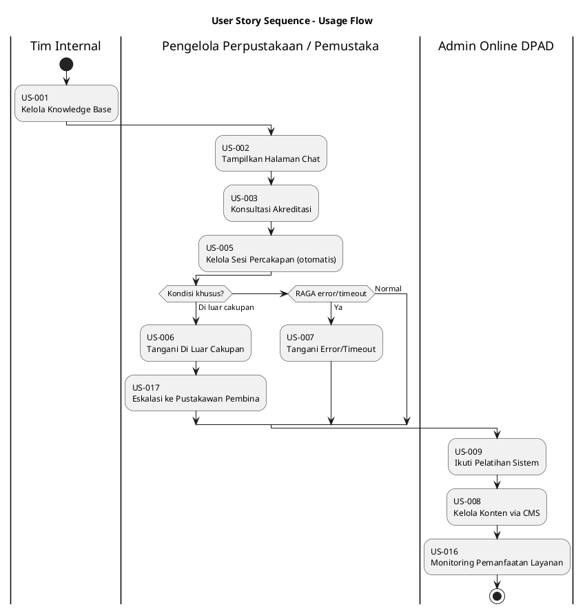
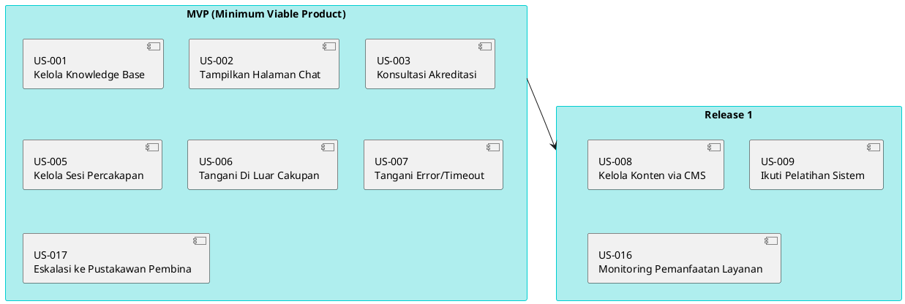
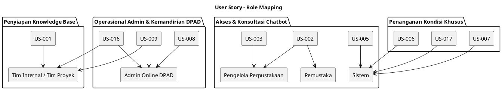
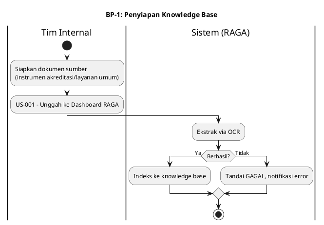
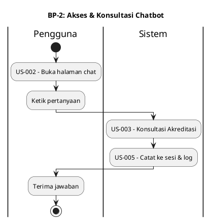
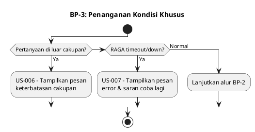
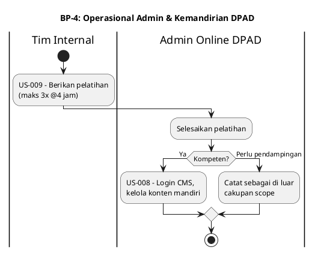
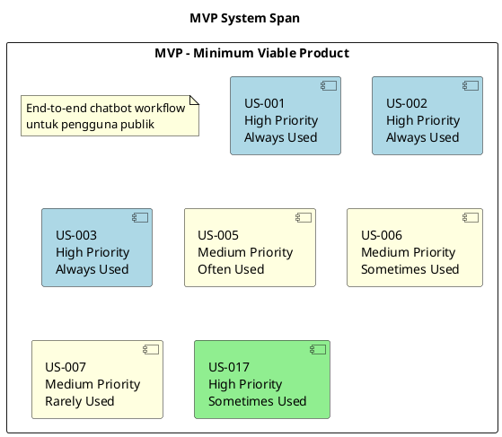
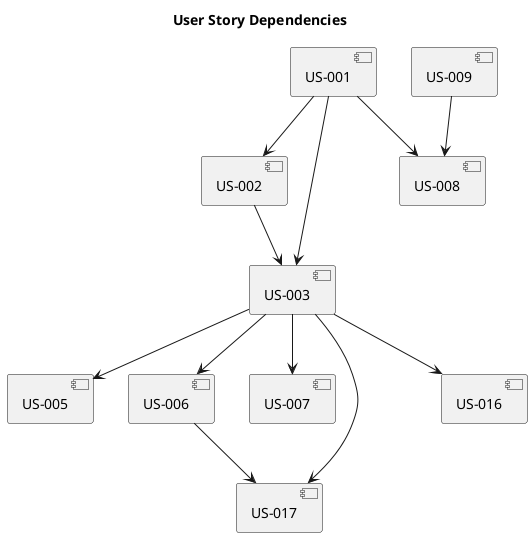

# User Story Mapping - AI Knowledge Center DPAD DIY

## Project Information

| **Field** | **Value** |
| --------- | --------- |
| **Project Name** | AI Knowledge Center DPAD DIY — Chatbot Konsultasi & Akreditasi Perpustakaan |
| **Document Version** | 1.2 |
| **FSD Reference** | 07_FSD.md |
| **Generated Date** | 10/08/2026 |
| **Methodology** | Jeff Patton - "It's All in How You Slice" |

---

## Document Overview

### 1.1 Purpose

User Story Mapping adalah teknik planning yang membantu tim memahami gambaran besar (big picture) sistem sebelum memecah menjadi backlog item. Dokumen ini memetakan seluruh User Story yang diekstrak dari 07_FSD.md ke dalam matriks Usage Sequence vs Criticality, dikelompokkan per proses bisnis, dan dipecah menjadi System Span (rilis).

### 1.2 Scope

Dokumen ini mencakup:
- Seluruh 10 Use Case aktif dari 07_FSD.md Section 3 (UC1–UC3, UC5–UC11)
- Seluruh aktor dari 07_FSD.md Section 2.2
- Prioritas dan urutan berdasarkan persyaratan FSD dan constraint bisnis (timeline 1 bulan, masa CMS 6 bulan)

### 1.3 Methodology

Berdasarkan metodologi Jeff Patton:
1. **Collect Features** — Kumpulkan seluruh User Story dari UC1–UC9
2. **Add Details** — Tambahkan User, Frequency, Value per kartu
3. **Sequence & Group** — Susun berdasarkan urutan penggunaan dan proses bisnis
4. **Slice into Releases** — Identifikasi System Span (MVP → Release 1 → Release 2)

---

## Actor/Roles Summary

| **Role** | **Description** | **Frequency** | **Associated Use Cases** |
| -------- | --------------- | ------------- | ----------------------- |
| Pengelola Perpustakaan | Staf perpustakaan mempersiapkan akreditasi | Tinggi saat musim akreditasi | UC2, UC3 |
| Pemustaka | Pengguna layanan perpustakaan (masyarakat umum) — *bukan fokus development fase ini* | Harian/insidental | UC2 |
| Admin Online DPAD | 1 orang staf DPAD, mengelola konten & mengikuti pelatihan | Berkala sesuai kebutuhan update konten | UC8, UC9 |
| Tim Internal / Tim Proyek | Setup awal & pemberi pelatihan | Sekali di awal + saat pelatihan | UC1, UC9 |
| *(Sistem — tanpa aktor langsung)* | Perilaku pendukung/kondisional | Setiap kali UC3 dijalankan | UC5, UC6, UC7 |

---

## User Story Index

| **US ID** | **User Story** | **Role** | **Use Case** | **Priority** | **Page** |
| --------- | -------------- | -------- | ------------ | ------------ | -------- |
| US-001 | Sebagai Tim Internal, saya ingin meng-extract dokumen ke RAGA, sehingga chatbot punya knowledge base akurat | Tim Internal / Admin Online | UC1 | High | §US-001 |
| US-002 | Sebagai Pengelola Perpustakaan/Pemustaka, saya ingin mengakses halaman chat dari website DPAD, sehingga saya bisa langsung bertanya tanpa berpindah platform | Pengelola Perpustakaan, Pemustaka | UC2 | High | §US-002 |
| US-003 | Sebagai Pengelola Perpustakaan, saya ingin bertanya seputar instrumen akreditasi, sehingga saya dapat jawaban cepat dengan sitasi sumber | Pengelola Perpustakaan | UC3 | High | §US-003 |
| US-005 | Sebagai pengguna chatbot, saya ingin percakapan saya diingat dalam satu sesi, sehingga saya bisa bertanya lanjutan tanpa mengulang konteks | *(sistem, mendukung UC3)* | UC5 | Medium | §US-005 |
| US-006 | Sebagai pengguna chatbot, saya ingin diberi tahu jika pertanyaan saya di luar cakupan, sehingga saya tidak menerima jawaban yang mengarang/menyesatkan | *(sistem, extend UC3)* | UC6 | Medium | §US-006 |
| US-007 | Sebagai pengguna chatbot, saya ingin melihat pesan error yang jelas saat sistem bermasalah, sehingga saya tahu harus mencoba lagi | *(sistem, extend UC3)* | UC7 | Medium | §US-007 |
| US-008 | Sebagai Admin Online DPAD, saya ingin mengelola konten chatbot via CMS, sehingga saya bisa memperbarui knowledge base secara mandiri | Admin Online DPAD | UC8 | High | §US-008 |
| US-009 | Sebagai Admin Online DPAD, saya ingin mengikuti pelatihan penggunaan sistem, sehingga saya mampu mengoperasikan CMS & chatbot secara mandiri | Admin Online DPAD | UC9 | High | §US-009 |
| US-017 | Sebagai pengguna chatbot, saya ingin diarahkan ke Pustakawan Pembina saat pertanyaan tidak terjawab, sehingga saya tetap mendapat bantuan resmi | *(sistem, extend UC3/UC6)* | UC10 | High | §US-017 |
| US-016 | Sebagai DPAD, saya ingin memantau pemanfaatan layanan (5 metrik KAK), sehingga saya dapat mengevaluasi layanan chatbot | Admin Online DPAD, Tim Internal | UC11 | Medium | §US-016 |

---

## User Story Cards

---

### US-001: Kelola Knowledge Base

| **Field** | **Value** |
| --------- | --------- |
| **User Story ID** | US-001 |
| **Use Case Reference** | UC-1 |
| **User/Role** | Tim Internal / Tim Proyek (setup awal), Admin Online DPAD (operasional via UC8) |
| **Action** | Meng-extract dokumen instrumen akreditasi & materi layanan umum ke Dashboard RAGA via OCR |
| **Benefit** | Chatbot memiliki sumber knowledge base yang akurat dan dapat dirujuk |
| **Full User Story** | Sebagai Tim Internal/Admin Online, saya ingin meng-extract dokumen ke Dashboard RAGA, sehingga chatbot punya sumber knowledge base yang akurat |
| **Frequency** | Sekali di awal proyek (setup); berkala setelahnya (via UC8) |
| **Value** | High |
| **Sequence Position** | 1 |
| **Criticality** | Always Used *(prasyarat seluruh use case Q&A)* |
| **System Span** | MVP |

**Related Functional Requirements:**
- FR-1.1: Sistem harus menerima dokumen format PDF, DOCX, DOC, XLSX, XLS, TXT
- FR-1.2: Sistem harus mengekstrak isi dokumen via OCR dan mengindeks sesuai kategori
- FR-1.3: Dokumen status_index='GAGAL' tidak boleh dirujuk sebagai sumber jawaban

**Acceptance Criteria:**
1. Dokumen berhasil diekstrak dan diindeks ke knowledge base sesuai kategori
2. Dokumen dengan format tidak didukung ditolak dengan notifikasi jelas
3. Dokumen yang gagal diekstrak tidak dirujuk sebagai sumber jawaban chatbot

---

### US-002: Tampilkan Halaman Chat

| **Field** | **Value** |
| --------- | --------- |
| **User Story ID** | US-002 |
| **Use Case Reference** | UC-2 |
| **User/Role** | Pengelola Perpustakaan, Pemustaka |
| **Action** | Mengklik tombol chat dan mengakses halaman chat yang ditempel di website DPAD |
| **Benefit** | Tidak perlu berpindah ke aplikasi/platform lain untuk berkonsultasi dan bisa melihat riwayat percakapan sebelumnya |
| **Full User Story** | Sebagai Pengelola Perpustakaan/Pemustaka, saya ingin mengklik tombol chat langsung dari website DPAD, sehingga saya bisa langsung berinteraksi dan melihat riwayat percakapan sebelumnya |
| **Frequency** | Harian (titik masuk setiap interaksi) |
| **Value** | High |
| **Sequence Position** | 2 |
| **Criticality** | Always Used |
| **System Span** | MVP |

**Related Functional Requirements:**
- FR-2.1: Sistem harus membuat session_id unik setiap kali halaman chat dibuka pertama kali
- FR-2.2: Sistem harus menampilkan pesan pembuka saat halaman chat pertama dibuka
- FR-2.3: Sistem harus menampilkan pesan fallback jika koneksi RAGA gagal
- FR-2.4: Sistem harus menampilkan riwayat percakapan sebelumnya (jika local storage belum dihapus)

**Acceptance Criteria:**
1. Halaman chat tampil saat tombol chat diklik dari website DPAD
2. session_id baru dibuat setiap kunjungan
3. Pesan fallback (bukan halaman kosong) tampil saat koneksi gagal
4. Riwayat percakapan terakhir ditampilkan jika tersimpan di local storage

---

### US-003: Konsultasi Akreditasi

| **Field** | **Value** |
| --------- | --------- |
| **User Story ID** | US-003 |
| **Use Case Reference** | UC-3 |
| **User/Role** | Pengelola Perpustakaan |
| **Action** | Bertanya langsung ke chatbot tentang isi/persyaratan instrumen akreditasi |
| **Benefit** | Mendapat jawaban cepat tanpa menunggu jadwal konsultasi manual |
| **Full User Story** | Sebagai Pengelola Perpustakaan yang mempersiapkan akreditasi, saya ingin bertanya langsung ke chatbot tentang instrumen akreditasi, sehingga saya mendapat jawaban cepat tanpa menunggu konsultasi manual |
| **Frequency** | Tinggi saat musim persiapan akreditasi |
| **Value** | High |
| **Sequence Position** | 3 |
| **Criticality** | Always Used *(fitur inti/tujuan utama proyek)* |
| **System Span** | MVP |

**Related Functional Requirements:**
- FR-3.1: Sistem harus meneruskan pertanyaan ke RAGA via HTTPS
- FR-3.2: Sistem harus menampilkan jawaban disertai referensi sumber dokumen
- FR-3.4: Sistem harus mencatat setiap percakapan ke log

**Acceptance Criteria:**
1. Pertanyaan akreditasi dijawab berbasis knowledge base terindeks
2. Jawaban disertai sitasi sumber dokumen yang akurat
3. Waktu respons < 5 detik p95 untuk pertanyaan standar

---

### US-005: Kelola Sesi Percakapan

| **Field** | **Value** |
| --------- | --------- |
| **User Story ID** | US-005 |
| **Use Case Reference** | UC-5 |
| **User/Role** | *(Tidak ada aktor langsung — perilaku pendukung dari UC3)* |
| **Action** | Menjaga konteks percakapan dalam satu sesi aktif dan mencatat log |
| **Benefit** | Pengguna bisa bertanya lanjutan tanpa mengulang konteks dari awal; DPAD mendapat data untuk audit |
| **Full User Story** | Sebagai pengguna chatbot, saya ingin chatbot mengingat konteks pertanyaan sebelumnya dalam satu sesi, sehingga saya bisa bertanya lanjutan tanpa mengulang konteks |
| **Frequency** | Setiap kali UC3 dijalankan (include, otomatis) |
| **Value** | Medium |
| **Sequence Position** | 4 |
| **Criticality** | Often Used *(mendukung, bukan dipicu mandiri)* |
| **System Span** | MVP *(melekat pada UC3, tidak bisa dipisah)* |

**Related Functional Requirements:**
- FR-5.1: Sistem harus menyimpan setiap pasangan tanya-jawab dengan referensi session_id
- FR-5.3: Sistem harus mengubah status_sesi menjadi BERAKHIR saat refresh/tutup

**Acceptance Criteria:**
1. Pertanyaan lanjutan dalam sesi yang sama memakai konteks sebelumnya
2. Setiap percakapan tercatat ke log audit
3. Refresh halaman menghasilkan sesi baru yang bersih

---

### US-006: Tangani Pertanyaan Di Luar Cakupan

| **Field** | **Value** |
| --------- | --------- |
| **User Story ID** | US-006 |
| **Use Case Reference** | UC-6 |
| **User/Role** | *(Tidak ada aktor langsung — extend kondisional dari UC3)* |
| **Action** | Mendeteksi pertanyaan di luar topik dan menyampaikan keterbatasan cakupan |
| **Benefit** | Pengguna tidak menerima jawaban yang mengarang/menyesatkan (anti-halusinasi) |
| **Full User Story** | Sebagai pengguna chatbot, saya ingin diberi tahu jika pertanyaan saya di luar cakupan, sehingga saya tidak menerima jawaban yang mengarang/menyesatkan |
| **Frequency** | Kondisional — hanya saat pertanyaan tidak relevan |
| **Value** | Medium |
| **Sequence Position** | 4 |
| **Criticality** | Sometimes Used |
| **System Span** | MVP *(prinsip anti-halusinasi adalah kriteria sukses proyek — spec.md)* |

**Related Functional Requirements:**
- FR-6.1: Sistem harus menampilkan pesan di luar cakupan, tanpa mengarang jawaban
- FR-6.2: Sistem tidak boleh membuat sitasi untuk jawaban di luar cakupan

**Acceptance Criteria:**
1. Pertanyaan di luar topik direspons dengan pesan keterbatasan cakupan
2. Tidak ada sitasi dokumen yang dibuat untuk jawaban di luar cakupan

---

### US-007: Tangani Error/Timeout RAGA

| **Field** | **Value** |
| --------- | --------- |
| **User Story ID** | US-007 |
| **Use Case Reference** | UC-7 |
| **User/Role** | *(Tidak ada aktor langsung — extend kondisional dari UC3)* |
| **Action** | Menampilkan pesan error informatif saat Workspace RAGA down/timeout |
| **Benefit** | Pengguna tahu harus mencoba lagi, bukan menghadapi tampilan kosong/hang yang membingungkan |
| **Full User Story** | Sebagai pengguna chatbot, saya ingin melihat pesan error yang jelas saat sistem bermasalah, sehingga saya tahu harus mencoba lagi |
| **Frequency** | Kondisional — hanya saat RAGA bermasalah |
| **Value** | Medium |
| **Sequence Position** | 4 |
| **Criticality** | Rarely Used *(idealnya jarang terjadi, tapi wajib ditangani baik)* |
| **System Span** | MVP *(reliabilitas dasar, tidak bisa ditunda)* |

**Related Functional Requirements:**
- FR-7.1: Sistem harus menampilkan pesan error informatif saat timeout/down
- FR-7.2: Sistem harus menyarankan pengguna mencoba kembali

**Acceptance Criteria:**
1. Pesan error tampil jelas, bukan halaman kosong/hang
2. Tombol "Coba Lagi" tersedia dan berfungsi
3. Sistem pulih normal setelah RAGA kembali aktif

---

### US-008: Kelola Konten via CMS

| **Field** | **Value** |
| --------- | --------- |
| **User Story ID** | US-008 |
| **Use Case Reference** | UC-8 |
| **User/Role** | Admin Online DPAD |
| **Action** | Mengelola (unggah/update) konten chatbot melalui CMS di website TLab |
| **Benefit** | Bisa memperbarui knowledge base secara mandiri tanpa bergantung pada tim developer |
| **Full User Story** | Sebagai Admin Online DPAD, saya ingin mengelola konten chatbot melalui CMS, sehingga saya bisa memperbarui/menambah konten secara mandiri |
| **Frequency** | Berkala sesuai kebutuhan update (bukan harian) |
| **Value** | High |
| **Sequence Position** | 5 |
| **Criticality** | Often Used *(operasional pasca-launch, krusial untuk keberlanjutan)* |
| **System Span** | Release 1 *(setelah MVP chatbot berjalan, sebelum masa 6 bulan CMS mulai efektif)* |

**Related Functional Requirements:**
- FR-8.1: Sistem harus memvalidasi masa akses admin sebelum login
- FR-8.3: Sistem harus memicu re-index setelah validasi format berhasil
- FR-8.4: Sistem harus menampilkan konfirmasi setelah update berhasil

**Acceptance Criteria:**
1. Admin online dapat login dan mengunggah konten baru
2. Konten yang diunggah memicu re-index knowledge base secara otomatis
3. Login ditolak jika masa akses (6 bulan) telah berakhir

---

### US-009: Ikuti Pelatihan Sistem

| **Field** | **Value** |
| --------- | --------- |
| **User Story ID** | US-009 |
| **Use Case Reference** | UC-9 |
| **User/Role** | Admin Online DPAD |
| **Action** | Mengikuti pelatihan penggunaan CMS dan sistem chatbot |
| **Benefit** | Mampu mengoperasikan dan mengelola chatbot secara mandiri setelah go-live |
| **Full User Story** | Sebagai Admin Online DPAD, saya ingin mendapat pelatihan penggunaan CMS dan sistem chatbot, sehingga saya mampu mengelola chatbot secara mandiri |
| **Frequency** | Maksimal 3x pertemuan @4 jam (sekali di awal, sebelum/menyusul go-live) |
| **Value** | High |
| **Sequence Position** | 5 *(prasyarat US-008 dapat dijalankan secara efektif)* |
| **Criticality** | Always Used *(sekali, tapi wajib — deliverable kontraktual)* |
| **System Span** | Release 1 |

**Related Functional Requirements:**
- FR-9.1: Sistem administratif harus mencatat maksimal 3 sesi pelatihan per admin
- FR-9.3: Permintaan pelatihan di luar batas harus dicatat sebagai di luar cakupan

**Acceptance Criteria:**
1. Jadwal 3x sesi @4 jam disepakati dan dilaksanakan
2. Admin online dievaluasi kompeten mengoperasikan CMS & sistem setelah pelatihan
3. Permintaan pelatihan tambahan (>3 sesi/>1 peserta) dicatat sebagai di luar cakupan

---

### US-017: Eskalasi ke Pustakawan Pembina

| **Field** | **Value** |
| --------- | --------- |
| **User Story ID** | US-017 |
| **Use Case Reference** | UC-10 |
| **User/Role** | *(Tidak ada aktor langsung — extend kondisional dari UC3/UC6)* |
| **Action** | Mengalihkan pertanyaan yang tidak dapat dijawab/butuh analisis ke Pustakawan Pembina |
| **Benefit** | Pengguna tetap mendapat jalur tindak lanjut resmi; DPAD menjaga kelengkapan layanan konsultasi |
| **Full User Story** | Sebagai pengguna chatbot, saya ingin diarahkan ke Pustakawan Pembina saat pertanyaan saya tidak dapat dijawab chatbot, sehingga saya tetap mendapat bantuan resmi dari DPAD |
| **Frequency** | Kondisional — hanya saat pertanyaan tidak terjawab/butuh interpretasi/analisis/pendampingan |
| **Value** | High |
| **Sequence Position** | 4 *(paralel dengan penanganan kondisi khusus US-006/US-007)* |
| **Criticality** | Sometimes Used *(wajib ada sebagai deliverable mandatory KAK — Prinsip Utama #6)* |
| **System Span** | MVP *(deliverable mandatory KAK)* |

**Related Functional Requirements:**
- FR-10.1: Sistem harus menampilkan mekanisme eskalasi ke Pustakawan Pembina saat pertanyaan tidak dapat dijawab/butuh analisis
- FR-10.2: Sistem harus menampilkan kontak WhatsApp Pustakawan Pembina (+62 881-0821-52119)
- FR-10.3: Sistem harus mencatat kejadian eskalasi ke log untuk mendukung metrik "jumlah eskalasi"

**Acceptance Criteria:**
1. Pertanyaan yang tidak dapat dijawab memicu pesan eskalasi ke Pustakawan Pembina
2. Kontak WhatsApp Pustakawan Pembina (+62 881-0821-52119) ditampilkan sebagai jalur tindak lanjut
3. Kejadian eskalasi tercatat di log percakapan (flag eskalasi = TRUE)

---

### US-016: Monitoring Pemanfaatan Layanan *(perluasan dari US-016 Laporan Analitik — backlog-plan)*

| **Field** | **Value** |
| --------- | --------- |
| **User Story ID** | US-016 |
| **Use Case Reference** | UC-11 |
| **User/Role** | Admin Online DPAD, Tim Internal / Tim Proyek |
| **Action** | Memantau pemanfaatan layanan chatbot melalui dashboard 5 metrik KAK |
| **Benefit** | DPAD dapat mengevaluasi pemanfaatan layanan dan kualitas jawaban chatbot |
| **Full User Story** | Sebagai DPAD (Admin Online/Tim Internal), saya ingin memantau pemanfaatan layanan chatbot melalui dashboard, sehingga saya dapat mengevaluasi pemanfaatan dan kualitas layanan |
| **Frequency** | On-demand (berkala sesuai kebutuhan monitoring) |
| **Value** | Medium |
| **Sequence Position** | 5 *(operasional pasca-launch)* |
| **Criticality** | Often Used *(deliverable mandatory KAK — "Statistik dan Monitoring")* |
| **System Span** | Release 1 *(menyusul MVP, selaras dengan US-008 CMS & analitik)* |

**Related Functional Requirements:**
- FR-11.1: Dashboard monitoring menampilkan jumlah pengguna
- FR-11.2: Dashboard monitoring menampilkan jumlah percakapan
- FR-11.3: Dashboard monitoring menampilkan pertanyaan yang berhasil dijawab
- FR-11.4: Dashboard monitoring menampilkan pertanyaan yang tidak terjawab
- FR-11.5: Dashboard monitoring menampilkan jumlah eskalasi

**Acceptance Criteria:**
1. Dashboard menampilkan 5 metrik KAK: jumlah pengguna, jumlah percakapan, berhasil dijawab, tidak terjawab, jumlah eskalasi
2. Metrik bersumber dari log percakapan (tbl_conversation_log) dan sesi (tbl_session)
3. Data log belum tersedia → dashboard menampilkan nilai nol dengan pesan informasi

---

## User Story Mapping Visualization

### 1. Complete User Story Map Overview

```plantuml
@startuml
skinparam backgroundColor #FEFEFE
skinparam componentStyle rectangle

title User Story Map - AI Knowledge Center DPAD DIY

partition "Penyiapan Knowledge Base" {
  [US-001: Kelola\nKnowledge Base]
}

partition "Akses & Konsultasi Chatbot" {
  [US-002: Tampilkan\nHalaman Chat]
  [US-003: Konsultasi\nAkreditasi]
  [US-005: Kelola Sesi\nPercakapan]
}

partition "Penanganan Kondisi Khusus" {
  [US-006: Tangani Di\nLuar Cakupan]
  [US-007: Tangani Error/\nTimeout RAGA]
  [US-017: Eskalasi ke\nPustakawan Pembina]
}

partition "Operasional Admin & Kemandirian DPAD" {
  [US-008: Kelola Konten\nvia CMS]
  [US-009: Ikuti Pelatihan\nSistem]
  [US-016: Monitoring\nPemanfaatan Layanan]
}

@enduml
```

---

### 2. User Story Sequence Diagram



---

### 3. System Span Visualization



---

### 4. User Role Interaction Map



---

## Business Process Columns

### BP-1: Penyiapan Knowledge Base

| **Attribute** | **Value** |
| ------------- | --------- |
| **BP ID** | BP-1 |
| **Process Name** | Penyiapan Knowledge Base |
| **Primary Role** | Tim Internal / Tim Proyek (setup awal), Admin Online DPAD (operasional lanjutan) |
| **User Stories** | US-001 |
| **Sequence Start** | 1 |
| **Sequence End** | 1 |

**Process Flow:**



---

### BP-2: Akses & Konsultasi Chatbot

| **Attribute** | **Value** |
| ------------- | --------- |
| **BP ID** | BP-2 |
| **Process Name** | Akses & Konsultasi Chatbot |
| **Primary Role** | Pengelola Perpustakaan, Pemustaka |
| **User Stories** | US-002, US-003, US-005 |
| **Sequence Start** | 2 |
| **Sequence End** | 4 |

**Process Flow:**



---

### BP-3: Penanganan Kondisi Khusus

| **Attribute** | **Value** |
| ------------- | --------- |
| **BP ID** | BP-3 |
| **Process Name** | Penanganan Kondisi Khusus (Anti-halusinasi & Error Handling) |
| **Primary Role** | Sistem (dipicu kondisional dari BP-2) |
| **User Stories** | US-006, US-007 |
| **Sequence Start** | 4 |
| **Sequence End** | 4 |

**Process Flow:**



---

### BP-4: Operasional Admin & Kemandirian DPAD

| **Attribute** | **Value** |
| ------------- | --------- |
| **BP ID** | BP-4 |
| **Process Name** | Operasional Admin & Kemandirian DPAD |
| **Primary Role** | Admin Online DPAD |
| **User Stories** | US-008, US-009 |
| **Sequence Start** | 5 |
| **Sequence End** | 5 |

**Process Flow:**



---

## System Spans (Releases)

### System Span Overview

| **Span** | **Name** | **Description** | **User Stories** | **Effort** |
| -------- | -------- | --------------- | ---------------- | ---------- |
| SP-1 | MVP | Chatbot end-to-end berfungsi: knowledge base, halaman chat, Q&A akreditasi, sesi, penanganan kondisi khusus, dan eskalasi ke Pustakawan Pembina | US-001, US-002, US-003, US-005, US-006, US-007, US-017 | *(estimasi tim teknis — belum ditentukan)* |
| SP-2 | Release 1 | Kemandirian operasional DPAD: CMS pengelolaan konten, pelatihan admin online, dan monitoring pemanfaatan layanan | US-008, US-009, US-016 | *(estimasi tim teknis — belum ditentukan)* |
| SP-3 | Release 2 *(backlog, belum disepakati)* | Integrasi Sibinakawan sebagai sumber data tambahan (jika disepakati klien) | *(belum ada User Story — menunggu konfirmasi)* | TBD |

---

### SP-1: MVP (Minimum Viable Product)

**Description:** Fitur minimum yang harus ada agar chatbot dapat digunakan secara end-to-end oleh Pengelola Perpustakaan dan Pemustaka — target live dalam 1 bulan sejak kick-off (27 Agustus 2026, rujukan Discovery Notes §1).

**Rationale:** Berdasarkan analisis 07_FSD.md, MVP mencakup Use Case yang memiliki:
- Priority = High (UC1–UC3, UC8) atau Medium namun tidak dapat dipisah dari alur inti (UC5–UC7)
- Criticality = Always Used / Often Used dalam alur konsultasi chatbot
- Sequence = Awal hingga pertengahan workflow (posisi 1–4)



**Included User Stories:**

| US ID | User Story | Role | Priority | Justification |
| ----- | ---------- | ---- | -------- | ------------- |
| US-001 | Kelola Knowledge Base | Tim Internal | High | Prasyarat mutlak — tanpa knowledge base, chatbot tidak punya sumber jawaban |
| US-002 | Tampilkan Halaman Chat | Pengelola Perpustakaan, Pemustaka | High | Satu-satunya titik akses publik ke chatbot |
| US-003 | Konsultasi Akreditasi | Pengelola Perpustakaan | High | Tujuan utama proyek (Discovery Notes §1) |
| US-005 | Kelola Sesi Percakapan | *(sistem)* | Medium | Melekat pada UC3 (include), tidak dapat dipisah rilis |
| US-006 | Tangani Di Luar Cakupan | *(sistem)* | Medium | Kriteria sukses proyek (anti-halusinasi, spec.md) |
| US-007 | Tangani Error/Timeout | *(sistem)* | Medium | Reliabilitas dasar, wajib ada sejak go-live |
| US-017 | Eskalasi ke Pustakawan Pembina | *(sistem)* | High | Deliverable mandatory KAK (Prinsip Utama #6 + alur bisnis) |


---

### SP-2: Release 1

**Description:** Kemandirian operasional DPAD pasca-launch — CMS pengelolaan konten dan pelatihan admin online, sesuai scope of work yang ditambahkan di Discovery Notes §3 (halaman chat, pelatihan, CMS).

**Rationale:** US-008 dan US-009 saling bergantung (pelatihan adalah prasyarat penggunaan CMS efektif) dan secara alami menyusul MVP karena masa aktif CMS (6 bulan) baru mulai dihitung sejak go-live.

```plantuml
@startuml
title Release 1 System Span

rectangle "Release 1 - Kemandirian Operasional DPAD" {
  note as N1
    Prasyarat: MVP sudah live
    Masa CMS mulai dihitung sejak go-live
  end note

  [US-009\nHigh Priority\nAlways Used] #LightGreen
  [US-008\nHigh Priority\nOften Used] #LightGreen
  [US-016\nMedium Priority\nOften Used] #LightGreen
}

US-009 --> US-008 : prasyarat kompetensi

@enduml
```

**Included User Stories:**

| US ID | User Story | Role | Priority | Justification |
| ----- | ---------- | ---- | -------- | ------------- |
| US-009 | Ikuti Pelatihan Sistem | Admin Online DPAD | High | Prasyarat US-008 — admin harus kompeten sebelum mengelola CMS mandiri |
| US-008 | Kelola Konten via CMS | Admin Online DPAD | High | Kemandirian jangka panjang; constraint waktu (6 bulan) membuatnya time-sensitive sejak go-live |
| US-016 | Monitoring Pemanfaatan Layanan | Admin Online DPAD, Tim Internal | Medium | Deliverable mandatory KAK ("Statistik dan Monitoring" — 5 metrik) |

---

### SP-3: Release 2 (Backlog — Menunggu Konfirmasi Klien)

**Description:** Integrasi Sibinakawan sebagai sumber data/KMS tambahan, dijadwalkan sebagai fase berikutnya bila disepakati (rujukan: PRD & Feature Spec §5 Fitur 5, status Backlog).

**Rationale:** Belum ada User Story formal karena perannya belum dikonfirmasi klien (Open Item, 01_Requirement_Extraction.md #2). Dicantumkan di sini sebagai placeholder perencanaan, bukan komitmen scope.

---

## Complete User Story Matrix

### Matrix: Usage Sequence vs Criticality

```plantuml
@startuml
skinparam backgroundColor #FEFEFE

title User Story Map Matrix — AI Knowledge Center DPAD

||= Sequence |= Always Used |= Often Used |= Sometimes Used |= Rarely Used |
|| 1 | US-001\nKelola Knowledge Base | | | |
|| 2 | US-002\nTampilkan Halaman Chat | | | |
|| 3 | US-003\nKonsultasi Akreditasi | | | |
|| 4 | | US-005\nKelola Sesi Percakapan | US-006\nTangani Di Luar Cakupan\nUS-017\nEskalasi ke Pustakawan Pembina | US-007\nTangani Error/Timeout |
|| 5 | US-009\nIkuti Pelatihan Sistem | US-008\nKelola Konten via CMS\nUS-016\nMonitoring Pemanfaatan Layanan | | |

@enduml
```

---

## Dependencies Analysis

### User Story Dependencies

| **US ID** | **Depends On** | **Type** | **Description** |
| --------- | ------------- | -------- | --------------- |
| US-002 | US-001 | Pre-requisite | Halaman chat tidak berguna tanpa knowledge base terisi terlebih dahulu |
| US-003 | US-001, US-002 | Pre-requisite | Konsultasi akreditasi butuh knowledge base akreditasi (US-001) dan titik akses (US-002) |
| US-005 | US-003 | Included behavior | Selalu terjadi bersamaan US-003, bukan use case mandiri |
| US-006 | US-003 | Extending behavior | Hanya terpicu kondisional dari US-003 |
| US-007 | US-003 | Extending behavior | Hanya terpicu kondisional dari US-003 |
| US-008 | US-001, US-009 | Pre-requisite | CMS memicu proses yang sama seperti US-001 (re-index); admin perlu kompeten (US-009) sebelum efektif memakainya |
| US-009 | — | Independent | Dapat dijadwalkan kapan saja menjelang/setelah go-live, tidak bergantung use case lain |
| US-016 | US-003, US-005 | Pre-requisite | Metrik monitoring bersumber dari log percakapan & sesi yang dihasilkan alur konsultasi |
| US-017 | US-003, US-006 | Extending behavior | Hanya terpicu kondisional — saat pertanyaan tak terjawab/butuh analisis (KAK Prinsip #6) |

### Dependency Diagram



---

## Release Planning

### Effort Estimation

| **US ID** | **User Story** | **Estimated Effort** | **Assigned To** |
| --------- | -------------- | -------------------- | --------------- |
| US-001 | Kelola Knowledge Base | *(TBD — tergantung volume dokumen awal)* | Tim Internal + RAGA TLab |
| US-002 | Tampilkan Halaman Chat | *(TBD)* | Tim developer + IT DPAD |
| US-003 | Konsultasi Akreditasi | *(TBD)* | Tim RAGA TLab |
| US-005 | Kelola Sesi Percakapan | *(TBD)* | Tim RAGA TLab (built-in RAGA) |
| US-006 | Tangani Di Luar Cakupan | *(TBD)* | Tim RAGA TLab (konfigurasi prompt/guardrail) |
| US-007 | Tangani Error/Timeout | *(TBD)* | Tim developer halaman chat |
| US-017 | Eskalasi ke Pustakawan Pembina | *(TBD)* | Tim developer halaman chat (pesan + kontak WA) |
| **TOTAL MVP** | | *(estimasi belum tersedia — perlu breakdown teknis lanjutan)* | |
| US-008 | Kelola Konten via CMS | *(TBD)* | Tim RAGA TLab (CMS built-in) |
| US-009 | Ikuti Pelatihan Sistem | 3 sesi × 4 jam = 12 jam | Tim Internal / Tim Proyek |
| US-016 | Monitoring Pemanfaatan Layanan | *(TBD — selaras Custom Analytics)* | Tim RAGA TLab / Tim developer |

> **Catatan:** Estimasi effort teknis (hari/story point) belum tersedia karena proyek ini bergantung penuh pada kapabilitas existing RAGA TLab — sebagian besar "effort" adalah konfigurasi dan integrasi, bukan pengembangan dari nol. Estimasi detail sebaiknya disusun bersama tim teknis RAGA TLab sebelum Fase Develop (di luar cakupan pipeline system-analysis ini).

### Release Timeline

| **Release** | **Sprint** | **Duration** | **User Stories** | **Goal** |
| ----------- | --------- | ------------ | ---------------- | -------- |
| MVP | — | Target 1 bulan sejak kick-off (27 Agustus 2026) | US-001, US-002, US-003, US-005, US-006, US-007, US-017 | Chatbot live & dapat diakses publik via website DPAD; eskalasi ke Pustakawan Pembina aktif |
| Release 1 | — | Menyusul MVP, sebelum/bersamaan go-live | US-008, US-009, US-016 | Admin online terlatih, CMS aktif digunakan, dashboard monitoring 5 metrik KAK tersedia |
| Release 2 | — | Belum dijadwalkan (backlog) | *(menunggu konfirmasi Sibinakawan)* | Integrasi sumber data tambahan bila disepakati |

> Timeline MVP 1 bulan dicatat sebagai **agresif dan perlu divalidasi ulang** terhadap cakupan fitur final (rujukan konsisten dengan Discovery Notes §5 Constraints dan spec.md §Constraints).

---

## Quality Checklist

- [x] Semua Use Case dari FSD Section 3 tercakup (UC1–UC11 → US-001–US-009, US-016, US-017)
- [x] Setiap User Story memiliki format: Sebagai [Actor], saya ingin [Action], sehingga [Benefit]
- [x] Semua Actor dari FSD Section 2.2 terpetakan (termasuk Pustakawan Pembina)
- [x] Frequency dan Value ter-assign untuk setiap User Story
- [x] Urutan sequence logis berdasarkan business flow (1: setup KB → 2: akses chat → 3: konsultasi → 4: kondisi khusus/eskalasi → 5: operasional admin)
- [x] Criticality sesuai dengan business impact
- [x] MVP mencakup end-to-end workflow minimum (US-001, 002, 003, 005, 006, 007, 017) + eskalasi KAK
- [x] System Spans/Releases teridentifikasi dengan jelas (MVP, Release 1, Release 2/backlog)
- [x] Dependencies antar User Story terdokumentasi
- [x] Deliverable mandatory KAK tercakup: eskalasi ke Pustakawan Pembina (US-017) & monitoring 5 metrik (US-016)
- [ ] Effort estimation tersedia untuk planning — **belum lengkap**, perlu breakdown teknis lanjutan bersama tim RAGA TLab (dicatat sebagai gap eksplisit, bukan diasumsikan)

---

## Sign-Off

| **Role** | **Name** | **Date** | **Signature** |
| ------- | -------- | -------- | ------------ |
| Product Owner | *(TBD)* | DD/MM/YYYY | __________ |
| Business Analyst | *(TBD)* | DD/MM/YYYY | __________ |
| Development Lead | *(TBD)* | DD/MM/YYYY | __________ |

---

*Dokumen ini adalah output Fase 9 (User Story Mapping) dari pipeline System Analysis Guide, disusun dari 07_FSD.md. Lanjut ke Fase 10 (Screen/Page Planning) menggunakan User Story Map ini bersama 03_ERD.md sebagai input.*
