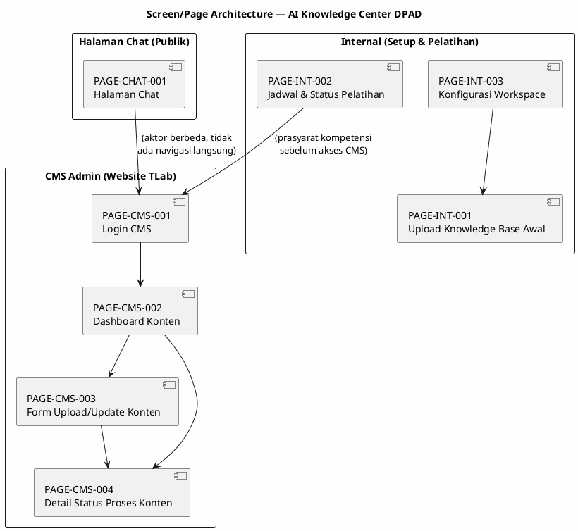
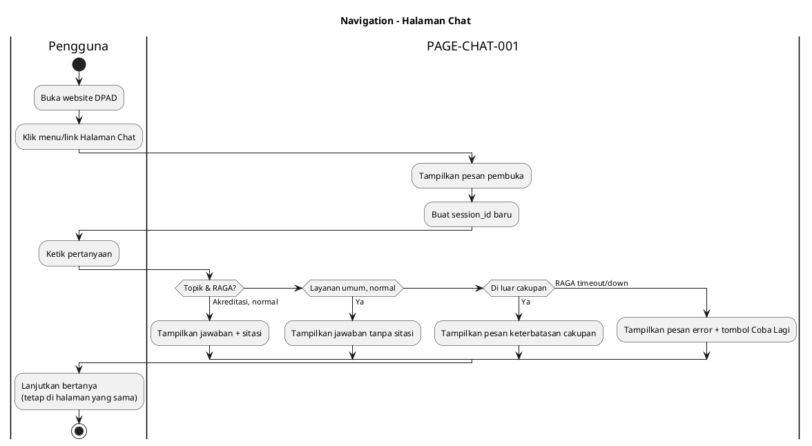
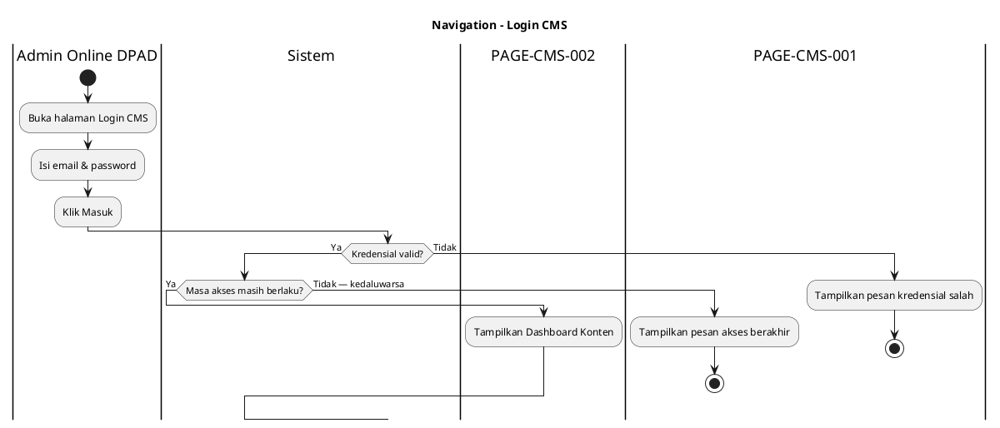
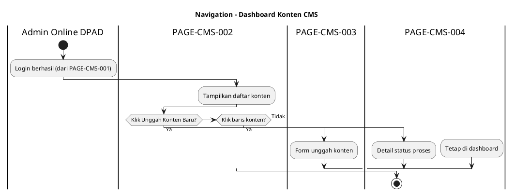
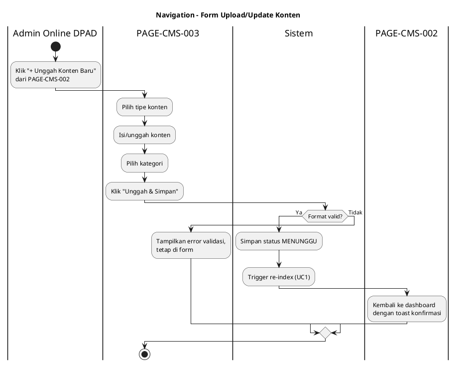
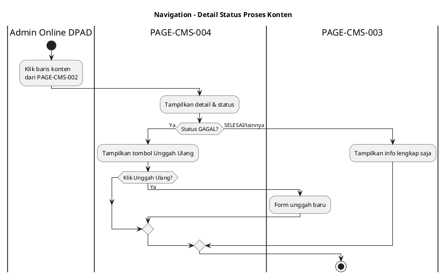

# Screen/Page Inventory - AI Knowledge Center DPAD DIY

## Project Information

| **Field** | **Value** |
| --------- | --------- |
| **Project Name** | AI Knowledge Center DPAD DIY — Chatbot Konsultasi & Akreditasi Perpustakaan |
| **Document Version** | 1.0 |
| **Source Documents** | 09_UserStory_Mapping.md, 03_ERD.md, 07_FSD.md, 04_DataDictionary.md |
| **Generated Date** | 10/08/2026 |
| **Total Pages** | 8 |
| **Total Modules** | 3 |

---

## Document Overview

### 1.1 Purpose

Dokumen ini merancang semua layar/halaman yang dibutuhkan sistem berdasarkan analisis dari User Story Mapping (fitur & alur), ERD (struktur data), dan FSD (field specification & validasi). Output ini menjadi fondasi untuk Fase 11 (HTML Mockup).

### 1.2 Scope

Dokumen ini mencakup halaman untuk seluruh User Story di MVP (US-001–US-007) dan Release 1 (US-008, US-009). Sistem ini relatif ramping — tidak ada modul CRUD administratif besar, karena mayoritas data (knowledge base, workspace) dikelola oleh RAGA TLab, bukan dibangun sebagai aplikasi terpisah oleh proyek ini.

### 1.3 Methodology

1. Baca 09_UserStory_Mapping.md → ekstrak User Story dan Actor
2. Baca 03_ERD.md → ekstrak Entity dan Atribut
3. Baca 07_FSD.md → ekstrak Field Specification dan Actions
4. Petakan User Story → Screen/Page
5. Petakan Entity → Data Source halaman
6. Hasilkan sample data realistis

---

## Page Architecture Overview

### Architecture Diagram



### Page Summary by System Span

| **System Span** | **Pages** | **User Stories Coverage** |
| --------------- | --------- | ------------------------ |
| **MVP** | PAGE-CHAT-001, PAGE-INT-001, PAGE-INT-003 | US-001, US-002, US-003, US-005, US-006, US-007 |
| **Release 1** | PAGE-CMS-001, PAGE-CMS-002, PAGE-CMS-003, PAGE-CMS-004, PAGE-INT-002 | US-008, US-009 |
| **Release 2 (backlog)** | *(belum ada — menunggu konfirmasi Sibinakawan)* | — |

---

## Module Structure

### Module Overview

| **Module** | **Description** | **Entity Source** | **Pages** | **User Stories** |
| ---------- | --------------- | ----------------- | --------- | ---------------- |
| Halaman Chat (Publik) | Antarmuka tanya-jawab chatbot untuk pengelola perpustakaan, ditempel di website DPAD | Session, ConversationLog, KnowledgeDocument (via citation) | 1 | US-002, US-003, US-005, US-006, US-007 |
| CMS Admin (Website TLab) | Antarmuka pengelolaan konten chatbot oleh admin online, termasuk login time-bound | Admin, CMSContent, KnowledgeDocument | 4 | US-008 |
| Internal (Setup & Pelatihan) | Halaman/aktivitas administratif tim internal — setup awal knowledge base, konfigurasi workspace, jadwal pelatihan | Workspace, KnowledgeDocument, TrainingSession, Admin | 3 | US-001, US-009 |

---

## PAGE-CHAT-001: Halaman Chat

### Page Metadata

| **Field** | **Value** |
| --------- | --------- |
| **Page ID** | PAGE-CHAT-001 |
| **Page Name** | Halaman Chat |
| **Page Path** | pages/chat/index.html |
| **Module** | Halaman Chat (Publik) |
| **Purpose** | Titik akses tunggal bagi pengguna publik untuk berkonsultasi dengan chatbot, ditempel (embed) di website DPAD |
| **Primary Actor** | Pengelola Perpustakaan, Pemustaka |
| **System Span** | MVP |
| **Page Type** | Chat Interface (bukan List/Form/Detail klasik) |

### User Story Coverage

| **User Story** | **Coverage** | **Description** |
| ------------- | ------------ | --------------- |
| US-002 | Full | Menampilkan halaman chat & membuat session baru |
| US-003 | Full | Menampilkan jawaban akreditasi + sitasi |
| US-005 | Full | Mempertahankan konteks percakapan dalam sesi (transparan bagi pengguna) |
| US-006 | Full | Menampilkan pesan di luar cakupan sebagai bagian dari alur chat |
| US-007 | Full | Menampilkan pesan error/timeout sebagai bagian dari alur chat |

### Data Source

| **Source Type** | **Entity** | **Description** |
| -------------- | ---------- | --------------- |
| **Primary Entity** | Session | Menyimpan session_id yang dibuat saat halaman dibuka |
| **Related Entities** | ConversationLog, CitationReference, KnowledgeDocument | Riwayat percakapan dalam sesi & sitasi sumber jawaban |
| **API Endpoint** | API/Iframe Workspace Chatbot DPAD (RAGA) | Sumber jawaban chatbot, di luar kendali skema DB internal proyek ini |

### Page Structure

```
┌─────────────────────────────────────────────────────────────┐
│ HEADER                                                      │
│ - Title: "Konsultasi Perpustakaan & Akreditasi DPAD DIY"     │
│ - Tidak ada breadcrumb (single-page chat widget)             │
│ - Tidak ada tombol aksi header (chatbot murni percakapan)    │
└─────────────────────────────────────────────────────────────┘
│                                                              │
│ CONTENT AREA                                                 │
│ - Pesan Pembuka/Instruksi (saat pertama dibuka)              │
│ - Riwayat Percakapan (bubble chat: pertanyaan & jawaban)     │
│   - Bubble jawaban akreditasi disertai badge sitasi sumber   │
│   - Bubble pesan "di luar cakupan" (styling berbeda)         │
│   - Bubble pesan error/timeout (alert, styling berbeda)      │
│                                                              │
└─────────────────────────────────────────────────────────────┘
│ FOOTER (Input Area)                                          │
│ - Kotak input pertanyaan (textbox)                            │
│ - Tombol Kirim                                                │
│ - Tombol Coba Lagi (muncul kondisional saat error)            │
└─────────────────────────────────────────────────────────────┘
```

### Fields Specification

**Berdasarkan ERD Entity dan FSD Field Specifications:**

#### Entity: Session

| **No** | **Field Name** | **Label** | **Type** | **Source** | **Validation** | **Description** |
| ------ | -------------- | --------- | -------- | ---------- | -------------- | --------------- |
| 1 | session_id | *(tidak ditampilkan ke pengguna)* | VARCHAR(40) | Session.session_id | Auto-generated, hidden | Identifier sesi internal |
| 2 | status_sesi | *(tidak ditampilkan ke pengguna)* | VARCHAR(20) | Session.status_sesi | AKTIF/BERAKHIR, hidden | Status internal sesi |

#### Entity: ConversationLog

| **No** | **Field Name** | **Label** | **Type** | **Source** | **Validation** | **Description** |
| ------ | -------------- | --------- | -------- | ---------- | -------------- | --------------- |
| 1 | user_message | Kotak Input Pertanyaan | TEXT | ConversationLog.user_message | Required, tidak boleh kosong | Pertanyaan bebas teks dari pengguna |
| 2 | jawaban_chatbot | Bubble Jawaban | TEXT (rich) | ConversationLog.jawaban_chatbot | Readonly | Jawaban chatbot ditampilkan |
| 3 | kategori_jawaban | *(mempengaruhi styling bubble)* | VARCHAR(20) | ConversationLog.kategori_jawaban | Readonly, hidden dari UI langsung | Menentukan tampilan (dengan/tanpa sitasi, error, dsb.) |

#### Entity: CitationReference (via KnowledgeDocument)

| **No** | **Field Name** | **Label** | **Type** | **Source** | **Validation** | **Description** |
| ------ | -------------- | --------- | -------- | ---------- | -------------- | --------------- |
| 1 | bagian_dokumen | Badge Sitasi Sumber | VARCHAR(255) | CitationReference.bagian_dokumen + KnowledgeDocument.nama_dokumen | Tampil hanya jika kategori_jawaban='AKREDITASI' | Referensi dokumen sumber jawaban |

### Sample Data (Realistic)

**Berdasarkan ERD attributes dan realistic values:**

| **Field** | **Sample Data 1** | **Sample Data 2** | **Sample Data 3** |
| --------- | ----------------- | ----------------- | ----------------- |
| user_message | "Apa syarat akreditasi perpustakaan sekolah?" | "Bagaimana cuaca hari ini di Yogyakarta?" |
| jawaban_chatbot | "Berdasarkan Instrumen Akreditasi Perpustakaan 2026 Bab III, syarat akreditasi perpustakaan sekolah meliputi..." | "Maaf, pertanyaan ini di luar cakupan layanan chatbot kami. Saya dapat membantu seputar instrumen akreditasi." |
| kategori_jawaban | AKREDITASI | DI_LUAR_CAKUPAN |
| bagian_dokumen (sitasi) | "Instrumen Akreditasi Perpustakaan 2026, Bab III Pasal 5" | *(tidak tampil)* |

**Sample Data Discussion:** Data mencerminkan dua jalur utama UC3/UC6 dari FSD — pertanyaan akreditasi dengan sitasi, dan pertanyaan di luar cakupan dengan pesan penolakan sopan. Format bahasa Indonesia formal sesuai konteks instansi pemerintah daerah.

### Actions & Buttons

| **Action** | **Button Label** | **Type** | **Target** | **Validation** | **User Story** |
| ---------- | ---------------- | -------- | ---------- | -------------- | ------------- |
| Kirim pertanyaan | Kirim (ikon panah) | Primary | Submit ke UC3 via API/Iframe | Input tidak boleh kosong | US-003 |
| Kirim ulang setelah error | Coba Lagi | Primary (kondisional) | Re-submit pertanyaan terakhir | Muncul hanya saat status error | US-007 |
| Klik badge sitasi | *(nama dokumen)* | Link/tooltip | Tampilkan detail sumber (modal/tooltip) | Muncul hanya untuk jawaban akreditasi | US-003 |

### Navigation Flow



### Component Requirements

| **Component** | **Type** | **Description** |
| ------------ | -------- | --------------- |
| Chat Bubble List | Custom (scrollable list) | Menampilkan riwayat percakapan dengan styling berbeda per kategori jawaban |
| Chat Input Bar | Form (textbox + button) | Input pertanyaan dan tombol kirim, sticky di bawah |
| Citation Badge | Custom (badge/chip + tooltip) | Menampilkan referensi sumber dokumen |
| Error Alert | Alert/banner | Menampilkan pesan error/timeout dengan tombol retry |
| Loading Indicator | Spinner/typing indicator | Menunjukkan chatbot sedang memproses jawaban |

### Responsive Breakpoints

| **Breakpoint** | **Layout** | **Description** |
| ------------- | ---------- | --------------- |
| Desktop (>1024px) | Chat widget lebar sedang, mengambang atau full-width di halaman dedicated | Bubble chat maksimal 70% lebar layar |
| Tablet (768-1024px) | Chat widget full-width dalam container halaman | Bubble chat maksimal 85% lebar |
| Mobile (<768px) | Full-screen chat interface | Bubble chat stack penuh, input bar sticky bottom |

### Accessibility Requirements

| **Requirement** | **Implementation** |
| -------------- | ------------------ |
| ARIA Labels | Kotak input, tombol kirim, dan badge sitasi memiliki aria-label deskriptif |
| Keyboard Navigation | Enter untuk kirim pertanyaan; Tab order: input → kirim → riwayat percakapan |
| Color Contrast | Min 4.5:1 untuk teks bubble chat, termasuk bubble error/warning |
| Screen Reader | Setiap bubble baru diumumkan via aria-live region agar pengguna screen reader tahu ada jawaban baru |

### Mockup Preview

```
┌─────────────────────────────────────────────────────────────┐
│  Konsultasi Perpustakaan & Akreditasi DPAD DIY               │
├─────────────────────────────────────────────────────────────┤
│                                                              │
│  🤖 Halo! Saya siap membantu pertanyaan seputar layanan      │
│     perpustakaan dan instrumen akreditasi.                   │
│                                                              │
│                          Apa syarat akreditasi perpustakaan  │
│                                              sekolah?    👤  │
│                                                              │
│  🤖 Berdasarkan Instrumen Akreditasi Perpustakaan 2026,      │
│     syarat akreditasi perpustakaan sekolah meliputi...       │
│     📄 Sumber: Instrumen Akreditasi 2026, Bab III Pasal 5    │
│                                                              │
│                    Bagaimana cuaca hari ini?             👤  │
│                                                              │
│  ⚠️ Maaf, pertanyaan ini di luar cakupan layanan chatbot     │
│     kami.                                                    │
│                                                              │
├─────────────────────────────────────────────────────────────┤
│ [ Ketik pertanyaan Anda...                    ] [ Kirim ➤ ] │
└─────────────────────────────────────────────────────────────┘
```

---

## PAGE-CMS-001: Login CMS

### Page Metadata

| **Field** | **Value** |
| --------- | --------- |
| **Page ID** | PAGE-CMS-001 |
| **Page Name** | Login CMS |
| **Page Path** | pages/cms/login.html |
| **Module** | CMS Admin (Website TLab) |
| **Purpose** | Autentikasi admin online sebelum mengakses Dashboard Konten CMS, dengan validasi masa akses time-bound |
| **Primary Actor** | Admin Online DPAD |
| **System Span** | Release 1 |
| **Page Type** | Form (Login) |

### User Story Coverage

| **User Story** | **Coverage** | **Description** |
| ------------- | ------------ | --------------- |
| US-008 | Partial | Bagian awal alur — autentikasi & validasi masa akses sebelum kelola konten |

### Data Source

| **Source Type** | **Entity** | **Description** |
| -------------- | ---------- | --------------- |
| **Primary Entity** | Admin | Validasi email/password dan tanggal_akhir_akses |
| **Related Entities** | — | Tidak ada relasi lain yang dibutuhkan pada tahap login |
| **API Endpoint** | Autentikasi CMS (native platform TLab, di luar skema ERD proyek ini) | — |

### Page Structure

```
┌─────────────────────────────────────────────────────────────┐
│ HEADER                                                      │
│ - Logo TLab / Knowledge AI RAAGA                              │
│ - Title: "Masuk ke CMS — AI Knowledge Center DPAD"            │
└─────────────────────────────────────────────────────────────┘
│                                                              │
│ CONTENT AREA                                                 │
│ - Form Login (email, password)                               │
│ - Pesan error (kredensial salah / akses kedaluwarsa)          │
│                                                              │
└─────────────────────────────────────────────────────────────┘
│ FOOTER                                                       │
│ - Link bantuan/kontak support (opsional)                     │
└─────────────────────────────────────────────────────────────┘
```

### Fields Specification

#### Entity: Admin

| **No** | **Field Name** | **Label** | **Type** | **Source** | **Validation** | **Description** |
| ------ | -------------- | --------- | -------- | ---------- | -------------- | --------------- |
| 1 | email | Email | Textbox | Admin.email | Required, format email, harus terdaftar | Email login admin |
| 2 | password | Password | Password field | *(di luar skema ERD — dikelola sistem autentikasi TLab)* | Required | Kata sandi admin |

### Sample Data (Realistic)

| **Field** | **Sample Data 1** | **Sample Data 2** |
| --------- | ----------------- | ----------------- |
| email | admin.dpad@example.go.id | *(TBD — identitas admin belum dikonfirmasi klien)* |
| status_akses (hasil validasi) | AKTIF | KEDALUWARSA |

**Sample Data Discussion:** Identitas definitif admin online belum dikonfirmasi klien (Open Item 01_Requirement_Extraction.md #5) — email bersifat placeholder mengikuti pola domain instansi pemerintah (.go.id).

### Actions & Buttons

| **Action** | **Button Label** | **Type** | **Target** | **Validation** | **User Story** |
| ---------- | ---------------- | -------- | ---------- | -------------- | ------------- |
| Login | Masuk | Primary | PAGE-CMS-002 (jika sukses) | Kredensial valid + status_akses='AKTIF' | US-008 |

### Navigation Flow



### Component Requirements

| **Component** | **Type** | **Description** |
| ------------ | -------- | --------------- |
| Login Form | Form | Email + password + tombol submit |
| Error Message | Alert | Pesan kredensial salah atau akses kedaluwarsa |

### Responsive Breakpoints

| **Breakpoint** | **Layout** | **Description** |
| ------------- | ---------- | --------------- |
| Desktop (>1024px) | Form terpusat, lebar maksimum 400px | Card login di tengah halaman |
| Tablet (768-1024px) | Sama seperti desktop | — |
| Mobile (<768px) | Form full-width dengan padding | Stack vertikal |

### Accessibility Requirements

| **Requirement** | **Implementation** |
| -------------- | ------------------ |
| ARIA Labels | Input email & password memiliki label eksplisit |
| Keyboard Navigation | Tab: email → password → tombol Masuk; Enter submit form |
| Color Contrast | Min 4.5:1 untuk teks & pesan error |
| Screen Reader | Pesan error diumumkan via aria-live |

### Mockup Preview

```
┌─────────────────────────────────────────────┐
│         Masuk ke CMS                          │
│    AI Knowledge Center DPAD                    │
├─────────────────────────────────────────────┤
│                                               │
│  Email                                        │
│  [ admin.dpad@example.go.id            ]     │
│                                               │
│  Password                                     │
│  [ ••••••••                            ]     │
│                                               │
│  [           Masuk           ]               │
│                                               │
└─────────────────────────────────────────────┘
```

---

## PAGE-CMS-002: Dashboard Konten CMS

### Page Metadata

| **Field** | **Value** |
| --------- | --------- |
| **Page ID** | PAGE-CMS-002 |
| **Page Name** | Dashboard Konten CMS |
| **Page Path** | pages/cms/dashboard.html |
| **Module** | CMS Admin (Website TLab) |
| **Purpose** | Menampilkan daftar konten yang sudah diunggah admin dan menjadi titik masuk untuk menambah konten baru |
| **Primary Actor** | Admin Online DPAD |
| **System Span** | Release 1 |
| **Page Type** | List/Index |

### User Story Coverage

| **User Story** | **Coverage** | **Description** |
| ------------- | ------------ | --------------- |
| US-008 | Full | Titik utama admin memantau & mengelola konten chatbot |

### Data Source

| **Source Type** | **Entity** | **Description** |
| -------------- | ---------- | --------------- |
| **Primary Entity** | CMSContent | Daftar entri konten yang pernah diunggah admin |
| **Related Entities** | KnowledgeDocument | Status hasil index terkait tiap entri konten |
| **API Endpoint** | — | Data langsung dari database CMS (native TLab) |

### Page Structure

```
┌─────────────────────────────────────────────────────────────┐
│ HEADER                                                      │
│ - Title: "Kelola Konten Chatbot DPAD"                         │
│ - Breadcrumb: CMS > Dashboard                                 │
│ - Action Button: [+ Unggah Konten Baru]                       │
└─────────────────────────────────────────────────────────────┘
│                                                              │
│ CONTENT AREA                                                 │
│ - Filter: kategori (akreditasi/layanan_umum), status_proses   │
│ - Tabel daftar konten (nama file, kategori, status, tanggal)  │
│                                                              │
└─────────────────────────────────────────────────────────────┘
│ FOOTER                                                       │
│ - Pagination                                                 │
│ - Info masa akses CMS tersisa (mis. "Akses aktif hingga        │
│   01 Maret 2027")                                             │
└─────────────────────────────────────────────────────────────┘
```

### Fields Specification

#### Entity: CMSContent

| **No** | **Field Name** | **Label** | **Type** | **Source** | **Validation** | **Description** |
| ------ | -------------- | --------- | -------- | ---------- | -------------- | --------------- |
| 1 | konten_id | *(tidak ditampilkan, internal)* | VARCHAR(20) | CMSContent.konten_id | — | Identifier internal |
| 2 | nama_file_asli | Nama File | Text | CMSContent.nama_file_asli | Readonly | Nama file yang diunggah |
| 3 | tipe_konten | Tipe | Badge | CMSContent.tipe_konten | Readonly, DOKUMEN/TEKS | Jenis konten |
| 4 | status_proses | Status | Badge (color-coded) | CMSContent.status_proses | Readonly, MENUNGGU/DIPROSES/SELESAI/GAGAL | Status pemrosesan |
| 5 | tanggal_update | Tanggal Unggah | Date | CMSContent.tanggal_update | Readonly | Waktu submit |

#### Entity: KnowledgeDocument (via relasi)

| **No** | **Field Name** | **Label** | **Type** | **Source** | **Validation** | **Description** |
| ------ | -------------- | --------- | -------- | ---------- | -------------- | --------------- |
| 1 | kategori | Kategori | Badge | KnowledgeDocument.kategori (via dokumen_id) | Readonly, akreditasi/layanan_umum | Kategori knowledge base hasil |

### Sample Data (Realistic)

| **nama_file_asli** | **tipe_konten** | **kategori** | **status_proses** | **tanggal_update** |
| ------------------- | ---------------- | ------------- | -------------------- | --------------------- |
| Instrumen_Akreditasi_2026.pdf | DOKUMEN | akreditasi | SELESAI | 2026-09-01 |
| Update_Prosedur_Peminjaman.docx | DOKUMEN | layanan_umum | SELESAI | 2026-09-15 |
| Draft_Instrumen_Corrupt.pdf | DOKUMEN | akreditasi | GAGAL | 2026-09-20 |
| FAQ_Jam_Operasional.txt | TEKS | layanan_umum | MENUNGGU | 2026-09-25 |

**Sample Data Discussion:** Data mencerminkan variasi status_proses (SELESAI, GAGAL, MENUNGGU) sesuai FR-8.2–FR-8.4 dan TC-CMS-8-01/02 di 08_TestCase_Specification.md, termasuk skenario dokumen corrupt yang relevan dengan UC1 ekstensi.

### Actions & Buttons

| **Action** | **Button Label** | **Type** | **Target** | **Validation** | **User Story** |
| ---------- | ---------------- | -------- | ---------- | -------------- | ------------- |
| Tambah konten baru | + Unggah Konten Baru | Primary | PAGE-CMS-003 | Masa akses masih aktif | US-008 |
| Lihat detail status | (klik baris tabel) | Link | PAGE-CMS-004 | — | US-008 |
| Logout | Keluar | Secondary | PAGE-CMS-001 | — | — |

### Navigation Flow



### Component Requirements

| **Component** | **Type** | **Description** |
| ------------ | -------- | --------------- |
| Filter Bar | Form (dropdown x2) | Filter kategori & status_proses |
| Content Table | Table | Daftar konten dengan sorting & pagination |
| Status Badge | Badge (color-coded) | Hijau=SELESAI, Kuning=MENUNGGU/DIPROSES, Merah=GAGAL |
| Access Expiry Banner | Info banner | Menampilkan sisa masa akses CMS |

### Responsive Breakpoints

| **Breakpoint** | **Layout** | **Description** |
| ------------- | ---------- | --------------- |
| Desktop (>1024px) | Tabel penuh 5 kolom | Semua kolom visible |
| Tablet (768-1024px) | Tabel dengan kolom tanggal disembunyikan | Info tanggal dipindah ke detail |
| Mobile (<768px) | List card (bukan tabel) | Setiap konten sebagai card ringkas |

### Accessibility Requirements

| **Requirement** | **Implementation** |
| -------------- | ------------------ |
| ARIA Labels | Filter dropdown & tombol aksi memiliki label |
| Keyboard Navigation | Tab melalui filter → tabel (per baris) → pagination |
| Color Contrast | Badge status tetap kontras 4.5:1 meski color-coded |
| Screen Reader | Status badge memiliki teks alternatif, bukan hanya warna |

### Mockup Preview

```
┌─────────────────────────────────────────────────────────────┐
│ Kelola Konten Chatbot DPAD              [+ Unggah Konten Baru]│
├─────────────────────────────────────────────────────────────┤
│ [Kategori ▼] [Status ▼]                        [Terapkan]    │
│                                                              │
│ ┌──────────────────────────┬──────────┬────────────┬───────┐│
│ │ Nama File                │ Kategori │ Status     │Tanggal││
│ │───────────────────────────│──────────│────────────│───────││
│ │ Instrumen_Akreditasi.pdf │Akreditasi│ ✅ Selesai │09/09  ││
│ │ Update_Prosedur.docx     │ Layanan  │ ✅ Selesai │15/09  ││
│ │ Draft_Corrupt.pdf        │Akreditasi│ ❌ Gagal   │20/09  ││
│ │ FAQ_Jam.txt              │ Layanan  │ ⏳ Menunggu│25/09  ││
│ └──────────────────────────┴──────────┴────────────┴───────┘│
│                                                              │
│  ℹ️ Akses CMS Anda aktif hingga 01 Maret 2027                │
└─────────────────────────────────────────────────────────────┘
```

---

## PAGE-CMS-003: Form Upload/Update Konten

### Page Metadata

| **Field** | **Value** |
| --------- | --------- |
| **Page ID** | PAGE-CMS-003 |
| **Page Name** | Form Upload/Update Konten |
| **Page Path** | pages/cms/content-form.html |
| **Module** | CMS Admin (Website TLab) |
| **Purpose** | Memungkinkan admin online mengunggah dokumen atau teks baru sebagai konten knowledge base |
| **Primary Actor** | Admin Online DPAD |
| **System Span** | Release 1 |
| **Page Type** | Form/Create |

### User Story Coverage

| **User Story** | **Coverage** | **Description** |
| ------------- | ------------ | --------------- |
| US-008 | Full | Aksi inti "mengelola konten" — bagian unggah |

### Data Source

| **Source Type** | **Entity** | **Description** |
| -------------- | ---------- | --------------- |
| **Primary Entity** | CMSContent | Entri baru dibuat saat form disubmit |
| **Related Entities** | Admin (FK admin_id), KnowledgeDocument (hasil re-index, terisi setelah proses) | — |
| **API Endpoint** | Trigger internal ke Dashboard RAGA untuk ekstraksi OCR | — |

### Page Structure

```
┌─────────────────────────────────────────────────────────────┐
│ HEADER                                                      │
│ - Title: "Unggah Konten Baru"                                 │
│ - Breadcrumb: CMS > Dashboard > Unggah Konten                 │
└─────────────────────────────────────────────────────────────┘
│                                                              │
│ CONTENT AREA                                                 │
│ - Pilihan Tipe Konten (radio: Dokumen / Teks)                 │
│ - File upload (jika Dokumen) ATAU textarea (jika Teks)        │
│ - Pilihan Kategori (dropdown: Akreditasi / Layanan Umum)      │
│                                                              │
└─────────────────────────────────────────────────────────────┘
│ FOOTER                                                       │
│ - [Batal] [Unggah & Simpan]                                    │
└─────────────────────────────────────────────────────────────┘
```

### Fields Specification

#### Entity: CMSContent

| **No** | **Field Name** | **Label** | **Type** | **Source** | **Validation** | **Description** |
| ------ | -------------- | --------- | -------- | ---------- | -------------- | --------------- |
| 1 | tipe_konten | Tipe Konten | Radio button | CMSContent.tipe_konten | Required, DOKUMEN/TEKS | Menentukan kontrol input berikutnya |
| 2 | nama_file_asli / konten teks | File / Teks Konten | File upload / Textarea | CMSContent.nama_file_asli | Required; jika Dokumen: format PDF/DOCX/DOC/XLSX/XLS | Isi konten yang diunggah |

#### Entity: KnowledgeDocument (untuk kategori)

| **No** | **Field Name** | **Label** | **Type** | **Source** | **Validation** | **Description** |
| ------ | -------------- | --------- | -------- | ---------- | -------------- | --------------- |
| 1 | kategori | Kategori Konten | Dropdown | KnowledgeDocument.kategori | Required, akreditasi/layanan_umum | Menentukan knowledge base tujuan |

### Sample Data (Realistic)

| **Field** | **Sample Data 1** | **Sample Data 2** |
| --------- | ----------------- | ----------------- |
| tipe_konten | DOKUMEN | TEKS |
| nama_file_asli | Update_Instrumen_Akreditasi_v2.pdf | *(tidak berlaku — input langsung teks)* |
| konten teks (jika TEKS) | *(tidak berlaku — file upload)* | "Perpustakaan tutup pada hari libur nasional." |
| kategori | akreditasi | layanan_umum |

### Actions & Buttons

| **Action** | **Button Label** | **Type** | **Target** | **Validation** | **User Story** |
| ---------- | ---------------- | -------- | ---------- | -------------- | ------------- |
| Submit konten | Unggah & Simpan | Primary | PAGE-CMS-004 (status proses) atau kembali ke PAGE-CMS-002 dengan toast konfirmasi | Format file valid; field wajib terisi | US-008 |
| Batalkan | Batal | Secondary | PAGE-CMS-002 | Konfirmasi jika ada perubahan belum disimpan | — |

### Navigation Flow



### Component Requirements

| **Component** | **Type** | **Description** |
| ------------ | -------- | --------------- |
| Content Type Selector | Radio group | Toggle antara file upload dan textarea |
| File Upload | File input (drag & drop opsional) | Menerima PDF/DOCX/DOC/XLSX/XLS |
| Text Area | Textarea | Input teks langsung untuk tipe TEKS |
| Category Dropdown | Select | Akreditasi / Layanan Umum |

### Responsive Breakpoints

| **Breakpoint** | **Layout** | **Description** |
| ------------- | ---------- | --------------- |
| Desktop (>1024px) | Form 2 kolom (tipe & kategori berdampingan) | — |
| Tablet (768-1024px) | Form 1 kolom | Field stack vertikal |
| Mobile (<768px) | Form 1 kolom, file upload full-width | Tombol full-width |

### Accessibility Requirements

| **Requirement** | **Implementation** |
| -------------- | ------------------ |
| ARIA Labels | Radio group, file input, textarea, dropdown semua berlabel |
| Keyboard Navigation | Tab: tipe konten → file/teks → kategori → submit |
| Color Contrast | Pesan error validasi kontras 4.5:1 |
| Screen Reader | Pesan error diumumkan segera setelah validasi gagal |

### Mockup Preview

```
┌─────────────────────────────────────────────┐
│ Unggah Konten Baru                            │
├─────────────────────────────────────────────┤
│ Tipe Konten:  ⦿ Dokumen   ○ Teks              │
│                                               │
│ File:                                         │
│ [ 📎 Pilih File...                    ]      │
│                                               │
│ Kategori:                                     │
│ [ Akreditasi                        ▼]       │
│                                               │
│           [ Batal ]  [ Unggah & Simpan ]      │
└─────────────────────────────────────────────┘
```

---

## PAGE-CMS-004: Detail Status Proses Konten

### Page Metadata

| **Field** | **Value** |
| --------- | --------- |
| **Page ID** | PAGE-CMS-004 |
| **Page Name** | Detail Status Proses Konten |
| **Page Path** | pages/cms/content-detail.html |
| **Module** | CMS Admin (Website TLab) |
| **Purpose** | Menampilkan detail satu entri konten dan status pemrosesannya, termasuk pesan error jika gagal |
| **Primary Actor** | Admin Online DPAD |
| **System Span** | Release 1 |
| **Page Type** | Detail/View |

### User Story Coverage

| **User Story** | **Coverage** | **Description** |
| ------------- | ------------ | --------------- |
| US-008 | Partial | Bagian verifikasi hasil unggahan konten |

### Data Source

| **Source Type** | **Entity** | **Description** |
| -------------- | ---------- | --------------- |
| **Primary Entity** | CMSContent | Detail satu entri konten |
| **Related Entities** | KnowledgeDocument (dokumen_id hasil index, jika ada) | Status akhir index dokumen |

### Page Structure

```
┌─────────────────────────────────────────────────────────────┐
│ HEADER                                                      │
│ - Title: "Detail Konten"                                      │
│ - Breadcrumb: CMS > Dashboard > Detail                        │
└─────────────────────────────────────────────────────────────┘
│                                                              │
│ CONTENT AREA                                                 │
│ - Info konten (nama file, tipe, kategori, tanggal)             │
│ - Status timeline (MENUNGGU → DIPROSES → SELESAI/GAGAL)       │
│ - Pesan error detail (jika GAGAL)                             │
│                                                              │
└─────────────────────────────────────────────────────────────┘
│ FOOTER                                                       │
│ - [Kembali ke Dashboard]                                      │
└─────────────────────────────────────────────────────────────┘
```

### Fields Specification

#### Entity: CMSContent

| **No** | **Field Name** | **Label** | **Type** | **Source** | **Validation** | **Description** |
| ------ | -------------- | --------- | -------- | ---------- | -------------- | --------------- |
| 1 | nama_file_asli | Nama File | Text | CMSContent.nama_file_asli | Readonly | — |
| 2 | tipe_konten | Tipe | Badge | CMSContent.tipe_konten | Readonly | — |
| 3 | status_proses | Status | Badge + Timeline | CMSContent.status_proses | Readonly | — |
| 4 | tanggal_update | Tanggal Unggah | Date | CMSContent.tanggal_update | Readonly | — |

#### Entity: KnowledgeDocument

| **No** | **Field Name** | **Label** | **Type** | **Source** | **Validation** | **Description** |
| ------ | -------------- | --------- | -------- | ---------- | -------------- | --------------- |
| 1 | status_index | Status Index Akhir | Badge | KnowledgeDocument.status_index (via dokumen_id) | Readonly | Status hasil ekstraksi OCR |

### Sample Data (Realistic)

| **Field** | **Sample (Sukses)** | **Sample (Gagal)** |
| --------- | -------------------- | -------------------- |
| nama_file_asli | Update_Instrumen_2027.pdf | Draft_Instrumen_Corrupt.pdf |
| status_proses | SELESAI | GAGAL |
| status_index | TERINDEKS | GAGAL |
| pesan error | *(tidak ada)* | "Dokumen tidak dapat diekstrak — format rusak/tidak dikenali. Silakan unggah ulang." |

### Actions & Buttons

| **Action** | **Button Label** | **Type** | **Target** | **Validation** | **User Story** |
| ---------- | ---------------- | -------- | ---------- | -------------- | ------------- |
| Kembali | Kembali ke Dashboard | Secondary | PAGE-CMS-002 | — | — |
| Unggah ulang (jika gagal) | Unggah Ulang | Primary (kondisional) | PAGE-CMS-003 | Muncul hanya jika status_proses='GAGAL' | US-008 |

### Navigation Flow



### Component Requirements

| **Component** | **Type** | **Description** |
| ------------ | -------- | --------------- |
| Status Timeline | Custom (stepper) | MENUNGGU → DIPROSES → SELESAI/GAGAL |
| Error Detail Box | Alert (danger) | Pesan error lengkap, hanya tampil jika GAGAL |

### Responsive Breakpoints

| **Breakpoint** | **Layout** | **Description** |
| ------------- | ---------- | --------------- |
| Desktop (>1024px) | 2 kolom (info + timeline) | — |
| Tablet/Mobile (<1024px) | 1 kolom stack | Timeline di bawah info |

### Accessibility Requirements

| **Requirement** | **Implementation** |
| -------------- | ------------------ |
| ARIA Labels | Timeline step memiliki label status |
| Keyboard Navigation | Tab ke tombol aksi |
| Color Contrast | Status GAGAL tetap kontras tinggi (bukan hanya merah) |
| Screen Reader | Status diumumkan sebagai teks, bukan hanya ikon |

### Mockup Preview

```
┌─────────────────────────────────────────────┐
│ Detail Konten                                 │
├─────────────────────────────────────────────┤
│ Nama File: Draft_Instrumen_Corrupt.pdf        │
│ Tipe: Dokumen | Kategori: Akreditasi          │
│ Diunggah: 20/09/2026                          │
│                                               │
│ Status: ⬤ Menunggu → ⬤ Diproses → ❌ Gagal   │
│                                               │
│ ⚠️ Dokumen tidak dapat diekstrak — format     │
│    rusak/tidak dikenali. Silakan unggah ulang.│
│                                               │
│  [Kembali]              [Unggah Ulang]        │
└─────────────────────────────────────────────┘
```

---

## PAGE-INT-001: Upload Knowledge Base Awal

### Page Metadata

| **Field** | **Value** |
| --------- | --------- |
| **Page ID** | PAGE-INT-001 |
| **Page Name** | Upload Knowledge Base Awal |
| **Page Path** | *(internal, Dashboard RAGA existing — bukan halaman baru yang dibangun proyek ini)* |
| **Module** | Internal (Setup & Pelatihan) |
| **Purpose** | Tim Internal meng-extract dokumen awal ke Dashboard RAGA saat setup proyek |
| **Primary Actor** | Tim Internal / Tim Proyek |
| **System Span** | MVP |
| **Page Type** | Form/Create (menggunakan antarmuka Dashboard RAGA existing) |

### User Story Coverage

| **User Story** | **Coverage** | **Description** |
| ------------- | ------------ | --------------- |
| US-001 | Full | Pemuatan awal knowledge base sebelum go-live |

### Data Source

| **Source Type** | **Entity** | **Description** |
| -------------- | ---------- | --------------- |
| **Primary Entity** | KnowledgeDocument | Dokumen yang diunggah menjadi entri knowledge base |
| **Related Entities** | Workspace | Workspace tujuan indexing |

> **Catatan penting:** Halaman ini **bukan halaman baru yang dibangun proyek ini** — ini adalah antarmuka Dashboard RAGA TLab existing yang digunakan Tim Internal untuk pemuatan awal. Dicatat di sini untuk kelengkapan inventory dan traceability ke US-001, bukan sebagai target pengembangan Fase 11 (HTML Mockup).

### Fields Specification

Sama seperti PAGE-CMS-003 secara konseptual (tipe konten, file, kategori) — namun diakses melalui antarmuka Dashboard RAGA, bukan CMS TLab yang dipakai admin online. Detail UI berada di luar kendali tim proyek.

### Sample Data (Realistic)

Sama seperti sample data PAGE-CMS-003 §Sample Data, karena struktur data yang mendasari identik (KnowledgeDocument).

### Actions & Buttons

| **Action** | **Button Label** | **Type** | **Target** | **Validation** | **User Story** |
| ---------- | ---------------- | -------- | ---------- | -------------- | ------------- |
| Unggah dokumen awal | *(sesuai UI Dashboard RAGA existing)* | Primary | — | Format didukung | US-001 |

---

## PAGE-INT-002: Jadwal & Status Pelatihan

### Page Metadata

| **Field** | **Value** |
| --------- | --------- |
| **Page ID** | PAGE-INT-002 |
| **Page Name** | Jadwal & Status Pelatihan |
| **Page Path** | *(administratif — dikelola manual/spreadsheet, bukan modul aplikasi, sesuai 07_FSD.md §3.9.5)* |
| **Module** | Internal (Setup & Pelatihan) |
| **Purpose** | Mencatat jadwal, mode, dan status 3 sesi pelatihan admin online |
| **Primary Actor** | Tim Internal / Tim Proyek |
| **System Span** | Release 1 |
| **Page Type** | List/Form (administratif) |

### User Story Coverage

| **User Story** | **Coverage** | **Description** |
| ------------- | ------------ | --------------- |
| US-009 | Full | Pencatatan jadwal & evaluasi pelatihan |

### Data Source

| **Source Type** | **Entity** | **Description** |
| -------------- | ---------- | --------------- |
| **Primary Entity** | TrainingSession | 3 entri sesi per admin |
| **Related Entities** | Admin | Peserta pelatihan |

### Fields Specification

#### Entity: TrainingSession

| **No** | **Field Name** | **Label** | **Type** | **Source** | **Validation** | **Description** |
| ------ | -------------- | --------- | -------- | ---------- | -------------- | --------------- |
| 1 | sesi_ke | Sesi Ke- | Number/Dropdown | TrainingSession.sesi_ke | 1–3, unik per admin | Nomor urut sesi |
| 2 | tanggal | Tanggal | Datepicker | TrainingSession.tanggal | Required | Tanggal pelaksanaan |
| 3 | jam_mulai / jam_selesai | Jam Mulai / Selesai | Time picker | TrainingSession.jam_mulai/jam_selesai | Required, target 4 jam | Durasi sesi |
| 4 | mode | Mode | Radio | TrainingSession.mode | ONLINE/ONSITE | *(belum dikonfirmasi klien)* |
| 5 | status | Status | Dropdown | TrainingSession.status | TERJADWAL/SELESAI/DIBATALKAN | Status pelaksanaan |

### Sample Data (Realistic)

| **sesi_ke** | **tanggal** | **jam_mulai–jam_selesai** | **mode** | **status** |
| ----------- | ----------- | ---------------------------- | -------- | ----------- |
| 1 | 20/08/2026 | 09.00–13.00 | ONLINE | SELESAI |
| 2 | 27/08/2026 | 09.00–13.00 | ONLINE | SELESAI |
| 3 | 03/09/2026 | 09.00–13.00 | ONLINE | TERJADWAL |

**Sample Data Discussion:** Jadwal disusun mingguan menjelang & sesudah target go-live (27 Agustus 2026), konsisten dengan constraint "maksimal 3x pertemuan @4 jam" di spec.md dan 04_DataDictionary.md.

### Actions & Buttons

| **Action** | **Button Label** | **Type** | **Target** | **Validation** | **User Story** |
| ---------- | ---------------- | -------- | ---------- | -------------- | ------------- |
| Catat sesi baru | Tambah Jadwal Sesi | Primary | — | sesi_ke unik, maks 3 | US-009 |
| Update status | Tandai Selesai | Secondary | — | — | US-009 |

> **Catatan:** Sesuai 07_FSD.md §3.9.5, halaman ini bersifat administratif internal tim proyek (dikelola manual/spreadsheet pada fase awal), bukan modul aplikasi yang perlu di-mockup HTML pada Fase 11 — dicantumkan di sini untuk kelengkapan traceability data model.

---

## PAGE-INT-003: Konfigurasi Workspace

### Page Metadata

| **Field** | **Value** |
| --------- | --------- |
| **Page ID** | PAGE-INT-003 |
| **Page Name** | Konfigurasi Workspace |
| **Page Path** | *(antarmuka Dashboard RAGA existing, bukan halaman baru proyek ini)* |
| **Module** | Internal (Setup & Pelatihan) |
| **Purpose** | Setup awal Workspace Chatbot DPAD di RAGA (endpoint API/Iframe, nama workspace) |
| **Primary Actor** | Tim Internal / Tim Proyek |
| **System Span** | MVP |
| **Page Type** | Form/Configuration |

### User Story Coverage

| **User Story** | **Coverage** | **Description** |
| ------------- | ------------ | --------------- |
| US-001 | Partial | Prasyarat teknis sebelum knowledge base dapat di-index (Workspace harus ada) |

### Data Source

| **Source Type** | **Entity** | **Description** |
| -------------- | ---------- | --------------- |
| **Primary Entity** | Workspace | Konfigurasi endpoint & status aktif |

### Fields Specification

#### Entity: Workspace

| **No** | **Field Name** | **Label** | **Type** | **Source** | **Validation** | **Description** |
| ------ | -------------- | --------- | -------- | ---------- | -------------- | --------------- |
| 1 | nama_workspace | Nama Workspace | Text | Workspace.nama_workspace | Required, unique | — |
| 2 | endpoint_api | Endpoint API/Iframe | Text (URL) | Workspace.endpoint_api | Required, HTTPS | — |
| 3 | status_aktif | Status Aktif | Toggle | Workspace.status_aktif | Default TRUE | — |

### Sample Data (Realistic)

| **nama_workspace** | **endpoint_api** | **status_aktif** |
| ------------------- | ------------------- | ------------------- |
| Workspace Chatbot DPAD | https://raga.tlab.co.id/api/dpad | TRUE |

> **Catatan:** Sama seperti PAGE-INT-001, halaman ini adalah antarmuka Dashboard RAGA existing, bukan target pengembangan HTML Mockup Fase 11 — dicantumkan untuk kelengkapan inventory dan traceability data.

---

## Cross-Reference: User Story → Page Mapping

### User Story Coverage Matrix

| **User Story** | **Pages** | **Coverage** |
| -------------- | --------- | ------------ |
| US-001 | PAGE-INT-001 (Upload KB Awal), PAGE-INT-003 (Konfigurasi Workspace) | Full |
| US-002 | PAGE-CHAT-001 | Full |
| US-003 | PAGE-CHAT-001 | Full |
| US-005 | PAGE-CHAT-001 | Full (transparan bagi pengguna) |
| US-006 | PAGE-CHAT-001 | Full |
| US-007 | PAGE-CHAT-001 | Full |
| US-008 | PAGE-CMS-001 (Login), PAGE-CMS-002 (Dashboard), PAGE-CMS-003 (Form Upload), PAGE-CMS-004 (Detail Status) | Full |
| US-009 | PAGE-INT-002 (Jadwal Pelatihan) | Full |

### Page to Entity Mapping

| **Page** | **Primary Entity** | **Related Entities** | **CRUD Operations** |
| -------- | ------------------ | --------------------- | ------------------ |
| PAGE-CHAT-001 | Session | ConversationLog, CitationReference, KnowledgeDocument | Create (Session, ConversationLog), Read |
| PAGE-CMS-001 | Admin | — | Read (validasi login) |
| PAGE-CMS-002 | CMSContent | KnowledgeDocument | Read, List |
| PAGE-CMS-003 | CMSContent | Admin, KnowledgeDocument | Create |
| PAGE-CMS-004 | CMSContent | KnowledgeDocument | Read |
| PAGE-INT-001 | KnowledgeDocument | Workspace | Create |
| PAGE-INT-002 | TrainingSession | Admin | Create, Read, Update |
| PAGE-INT-003 | Workspace | — | Create, Update |

### Entity to Page Distribution

| **Entity** | **Pages** | **Fields Used** |
| ---------- | --------- | -------------- |
| Session | PAGE-CHAT-001 | session_id, status_sesi |
| ConversationLog | PAGE-CHAT-001 | user_message, jawaban_chatbot, kategori_jawaban |
| CitationReference | PAGE-CHAT-001 | bagian_dokumen |
| KnowledgeDocument | PAGE-CHAT-001, PAGE-CMS-002, PAGE-CMS-003, PAGE-CMS-004, PAGE-INT-001 | kategori, nama_dokumen, status_index |
| CMSContent | PAGE-CMS-002, PAGE-CMS-003, PAGE-CMS-004 | nama_file_asli, tipe_konten, status_proses, tanggal_update |
| Admin | PAGE-CMS-001, PAGE-INT-002 | email, tanggal_akhir_akses, status_akses |
| TrainingSession | PAGE-INT-002 | sesi_ke, tanggal, jam_mulai, jam_selesai, mode, status |
| Workspace | PAGE-INT-001, PAGE-INT-003, PAGE-CHAT-001 (tidak langsung) | nama_workspace, endpoint_api, status_aktif |

---

## Integration Points

### External Systems

| **Page** | **External System** | **Data Exchange** | **Integration Type** |
| -------- | ------------------- | ----------------- | -------------------- |
| PAGE-CHAT-001 | Workspace Chatbot DPAD (RAGA) | user_message, session_id ↔ jawaban + sitasi | API/Iframe (HTTPS) |
| PAGE-CMS-003 | Dashboard RAGA (ekstraksi OCR) | Dokumen/teks konten → knowledge base terindeks | Trigger internal (native platform TLab) |
| PAGE-INT-001, PAGE-INT-003 | Dashboard RAGA TLab | Konfigurasi & data awal | Native platform (bukan API eksternal proyek ini) |

### Internal Navigation

| **From Page** | **To Page** | **Trigger** | **Data Passed** |
| ------------- | ----------- | ----------- | --------------- |
| PAGE-CMS-001 | PAGE-CMS-002 | Login sukses | Session admin (server-side) |
| PAGE-CMS-002 | PAGE-CMS-003 | Klik "+ Unggah Konten Baru" | — |
| PAGE-CMS-002 | PAGE-CMS-004 | Klik baris tabel konten | konten_id |
| PAGE-CMS-003 | PAGE-CMS-002 / PAGE-CMS-004 | Submit form berhasil | konten_id baru |
| PAGE-CMS-004 | PAGE-CMS-003 | Klik "Unggah Ulang" (jika GAGAL) | — |

---

## Entity-Field to Page-Field Mapping

### Detailed Mapping Table

| **Entity** | **Attribute** | **Data Type** | **Page** | **Field Label** | **UI Control** | **Editable** |
| ---------- | ------------ | ------------- | -------- | --------------- | -------------- | ------------ |
| ConversationLog | user_message | TEXT | PAGE-CHAT-001 | Kotak Input Pertanyaan | Textbox (chat input) | Yes |
| ConversationLog | jawaban_chatbot | TEXT | PAGE-CHAT-001 | Bubble Jawaban | Read-only text block | No |
| CitationReference | bagian_dokumen | VARCHAR(255) | PAGE-CHAT-001 | Badge Sitasi Sumber | Badge/link | No |
| Admin | email | VARCHAR(100) | PAGE-CMS-001 | Email | Textbox | Yes |
| Admin | tanggal_akhir_akses | DATE | PAGE-CMS-002 | Info banner (sisa akses) | Read-only | No |
| CMSContent | nama_file_asli | VARCHAR(255) | PAGE-CMS-002, PAGE-CMS-004 | Nama File | Read-only text | No |
| CMSContent | status_proses | VARCHAR(20) | PAGE-CMS-002, PAGE-CMS-004 | Status | Badge | No |
| CMSContent | tipe_konten | VARCHAR(20) | PAGE-CMS-003 | Tipe Konten | Radio button | Yes |
| CMSContent | nama_file_asli (input) | VARCHAR(255) | PAGE-CMS-003 | File Konten | File upload | Yes |
| KnowledgeDocument | kategori | VARCHAR(20) | PAGE-CMS-003 | Kategori Konten | Dropdown | Yes |
| KnowledgeDocument | status_index | VARCHAR(20) | PAGE-CMS-004 | Status Index Akhir | Badge | No |
| TrainingSession | sesi_ke | SMALLINT | PAGE-INT-002 | Sesi Ke- | Dropdown/Number | Yes |
| TrainingSession | tanggal | DATE | PAGE-INT-002 | Tanggal | Datepicker | Yes |
| TrainingSession | mode | VARCHAR(10) | PAGE-INT-002 | Mode | Radio | Yes |
| Workspace | endpoint_api | VARCHAR(255) | PAGE-INT-003 | Endpoint API/Iframe | Textbox (URL) | Yes |

---

## Sample Data Library

### Guidelines for Realistic Sample Data

1. **Data harus realistis** — mengikuti konteks instansi pemerintah DIY (nama dokumen, email .go.id, bahasa formal Indonesia)
2. **Variasi data** — mencakup status sukses, gagal, dan menunggu agar mockup dapat menunjukkan seluruh state UI
3. **Referensi bisnis** — istilah "instrumen akreditasi", "layanan perpustakaan" konsisten dengan Discovery Notes & spec.md
4. **Consistent formatting** — tanggal format DD/MM/YYYY untuk tampilan, YYYY-MM-DD untuk data internal

### Sample Data Templates

#### Common Data Types

| **Data Type** | **Sample Pattern** | **Examples** |
| ------------- | ------------------ | ------------ |
| Nama Dokumen | [Jenis Dokumen]_[Tahun/Versi].[ext] | Instrumen_Akreditasi_2026.pdf |
| Email Admin | [nama].[jabatan]@[instansi].go.id | admin.dpad@example.go.id |
| session_id | SESS-[UUID pendek] | SESS-a1b2c3d4-e5f6 |
| ID Dokumen | DOC-[YYYY]-[XXXX] | DOC-2026-0001 |
| ID Konten CMS | CMS-[YYYY]-[XXXX] | CMS-2026-0001 |
| Tanggal (tampilan) | DD/MM/YYYY | 20/08/2026 |
| Status | [MENUNGGU/DIPROSES/SELESAI/GAGAL] | SELESAI, GAGAL |

### Sample Data by Entity

#### KnowledgeDocument Sample Data

| **Field** | **Sample 1** | **Sample 2** | **Sample 3** |
| --------- | ------------ | ------------ | ------------ |
| dokumen_id | DOC-2026-0001 | DOC-2026-0002 | DOC-2026-0003 |
| kategori | akreditasi | layanan_umum | akreditasi |
| nama_dokumen | Instrumen_Akreditasi_2026.pdf | Panduan_Prosedur_Peminjaman.docx | Draft_Instrumen_Corrupt.pdf |
| status_index | TERINDEKS | TERINDEKS | GAGAL |

#### CMSContent Sample Data

| **Field** | **Sample 1** | **Sample 2** | **Sample 3** |
| --------- | ------------ | ------------ | ------------ |
| konten_id | CMS-2026-0001 | CMS-2026-0002 | CMS-2026-0003 |
| tipe_konten | DOKUMEN | TEKS | DOKUMEN |
| status_proses | SELESAI | MENUNGGU | GAGAL |
| tanggal_update | 01/09/2026 | 25/09/2026 | 20/09/2026 |

#### ConversationLog Sample Data

| **Field** | **Sample 1** | **Sample 2** | **Sample 3** |
| --------- | ------------ | ------------ | ------------ |
| user_message | "Apa syarat akreditasi perpustakaan sekolah?" | "Bagaimana cuaca hari ini?" |
| kategori_jawaban | AKREDITASI | DI_LUAR_CAKUPAN |
| is_out_of_scope | FALSE | TRUE |

---

## Quality Checklist

- [x] Semua User Stories tercakup dalam Screen/Page Inventory (US-001–US-009)
- [x] Setiap halaman memiliki Primary Entity dari ERD
- [x] Semua field berasal dari ERD attributes atau FSD specifications
- [x] Sample data realistis dan konsisten dengan business domain (instansi pemerintah DIY)
- [x] Navigation flow logis dan sesuai User Story sequence
- [x] Setiap halaman memiliki CRUD operations yang sesuai
- [x] Responsive breakpoints teridentifikasi
- [x] Integration points terdokumentasi
- [x] Field mapping lengkap (Entity → Page → UI Control)

## Catatan Penting untuk Fase 11 (HTML Mockup)

Dari 8 halaman yang teridentifikasi, hanya **5 halaman** yang menjadi target realistis pengembangan HTML Mockup oleh tim proyek ini:
- PAGE-CHAT-001 (Halaman Chat)
- PAGE-CMS-001 (Login CMS)
- PAGE-CMS-002 (Dashboard Konten CMS)
- PAGE-CMS-003 (Form Upload/Update Konten)
- PAGE-CMS-004 (Detail Status Proses Konten)

**PAGE-INT-001, PAGE-INT-002, PAGE-INT-003** bersifat administratif/menggunakan antarmuka Dashboard RAGA existing — dicantumkan untuk kelengkapan traceability data model, namun **tidak perlu di-mockup** sebagai halaman HTML baru di Fase 11, kecuali tim memutuskan lain.

---

## Sign-Off

| **Role** | **Name** | **Date** | **Signature** |
| ------- | -------- | -------- | ------------ |
| UI/UX Architect | *(TBD)* | DD/MM/YYYY | __________ |
| Business Analyst | *(TBD)* | DD/MM/YYYY | __________ |
| Technical Lead | *(TBD)* | DD/MM/YYYY | __________ |

---

*Dokumen ini adalah output Fase 10 (Screen/Page Planning) dari pipeline System Analysis Guide, disusun dari 09_UserStory_Mapping.md, 03_ERD.md, 07_FSD.md, dan 04_DataDictionary.md. Lanjut ke Fase 11 (HTML Mockup) untuk 5 halaman yang menjadi target pengembangan.*
