# DFD Level 1 — Diagram Dekomposisi
## API Mitra Penyalur BP TAPERA

---

## 1. Diagram (PlantUML)

```plantuml
@startuml DFD_Level1_Mitra_Penyalur

title DFD Level 1 — API Mitra Penyalur BP TAPERA\n(Rev. 0.8.5)

' ── Font: Inter ──
skinparam defaultFontName  "Inter"
skinparam defaultFontSize  10
skinparam defaultFontColor #000000

skinparam titleFontName    "Inter"
skinparam titleFontSize    13
skinparam titleFontColor   #000000
skinparam titleFontStyle   bold

' ── Garis ortogonal ──
skinparam linetype ortho

' ── Style: Hitam-Putih ──
skinparam rectangle {
  BackgroundColor  #FFFFFF
  BorderColor      #000000
  BorderThickness  1.5
  FontStyle        bold
  FontColor        #000000
  FontName         "Inter"
  FontSize         11
}

skinparam database {
  BackgroundColor  #FFFFFF
  BorderColor      #000000
  BorderThickness  1.5
  FontStyle        bold
  FontColor        #000000
  FontName         "Inter"
  FontSize         10
}

skinparam arrow {
  Color       #000000
  Thickness   1.2
  FontSize    9
  FontColor   #000000
  FontName    "Inter"
}

' ── Padding & spasi ──
'skinparam padding  10
'skinparam nodesep  60
'skinparam ranksep  50

' ── Skala A4 Portrait ──
'scale max 1700 height

' ═══════════════════════════════════════════════════━
' ENTITAS EKSTERNAL
' ═══════════════════════════════════════════════════━
rectangle "E1\nMitra Penyalur" as E1
rectangle "E2\nPeserta Tapera" as E2
rectangle "E3\nBP TAPERA" as E3
rectangle "E4\nPengembang" as E4

' ═══════════════════════════════════════════════════━
' SUB-PROSES
' ═══════════════════════════════════════════════════━
' MODUL 1: Pengajuan Pembiayaan
rectangle "1.0\nPengajuan Pembiayaan" as P1
rectangle "2.0\nList & Detail Pengajuan" as P2
rectangle "3.0\nFollow Up" as P3
rectangle "4.0\nInbox Pengajuan" as P4

' MODUL 2: SP3K
rectangle "5.0\nPersetujuan SP3K" as P5
rectangle "6.0\nPerubahan SP3K" as P6

' MODUL 3: Verifikasi Kelayakan
rectangle "7.0\nVerifikasi Layak Huni" as P7
rectangle "8.0\nCek Layak Kelayakan" as P8

' MODUL 4: Akad & Financing
rectangle "9.0\nPengajuan Akad" as P9
rectangle "10.0\nPerubahan Akad" as P10
rectangle "11.0\nJadwal Angsuran" as P11

' MODUL 5: Pencairan
rectangle "12.0\nPencairan Tapera" as P12
rectangle "13.0\nPencairan FLPP" as P13

' MODUL 6: Tagihan FLPP
rectangle "14.0\nTagihan FLPP" as P14

' MODUL 7: Laporan
rectangle "15.0\nLaporan Outstanding" as P15
rectangle "16.0\nPelunasan" as P16

' MODUL 8: Management PIC & Cabang
rectangle "17.0\nPIC Management" as P17
rectangle "18.0\nCabang Management" as P18

' MODUL 9: Stok Rumah & Parameter
rectangle "19.0\nStok Rumah" as P19
rectangle "20.0\nParameter Referensi" as P20

' ═══════════════════════════════════════════════════━
' DATA STORE
' ═══════════════════════════════════════════════════━
database "DS1\nData Peserta" as DS1
database "DS2\nData Pengajuan" as DS2
database "DS3\nData Rumah" as DS3
database "DS4\nData SP3K" as DS4
database "DS5\nData Akad" as DS5
database "DS6\nData Pencairan" as DS6
database "DS7\nData Tagihan FLPP" as DS7
database "DS8\nData Outstanding" as DS8
database "DS9\nData PIC" as DS9
database "DS10\nData Cabang" as DS10
database "DS11\nData Perumahan" as DS11
database "DS12\nData Referensi" as DS12

' ═══════════════════════════════════════════════════━
' ALIRAN DATA: Mitra Penyalur ke Proses
' ═══════════════════════════════════════════════════━
E1 --> P1 : "F01 Data pengajuan"
E1 --> P4 : "F07 List request"
E1 --> P2 : "F08 List query"
E1 --> P3 : "F09 Follow up update"
E1 --> P5 : "F10 SP3K submission"
E1 --> P7 : "F11 Verifikasi request"
E1 --> P9 : "F12 Akad submission"
E1 --> P10 : "F29 Perubahan akad"
E1 --> P12 : "F13 Pencairan request"
E1 --> P13 : "F30 Pencairan FLPP"
E1 --> P14 : "F14 Tagihan creation"
E1 --> P15 : "F15 Laporan submission"
E1 --> P17 : "F16 PIC management"
E1 --> P18 : "F17 Cabang management"
E1 --> P19 : "F18 Stok query"
E1 --> P20 : "F19 Ref data request"

' ═══════════════════════════════════════════════════━
' ALIRAN DATA: Peserta Tapera ke Proses
' ═══════════════════════════════════════════════════━
E2 --> P1 : "F20 Data peserta"
E2 --> P3 : "F21 Notifikasi"
E2 --> P6 : "F22 Akad document"

' ═══════════════════════════════════════════════════━
' ALIRAN DATA: BP TAPERA ke Proses
' ═══════════════════════════════════════════════════━
E3 --> P7 : "F23 Validasi kelayakan"
E3 --> P8 : "F24 Verifikasi umum"
E3 --> P9 : "F25 Akad approval"
E3 --> P12 : "F26 Pencairan approval"
E3 --> P15 : "F27 Laporan receiving"

' ═══════════════════════════════════════════════════━
' ALIRAN DATA: Pengembang ke Proses
' ═══════════════════════════════════════════════════━
E4 --> P7 : "F28 Data properti"

' ═══════════════════════════════════════════════════━
' ALIRAN DATA: Sistem ke Mitra Penyalur
' ═══════════════════════════════════════════════════━
P1 --> E1 : "F31 Nomor pengajuan"
P1 --> E1 : "F32 Status awal"
P2 --> E1 : "F33 List pengajuan"
P2 --> E1 : "F34 Detail pengajuan"
P3 --> E1 : "F35 Update konfirmasi"
P5 --> E1 : "F36 SP3K approval"
P7 --> E1 : "F37 Hasil verifikasi"
P9 --> E1 : "F38 Nomor akad"
P9 --> E1 : "F39 Status akad"
P11 --> E1 : "F40 Jadwal angsuran"
P12 --> E1 : "F41 Status pencairan"
P14 --> E1 : "F42 Tagihan status"
P15 --> E1 : "F43 Laporan outstanding"
P17 --> E1 : "F44 PIC detail"
P18 --> E1 : "F45 Cabang list"
P4  --> E1 : "F46 Daftar inbox"
P6  --> E1 : "F47 Konfirmasi update SP3K"
P10 --> E1 : "F49 Konfirmasi update akad"
P13 --> E1 : "F52 Status pencairan FLPP"
P16 --> E1 : "F54 Status pelunasan"

' ═══════════════════════════════════════════════════━
' ALIRAN DATA: Sistem ke Peserta Tapera
' ═══════════════════════════════════════════════════━
P2 --> E2 : "F50 info status"
P12 --> E2 : "F51 pencairan details"

' ═══════════════════════════════════════════════════━
' ALIRAN DATA: Sistem ke BP TAPERA
' ═══════════════════════════════════════════════════━
P12 --> E3 : "F61 berita acara"
P15 --> E3 : "F62 laporan bulanan"
P8  --> E3 : "F63 Hasil verifikasi umum"
P13 --> E3 : "F64 Berita acara FLPP"

' ═══════════════════════════════════════════════════━
' ALIRAN DATA: Akses Data Store
' ═══════════════════════════════════════════════════━
DS1 --> P1 : "R: check participant"
P1 --> DS2 : "W: save pengajuan"
DS2 --> P2 : "R: list query"
DS2 --> P4 : "R: read inbox"
DS2 --> P3 : "R: fetch data"
P3 --> DS2 : "W: update follow up"
DS4 --> P5 : "R: check SP3K"
P5 --> DS4 : "W: set approval"
DS4 --> P6 : "R: check SP3K"
P6 --> DS4 : "W: update SP3K"
DS3 --> P7 : "R: check property"
DS1 --> P7 : "R: verify participant"
DS1 --> P8 : "R: check participant"
DS12 --> P8 : "R: reference data"
DS1 --> P9 : "R: validate data"
P9 --> DS5 : "W: save akad"
DS1 --> P10 : "R: check participant"
DS2 --> P10 : "R: check pengajuan"
DS5 --> P10 : "R: check akad"
P10 --> DS5 : "W: update akad"
DS5 --> P11 : "R: fetch schedule"
DS8 --> P11 : "R: payment status"
DS5 --> P12 : "R: check akad"
P12 --> DS6 : "W: save pencairan"
P14 --> DS7 : "W: create tagihan"
DS7 --> P14 : "R: check status"
DS8 --> P15 : "R: export data"
P15 --> DS8 : "W: save laporan"
DS8 --> P16 : "R: check outstanding"
P16 --> DS8 : "W: update pelunasan"
P17 <--> DS9 : "R/W: manage PIC"
P18 <--> DS10 : "R/W: manage cabang"
DS11 --> P19 : "R: list properties"
DS12 --> P20 : "R: reference data"

' ═══════════════════════════════════════════════════━
' ALIRAN DATA: Antar-Proses
' ═══════════════════════════════════════════════════━
P3 --> P2 : "Internal: update status"
P5 --> P2 : "Internal: set SP3K status"
P7 --> P2 : "Internal: verification result"
P9 --> P11 : "Internal: generate schedule"
P12 --> P15 : "Internal: report pencairan"
P14 --> P16 : "Internal: settlement trigger"

hide legend
footer DFD Level 1 (Decomposition) — API Mitra Penyalur BP TAPERA

@enduml
```



---

## 2. Legenda/Notasi

| Elemen | Bentuk | Persamaan | Keterangan |
|--------|--------|-----------|-------------|
| Entitas Eksternal | Rectangle | E1, E2, E3, E4 | Pihak di luar sistem |
| Sub-Proses | Rectangle | P1.0 - P20.0 | Fungsi bisnis terdekomposisi |
| Data Store | Database | DS1 - DS12 | Repository data sistem |
| Aliran Data | Arrow | F01-F62 | Arah dan jenis data |
| Akses Data | Arrow | "Baca"/"Simpan" | Operasi pada data store |
| Aliran Internal | Arrow | "Internal: ..." | Data antar sub-proses |

---

## 3. Tabel Deskripsi Sub-Proses

| ID | Sub-Proses | Deskripsi | Aktor Internal | Proses Sumber |
|----|------------|-----------|----------------|---------------|
| P1.0 | Pengajuan Pembiayaan | Menerima dan memproses pengajuan pembiayaan baru | Staff Approval | P1 |
| P2.0 | List & Detail Pengajuan | Menampilkan daftar dan detail pengajuan | Customer Service | P2, P3, P4 |
| P3.0 | Follow Up | Mengelola update data pengajuan | Staff Approval | P8, P9, P10 |
| P4.0 | Inbox Pengajuan | Menampilkan pengajuan masuk ke mitra | Customer Service | P7 |
| P5.0 | Persetujuan SP3K | Menyetujui SP3K peserta | Approval Manager | P11 |
| P6.0 | Perubahan SP3K | Mengupdate data SP3K | Staff Approval | P12 |
| P7.0 | Verifikasi Layak Huni | Memverifikasi kelayakan hunian | Verifikator | P14, P15, P16 |
| P8.0 | Cek Layak Kelayakan | Validasi kelayakan umum | Verifikator | P17 |
| P9.0 | Pengajuan Akad | Menerima pengajuan akad pembiayaan | Approval Manager | P19 |
| P10.0 | Perubahan Akad | Mengupdate data akad | Approval Manager | P20 |
| P11.0 | Jadwal Angsuran | Menghasilkan jadwal pembayaran | System | P21 |
| P12.0 | Pencairan Tapera | Memproses pencairan dana Tapera | Finance | P25 |
| P13.0 | Pencairan FLPP | Memproses pencairan FLPP | Finance | P29 |
| P14.0 | Tagihan FLPP | Mengelola tagihan FLPP | AR Staff | P30, P31, P32, P33 |
| P15.0 | Laporan Outstanding | Generate laporan piutang | Reporting | P36, P37 |
| P16.0 | Pelunasan | Proses pelunasan dan mutasi | Finance | P44, P45-P55 |
| P17.0 | PIC Management | Kelola PIC dan role | Admin | P57, P58, P59, P60, P61, P62 |
| P18.0 | Cabang Management | Kelola cabang | Admin | P63, P64, P65 |
| P19.0 | Stok Rumah | Tampilkan perumahan & unit | Sales | P66, P67, P68 |
| P20.0 | Parameter Referensi | Data master referensi | System | P69-P84 |

---

## 4. Matriks Akses Data Store

| Data Store | P1 | P2 | P3 | P4 | P5 | P6 | P7 | P8 | P9 | P10 | P11 | P12 | P13 | P14 | P15 | P16 | P17 | P18 | P19 | P20 |
|------------|----|----|----|----|----|----|----|----|----|-----|-----|-----|-----|-----|-----|-----|-----|-----|-----|-----|
| **DS1** Peserta | R/W | R | R | — | — | — | R | R | R | R | R | R | — | — | — | — | — | — | — | — |
| **DS2** Pengajuan | W | R/W | R/W | R | R | R | — | — | R | R | R | R | — | — | — | — | — | — | — | — |
| **DS3** Rumah | R | — | — | — | — | — | R | — | — | — | — | — | — | — | — | — | — | — | R | — |
| **DS4** SP3K | — | — | — | — | R/W | R/W | — | — | — | — | — | — | — | — | — | — | — | — | — | — |
| **DS5** Akad | — | — | — | — | — | — | — | — | W | R/W | R | R | — | — | — | — | — | — | — | — |
| **DS6** Pencairan | — | — | — | — | — | — | — | — | — | — | — | W/R | R | — | — | — | — | — | — | — |
| **DS7** Tagihan FLPP | — | — | — | — | — | — | — | — | — | — | — | — | — | W/R | — | — | — | — | — | — |
| **DS8** Outstanding | — | — | — | — | — | — | — | — | — | — | R | — | — | — | R/W | R/W | — | — | — | — |
| **DS9** PIC | — | — | — | — | — | — | — | — | — | — | — | — | — | — | — | — | R/W | — | — | — |
| **DS10** Cabang | — | — | — | — | — | — | — | — | — | — | — | — | — | — | — | — | — | R/W | — | — |
| **DS11** Perumahan | — | — | — | — | — | — | R | — | — | — | — | — | — | — | — | — | — | — | R | — |
| **DS12** Referensi | — | — | — | — | — | — | — | R | — | — | — | — | — | — | — | — | — | — | R | R/W |

Legend: R = Read, W = Write, R/W = Read & Write

---

## 5. Tabel Aliran Data per Proses

### Proses 1.0: Pengajuan Pembiayaan
| Aliran | Deskripsi | Sumber | Tujuan |
|--------|-----------|--------|--------|
| F01 | Data pengajuan | E1 | P1 |
| F02 | Data peserta | E2 | P1 |
| F03 | Data properti | E4 | P1 |
| F31 | Nomor pengajuan | P1 | E1 |
| F32 | Status awal | P1 | E1 |
| F101 | Save ke DS2 | P1 | DS2 |

### Proses 2.0: List & Detail Pengajuan
| Aliran | Deskripsi | Sumber | Tujuan |
|--------|-----------|--------|--------|
| F07 | List request | E1 | P2 |
| F08 | List query | E1 | P2 |
| F33 | List pengajuan | P2 | E1 |
| F34 | Detail pengajuan | P2 | E1 |
| F201 | Read from DS2 | DS2 | P2 |

### Proses 5.0: Persetujuan SP3K
| Aliran | Deskripsi | Sumber | Tujuan |
|--------|-----------|--------|--------|
| F10 | SP3K submission | E1 | P5 |
| F101 | Check SP3K | DS4 | P5 |
| F36 | SP3K approval | P5 | E1 |
| F102 | Set approval | P5 | DS4 |

### Proses 9.0: Pengajuan Akad
| Aliran | Deskripsi | Sumber | Tujuan |
|--------|-----------|--------|--------|
| F12 | Akad submission | E1 | P9 |
| F103 | Validate participant | DS1 | P9 |
| F38 | Nomor akad | P9 | E1 |
| F39 | Status akad | P9 | E1 |
| F104 | Save to DS5 | P9 | DS5 |

### Proses 15.0: Laporan Outstanding
| Aliran | Deskripsi | Sumber | Tujuan |
|--------|-----------|--------|--------|
| F15 | Laporan submission | E1 | P15 |
| F202 | Export data | DS8 | P15 |
| F43 | Outstanding report | P15 | E1 |
| F62 | Laporan bulanan | P15 | E3 |

### Proses 17.0: PIC Management
| Aliran | Deskripsi | Sumber | Tujuan |
|--------|-----------|--------|--------|
| F16 | PIC management | E1 | P17 |
| R/W | Manage PIC | DS9 | P17 |
| F44 | PIC detail | P17 | E1 |

---

## 6. Tabel Aliran Antar-Proses

| Dari | Ke | Aliran Data | Pemicu |
|------|----|-------------|--------|
| P3.0 | P2.0 | Update status pengajuan | Follow up completed |
| P5.0 | P2.0 | Set SP3K status | SP3K approved/rejected |
| P7.0 | P2.0 | Verification result | Verifikasi selesai |
| P9.0 | P11.0 | Generate schedule | Akad disetujui |
| P12.0 | P15.0 | Report pencairan | Pencairan selesai |
| P14.0 | P16.0 | Settlement trigger | Tagihan dibayar |

---

## 7. Urutan Aliran Proses (Contoh Workflow: Pengajuan → Pencairan)

```
Mitra Penyalur             Sistem API                Data Store                BP TAPERA
     │                          │                       │                       │
     │──[F01]─ Data pengajuan ───►│                       │                       │
     │                          │──[F101]─ Save ke DS2 ────►│                       │
     │                          │                       │                       │
     │◄──[F31]─ Nomor pengajuan ───│                       │                       │
     │                          │                       │                       │
     │                          │                       │                       │
     │──[F25] Akad → Approval───►│                       │                       │
     │                          │──[F104]─ Save ke DS5 ────►│                       │
     │                          │                       │                       │
     │◄──[F38]─ Nomor akad ───────│                       │                       │
     │                          │                       │                       │
     │──[F13]─ Pencairan ────────►│                       │                       │
     │                          │──[F105]─ Save ke DS6 ────►│                       │
     │                          │                       │                       │
     │◄──[F41]─ Status ───────────│                       │                       │
     │                          │                       │                       │
     │                          │──[F61]─ Berita Acara ──────────────────►│
     │                          │                       │                       │
```

---

## 8. Batas Sistem dan Catatan

### 8.1 Batas Sistem DFD Level 1
```
┌─────────────────────────────────────────────────────────────────────────────┐
│                    API Mitra Penyalur BP TAPERA - DFD Level 1                 │
│                                                                             │
│  Batas Sistem: Sistem API yang mengintegrasikan Mitra Penyalur dengan       │
│               BP TAPERA untuk penyaluran pembiayaan perumahan Tapera.       │
│                                                                             │
│  Modul Fungsional:                                                          │
│  1. Pengajuan Pembiayaan & Follow Up                                        │
│  2. SP3K Management                                                         │
│  3. Verifikasi Kelayakan                                                    │
│  4. Akad & Perencanaan Angsuran                                            │
│  5. Pencairan Dana (Tapera & FLPP)                                          │
│  6. Tagihan FLPP                                                            │
│  7. Laporan Outstanding & Pelunasan                                         │
│  8. PIC & Cabang Management                                                 │
│  9. Stok Rumah                                                              │
│ 10. Parameter & Referensi                                                   │
│                                                                             │
│  Catatan Penting:                                                           │
│  - Setiap sub-proses harus memiliki input dan output data                   │
│  - Setiap data store diakses minimal oleh satu proses                       │
│  - Aliran internal antar-proses ditunjukkan dengan label "[Internal]"       │
│  - Semua proses wajib mematuhi aturan BP TAPERA dan regulasi terkait        │
└─────────────────────────────────────────────────────────────────────────────┘
```

### 8.2 Checklist Kelengkapan DFD Level 1
- [x] Setiap entitas eksternal memiliki setidaknya satu aliran
- [x] Setiap sub-proses memiliki aliran input DAN output
- [x] Setiap data store diakses oleh setidaknya satu proses
- [x] Semua akses data store diberi label (Baca/Simpan/Update)
- [x] Aliran antar-proses ditandai jelas "[Internal]"
- [x] Diagram menggunakan styling hitam-putih
- [x] Diagram muat dalam satu halaman A4 portrait

---

*DFD Level 1 ini mendekomposisi sistem utama menjadi 20 sub-proses fungsional dengan 12 data store dan 62 aliran data, mencakup seluruh proses bisnis姐链 *
