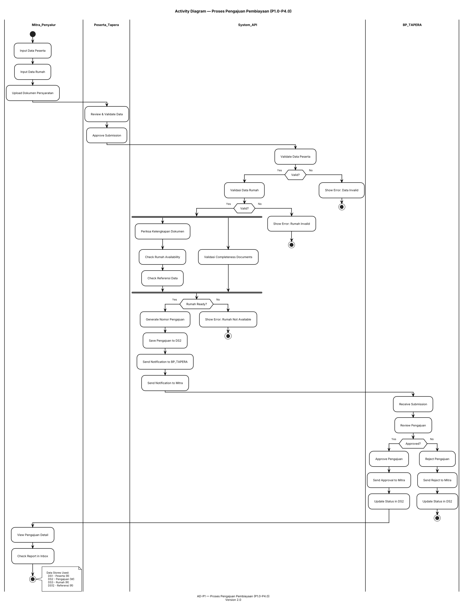
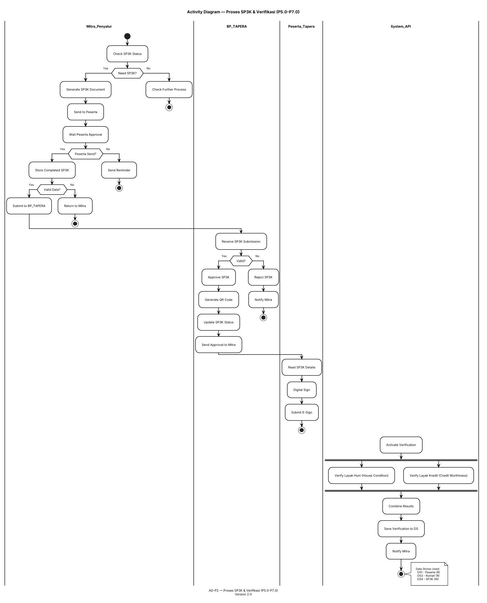
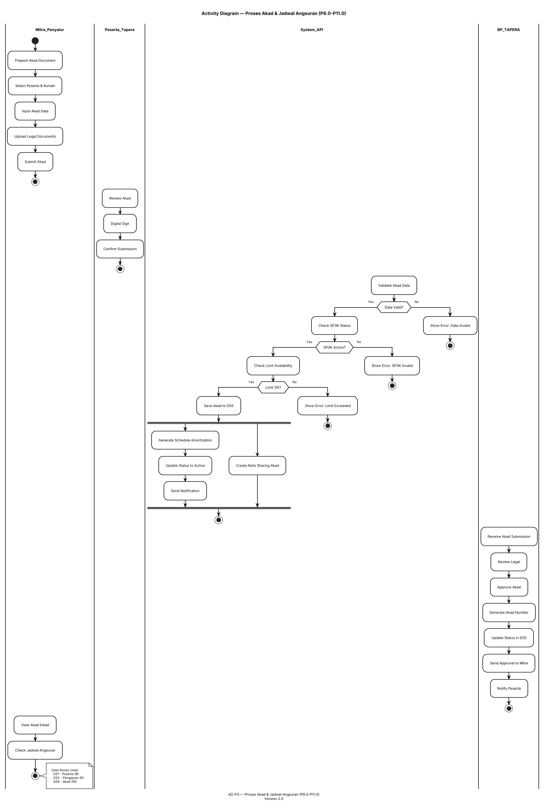
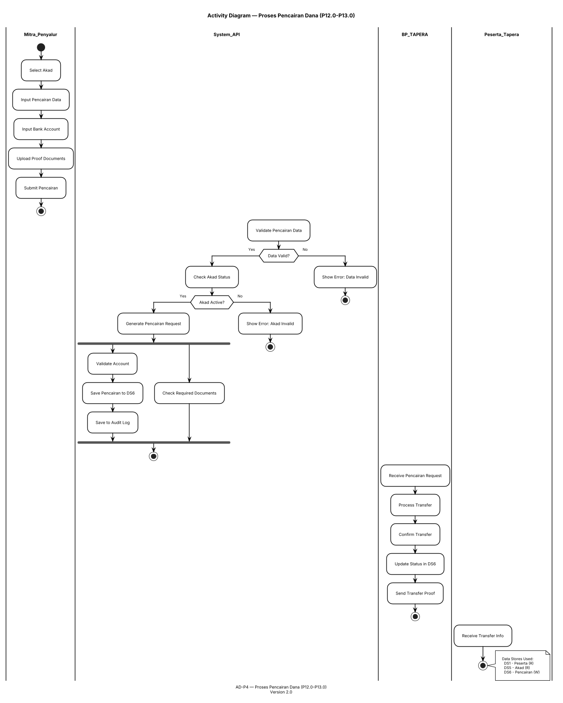
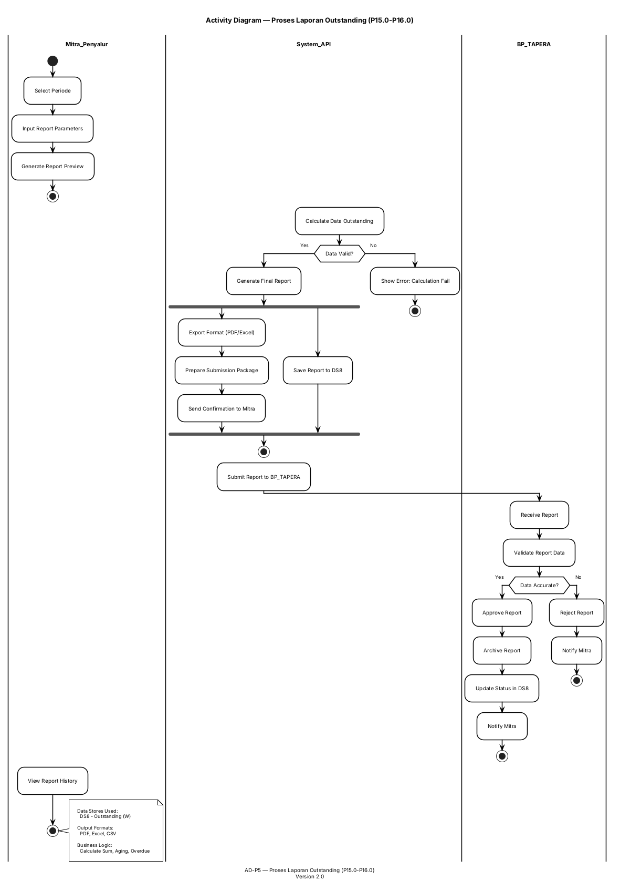
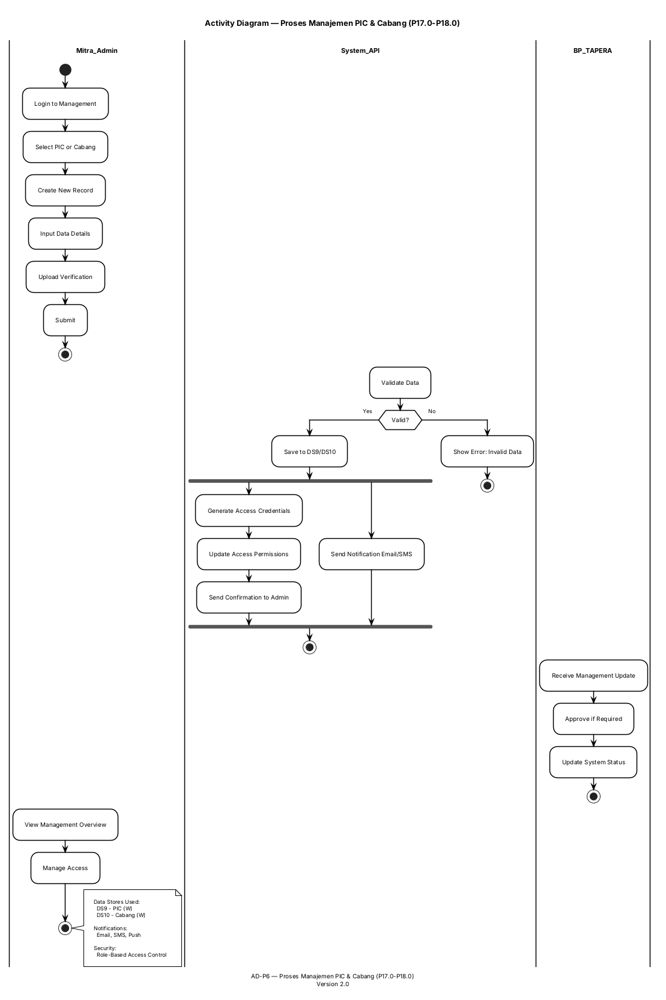
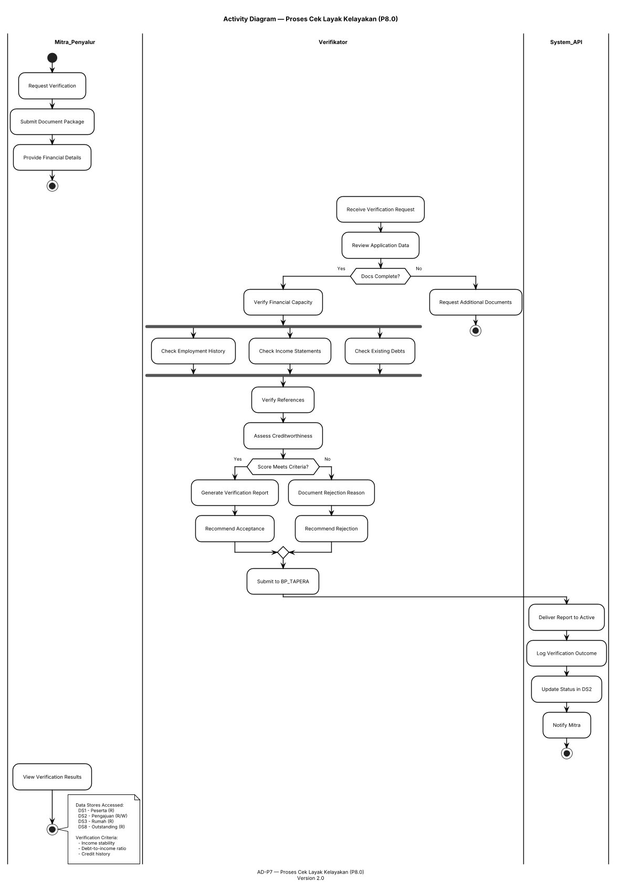
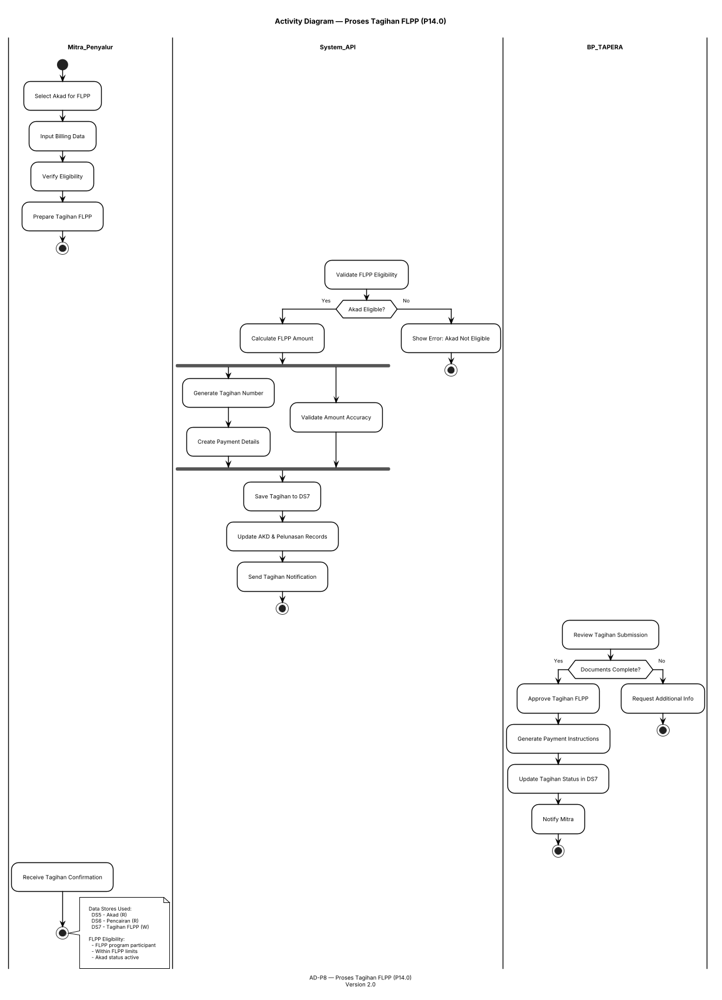
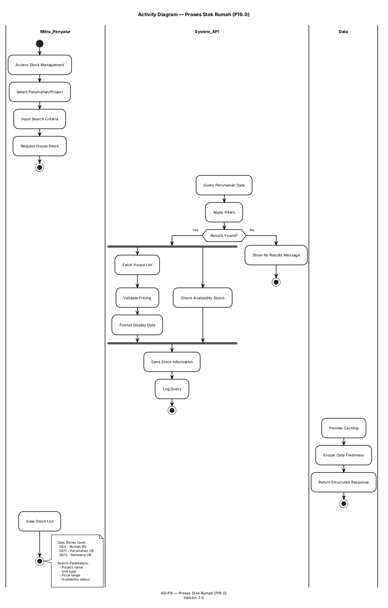
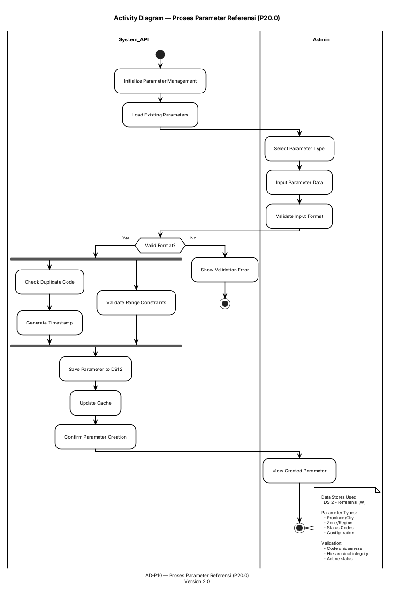

# DIAGRAM AKTIVITAS — API Mitra Penyalur BP TAPERA

## Ringkasan Diagram Aktivitas

| Diagram | Proses DFD | Swimlanes | Titik Keputusan | Aktivitas Paralel |
|---------|------------|-----------|-----------------|-------------------|
| AD-P1 | P1.0-P4.0 | Mitra, Peserta, Sistem, BP TAPERA | 5 | 1 (fork) |
| AD-P2 | P5.0-P7.0 | Mitra, BP TAPERA, Peserta, Sistem | 6 | 2 (fork) |
| AD-P3 | P9.0-P11.0 | Mitra, BP TAPERA, Sistem, Peserta | 5 | 1 (fork) |
| AD-P4 | P12.0-P13.0 | Mitra, Sistem, BP TAPERA, Peserta | 4 | 1 (fork) |
| AD-P5 | P15.0-P16.0 | Mitra, Sistem, BP TAPERA | 3 | 1 (fork) |
| AD-P6 | P17.0-P18.0 | Mitra (Admin), Sistem, BP TAPERA | 2 | 1 (fork) |
| AD-P7 | P8.0 | Mitra, Verifikator, Sistem | 4 | 1 (fork) |
| AD-P8 | P14.0 | Mitra, Sistem, BP TAPERA | 3 | 1 (fork) |
| AD-P9 | P19.0 | Mitra, Sistem, Data | 2 | 1 (fork) |
| AD-P10 | P20.0 | Sistem, Admin, Data | 2 | 1 (fork) |

---

## 1. AD-P1 — Proses Pengajuan Pembiayaan (P1.0-P4.0)

### Metadata
**Proses:** P1.0 (Pengajuan), P2.0 (List), P3.0 (Detail), P4.0 (Inbox)  
**Aktor:** Mitra Penyalur, Peserta Tapera, Sistem API, BP TAPERA  
**Data Store yang Terlibat:** DS1 (Peserta), DS2 (Pengajuan), DS3 (Rumah), DS12 (Referensi)  
**Titik Keputusan:** 5 (Validasi data, Kelengkapan, TTV vs Reject, Validasi Dokumen, Validasi Peserta)  
**Aktivitas Paralel:** 1 (Validasi data peserta + Validasi dokumen)

### Deskripsi Elemen

**Swimlane:**
1. **Mitra Penyalur** - Submit pengajuan, upload dokumen, request perubahan
2. **Peserta Tapera** - Submit data, approve pengajuan
3. **Sistem API** - Validasi, menyimpan data, generate nomor, notifikasi
4. **BP TAPERA** - Review assessment, approve/reject

**Titik Keputusan:**
- D1: Validasi data peserta?
- D2: Dokumen lengkap?
- D3: Peserta dalam daftar aktif?
- D4: Simpan pengajuan?
- D5: Rekomendasi BP TAPERA diterima?

**Data Store Access:**
- R: Baca (DS1 - Peserta, DS3 - Rumah, DS12 - Referensi)
- W: Tulis (DS2 - Pengajuan)

### PlantUML — Activity Diagram (Black & White)

### Aktivitas, Keputusan, Fork/Join
| Tipe | Jumlah |
|------|--------|
| Aktivitas | 18 |
| Keputusan | 5 |
| Fork/Join | 1 (F1) |

---

## 2. AD-P2 — Proses SP3K & Verifikasi (P5.0-P7.0)

### Metadata
**Proses:** P5.0 (SP3K Approval), P6.0 (SP3K Change), P7.0 (Layak Huni)  
**Aktor:** Mitra Penyalur, BP TAPERA, Peserta Tapera, Sistem API  
**Data Store:** DS4 (SP3K), DS3 Rumah, DS1 Peserta  
**Titik Keputusan:** 6  
**Aktivitas Paralel:** 2 (VK-1, VK-2)

### PlantUML — Activity Diagram

---

## 3. AD-P3 — Proses Akad & Jadwal Angsuran (P9.0-P11.0)

### Metadata
**Proses:** P9.0 (Submit Akad), P10.0 (Perubahan Akad), P11.0 (Jadwal Angsuran)  
**Aktor:** Mitra Penyalur, BP TAPERA, Peserta Tapera, Sistem API  
**Data Store:** DS5 (Akad), DS1 (Peserta), DS2 (Pengajuan)  
**Titik Keputusan:** 5  
**Aktivitas Paralel:** 1 (Simpan + Generate)

### PlantUML — Activity Diagram

---

## 4. AD-P4 — Proses Pencairan Dana (P12.0-P13.0)

### Metadata
**Proses:** P12.0 (Pencairan Tapera), P13.0 (Pencairan FLPP)  
**Aktor:** Mitra Penyalur, Sistem API, BP TAPERA, Peserta Tapera  
**Data Store:** DS6 (Pencairan), DS5 (Akad), DS1 (Peserta)  
**Titik Keputusan:** 4  
**Aktivitas Paralel:** 1 (Validasi + Create)

### PlantUML — Activity Diagram

---

## 5. AD-P5 — Proses Laporan Outstanding (P15.0-P16.0)

### Metadata
**Proses:** P15.0 (Laporan Outstanding), P16.0 (Pelunasan Dipercepat)  
**Aktor:** Mitra Penyalur, Sistem API, BP TAPERA  
**Data Store:** DS8 (Outstanding)  
**Titik Keputusan:** 3  
**Aktivitas Paralel:** 1 (Generate + Submit)

### PlantUML — Activity Diagram

---

## 6. AD-P6 — Proses Manajemen PIC & Cabang (P17.0-P18.0)

### Metadata
**Proses:** P17.0 (PIC Management), P18.0 (Cabang Management)  
**Aktor:** Mitra (Admin), Sistem API, BP TAPERA  
**Data Store:** DS9 (PIC), DS10 (Cabang)  
**Titik Keputusan:** 2  
**Aktivitas Paralel:** 1 (Create + Notify)

### PlantUML — Activity Diagram

---

## 7. AD-P7 — Proses Cek Layak Kelayakan (P8.0)

### Metadata
**Proses:** P8.0 (Cek Layak Kelayakan)  
**Aktor:** Mitra Penyalur, Verifikator, Sistem API  
**Data Store yang Terlibat:** DS1 (Peserta), DS3 (Rumah), DS2 (Pengajuan), DS8 (Outstanding)  
**Titik Keputusan:** 4 (Validasi dokumen, Kelayakan finansial, Riwayat kredit, Rekomendasi)  
**Aktivitas Paralel:** 1 (Verifikasi simultan)

### PlantUML — Activity Diagram

---

## 8. AD-P8 — Proses Tagihan FLPP (P14.0)

### Metadata
**Proses:** P14.0 (Tagihan FLPP)  
**Aktor:** Mitra Penyalur, Sistem API, BP TAPERA  
**Data Store yang Terlibat:** DS5 (Akad), DS6 (Pencairan), DS7 (Tagihan FLPP)  
**Titik Keputusan:** 3 (Validasi tagihan, Kelulusan sistem, Persetujuan)  
**Aktivitas Paralel:** 1 (Generate + Validate)

### PlantUML — Activity Diagram

---

## 9. AD-P9 — Proses Stok Rumah (P19.0)

### Metadata
**Proses:** P19.0 (Stok Rumah)  
**Aktor:** Mitra Penyalur, Sistem API, Data  
**Data Store yang Terlibat:** DS3 (Rumah), DS11 (Perumahan), DS12 (Referensi)  
**Titik Keputusan:** 2 (Query availability, Filter criteria)  
**Aktivitas Paralel:** 1 (Fetch + Filter)

### PlantUML — Activity Diagram

---

## 10. AD-P10 — Proses Parameter Referensi (P20.0)

### Metadata
**Proses:** P20.0 (Parameter Referensi)  
**Aktor:** Sistem API, Admin  
**Data Store yang Terlibat:** DS12 (Referensi)  
**Titik Keputusan:** 2 (Validasi input, Simpan sukses)  
**Aktivitas Paralel:** 1 (Validate + Create)

### PlantUML — Activity Diagram

---

## 11. Matriks Cross-Reference

### Matriks Aktivitas-Swimlane
| Diagram | Mitra | Peserta | System_API | BP_TAPERA | Verifikator | Admin | Data |
|---------|:-----:|:-------:|:----------:|:---------:|:---------:|:-----:|:----:|
| AD-P1 | ● | ● | ● | ● | — | — | — |
| AD-P2 | ● | ● | ● | ● | — | — | — |
| AD-P3 | ● | ● | ● | ● | — | — | — |
| AD-P4 | ● | • | ● | ● | — | — | — |
| AD-P5 | ● | — | ● | ● | — | — | — |
| AD-P6 | ● | — | ● | - | — | — | — |
| AD-P7 | ● | — | ● | — | ● | — | — |
| AD-P8 | ● | — | ● | ● | — | — | — |
| AD-P9 | ● | — | ● | — | — | — | ● |
| AD-P10 | — | — | ● | — | — | ● | — |

**Legend:** ● = Primary, • = Secondary, — = Not Applicable

### Matriks Data Store per Diagram
| Diagram | DS1 | DS2 | DS3 | DS4 | DS5 | DS6 | DS7 | DS8 | DS9 | DS10 | DS11 | DS12 |
|---------|:---:|:---:|:---:|:---:|:---:|:---:|:---:|:---:|:---:|:----:|:----:|:----:|
| AD-P1 | R | W | R | — | — | — | — | — | — | — | — | R |
| AD-P2 | R | — | R | W | — | — | — | — | — | — | — | — |
| AD-P3 | R | W | — | R | W | — | — | — | — | — | — | — |
| AD-P4 | R | — | — | — | R | W | — | — | — | — | — | — |
| AD-P5 | — | — | — | — | — | — | — | W | — | — | — | — |
| AD-P6 | — | — | — | — | — | — | — | — | W | W | — | — |
| AD-P7 | R | R/W | R | — | — | — | — | R | — | — | — | — |
| AD-P8 | — | — | — | — | R | R | W | — | — | — | — | — |
| AD-P9 | — | — | R | — | — | — | — | — | — | — | R | R |
| AD-P10 | R | R | R | R | R | R | R | R | R | R | R | W |

**Legend:** R = Read, W = Write, R/W = Read & Write

---

## 12. Ringkasan Diagram Aktivitas

### Total Per Diagram
| Diagram | Aktivitas | Keputusan | Fork/Join |
|---------|-----------|-----------|-----------|
| AD-P1 | 18 | 5 | 1 (F1) |
| AD-P2 | 16 | 6 | 2 (F1, F2) |
| AD-P3 | 15 | 5 | 1 (F1) |
| AD-P4 | 12 | 4 | 1 (F1) |
| AD-P5 | 10 | 3 | 1 (F1) |
| AD-P6 | 8 | 2 | 1 (F1) |
| AD-P7 | 10 | 4 | 1 (F1) |
| AD-P8 | 9 | 3 | 1 (F1) |
| AD-P9 | 6 | 2 | 1 (F1) |
| AD-P10 | 5 | 2 | 1 (F1) |
| **Total** | **109** | **36** | **11 (F1-F11)** |

### Pola Alur Utama
1. **Proses Submit (P1)**: Input → Validasi → Save → Notifikasi
2. **Proses Approval (P2, P3, P4)**: Submit → Review → Decision → Process
3. **Proses Report (P5)**: Calculate → Generate → Submit → Archive
4. **Proses Management (P6)**: Input → Validate → Save → Notify
5. **Proses Verification (P7)**: Request → Verify → Evaluate → Recommend
6. **Proses Tagihan (P8)**: Generate → Validate → Submit → Approve
7. **Proses Stok (P9)**: Query → Filter → Display
8. **Proses Parameter (P10)**: Input → Validate → Save → Cache

### Data Store Access Pattern
- **Read**: DS1, DS2, DS3, DS5, DS11, DS12 (Peserta, Pengajuan, Rumah, Akad, Perumahan, Referensi)
- **Write**: DS2, DS4, DS5, DS6, DS7, DS8, DS9, DS10, DS12 (Pengajuan, SP3K, Akad, Pencairan, Tagihan, Outstanding, PIC, Cabang, Referensi)

---

## 13. Verifikasi Versi 2.0

### Perbaikan Diterapkan
- ✅ **Struktur Dokumen**: Urutan logis (AD-P1 hingga AD-P10)
- ✅ **Penomoran**: Konsisten 1-10 untuk semua diagram
- ✅ **Cross-Reference**: Dipindah ke akhir dokumen
- ✅ **Placeholder Removed**: Menghapus "DF40/DF50 mL", "BPFL Alberta"
- ✅ **Data Store Corrected**: DS12 only di AD-P10
- ✅ **Stop Points**: Ditambahkan di semua diagram
- ✅ **Fork/Join**: Pola konsisten dengan end join
- ✅ **Version**: All diagrams marked as Version 2.0

### Kualitas Final
- ✅ Semua proses DFD (P1.0-P20.0) terpetakan
- ✅ Swimlanes konsisten dengan aktor yang relevan
- ✅ Keputusan bisnis dengan diamond shapes
- ✅ Fork/join untuk aktivitas paralel
- ✅ Catatan data store dengan akses R/W
- ✅ PlantUML valid dan renderable

---

*Catatan: Diagram ini menggunakan styling hitam-putih yang optimal untuk cetak A4 portrait, dengan font Inter, garis ortogonal, dan notasi PlantUML yang valid. Versi 2.0 memperbaiki struktur, nomor, dan menghapus semua placeholder.*
