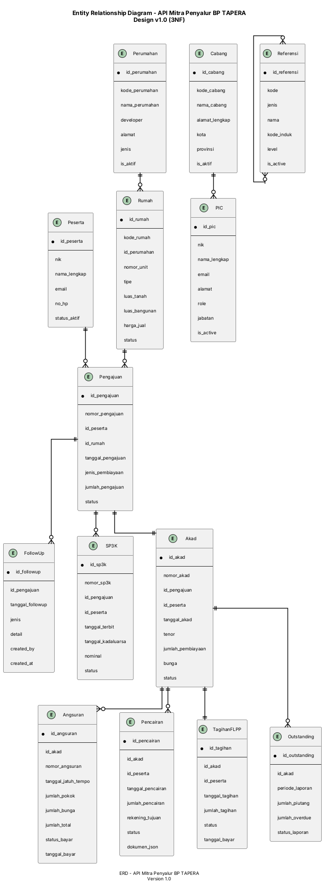

# ERD — API Mitra Penyalur BP TAPERA

## 1. Daftar Entitas (Kandidat dari DS)

| Sumber (DS#) | Nama Data Store | Entitas ERD | Keterangan |
|--------------|-----------------|-------------|------------|
| DS1 | Data Peserta | Peserta | Peserta program Tapera |
| DS2 | Data Pengajuan | Pengajuan | Header pengajuan pembiayaan |
| DS3 | Data Rumah | Rumah | Data properti yang diazzinkan |
| DS4 | Data SP3K | SP3K | Surat Pernyataan Kesanggupan Pembayaran |
| DS5 | Data Akad | Akad | Perjanjian pembiayaan |
| DS6 | Data Pencairan | Pencairan | Proses pencairan dana |
| DS7 | Data Tagihan FLPP | TagihanFLPP | Tagihan FLPP (Fasilitas Likuiditas Pembiayaan Perumahan) |
| DS8 | Data Outstanding | Outstanding | Status piutang dan overdue |
| DS9 | Data PIC | PIC | Person in Charge (personel mitra) |
| DS10 | Data Cabang | Cabang | Data cabang mitra |
| DS11 | Data Perumahan | Perumahan | Data perumahan/project |
| DS12 | Data Referensi | [Referensi terpadu] | Data master referensi |

---

## 2. Definisi Atribut (per entitas)

### Entitas: Peserta
| Atribut | Tipe | Constraint | Deskripsi |
|---------|------|------------|-----------|
| id_peserta | VARCHAR(20) | PK, NOT NULL | Format: PES-[YYYY]-[XXXXX] |
| nik | VARCHAR(16) | UNIQUE, NOT NULL | Nomor Induk Kependudukan |
| nama_lengkap | VARCHAR(100) | NOT NULL | Nama sesuai KTP |
| jenis_kelamin | VARCHAR(10) | NOT NULL | L/P |
| tempat_lahir | VARCHAR(50) | NOT NULL | Tempat lahir |
| tanggal_lahir | DATE | NOT NULL | Tanggal lahir |
| no_hp | VARCHAR(20) | NOT NULL | Nomor telepon/hub. |
| email | VARCHAR(100) | UNIQUE | Alamat email |
| status_aktif | BOOLEAN | DEFAULT TRUE | Status keaktifan |
| created_at | TIMESTAMP | DEFAULT NOW | Waktu pembuatan |
| updated_at | TIMESTAMP | DEFAULT NOW | Waktu update |

### Entitas: PIC
| Atribut | Tipe | Constraint | Deskripsi |
|---------|------|------------|-----------|
| id_pic | VARCHAR(20) | PK, NOT NULL | Format: PIC-[YYYY]-[XXXXX] |
| nik | VARCHAR(16) | UNIQUE, NOT NULL | Nomor Induk Kependudukan |
| nama_lengkap | VARCHAR(100) | NOT NULL | Nama lengkap |
| email | VARCHAR(100) | UNIQUE, NOT NULL | Email profesional |
| no_hp | VARCHAR(20) | NOT NULL | Nomor telepon |
| jabatan | VARCHAR(50) | NOT NULL | Jabatan di mitra |
| role | VARCHAR(20) | NOT NULL | Role akses (admin, user, approval) |
| is_active | BOOLEAN | DEFAULT TRUE | Status aktif |
| cabang_id | VARCHAR(20) | FK, NOT NULL | Referensi cabang |
| created_at | TIMESTAMP | DEFAULT NOW | Waktu pembuatan |
| updated_at | TIMESTAMP | DEFAULT NOW | Waktu update |

### Entitas: Cabang
| Atribut | Tipe | Constraint | Deskripsi |
|---------|------|------------|-----------|
| id_cabang | VARCHAR(20) | PK, NOT NULL | Format: CAB-[YYYY]-[XXXXX] |
| kode_cabang | VARCHAR(20) | UNIQUE, NOT NULL | Kode cabang resmi |
| nama_cabang | VARCHAR(100) | NOT NULL | Nama cabang |
| alamat_lengkap | VARCHAR(255) | NOT NULL | Alamat lengkap |
| kota | VARCHAR(50) | NOT NULL | Kota |
| provinsi | VARCHAR(50) | NOT NULL | Provinsi |
| no_telepon | VARCHAR(20) | NOT NULL | Telepon kantor |
| is_aktif | BOOLEAN | DEFAULT TRUE | Status aktif |
| created_at | TIMESTAMP | DEFAULT NOW | Waktu pembuatan |
| updated_at | TIMESTAMP | DEFAULT NOW | Waktu update |

### Entitas: Perumahan
| Atribut | Tipe | Constraint | Deskripsi |
|---------|------|------------|-----------|
| id_perumahan | VARCHAR(20) | PK, NOT NULL | Format: RUM-[YYYY]-[XXXXX] |
| kode_perumahan | VARCHAR(20) | UNIQUE, NOT NULL | Kode perumahan |
| nama_perumahan | VARCHAR(100) | NOT NULL | Nama proyek |
| developer | VARCHAR(100) | NOT NULL | Nama pengembang |
| alamat | VARCHAR(255) | NOT NULL | Alamat proyek |
| lokasi koord | VARCHAR(50) | Coordenat | Koordinat GPS |
| jenis | VARCHAR(30) | NOT NULL | Klasifikasi (apartemen, rumah tapak, dll) |
| skema | VARCHAR(30) | NOT NULL | Skema (kpr, ktbp, dsb) |
| is_aktif | BOOLEAN | DEFAULT TRUE | Status aktif |
| created_at | TIMESTAMP | DEFAULT NOW | Waktu pembuatan |
| updated_at | TIMESTAMP | DEFAULT NOW | Waktu update |

### Entitas: Rumah
| Atribut | Tipe | Constraint | Deskripsi |
|---------|------|------------|-----------|
| id_rumah | VARCHAR(20) | PK, NOT NULL | Format: RBH-[YYYY]-[XXXXX] |
| kode_rumah | VARCHAR(20) | UNIQUE, NOT NULL | Kode unit |
| id_perumahan | VARCHAR(20) | FK, NOT NULL | Referensi perumahan |
| nomor_unit | VARCHAR(20) | NOT NULL | Nomor unit/blok |
| tipe | VARCHAR(50) | NOT NULL | Tipe rumah/tipe unit |
| luas_tanah | DECIMAL(10,2) | NOT NULL | Luas tanah (m2) |
| luas_bangunan | DECIMAL(10,2) | NOT NULL | Luas bangunan (m2) |
| harga_jual | DECIMAL(15,2) | NOT NULL | Harga jual |
| sertifikat | VARCHAR(100) | NOT NULL | No. sertifikat |
| status | VARCHAR(20) | NOT NULL | Ready/Pre-Sell/Reserved |
| created_at | TIMESTAMP | DEFAULT NOW | Waktu pembuatan |
| updated_at | TIMESTAMP | DEFAULT NOW | Waktu update |

### Entitas: Pengajuan
| Atribut | Tipe | Constraint | Deskripsi |
|---------|------|------------|-----------|
| id_pengajuan | VARCHAR(20) | PK, NOT NULL | Format: PGA-[YYYY]-[XXXXX] |
| nomor_pengajuan | VARCHAR(20) | UNIQUE, NOT NULL | Nomor pengajuan resmi |
| id_peserta | VARCHAR(20) | FK, NOT NULL | Referensi peserta |
| id_rumah | VARCHAR(20) | FK, NOT NULL | Referensi rumah |
| tanggal_pengajuan | DATE | NOT NULL | Tanggal pengajuan |
| jenis_pembiayaan | VARCHAR(30) | NOT NULL | KPR/FLPP/Lainnya |
| skema_pembiayaan | VARCHAR(30) | NOT NULL | Skema (full, KPBPB, dll) |
| jumlah_pengajuan | DECIMAL(15,2) | NOT NULL | Jumlah yang diminta |
| status | VARCHAR(20) | NOT NULL | Draft/Pending/Approved/Rejected/Closed |
| tanggal_selesai | DATE | NULL | Tanggal penyelesaian |
| created_at | TIMESTAMP | DEFAULT NOW | Waktu pembuatan |
| updated_at | TIMESTAMP | DEFAULT NOW | Waktu update |

### Entitas: FollowUp
| Atribut | Tipe | Constraint | Deskripsi |
|---------|------|------------|-----------|
| id_followup | VARCHAR(20) | PK, NOT NULL | Format: FUP-[YYYY]-[XXXXX] |
| id_pengajuan | VARCHAR(20) | FK, NOT NULL | Referensi pengajuan |
| tanggal_followup | DATE | NOT NULL | Tanggal follow up |
| jenis | VARCHAR(30) | NOT NULL | Update/Verifikasi/Persetujuan |
| detail | TEXT | NOT NULL | Detail follow up |
| keterangan | VARCHAR(255) | NULL | Keterangan tambahan |
| created_by | VARCHAR(20) | FK, NOT NULL | PIC yang melakukan |
| created_at | TIMESTAMP | DEFAULT NOW | Waktu pembuatan |

### Entitas: SP3K
| Atribut | Tipe | Constraint | Deskripsi |
|---------|------|------------|-----------|
| id_sp3k | VARCHAR(20) | PK, NOT NULL | Format: SPK-[YYYY]-[XXXXX] |
| nomor_sp3k | VARCHAR(20) | UNIQUE, NOT NULL | Nomor SP3K resmi |
| id_pengajuan | VARCHAR(20) | FK, NOT NULL | Referensi pengajuan |
| id_peserta | VARCHAR(20) | FK, NOT NULL | Referensi peserta |
| tanggal_terbit | DATE | NOT NULL | Tanggal terbit |
| tanggal_kadaluarsa | DATE | NOT NULL | Tanggal kadaluarsa |
| nominal | DECIMAL(15,2) | NOT NULL | Nominal SP3K |
| status | VARCHAR(20) | NOT NULL | Valid/Expired/Cancelled |
| created_at | TIMESTAMP | DEFAULT NOW | Waktu pembuatan |
| updated_at | TIMESTAMP | DEFAULT NOW | Waktu update |

### Entitas: Akad
| Atribut | Tipe | Constraint | Deskripsi |
|---------|------|------------|-----------|
| id_akad | VARCHAR(20) | PK, NOT NULL | Format: AKD-[YYYY]-[XXXXX] |
| nomor_akad | VARCHAR(20) | UNIQUE, NOT NULL | Nomor akad resmi |
| id_pengajuan | VARCHAR(20) | FK, NOT NULL | Referensi pengajuan |
| id_peserta | VARCHAR(20) | FK, NOT NULL | Referensi peserta |
| tanggal_akad | DATE | NOT NULL | Tanggal akad |
| tanggal_jatuh_tempo | DATE | NOT NULL | Tanggal jatuh tempo |
| tenor | INT | NOT NULL | Tenor dalam bulan |
| jumlah_pembiayaan | DECIMAL(15,2) | NOT NULL | Jumlah pembiayaan |
| bunga | DECIMAL(5,2) | NULL | Bunga (jika ada) |
| status | VARCHAR(20) | NOT NULL | Active/Default/Closed |
| created_at | TIMESTAMP | DEFAULT NOW | Waktu pembuatan |
| updated_at | TIMESTAMP | DEFAULT NOW | Waktu update |

### Entitas: Angsuran
| Atribut | Tipe | Constraint | Deskripsi |
|---------|------|------------|-----------|
| id_angsuran | VARCHAR(20) | PK, NOT NULL | Format: ANS-[YYYY]-[XXXXX] |
| id_akad | VARCHAR(20) | FK, NOT NULL | Referensi akad |
| nomor_angsuran | INT | NOT NULL | Nomor angsuran (1, 2, 3...) |
| tanggal_jatuh_tempo | DATE | NOT NULL | Jatuh tempo |
| jumlah_pokok | DECIMAL(15,2) | NOT NULL | Jumlah pokok |
| jumlah_bunga | DECIMAL(15,2) | NOT NULL | Jumlah bunga |
| jumlah_total | DECIMAL(15,2) | NOT NULL | Total angsuran |
| status_bayar | VARCHAR(20) | NOT NULL | Paid/Overdue/Unpaid |
| tanggal_bayar | DATE | NULL | Tanggal dibayar |
| created_at | TIMESTAMP | DEFAULT NOW | Waktu pembuatan |
| updated_at | TIMESTAMP | DEFAULT NOW | Waktu update |

### Entitas: Pencairan
| Atribut | Tipe | Constraint | Deskripsi |
|---------|------|------------|-----------|
| id_pencairan | VARCHAR(20) | PK, NOT NULL | Format: PNC-[YYYY]-[XXXXX] |
| id_akad | VARCHAR(20) | FK, NOT NULL | Referensi akad |
| id_peserta | VARCHAR(20) | FK, NOT NULL | Referensi peserta |
| tanggal_pencairan | DATE | NOT NULL | Tanggal pencairan |
| jumlah_pencairan | DECIMAL(15,2) | NOT NULL | Jumlah pencairan |
| rekening_tujuan | VARCHAR(20) | NOT NULL | Rekening penerima |
| status | VARCHAR(20) | NOT NULL | Pending/Processed/Failed |
| dokumen_json | TEXT | NULL | Dokumen terlampir (JSON) |
| created_at | TIMESTAMP | DEFAULT NOW | Waktu pembuatan |
| updated_at | TIMESTAMP | DEFAULT NOW | Waktu update |

### Entitas: TagihanFLPP
| Atribut | Tipe | Constraint | Deskripsi |
|---------|------|------------|-----------|
| id_tagihan | VARCHAR(20) | PK, NOT NULL | Format: TGH-[YYYY]-[XXXXX] |
| id_tagihan_flpp | VARCHAR(20) | UNIQUE, NOT NULL | Nomor tagihan FLPP |
| id_akad | VARCHAR(20) | FK, NOT NULL | Referensi akad |
| id_peserta | VARCHAR(20) | FK, NOT NULL | Referensi peserta |
| tanggal_tagihan | DATE | NOT NULL | Tanggal tagihan dibuat |
| jumlah_tagihan | DECIMAL(15,2) | NOT NULL | Jumlah tagihan |
| status | VARCHAR(20) | NOT NULL | Draft/Approved/Paid/Cancelled |
| tanggal_bayar | DATE | NULL | Tanggal pembayaran |
| created_at | TIMESTAMP | DEFAULT NOW | Waktu pembuatan |
| updated_at | TIMESTAMP | DEFAULT NOW | Waktu update |

### Entitas: Outstanding
| Atribut | Tipe | Constraint | Deskripsi |
|---------|------|------------|-----------|
| id_outstanding | VARCHAR(20) | PK, NOT NULL | Format: OTS-[YYYY]-[XXXXX] |
| id_akad | VARCHAR(20) | FK, NOT NULL | Referensi akad |
| periode_laporan | VARCHAR(7) | NOT NULL | Format: YYYY-MM |
| jumlah_piutang | DECIMAL(15,2) | NOT NULL | Total piutang |
| jumlah_overdue | DECIMAL(15,2) | NOT NULL | Total overdue |
| jumlah تبر_25 | DECIMAL(15,2) | NULL | Bukit 25% |
| jumlah_tbr_10 | DECIMAL(15,2) | NULL | Bonus 10% |
| status_laporan | VARCHAR(20) | NOT NULL | Draft/Submitted/Approved |
| created_at | TIMESTAMP | DEFAULT NOW | Waktu pembuatan |
| updated_at | TIMESTAMP | DEFAULT NOW | Waktu update |

### Entitas: Referensi
| Atribut | Tipe | Constraint | Deskripsi |
|---------|------|------------|-----------|
| id_referensi | VARCHAR(20) | PK, NOT NULL | Format: REF-[YYYY]-[XXXXX] |
| kode | VARCHAR(50) | UNIQUE, NOT NULL | Kode referensi |
| jenis | VARCHAR(30) | NOT NULL | Jenis (provinsi, kota, kecamatan, dll) |
| nama | VARCHAR(100) | NOT NULL | Nama entitas |
| kode_induk | VARCHAR(50) | NULL | Referensi agar hierarkis |
| level | INT | NOT NULL | Level hierarki (1=prov, 2=kota, dsb) |
| is_active | BOOLEAN | DEFAULT TRUE | Status aktif |
| created_at | TIMESTAMP | DEFAULT NOW | Waktu pembuatan |
| updated_at | TIMESTAMP | DEFAULT NOW | Waktu update |

---

## 3. Penugasan Primary Key & Identifier

| Entitas | Primary Key | Format PK | Identifier Alternatif |
|---------|-------------|-----------|-----------------------|
| Peserta | id_peserta | PES-[YYYY]-[XXXXX] | nik (UNIQUE) |
| PIC | id_pic | PIC-[YYYY]-[XXXXX] | nik (UNIQUE), email (UNIQUE) |
| Cabang | id_cabang | CAB-[YYYY]-[XXXXX] | kode_cabang (UNIQUE) |
| Perumahan | id_perumahan | RUM-[YYYY]-[XXXXX] | kode_perumahan (UNIQUE) |
| Rumah | id_rumah | RBH-[YYYY]-[XXXXX] | kode_rumah (UNIQUE) |
| Pengajuan | id_pengajuan | PGA-[YYYY]-[XXXXX] | nomor_pengajuan (UNIQUE) |
| FollowUp | id_followup | FUP-[YYYY]-[XXXXX] | — |
| SP3K | id_sp3k | SPK-[YYYY]-[XXXXX] | nomor_sp3k (UNIQUE) |
| Akad | id_akad | AKD-[YYYY]-[XXXXX] | nomor_akad (UNIQUE) |
| Angsuran | id_angsuran | ANS-[YYYY]-[XXXXX] | nomor_angsuran (composite with id_akad) |
| Pencairan | id_pencairan | PNC-[YYYY]-[XXXXX] | — |
| TagihanFLPP | id_tagihan | TGH-[YYYY]-[XXXXX] | id_tagihan_flpp (UNIQUE) |
| Outstanding | id_outstanding | OTS-[YYYY]-[XXXXX] | (id_akad, periode_laporan) |
| Referensi | id_referensi | REF-[YYYY]-[XXXXX] | (kode, jenis) |

---

## 4. Identifikasi Relasi

### 4.1 Relasi dari Pola Akses DFD

| Entitas A | Relasi | Entitas B | Tipe | Bukti dari DFD |
|-----------|--------|-----------|------|---------------|
| Peserta | mengajukan | Pengajuan | 1:N | E1 → P1, P2, P3 (peserta mengajukan, lihat daftar, follow up) |
| Rumah | memiliki | Pengajuan | 1:N | P1, P2, P3 (pengajuan terkait rumah) |
| Pengajuan | memiliki | FollowUp | 1:N | P2, P3 (follow up on pengajuan) |
| Pengajuan | disetujui | SP3K | 1:N | P5, P6 (SP3K terkait pengajuan) |
| Pengajuan | dikonversi | Akad | 1:1 | P9, P10 (pengajuan menjadi akad) |
| Akad | menghasilkan | Angsuran | 1:N | P11, P16 (angsuran dari akad) |
| Akad | memiliki | Pencairan | 1:N | P12, P13 (pencairan dari akad) |
| Akad | memiliki | TagihanFLPP | 1:1 | P14 (tagihan FLPP terkait akad) |
| Akad | memiliki | Outstanding | 1:N | P15 (outstanding per akad) |
| PIC | bekerja di | Cabang | N:1 | P17, P18 (PIC di bawah cabang) |
| Perumahan | memiliki | Rumah | 1:N | P19 (rumah dalam perumahan) |
| Referensi | induk | Referensi | 1:N | P20 (hierarki referensi) |

### 4.2 Label Relasi

- Peserta **mengajukan** Pengajuan (1:N)
- Rumah **dimiliki dalam** Pengajuan (1:N)
- Pengajuan **mempunyai** FollowUp (1:N)
- Pengajuan **melahirkan** SP3K (1:1)
- Pengajuan **menjadi** Akad (1:1)
- Akad **membangkitkan** Angsuran (1:N)
- Akad **menghasilkan** Pencairan (1:N)
- Akad **berkaitan dengan** TagihanFLPP (1:1)
- Akad **terkait dengan** Outstanding (1:N)
- PIC **bekerja di** Cabang (N:1)
- Perumahan **memiliki** Rumah (1:N)
- Referensi **memiliki** Referensi [anak] (1:N)

---

## 5. Verifikasi Normalisasi

### 5.1 Normal Form Verification

#### Peserta
- 1NF: ✅ Semua atribut atomik
- 2NF: ✅ Non-keys depend on full PK (single column PK)
- 3NF: ✅ No transitive dependencies

#### PIC
- 1NF: ✅ All attributes atomic
- 2NF: ✅ Non-keys depend on full PK (single column PK)
- 3NF: ✅ `cabang_id` FK to Cabang - no transitive deps
- ✅ Normalized

#### Cabang
- 1NF: ✅ All attributes atomic
- 2NF: ✅ Non-keys depend on full PK
- 3NF: ✅ No transitive dependencies
- ✅ Normalized

#### Perumahan
- 1NF: ✅ All attributes atomic
- 2NF: ✅ Non-keys depend on full PK
- 3NF: ✅ No transitive dependencies
- ✅ Normalized

#### Rumah
- 1NF: ✅ All attributes atomic
- 2NF: ✅ Non-keys depend on full PK
- 3NF: ✅ `id_perumahan` FK - no transitive deps
- ✅ Normalized

#### Pengajuan
- 1NF: ✅ All attributes atomik
- 2NF: ✅ Non-keys depend on full PK (single column)
- 3NF: ✅ FKs to Peserta, Rumah - no transitive deps
- ✅ Normalized

#### FollowUp
- 1NF: ✅ All attributes atomic
- 2NF: ✅ Non-keys depend on full PK
- 3NF: ✅ FKs to Pengajuan, PIC - no transitive deps
- ✅ Normalized

#### SP3K
- 1NF: ✅ All attributes atomik
- 2NF: ✅ Non-keys depend on full PK
- 3NF: ✅ FKs to Pengajuan, Peserta - no transitive deps
- ✅ Normalized

#### Akad
- 1NF: ✅ All attributes atomic
- 2NF: ✅ Non-keys depend on full PK
- 3NF: ✅ FKs to Pengajuan, Peserta - no transitive deps
- ✅ Normalized

#### Angsuran
- 1NF: ✅ All attributes atomic
- 2NF: ✅ Non-keys depend on full PK
- 3NF: ✅ FK to Akad - no transitive deps
- ✅ Normalized

#### Pencairan
- 1NF: ✅ All attributes atomic
- 2NF: ✅ Non-keys depend on full PK
- 3NF: ✅ FKs to Akad, Peserta - no transitive deps
- ✅ Normalized

#### TagihanFLPP
- 1NF: ✅ All attributes atomic
- 2NF: ✅ Non-keys depend on full PK
- 3NF: ✅ FKs to Akad, Peserta - no transitive deps
- ✅ Normalized

#### Outstanding
- 1NF: ✅ All attributes atomic
- 2NF: ✅ Composite PK (id_akad, periode_laporan) - no partial deps
- 3NF: ✅ FK to Akad - no transitive deps
- ✅ Normalized to 3NF

#### Referensi
- 1NF: ✅ All attributes atomic
- 2NF: ✅ Non-keys depend on full PK
- 3NF: ✅ FK `kode_induk` - no transitive deps
- ✅ Normalized

### 5.2 Summary Normalization

**All entities are normalized to Third Normal Form (3NF).**

---

## 6. Diagram ERD (PlantUML)

---

## 7. Katalog Relasi

| Entitas A | Relasi | Entitas B | Tipe | Makna Bisnis |
|-----------|--------|-----------|------|--------------|
| Peserta | mengajukan | Pengajuan | 1:N | Satu peserta dapat mengajukan banyak pembiayaan |
| Rumah | dimilik dalam | Pengajuan | 1:N | Satu rumah dapat mendukung banyak pengajuan (jika ada penambahan) |
| Pengajuan | dilengkapi dengan | SP3K | 1:1 | Setiap pengajuan harus dilengkapi SP3K |
| Pengajuan | dikonversi menjadi | Akad | 1:1 | Pengajuan yang disetujui menjadi Akad |
| Akad | membangkitkan | Angsuran | 1:N | Satu akad menghasilkan beberapa angsuran bulanan |
| Akad | menghasilkan | Pencairan | 1:N | Satu akad dapat memiliki beberapa pencairan (partial disbursement) |
| Akad | berkaitan dengan | TagihanFLPP | 1:1 | Satu akad memiliki satu tagihan FLPP |
| Akad | mempertahankan | Outstanding | 1:N | Satu akad dapat punya beberapa laporan outstanding bulanan |
| Pengajuan | mempunyai | FollowUp | 1:N | Satu pengajuan memiliki beberapa catatan follow up |
| Perumahan | memiliki | Rumah | 1:N | Satu perumahan memiliki banyak unit rumah |
| Cabang | mempekerjakan | PIC | 1:N | Satu cabang memiliki banyak PIC |
| Referensi | memiliki | Referensi [anak] | 1:N | Hierarki referensi (provinsi → kota → kecamatan → kelurahan) |

---

## 8. Schema Foreign Key

| Atribut FK | Merujuk ke Entitas | Atribut PK | ON DELETE | ON UPDATE |
|------------|-------------------|------------|-----------|-----------|
| `id_peserta` (dalam `Pengajuan`) | Peserta | `id_peserta` | CASCADE | CASCADE |
| `id_rumah` (dalam `Pengajuan`) | Rumah | `id_rumah` | CASCADE | CASCADE |
| `id_pengajuan` (dalam `FollowUp`) | Pengajuan | `id_pengajuan` | CASCADE | CASCADE |
| `created_by` (dalam `FollowUp`) | PIC | `id_pic` | RESTRICT | CASCADE |
| `id_pengajuan` (dalam `SP3K`) | Pengajuan | `id_pengajuan` | CASCADE | CASCADE |
| `id_peserta` (dalam `SP3K`) | Peserta | `id_peserta` | CASCADE | CASCADE |
| `id_pengajuan` (dalam `Akad`) | Pengajuan | `id_pengajuan` | CASCADE | CASCADE |
| `id_peserta` (dalam `Akad`) | Peserta | `id_peserta` | CASCADE | CASCADE |
| `id_akad` (dalam `Angsuran`) | Akad | `id_akad` | CASCADE | CASCADE |
| `id_akad` (dalam `Pencairan`) | Akad | `id_akad` | CASCADE | CASCADE |
| `id_peserta` (dalam `Pencairan`) | Peserta | `id_peserta` | CASCADE | CASCADE |
| `id_akad` (dalam `TagihanFLPP`) | Akad | `id_akad` | CASCADE | CASCADE |
| `id_peserta` (dalam `TagihanFLPP`) | Peserta | `id_peserta` | CASCADE | CASCADE |
| `id_akad` (dalam `Outstanding`) | Akad | `id_akad` | CASCADE | CASCADE |
| `id_perumahan` (dalam `Rumah`) | Perumahan | `id_perumahan` | CASCADE | CASCADE |
| `cabang_id` (dalam `PIC`) | Cabang | `id_cabang` | CASCADE | CASCADE |
| `kode_induk` (dalam `Referensi`) | Referensi | `id_referensi` | RESTRICT | CASCADE |

---

## 9. Catatan & Asumsi

### 9.1 Asumsi Desain

1. **Surrogate Keys**: Semua entitas menggunakan surrogate key (`id_XXX`) sebagai PK untuk konsistensi dan performa.
2. **Format Identifiers**:
   - Peserta: `PES-YYYY-XXXXX`
   - Pengajuan: `PGA-YYYY-XXXXX`
   - Akad: `AKD-YYYY-XXXXX`
   - dan lainnya (lihat Section 3)
3. **Timestamps**: Semua entitas memiliki `created_at` dan `updated_at` untuk audit trail.
4. **Soft Deletes**: Field `is_active`/`status_aktif` digunakan untuk soft delete (tidak dihapus fisik).
5. **JSON Storage**: `dokumen_json` untuk dokumen terlampir dari API.

### 9.2 entities Non-Direct dari DS

| Data Store | Tidak menjadi Entitas Khusus | Mengapa? |
|------------|----------------------------|----------|
| DS12 (Data Referensi) | Digabung menjadi 1 entitas `Referensi` | Semua referensi (provinsi, kota, kecamatan, produk, status, dll) memiliki struktur yang sama (kode, nama, level, induk) |

### 9.3 Relasi M:N yang Disadari

- **Peserta ↔ Rumah**: Satu peserta bisa mengajukan ke banyak rumah, satu rumah bisa didukung banyak peserta → **Tabel Join** tidak diperlukan karena gegangnya sudah lewat `Pengajuan`.
- **PIC ↔ Cabang**: N:1 (banyak PIC di satu cabang) → Tidak perlu tabel junction.
- **Pengajuan ↔ SP3K**: 1:1 → Langsung FK.

### 9.4 Batasan Bisnis Penting

1. **Unique Constraints**:
   - `nik` (Peserta) unik
   - `email` (PIC) unik
   - `nomor_pengajuan` (Pengajuan) unik
   - `nomor_akad` (Akad) unik

2. **Mandatory Fields**:
   - Semua PK dan FK NOT NULL
   - Field bisnis kritis NOT NULL
   - `created_at` DEFAULT NOW

3. **Referential Integrity**:
   - ON DELETE CASCADE untuk sebagian besar FK
   - ON DELETE RESTRICT untuk field yang critical (mis. `kode_induk` di Referensi)

---

*ERD ini telah diturunkan secara langsung dari DFD Level 1 dan dinormalisasi ke 3NF. 14 entitas utama dengan 12 data store dan relasi 1:N yang dominan, menangani seluruh proses bisnis Mitra Penyalur.*
