# CR Consolidated v2 — Integrasi BP Tapera (BSB)

**Dokumen:** Konsolidasi Change Request (CR) proyek Integrasi BP Tapera
**Versi:** 2.1 | **Tanggal:** 2026-09-09
**Status:** Active (source of truth internal)

> **Fungsi dokumen:** Satu sumber rujukan bagi **tim bisnis** (finalisasi proposal penawaran) dan **tim teknis** (eksekusi development). Menampilkan seluruh CR aktif, hubungan teknis antar-CR, detail item pekerjaan, estimasi effort, dan rekomendasi urutan eksekusi.

> **Catatan versi 2.1:** Dokumen ini hanya merujuk **3 CR aktif**. CR-20260723-001 (dropdown pekerjaan) dan CR-20260724-001 (analisis delta TSD) **tidak lagi menjadi sumber terpisah** karena keduanya sudah terakomodasi di dalam **CR-20260729-001** (penawaran delta TSD yang merupakan gabungan keduanya).

---

## 1. Ringkasan CR Register

| # | CR ID | Judul | Sumber | Status | Effort (MD) | Modul Terdampak |
|---|-------|-------|--------|--------|:-----------:|-----------------|
| 1 | [CR-20260729-001](CR/CR-20260729-001-penawaran-delta-tsd-v086-v088.md) | Penawaran Pengerjaan CR Delta TSD v0.8.6–v0.8.8 | BSB/TLab | Pending | 42 | Jadwal Angsuran, DTO, Stok Rumah, Detail Rumah, Dropdown Pekerjaan |
| 2 | [CR-20260908-001](CR/CR-20260908-001-penyesuaian-validasi-gender-dan-pendapatan-applicant.md) | Penyesuaian Validasi Gender & Pendapatan Applicant | Client (WA) | Draft | 2,5 (draft) | Inbox Pengajuan, Form Pengajuan |
| 3 | [CR-20260908-002](CR/CR-20260908-002-penyesuaian-tenor-dan-suku-bunga-flpp.md) | Penyesuaian Tenor Maksimal & Suku Bunga KPR Sejahtera FLPP | Client Document (Kepmen 1721/1722) | Draft | 16,0 | Pengajuan, Amortisasi, Parameter Produk |

**Ringkasan status:** 1 Pending, 2 Draft. **Belum ada CR yang tereksekusi penuh.**

> **CR yang di-takeout (terakomodasi di CR-20260729-001):**
> - **CR-20260723-001** (Dropdown Pekerjaan Pemohon) → menjadi item **D.3** di CR-20260729-001
> - **CR-20260724-001** (Analisis Delta TSD) → menjadi bagian **A, B, C, D.1, D.2** di CR-20260729-001

---

## 2. Peta Hubungan Teknis Antar-CR

### 2.1 Klaster Pekerjaan

Ketiga CR dikelompokkan ke **3 klaster** berdasarkan modul & tujuan teknis:

```
┌─────────────────────────────────────────────────────────────────────┐
│  KLASTER 1 — DELTA TSD v0.8.6–v0.8.8 (API BP Tapera)                │
│  CR-20260729-001 (penawaran — gabungan delta TSD + dropdown)        │
│  Modul: Jadwal Angsuran (12 endpoint), DTO, Stok Rumah, Detail Rumah │
│         Dropdown Pekerjaan Pemohon                                   │
├─────────────────────────────────────────────────────────────────────┤
│  KLASTER 2 — FORM PENGAJUAN & VALIDASI                               │
│  CR-20260908-001 (validasi gender & pendapatan)                     │
│  └─ terkait: CR-20260729-001 D.3 (dropdown pekerjaan)               │
│  Modul: Inbox Pengajuan, Form Pengajuan                              │
├─────────────────────────────────────────────────────────────────────┤
│  KLASTER 3 — KEBIJAKAN KPR SEJAHTERA FLPP (Kepmen 1721/1722)        │
│  CR-20260908-002 (tenor & suku bunga)                                │
│  Modul: Pengajuan, Amortisasi, Parameter Produk                       │
└─────────────────────────────────────────────────────────────────────┘
```

### 2.2 Dependensi Teknis Antar-CR

| # | Dari CR | Ke CR | Jenis Hubungan | Detail |
|---|---------|-------|----------------|--------|
| D1 | CR-20260908-001 | CR-20260729-001 (D.3) | **Modul sama** | Keduanya menyentuh form pengajuan & validasi mandatory field (dropdown pekerjaan). Pengerjaan sebaiknya digabung agar validasi form konsisten. |
| D2 | CR-20260908-002 | CR-20260729-001 | **Modul sama** | Keduanya menyentuh modul Amortisasi/Jadwal Angsuran. Perubahan routing endpoint (delta TSD) dan perubahan tenor/bunga (FLPP) harus diuji bersama agar tidak saling menimpa. |

### 2.3 Konflik Resource (Cross-Cutting)

Seluruh CR memakai tim development yang sama:

| Personil        | Peran              | CR yang Terdampak |
| --------------- | ------------------ | ----------------- |
| Marcel          | Backend Developer  | #1, #3            |
| Daffa Aldzakian | Frontend Developer | #1, #2, #3        |
| Dinda           | QA                 | #1, #3            |
| Yudha Pratama   | PM                 | Semua             |

**Risiko:** CR-20260729-001 (42 MD) dan CR-20260908-002 (16 MD) sama-sama menunggu eksekusi. Jika berjalan paralel, terjadi **kontensi resource** pada Tirza (BE) dan Dinda (QA). Perlu prioritisasi (lihat Bab 7).

---

## 3. CR-20260729-001 — Penawaran Pengerjaan CR Delta TSD v0.8.6–v0.8.8

**Status:** Pending | **Effort:** 42 MD (10 hari kerja) | **Sumber:** BSB/TLab

> **Sumber teknis:** `TSD-Mitra_Penyalur-v0.8.8_-_15062026.pdf` (dokumen resmi BP Tapera, versi 0.8.8, tanggal 23 Juni 2026). Seluruh item delivery di bawah ini **mengacu langsung ke spesifikasi TSD v0.8.8**.
>
> **Catatan:** CR ini merupakan **gabungan** dari (a) penyesuaian delta TSD v0.8.6–v0.8.8 dan (b) penyesuaian dropdown Pekerjaan Pemohon (sebelumnya CR-20260723-001).

### 3.1 Ringkasan Perubahan TSD v0.8.6–v0.8.8

Berdasarkan **Log Status Perubahan Dokumen** pada TSD v0.8.8 (halaman 1–3):

| Versi | Tanggal | Fokus Perubahan | Diubah Oleh |
|-------|---------|-----------------|-------------|
| **v0.8.6** | 30 April 2026 | Penyesuaian kolom (panjang field), perubahan constraint `pekerjaan_pemohon`, penyesuaian URL environment, penyesuaian endpoint Jadwal Angsuran FLPP | Akhmad Khusaeri |
| **v0.8.7** | 03 Juni 2026 | Penyesuaian Stok Rumah (2.13) sesuai struct Go: List Perumahan tambah `namaPerumahan`/`limit`/`page`; List Rumah koreksi typo `luas_bangunan` + tambah `blok`/`nomor_rumah`/`tipe_bangunan`; Detail Rumah tambah `nomor_slf`/`tipe_bangunan` | Akhmad Khusaeri |
| **v0.8.8** | 15 Juni 2026 | Detail Rumah (2.13.3): Tambah field `tanggal_slf` (O, 10x, YYYY-MM-DD) dari Sikumbang API | Akhmad Khusaeri |

> **Catatan tanggal:** Dokumen TSD v0.8.8 bertanggal **23 Juni 2026** (halaman sampul), sedangkan log perubahan mencatat v0.8.8 pada **15 Juni 2026**. Keduanya merujuk rilis yang sama.

### 3.2 Detail Item Delivery (Mengacu Langsung ke TSD v0.8.8)

#### 3.2.1 Penyesuaian Kolom / Panjang Field (v0.8.6)

| No | Field | Perubahan | Keterangan |
|----|-------|-----------|------------|
| 1 | `blok_agunan` | → 100x | |
| 2 | `nomor_unit_agunan` | → 100x | |
| 3 | `nama_pemohon` | → 100x | |
| 4 | `email_pemohon` | → 100x | |
| 5 | `nama_pasangan` | → 100x | |
| 6 | `id_rumah` | → 100x | |
| 7 | `nomor_spr` | → 100x | |
| 8 | `nomor_ppjb` | → 100x | |
| 9 | `nomor_slf` | → 100x | |
| 10 | `nomor_sp3k` | → 100x | |
| 11 | `limit_pembiayaan` | **DIHAPUS** | Datanya akan digenerate sistem |
| 12 | `nomor_bast` | → 100x | |
| 13 | `nomor_imb_pbg` | → 100x | |
| 14 | `nomor_akad` | → 100x | |
| 15 | `kode_bank_pengembang` | **DIHAPUS** | |
| 16 | `nomor_rekening_pengembang` | **DIHAPUS** | |
| 17 | `kode_bank_pemohon` | **DIHAPUS** | |
| 18 | `rekening_tabungan_pemohon` | **DIHAPUS** | |
| 19 | `rekening_kredit_pemohon` | → 100x | |
| 20 | `nama_pengembang` | → 200x | |
| 21 | `nama_pemohon` | → 100x | (duplikat #3) |
| 22 | `nomor_batch` | → 100x | |
| 23 | `keterangan` | → 100x | |
| 24 | `jenis_dokumen` | → 100x | |
| 25 | `nomor_sertifikat` | → 100x | |

**Ringkasan:** 19 field berubah panjang menjadi 100x (kecuali `nama_pengembang` → 200x), 5 field dihapus (`limit_pembiayaan`, `kode_bank_pengembang`, `nomor_rekening_pengembang`, `kode_bank_pemohon`, `rekening_tabungan_pemohon`).

#### 3.2.2 Perubahan Constraint `pekerjaan_pemohon` (v0.8.6)

Constraint `pekerjaan_pemohon` berubah menjadi enumerasi:
- `ASN`
- `TNI/POLRI`
- `SWASTA`
- `WIRASWASTA`
- `LAINNYA`

#### 3.2.3 Penyesuaian URL Environment (v0.8.6)

| Environment | Base URL |
|-------------|----------|
| Development | `https://api.dev.tapera.go.id:8443/` |
| Staging | `https://api.qa.tapera.go.id/` |
| Production | `https://h2h.tapera.go.id/` |

#### 3.2.4 Penyesuaian Endpoint Jadwal Angsuran FLPP (v0.8.6)

Perubahan path endpoint dari prefix `/angsuran/` menjadi `/jadwal-angsur/`:

| No | Endpoint | Sebelum (v0.8.5) | Sesudah (v0.8.6) |
|----|----------|-------------------|-------------------|
| 1 | Mutasi 75:25 | `/api/mitra-penyalur/v2/angsuran/mutasi-75` | `/api/mitra-penyalur/v2/jadwal-angsur/mutasi-7525` |
| 2 | Mutasi 90:10 | `/api/mitra-penyalur/v2/angsuran/mutasi-90` | `/api/mitra-penyalur/v2/jadwal-angsur/mutasi-9010` |
| 3 | Mutasi Dipercepat 75:25 | `/api/mitra-penyalur/v2/angsuran/percepat/75` | `/api/mitra-penyalur/v2/jadwal-angsur/mutasi-dipercepat-7525` |
| 4 | Mutasi Dipercepat 90:10 | `/api/mitra-penyalur/v2/angsuran/percepat/90` | `/api/mitra-penyalur/v2/jadwal-angsur/mutasi-dipercepat-9010` |
| 5 | Mutasi KPO | `/api/mitra-penyalur/v2/angsuran/mutasi-kpo` | `/api/mitra-penyalur/v2/jadwal-angsur/mutasi-kpo` |
| 6 | List KPO | `/api/mitra-penyalur/v2/angsuran/kpo` | `/api/mitra-penyalur/v2/jadwal-angsur/kpo` |
| 7 | Detail 75:25 | `/api/mitra-penyalur/v2/angsuran/detail-7525` | `/api/mitra-penyalur/v2/jadwal-angsur/detail-7525` |
| 8 | Detail 90:10 | `/api/mitra-penyalur/v2/angsuran/detail-9010` | `/api/mitra-penyalur/v2/jadwal-angsur/detail-9010` |
| 9 | List 75:25 | `/api/mitra-penyalur/v2/angsuran/list-7525` | `/api/mitra-penyalur/v2/jadwal-angsur/list-7525` |
| 10 | List 90:10 | `/api/mitra-penyalur/v2/angsuran/list-9010` | `/api/mitra-penyalur/v2/jadwal-angsur/list-9010` |
| 11 | Data Lunas 75:25 | `/api/mitra-penyalur/v2/angsuran/data-lunas-7525` | `/api/mitra-penyalur/v2/jadwal-angsur/data-lunas-7525` |
| 12 | Data Lunas 90:10 | `/api/mitra-penyalur/v2/angsuran/data-lunas-9010` | `/api/mitra-penyalur/v2/jadwal-angsur/data-lunas-9010` |

#### 3.2.5 Penyesuaian Stok Rumah (v0.8.7)

**List Perumahan (2.13.1)** — tambah request params:
- `namaPerumahan` (O, 100x, string)
- `limit` (O, 3n, integer, default 10)
- `page` (O, 3n, integer, default 1)

**List Rumah (2.13.2)** — koreksi typo `luas_bangunan` (integer) + tambah field baru pada response:
- `blok` (M, 10x, string)
- `nomor_rumah` (M, 10x, string)
- `tipe_bangunan` (M, 10x, string)

**Detail Rumah (2.13.3)** — tambah field baru pada response:
- `tipe_bangunan` (M, 10x, string)
- `nomor_slf` (O, 50x, string)

#### 3.2.6 Detail Rumah — `tanggal_slf` (v0.8.8)

Tambah field baru pada response Detail Rumah (2.13.3):
- `tanggal_slf` (O, 10x, string, format YYYY-MM-DD) — dari Sikumbang API

#### 3.2.7 Dropdown Pekerjaan Pemohon (D.3 — dari CR-20260723-001)

Penyesuaian data pada *dropdown* Pekerjaan Pemohon sesuai dengan data yang divalidasi di API Tapera. Memastikan hanya opsi berikut yang ada dalam daftar pilihan *field* Pekerjaan Pemohon pada form Pengajuan Pembiayaan:

- `ASN`
- `TNI/POLRI`
- `SWASTA`
- `WIRASWASTA`
- `LAINNYA`

| Kode Task | Task |
|-----------|------|
| T.1 | Front End — penyesuaian data pada *dropdown* Pekerjaan Pemohon sesuai data tervalidasi API Tapera |
| T.2 | Back End Process Test |

> **Catatan:** Item ini merupakan kelanjutan dari CR-20260723-001 (awalnya inject 4 opsi: ASN, TNI/POLRI, KARYAWAN SWASTA, WIRASWASTA). Hasil validasi API Tapera menunjukkan hanya 5 nilai yang diterima, sehingga dropdown disesuaikan ke 5 nilai tervalidasi. Nilai yang dikirim saat submit harus `SWASTA` (bukan `KARYAWAN SWASTA`).

### 3.3 Dampak ke Sistem (Aplikasi Web Tapera)

#### 3.3.1 Backend (Golang)

| Kode | Task | Deskripsi |
|------|------|-----------|
| BE-1 | Update constraint panjang field | Ubah panjang field pada DTO & validasi sesuai TSD v0.8.6 (19 field → 100x, `nama_pengembang` → 200x) |
| BE-2 | Hapus field yang tidak dipakai | Hapus 5 field (`limit_pembiayaan`, `kode_bank_pengembang`, `nomor_rekening_pengembang`, `kode_bank_pemohon`, `rekening_tabungan_pemohon`) dari DTO & database |
| BE-3 | Update enum `pekerjaan_pemohon` | Terapkan validasi enum: ASN, TNI/POLRI, SWASTA, WIRASWASTA, LAINNYA |
| BE-4 | Update URL environment | Sesuaikan base URL dev/staging/production |
| BE-5 | Route alignment Jadwal Angsuran | Ubah path 12 endpoint dari `/angsuran/` → `/jadwal-angsur/` |
| BE-6 | Update Stok Rumah List Perumahan | Tambah request params `namaPerumahan`/`limit`/`page` |
| BE-7 | Update Stok Rumah List Rumah | Tambah field `blok`/`nomor_rumah`/`tipe_bangunan` + koreksi typo `luas_bangunan` |
| BE-8 | Update Stok Rumah Detail Rumah | Tambah field `tipe_bangunan`/`nomor_slf`/`tanggal_slf` |

#### 3.3.2 Frontend (React JS)

| Kode | Task | Deskripsi |
|------|------|-----------|
| FE-1 | Update model House | Tambah field `tipe_bangunan`/`nomor_slf`/`tanggal_slf` pada model frontend |
| FE-2 | Update tampilan Stok Rumah | Sesuaikan tampilan halaman yang menggunakan data House |
| FE-3 | Update dropdown Pekerjaan Pemohon | Sesuaikan dropdown sesuai 5 nilai tervalidasi (ASN, TNI/POLRI, SWASTA, WIRASWASTA, LAINNYA) |

#### 3.3.3 Integrasi SI (NestJS)

| Kode | Task | Deskripsi |
|------|------|-----------|
| SI-1 | Update proxy routing | Sesuaikan proxy path 12 endpoint Jadwal Angsuran |
| SI-2 | Update proxy Stok Rumah | Sesuaikan proxy untuk field baru Stok Rumah |

### 3.4 Sumber Daya (dari CR-20260729-001)

| Ruang Lingkup                | Jumlah | Mandays |
| ---------------------------- | :----: | :-----: |
| Project Manager              |   1    |   12    |
| DevOps                       |   1    |    6    |
| Backend Developer            |   1    |   12    |
| Tester (Regression, UAT/VIT) |   1    |   12    |
| **Total**                    | **4**  | **42**  |

---

## 4. CR-20260908-001 — Penyesuaian Validasi Gender & Pendapatan Applicant

**Status:** Draft | **Effort:** 2,5 MD (draft) | **Sumber:** Client (WA)

| Item | Deskripsi |
|------|-----------|
| Isu | Pengajuan via inbox aplikasi Tapera memungkinkan field pendapatan & gender dilewati |
| Celah | User bisa klik "Isi Formulir" tanpa validasi ulang field Gender, Pilih Pekerjaan Pemohon, dan mandatory fields lainnya |
| Resolusi | Improve UI / tambah proses validasi saat tombol "Isi Formulir" diklik |

### 4.1 Detail Item Pekerjaan & Estimasi Mandays

| Kode | Task | Deskripsi | Mandays |
|------|------|-----------|:-------:|
| V-1 | Frontend — validasi form | Tambah validasi mandatory field (Gender, Pilih Pekerjaan Pemohon, pendapatan) saat tombol "Isi Formulir" diklik; tampilkan pesan error yang jelas | 1,0 |
| V-2 | Backend — validasi mandatory | Tambah/verifikasi validasi mandatory field di sisi backend agar tidak bisa dilewati | 0,5 |
| V-3 | QA — test case & regression | Test case validasi form + regression form pengajuan & inbox | 0,5 |
| V-4 | PM — koordinasi & dokumentasi | Koordinasi BSB, update PRD/FSD, finalisasi CR | 0,5 |
| | **Total** | | **2,5 MD** |

> **Catatan:** Estimasi **draft** — perlu validasi tim dev. Item ini kecil & cepat; **Terkait D1** dengan CR-20260729-001 D.3 (validasi form pengajuan & dropdown pekerjaan) — sebaiknya digabung saat pengerjaan.

---

## 5. CR-20260908-002 — Penyesuaian Tenor Maksimal & Suku Bunga KPR Sejahtera FLPP

**Status:** Draft | **Effort:** 16,0 MD (draft) | **Sumber:** Client Document (Kepmen 1721/1722)

| Kode | Item | Effort |
|------|------|:------:|
| A.1–A.5 | Backend — validasi tenor 480, bunga 6%/5%, pemetaan jenis rumah, DB, testing | 4,5 |
| B.1–B.4 | Frontend — field tenor/bunga, tampilan jadwal 480 baris, testing | 2,5 |
| C.1–C.2 | Integrasi SI — verifikasi proxy Get Jadwal Angsur, cek TSD terbaru | 1,0 |
| D.1–D.3 | QA — test case baru, regression, uji silang simulasi | 3,5 |
| E.1–E.3 | DevOps — staging, production, verifikasi | 1,5 |
| F.1–F.3 | PM — koordinasi, update PRD/FSD, manajemen | 3,0 |
| | **Total** | **16,0 MD** |

**Ekspektasi client:** selesai **25 September 2026** (12 hari kerja). **Terkait D2** dengan CR-20260729-001 (modul amortisasi).

---

## 6. Rekomendasi Urutan Eksekusi & Timeline

### 6.1 Prioritas

| Prioritas | Workstream | Alasan |
|-----------|-----------|--------|
| **P1** | CR-20260908-002 (FLPP tenor/bunga) | Deadline client **25 Sep 2026**; regulasi wajib (Kepmen 1721/1722) |
| **P2** | CR-20260908-001 (validasi gender & pendapatan) | Kecil & cepat; menyentuh form pengajuan yang sama dengan CR-20260729-001 D.3 |
| **P3** | CR-20260729-001 (delta TSD) | Menunggu approval BSB; effort besar (42 MD); bisa dijadwalkan setelah P1 |

### 6.2 Alasan Urutan

- **P1 didahulukan** karena ada **deadline regulasi** (25 Sep) dan berdampak ke kepatuhan BSB terhadap Kepmen.
- **P2 menyusul** karena kecil & cepat, dan menyentuh validasi form pengajuan yang sama dengan dropdown pekerjaan (CR-20260729-001 D.3) — sebaiknya digabung saat pengerjaan.
- **P3 menyusul** karena menunggu approval BSB dan effort besar; tidak boleh tumpang tindih resource dengan P1.

### 6.3 Timeline Konsolidasi (indikatif)

Timeline dinyatakan dalam **hari kerja (H1–H22)**, bukan tanggal kalender — tanggal mulai menyesuaikan saat eksekusi dimulai.

> **📊 File Excel timeline:** [timeline-cr-consolidated-v2.xlsx](timeline-cr-consolidated-v2.xlsx) — berisi sheet **Timeline** (Gantt H1–H22), **Summary** (item & mandays per peran), dan **Detail item delivery** per CR (1 CR = 1 sheet).

```mermaid
gantt
    title Gantt Chart — CR Consolidated v2.1 (Integrasi BP Tapera)
    dateFormat X
    axisFormat %d
    %% Timeline dalam hari kerja H1–H22

    section P1 · FLPP (CR-20260908-002) — 16 MD
    Kickoff & klarifikasi BSB        :p1, 0, 3d
    Backend (A.1–A.5)                :p1, 1, 5d
    Frontend (B.1–B.4)               :p1, 1, 4d
    Integrasi SI (C.1–C.2)           :p1, 3, 2d
    QA test case & regression (D.1–D.3) :p1, 4, 6d
    Deploy staging (E.1)             :milestone, 6, 1d
    UAT + deploy production (E.2)    :milestone, 9, 1d
    Pendampingan pasca-deploy (E.3)  :p1, 10, 1d
    Milestone: Deadline client       :milestone, 11, 0d

    section P2 · Validasi Form (CR-20260908-001) — 2,5 MD
    Frontend validasi (V-1)          :p2, 10, 1d
    Backend validasi (V-2) + QA (V-3) :p2, 11, 1d

    section P3 · Delta TSD (CR-20260729-001) — 42 MD
    Backend route/DTO/Stok (BE-1..8) :p3, 12, 10d
    Frontend model & dropdown (FE-1..3) :p3, 12, 4d
    Integrasi SI proxy (SI-1..2)     :p3, 12, 2d
    QA regression & UAT/VIT          :p3, 16, 6d
    Deploy staging + production      :p3, 19, 2d
```



> **Catatan Mermaid:** Sumbu X menggunakan **hari kerja relatif (H0 = hari mulai)**. P1 berjalan H1–H12 (deadline client di H12), P2 di H11–H12 (paralel pendampingan), P3 di H13–H22 (setelah P1 selesai & approval BSB). Posisi P3 indikatif — bergantung approval BSB (K7) & ketersediaan resource.

---

## 7. Klarifikasi Data (Blocker)

| #   | CR              | Klarifikasi                                                                                | Deadline             |
| --- | --------------- | ------------------------------------------------------------------------------------------ | -------------------- |
| K1  | CR-20260908-002 | Apakah core banking BSB mendukung tenor 480 bulan & bunga baru?                            | H3 (14 Sep)          |
| K2  | CR-20260908-002 | Apakah BP Tapera merilis TSD baru terkait Kepmen 1721/1722?                                | Sebelum implementasi |
| K3  | CR-20260908-002 | Suku bunga baru berlaku untuk produk FLPP saja atau menggantikan existing?                 | H3 (14 Sep)          |
| K4  | CR-20260908-002 | Perlakuan pengajuan existing dengan parameter lama?                                        | H3 (14 Sep)          |
| K5  | CR-20260908-002 | Apakah DP 1%, premi asuransi, pelunasan dipercepat perlu fitur tampilan?                   | H3 (14 Sep)          |
| K6  | CR-20260908-001 | Estimasi mandays & analisis risiko belum ada                                               | Sebelum penawaran    |
| K7  | CR-20260729-001 | Approval BSB atas penawaran delta TSD                                                      | Sebelum eksekusi P3  |
| K8  | CR-20260729-001 | Perbedaan panjang field di core banking BSB (40–50x) vs TSD (100x)                         | Sebelum implementasi |
| K9  | CR-20260729-001 | URL environment development Tapera tidak dapat diakses (`You cannot consume this service`) | Sebelum implementasi |
| K10 | CR-20260729-001 | Data `pekerjaan_pemohon` — hubungan field di form step 1 dan SP3K                          | Sebelum implementasi |
| K11 | CR-20260729-001 | Data `pekerjaan_pemohon` selain 5 nilai tervalidasi                                        | Sebelum implementasi |

---

## 8. Risk Register Konsolidasi

| # | Risiko | Dampak | Kemungkinan | Mitigasi |
|---|--------|--------|:-----------:|----------|
| R1 | Core banking BSB belum dukung tenor 480 bulan | Tinggi | Sedang | Klarifikasi tertulis ≤ H3; eskalasi BSB |
| R2 | BP Tapera rilis TSD baru di tengah pengerjaan | Tinggi | Sedang | Pemantauan rilis; CR terpisah |
| R3 | Konflik resource antara P1 (FLPP) & P3 (delta TSD) | Tinggi | Sedang | Prioritisasi P1; jadwalkan P3 setelahnya |
| R4 | Timeline ketat (target 25 Sep, 12 hari kerja) | Sedang | Sedang | FE/BE paralel; gate H3; buffer H11–H12 |
| R5 | Nilai dropdown pekerjaan tidak match enum API (KARYAWAN SWASTA vs SWASTA) | Tinggi | Sedang | Pemetaan nilai sebelum submit |
| R6 | Simulasi angsuran tidak sesuai tabel resmi (5 zona × 4 tenor) | Sedang | Sedang | Uji silang sebelum UAT |
| R7 | Regresi pengajuan existing akibat perubahan parameter | Sedang | Rendah | Regression testing menyeluruh |
| R8 | Perbedaan panjang field core banking BSB vs TSD (100x) | Tinggi | Sedang | Konfirmasi BSB; koordinasi core banking |
| R9 | URL environment development Tapera tidak dapat diakses | Tinggi | Tinggi | Koordinasi akses environment dari BP Tapera |

---

## 9. Estimasi Effort Konsolidasi (untuk Proposal Bisnis)

> **Penting — bedakan Mandays vs Timeline:**
> - **Mandays** = total effort per peran, dipakai untuk **penentuan harga** (bisnis). Nilai ini akumulatif, tidak terpengaruh paralelisme.
> - **Timeline** = durasi kalender untuk **delivery item development**, dipengaruhi paralelisme. Contoh: total 45 mandays yang dikerjakan paralel oleh beberapa peran bisa selesai dalam **10 hari kalender**.
> - Keduanya **tidak boleh dicampur** — mandays untuk harga, timeline untuk delivery.

### 9.1 Effort per CR (Mandays)

| CR | Effort (MD) | Status |
|----|:-----------:|--------|
| CR-20260729-001 | 42 | Pending |
| CR-20260908-001 | 2,5 (draft) | Draft |
| CR-20260908-002 | 16,0 (draft) | Draft |
| **Total** | **60,5 MD** | |

### 9.2 Effort per Peran (Mandays — untuk harga)

| Peran              | Delta TSD (CR-20260729-001) | Validasi Form (CR-20260908-001) | FLPP (CR-20260908-002) |    Total    |
| ------------------ | :-------------------------: | :-----------------------------: | :--------------------: | :---------: |
| Project Manager    |             12              |               0,5               |          3,0           |    15,5     |
| DevOps             |              6              |                —                |          1,5           |     7,5     |
| Backend Developer  |              9              |               0,5               |          4,5           |    14,0     |
| Integrasi SI       |              1              |                —                |          1,0           |     2,0     |
| Tester             |             12              |               0,5               |          3,5           |    16,0     |
| Frontend Developer |              2              |               1,0               |          2,5           |     5,5     |
| **Total**          |           **42**            |             **2,5**             |        **16,0**        | **60,5 MD** |

> **Catatan pemetaan peran:** "Sys. Admin" (CR-20260729-001) dipetakan ke **DevOps**; "Software Engineer" (CR-20260729-001) dipecah menjadi **Backend Developer (9 MD) + Integrasi SI (1 MD) + Frontend Developer (2 MD)** sesuai breakdown task detail. DevOps di FLPP (1,5 MD) digabung dengan DevOps delta TSD (6 MD) menjadi 7,5 MD.

### 9.3 Timeline Delivery (untuk eksekusi development)

Timeline dihitung berdasarkan **paralelisme peran**, bukan penjumlahan mandays. Berikut estimasi durasi kalender per workstream:

| Workstream                      | Mandays | Peran Paralel               | Estimasi Timeline                 |
| ------------------------------- | :-----: | --------------------------- | --------------------------------- |
| CR-20260729-001 (Delta TSD)     |   42    | PM, DevOps, Backend, Tester | **10 hari kerja** (sesuai CR)     |
| CR-20260908-001 (Validasi Form) |   2,5   | FE, BE, QA, PM              | **2–3 hari kerja**                |
| CR-20260908-002 (FLPP)          |  16,0   | BE, FE, QA, DevOps, PM      | **12 hari kerja** (target 25 Sep) |

> **Contoh ilustrasi:** Total 60,5 mandays **tidak berarti** 60,5 hari kalender. Karena dikerjakan paralel oleh beberapa peran, timeline delivery bisa jauh lebih pendek — misal workstream FLPP (16 MD) selesai dalam 12 hari kerja karena BE/FE/QA berjalan paralel.

### 9.4 Catatan untuk Tim Bisnis

1. **CR-20260729-001 (42 MD)** sudah mencakup delta TSD v0.8.6–v0.8.8 **dan** dropdown Pekerjaan Pemohon — jangan dihitung ganda dengan CR-20260723-001/CR-20260724-001 (sudah di-takeout).
2. **Estimasi CR-20260908-001 (2,5 MD) dan CR-20260908-002 (16 MD) masih draft** — wajib divalidasi tim dev sebelum finalisasi penawaran.
3. **Gunakan mandays (60,5 MD) untuk harga**, dan **timeline per workstream untuk delivery** — jangan dicampur.
4. Jika ketiga workstream digabung dalam satu penawaran, total estimasi **±60,5 MD** (mandays) dengan timeline delivery yang dijadwalkan paralel.

---

## 10. Referensi

### Dokumen Sumber
- `TSD-Mitra_Penyalur-v0.8.8_-_15062026.pdf` — Dokumen Spesifikasi Teknis API Mitra Penyalur BP TAPERA v0.8.8 (23 Juni 2026)
- `Rapat_Koordinasi_Konfirmasi_Progress_Sistem_IT_Kebijakan_Baru_Rusun.pdf` — Rapat Koordinasi Kesiapan Sistem IT Bank Penyalur FLPP (04-09-2026), Kepmen PKP 1721/1722
- FSD 20241001.TAPERA.FSD-14.1.0 (Amortisasi Jadwal Angsuran)
- FSD 20241216.TAPERA.FSD-Pengajuan_Pembiayaan.md

### Dokumen CR Detail
- `CR/CR-20260729-001-penawaran-delta-tsd-v086-v088.md`
- `CR/CR-20260908-001-penyesuaian-validasi-gender-dan-pendapatan-applicant.md`
- `CR/CR-20260908-002-penyesuaian-tenor-dan-suku-bunga-flpp.md`

### Artifacts Terkait
- `decisions/decision-log.md` — DEC-2026-011 (CR-20260908-002)
- `decisions/CHANGELOG.md` — register CR
- `risks/risk-register.md` — perlu sinkronisasi risiko R1–R9
- `requirements/requirement-backlog.md` — perlu update parameter produk

---

*Dokumen consolidated v2.1 — source of truth internal. Estimasi CR-20260908-001 (2,5 MD) & CR-20260908-002 (16 MD) menunggu validasi tim development. Mandays (60,5 MD) untuk harga; timeline per workstream untuk delivery.*