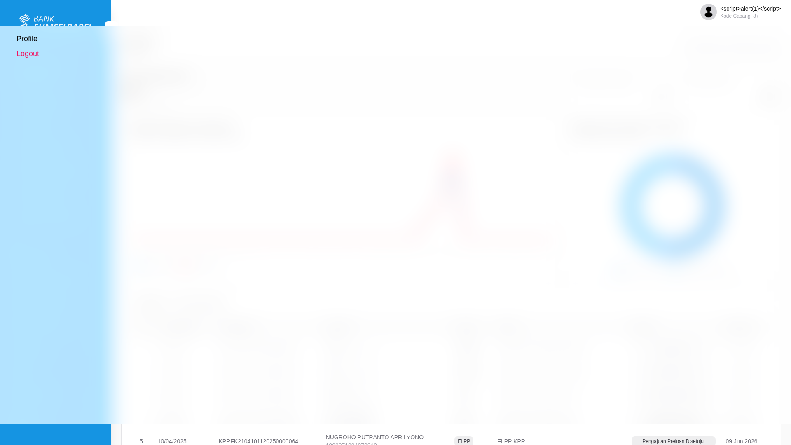
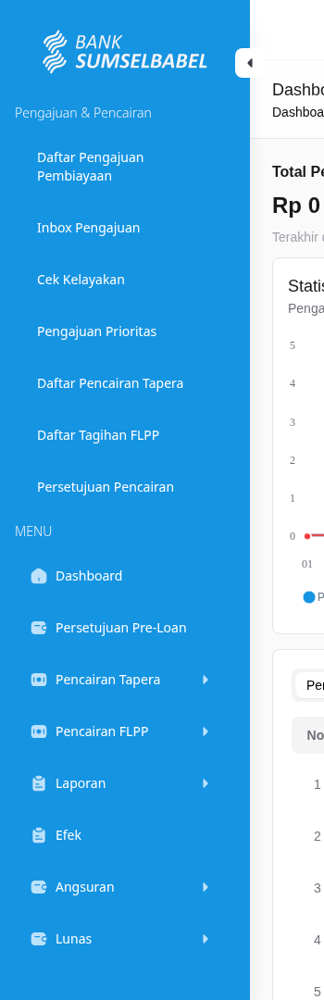

# Konfirmasi & FAQ — Integrasi BP Tapera

**Tujuan:** Dokumentasi pertanyaan yang perlu dikonfirmasi ke tim (Annas / Ibnu BSB / Dinda) serta jawaban yang sudah fix.
**Status:** 🟡 Belum dikonfirmasi / 🟢 Fix / 🔴 Bermasalah
**Tanggal:** 2026-07-23

---

## Daftar Isi

1. [Master Data & Konfigurasi](#1-master-data--konfigurasi)
2. [Alur Bisnis & Approval](#2-alur-bisnis--approval)
3. [Teknis & Integrasi](#4-teknis--integrasi)
4. [Keamanan](#5-keamanan)
5. [UI & Frontend](#6-ui--frontend)

---

## 1. Master Data & Konfigurasi

---

### Q1.1: Apa kepanjangan dari BV? — 🟢 Fix

**Konteks:** Field "BV" muncul di Master Data saat menambah user. Juga di tombol "Kirim Data ke BV" pada halaman amortisasi akad.

| Item | Detail |
|------|--------|
| **Sumber** | `01a_conversation_analysis.md` — 9/6/26, 23/6/26, 1/7/26 |
| **Jawaban** | **BV = Core Banking System BSB.** Istilah internal BSB untuk sistem *core banking* mereka. |
| **Status** | 🟢 **Fix — sudah dikonfirmasi** |
| **Dicatat di** | `business-faq.md` — Q: Apa kepanjangan dari BV? |

---

### Q1.2: Daftar ACL di Master Data — dari mana sumbernya? — 🟢 Fix

**Konteks:** Di menu Master Data ada fitur ACL (Access Control List) dengan format `Department - 42`, `Mutasi - 40`, `SP3K - 11`. Cara menambah/mengedit daftar ini tidak jelas.

| Item | Detail |
|------|--------|
| **Sumber** | UI observation (user report) |
| **Jawaban** | Data ACL berasal dari **seeder / desain aplikasi** (tidak diambil dari API eksternal). |
| **Status** | 🟢 **Fix — sudah dikonfirmasi** |
| **Dicatat di** | `engineering-faq.md` — Q: Dari mana sumber daftar ACL di Master Data? |

---

### Q1.3: Pengaturan Approval di Unit Kerja — untuk apa? — 🟡

**Konteks:** Saat menambah Unit Kerja (Master Data), ada field "Pengaturan Approval" (radio boolean, default false).

| Item | Detail |
|------|--------|
| **Sumber** | FSD-Pengelolaan_Unit_Kerja.md (line 48) — field `Pengaturan Approval` tipe Radio, mandatory, default false |
| **Status** | 🟡 **Perlu konfirmasi — apa yang di-toggle?** |
| **Pertanyaan** | Apa yang berubah jika setting ini `true` vs `false`? Apakah ini mengaktifkan approval chain untuk: (a) SP3K perlu approval supervisor? (b) Akad perlu approval? (c) Pencairan perlu approval? Atau approval untuk semua tahap? |
| **Konfirmasi ke** | Annas / Ibnu / Dinda |

---

### Q1.4: Field NIK PIC — format dan validasi — 🟢 Fix

**Konteks:** Field NIK PIC di-user-guide dan FSD menunjukkan contoh `3603231502830002`.

| Item | Detail |
|------|--------|
| **Sumber** | FSD-Follow_Up.md (line 113) |
| **Jawaban** | NIK PIC 16 digit standar KTP. Validasi (panjang, format numerik) sudah ada di frontend dan sudah *tested*. |
| **Status** | 🟢 **Fix — sudah dikonfirmasi** |
| **Dicatat di** | `engineering-faq.md` — Q: Validasi NIK PIC |

---

## 2. Alur Bisnis & Approval

---

### Q2.2: Approval chain — siapa approve apa? — 🟡

**Konteks:** Ada beberapa role approval: Supervisor untuk SP3K, Finance untuk Pencairan, Admin untuk Tagihan FLPP & Laporan Outstanding. Tapi tidak ada dokumentasi eksplisit siapa approve apa.

| Item | Detail |
|------|--------|
| **Sumber** | `project-profile.md`, DFD Level 1 |
| **Status** | 🟡 **Masih relate dengan Q1.3 (Pengaturan Approval)** |
| **Pertanyaan** | Siapa approve SP3K? Siapa approve Akad? Siapa approve Pencairan TAPERA? Siapa approve Pencairan FLPP? Siapa approve Tagihan FLPP? Siapa approve Laporan Outstanding? |
| **Konfirmasi ke** | Annas / Ibnu / Dinda |

---

### Q2.3: Yudisium — nilai kinerja atau nilai akhir? — 🟡

**Konteks:** Issue #3 di Support BSB — implementasi saat ini menggunakan **nilai kinerja** sebagai basis perhitungan Yudisium.

| Item | Detail |
|------|--------|
| **Sumber** | Taiga Support BSB Issue #3 |
| **Status** | 🟡 **Perlu konfirmasi BSB dan cek mas Annas** |
| **Pertanyaan** | Yudisium dihitung berdasarkan Nilai Kinerja atau Nilai Akhir? |
| **Konfirmasi ke** | BSB (Febby / Jimmy) + Annas |

---

## 3. Teknis & Integrasi

---

### Q4.1: Endpoint Kirim Data ke BV — error "All Required" — 🟡

**Konteks:** Tombol "Kirim Data ke BV" di halaman amortisasi akad. Error muncul karena field mandatory kosong (jenis_kelamin, applicant_income, pekerjaan). Fix: query UPDATE dari Annas.

| Item | Detail |
|------|--------|
| **Sumber** | `01a_conversation_analysis.md` (line 158) |
| **Status** | 🟡 **Masih perlu konfirmasi** |
| **Catatan** | Perlu di-add ke validasi frontend agar field ini mandatory sebelum tombol aktif |

---

### Q4.2: Tarif 75/25 mismatch dengan BV — 🔴 Blocker

**Konteks:** Perbandingan data antara web e-FLPP dengan BV ada selisih 5 nasabah. Web e-FLPP bukan TLab develop — mekanisme update tidak jelas.

| Item | Detail |
|------|--------|
| **Sumber** | `01a_conversation_analysis.md` (line 132, 195) |
| **Catatan** | Pertanyaan ini berasal dari analisis dokumen `01a_conversation_analysis.md` — conversation analysis dari chat history Tim. Bukan hasil cek langsung ke API BV/Tapera. |
| **Status** | 🔴 **Blocker — bukan TLab scope, perlu eskalasi ke vendor lain** |

---

## 5. Keamanan

---

### Q6.1: Stored XSS di field Nama PIC — 🔴 Critical

**Konteks:** Payload `` pada field "Nama PIC" terender apa adanya di DOM (tidak di-escape). Semua user yang lihat detail pengajuan akan mengeksekusi script tersebut.

| Item | Detail |
|------|--------|
| **Sumber** | `ui_analysis.md` (line 189-193), reproduksi manual 24/7/26 |
| **URL Aplikasi** | `https://tapera-web-stag.tlabdemo.com/` |
| **Akun test** | PIC Konven: `cobapicbsbkonven@mail.com` / `Super@dm1n` |
| **Halaman terdampak** | Dashboard + detail pengajuan `/financing-application/{uuid}` + halaman turunan |
| **Field** | Nama PIC (login user) — nama user terender sebagai `` |
| **Dampak** | Session hijacking, defacement, data exfiltration |
| **Severity** | 🔴 **CRITICAL** |
| **Status** | 🟡 **Perlu konfirmasi — sudah difix atau belum?** |
| **Pertanyaan** | Apakah issue ini sudah di-fix atau masih open? Kalau belum, perlu segera ditangani. |
| **Konfirmasi ke** | Pras / Annas |

**Tampilan:**  
  
*Gambar 1 — Navbar user: `` terender sebagai nama user login PIC Konven*

  
*Gambar 2 — Dashboard penuh. Payload XSS muncul di header user dan tidak di-escape*

---

## 6. UI & Frontend

---

### Q5.1: Menu 404 untuk Superadmin — intentional atau bug? — 🟡

**Konteks:** Beberapa menu (Inbox Pengajuan, Daftar Pencairan Tapera, dll) return 404 untuk Superadmin tapi bekerja untuk PIC Konven.

| Route | Superadmin | PIC Konven |
|-------|-----------|------------|
| `/submission-inbox` | 404 | ✅ OK |
| `/disbursement-tapera` | 404 | ✅ OK |
| `/disbursement-agreement` | — | 404 |

**Sumber:** `ui_analysis.md` (line 96-103)

**Status:** 🟡 **Perlu konfirmasi ke internal — apakah intentional karena RBAC atau bug frontend guard?**

---

### Q5.2: Menu non-navigasi — placeholder atau disabled? — 🟡

**Konteks:** Beberapa menu muncul di sidebar tapi tidak ada route/navigasi saat diklik.

| Menu | Status |
|------|--------|
| Pencairan FLPP | Tidak navigasi (PIC) |
| Persetujuan Pre-Loan | Tidak navigasi (PIC) |
| Laporan → Outstanding | Tidak navigasi (keduanya) |
| Efek | Tidak navigasi (PIC) |
| Angsuran | Tidak navigasi (PIC) |
| Lunas | Tidak navigasi (keduanya) |
| Mutasi | Tidak navigasi (keduanya) |
| Pengelolaan Pengembang | Tidak navigasi (keduanya) |
| Master Data | Tidak navigasi (PIC) |

**Sumber:** `ui_analysis.md` (line 108-127)

**Screenshot — Sidebar penuh dengan menu non-navigasi:**  
  
*Gambar 3 — Sidebar setelah expand. Item seperti Pencairan FLPP, Persetujuan Pre-Loan, Laporan, Efek, Angsuran, Lunas, Mutasi, Pengelolaan Pengembang, Master Data tidak memiliki navigasi*

  
*Gambar 4 — Crop sidebar untuk melihat item dengan lebih jelas*

**Status:** 🟡 **Perlu konfirmasi — placeholder untuk fitur masa depan atau feature flag disabled?**
**Konfirmasi ke:** Annas

---

### Q5.3: Cabang Management dan Stok Rumah — dari mana data nya? — 🟡

**Konteks:** DFD menyebut sub-proses P18.0 (Cabang Management) dan P19.0 (Stok Rumah) tapi tidak ada menu yang sesuai.

| Item | Detail |
|------|--------|
| **Sumber** | `ui_analysis.md` (line 152-155, 166-169) |
| **Status** | 🟡 **Perlu konfirmasi — sumber data stok rumah** |
| **Pertanyaan** | Apakah data stok rumah bersumber dari **TLab internal** atau **langsung dari Tapera/Sikumbang**? |
| **Konfirmasi ke** | Annas / Dinda |

---

## Ringkasan Prioritas

| Priority | Q | Deskripsi | Status | Konfirmasi ke |
|----------|---|-----------|--------|---------------|
| 🔴 Critical | Q6.1 | Stored XSS di field Nama PIC | 🟡 | Pras / Annas |
| 🔴 Blocker | Q4.2 | Tarif 75/25 mismatch BV (bukan TLab scope) | 🔴 | Eskalasi |
| 🟡 High | Q1.3 | Pengaturan Approval — fungsinya apa? | 🟡 | Annas / Ibnu / Dinda |
| 🟡 High | Q2.2 | Approval matrix (relate Q1.3) | 🟡 | Annas / Ibnu / Dinda |
| 🟡 Medium | Q2.3 | Yudisium nilai kinerja/nilai akhir | 🟡 | BSB / Annas |
| 🟡 Medium | Q4.1 | Kirim Data ke BV error | 🟡 | Annas |
| 🟡 Medium | Q5.1 | Menu 404 Superadmin | 🟡 | Internal |
| 🟡 Medium | Q5.2 | Menu non-navigasi | 🟡 | Annas |
| 🟡 Low | Q5.3 | Stok Rumah — sumber data | 🟡 | Annas / Dinda |
| 🟢 Fix | Q1.1 | BV = Core Banking BSB | 🟢 | — |
| 🟢 Fix | Q1.2 | ACL dari seeder/desain | 🟢 | — |
| 🟢 Fix | Q1.4 | NIK PIC validasi FE | 🟢 | — |

---

**Sumber Dokumen:**
- UI Analysis: `../analysis/ui_analysis.md`
- Conversation Analysis: `../analysis/01a_conversation_analysis.md`
- FSD Unit Kerja: `../requirements/fsd/20241009.TAPERA.FSD-Pengelolaan_Unit_Kerja.md`
- TSD: `../architecture/tsd-tapera-v0.8.5.md`
- FAQ: `../faq/`

**Dibuat:** 2026-07-20
**Diperbarui:** 2026-07-24
**Maintainer:** Yudha Pratama
